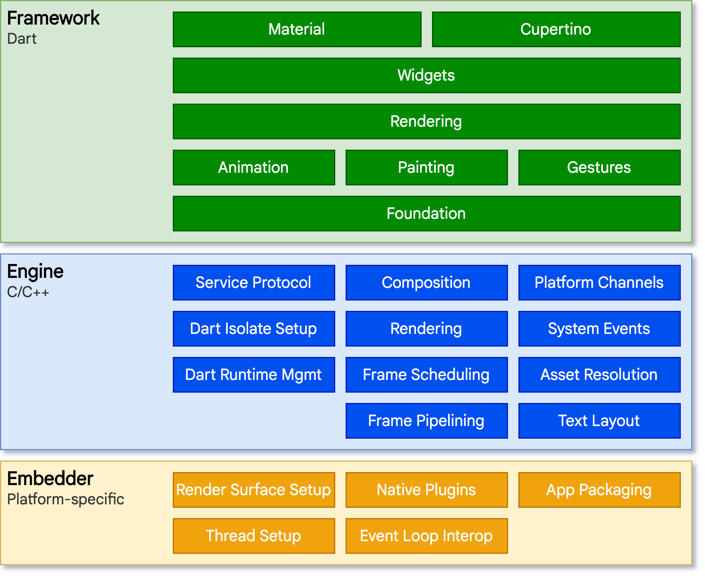
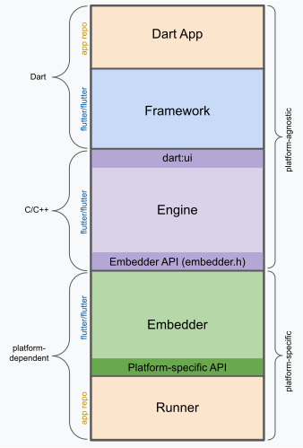
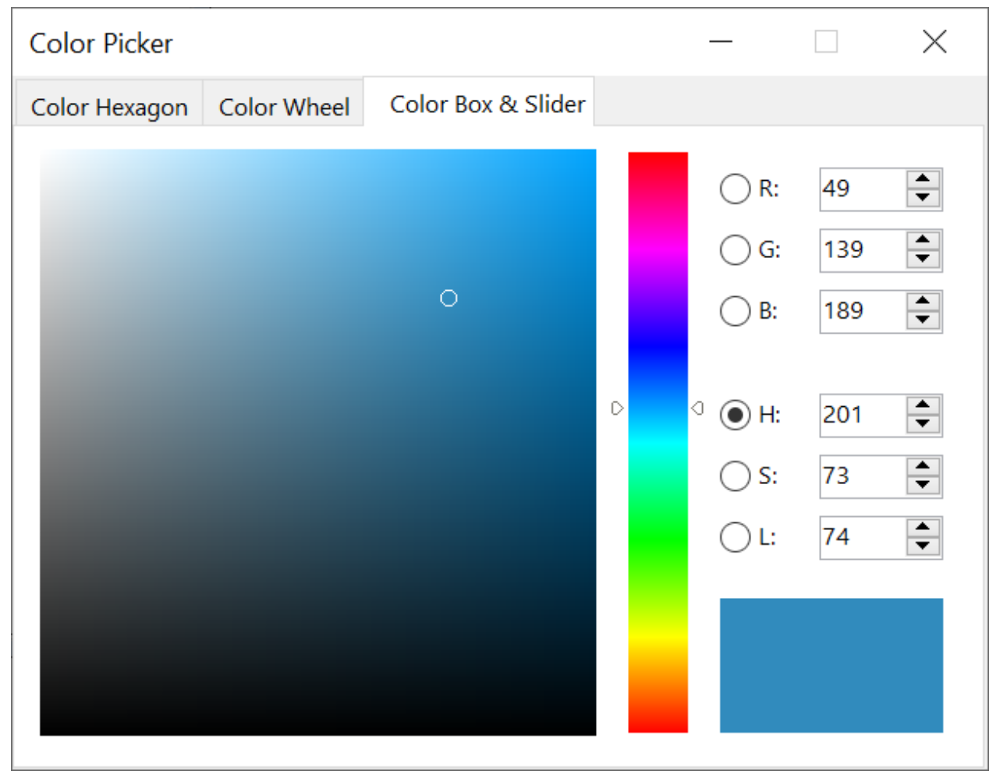
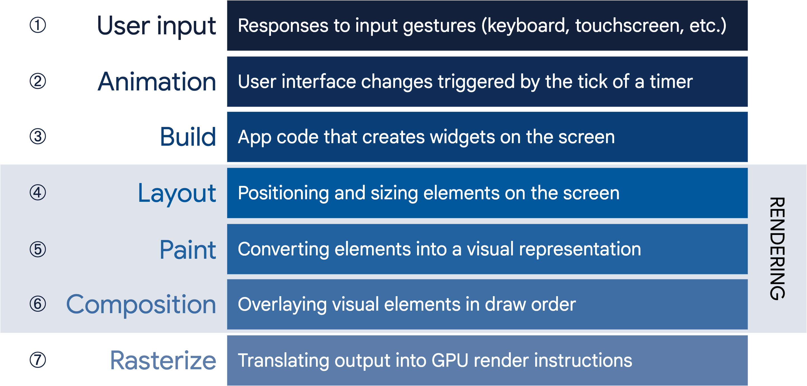
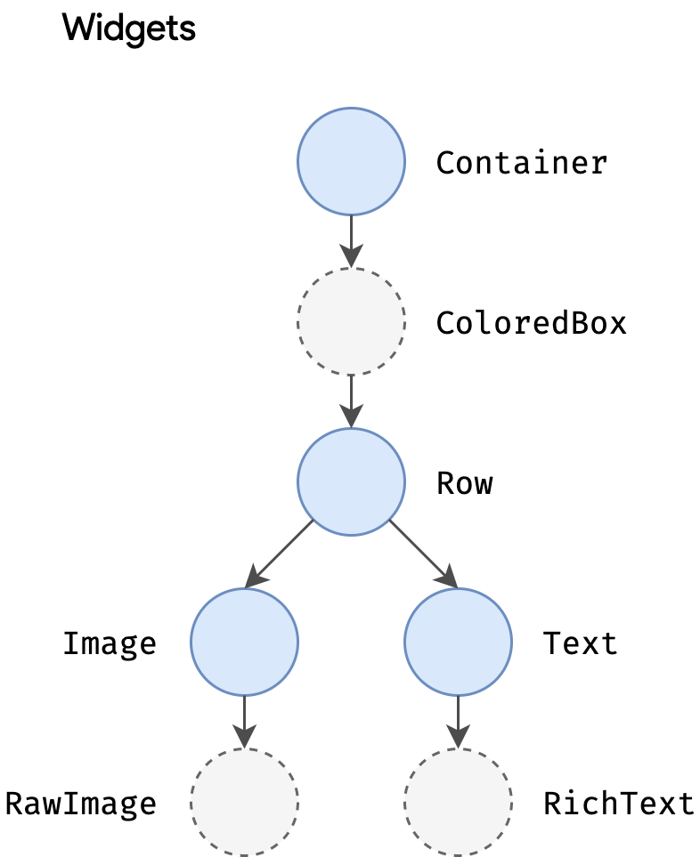
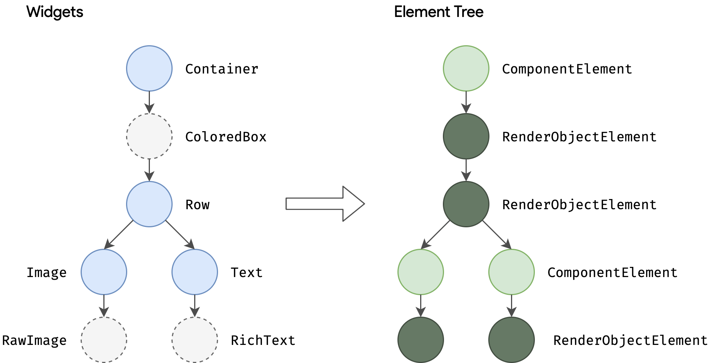
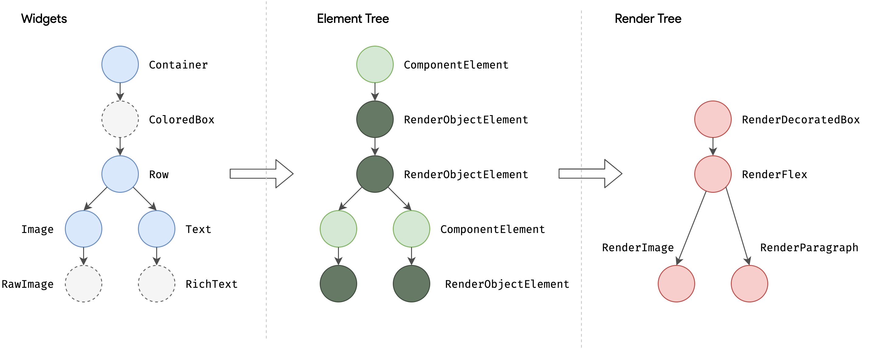
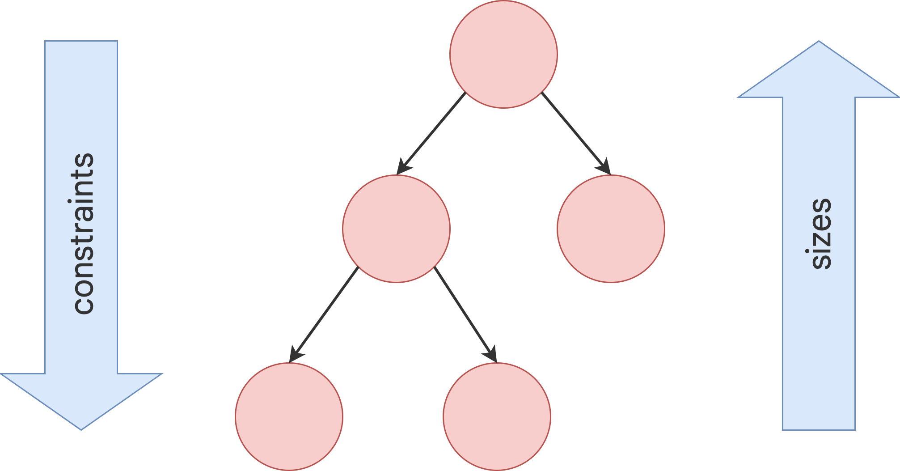
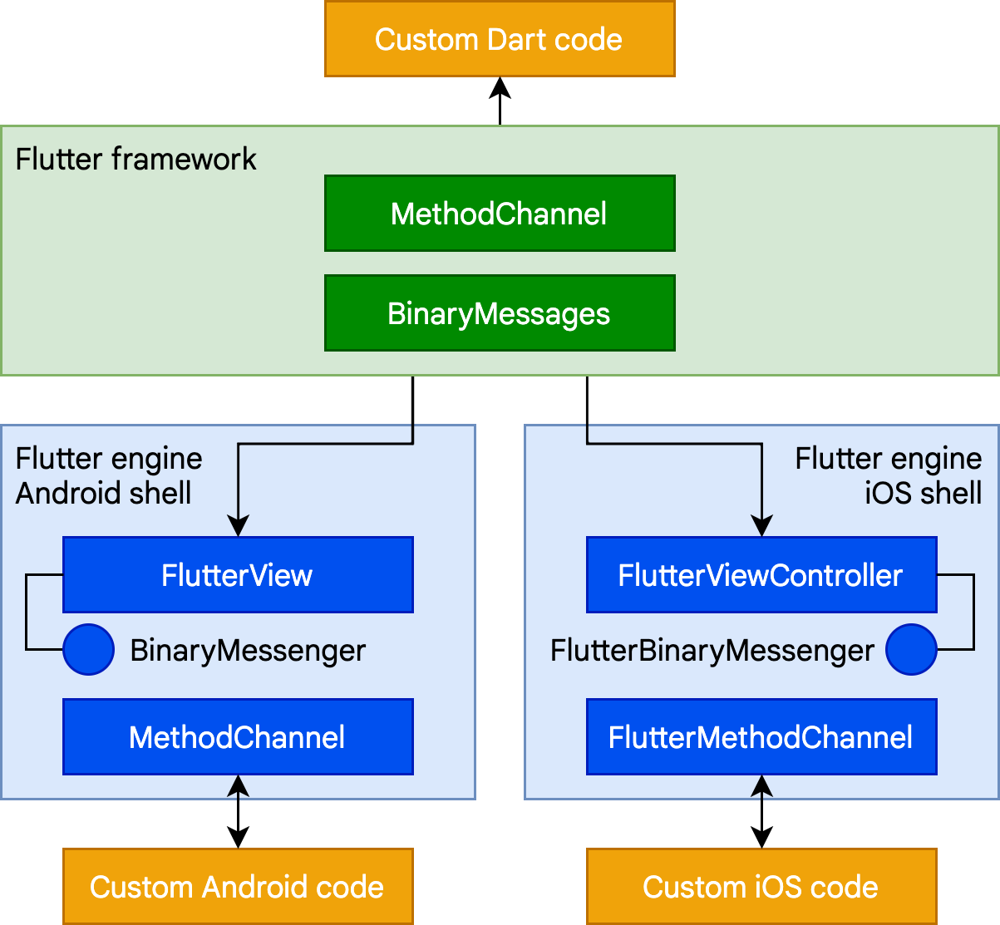
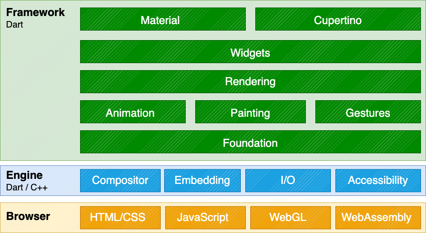

# Flutter mimarisine genel bakış

Bu makale, tasarımını oluşturan temel prensipler ve kavramlar dahil olmak üzere Flutter mimarisine üst düzey bir bakış sağlamayı amaçlamaktadır. Flutter uygulamasının nasıl mimarilendirileceğiyle ilgileniyorsanız, *Architecting Flutter apps* (Flutter uygulamalarını mimarilendirme) bölümüne göz atın.

Flutter, iOS, Android, web ve masaüstü gibi işletim sistemlerinde kodun yeniden kullanılmasına izin vermek ve aynı zamanda uygulamaların alttaki platform hizmetleriyle doğrudan arayüz oluşturmasına olanak tanımak için tasarlanmış, platformlar arası bir UI araç setidir. Hedef, geliştiricilerin farklı platformlarda doğal hissettiren, farklılıkları olduğu yerde kucaklayan ve mümkün olduğunca çok kodu paylaşan yüksek performanslı uygulamalar sunmasını sağlamaktır.

Geliştirme sırasında Flutter uygulamaları, tam bir yeniden derlemeye ihtiyaç duymadan değişikliklerin durum bilgisi korunan "hot reload" (sıcak yeniden yükleme) özelliğini sunan bir sanal makinede (VM) çalışır. Sürüm (release) için Flutter uygulamaları, ister Intel x64 ister ARM komutları olsun doğrudan makine koduna veya web hedefleniyorsa JavaScript'e derlenir. Framework açık kaynaklıdır, izin verici bir BSD lisansına sahiptir ve çekirdek kütüphane işlevselliğini tamamlayan üçüncü taraf paketlerden oluşan gelişen bir ekosisteme sahiptir.

Bu genel bakış bir dizi bölüme ayrılmıştır:

* **Katman modeli (The layer model):** Flutter'ın oluşturulduğu parçalar.
* **Reaktif kullanıcı arayüzleri (Reactive user interfaces):** Flutter kullanıcı arayüzü geliştirme için temel bir kavram.
* **Widget'lara giriş (An introduction to widgets):** Flutter kullanıcı arayüzlerinin temel yapı taşları.
* **Render işlemi (The rendering process):** Flutter'ın UI kodunu piksellere dönüştürme şekli.
* **Platform gömücülerine genel bakış (An overview of the platform embedders):** Mobil ve masaüstü işletim sistemlerinin Flutter uygulamalarını yürütmesini sağlayan kod.
* **Flutter'ı diğer kodlarla entegre etme (Integrating Flutter with other code):** Flutter uygulamaları için mevcut olan farklı teknikler hakkında bilgi.
* **Web desteği (Support for the web):** Bir tarayıcı ortamında Flutter'ın özellikleri hakkında sonuç niteliğinde açıklamalar.

## Mimari katmanlar

Flutter, genişletilebilir ve katmanlı bir sistem olarak tasarlanmıştır. Her biri alttaki katmana bağımlı olan bir dizi bağımsız kütüphane şeklinde var olur. Hiçbir katman, altındaki katmana ayrıcalıklı erişime sahip değildir ve framework seviyesindeki her parça isteğe bağlı ve değiştirilebilir olacak şekilde tasarlanmıştır.




Alttaki işletim sistemine göre, Flutter uygulamaları diğer yerel (native) uygulamalarla aynı şekilde paketlenir. Platforma özgü bir gömücü (embedder) bir giriş noktası sağlar; render yüzeyleri, erişilebilirlik ve giriş gibi hizmetlere erişim için alttaki işletim sistemiyle koordine olur; ve mesaj olay döngüsünü yönetir. Gömücü, platforma uygun bir dilde yazılmıştır: şu anda Android için Java ve C++, iOS ve macOS için Swift ve Objective-C/Objective-C++, Windows ve Linux için C++. Gömücü kullanılarak, Flutter kodu mevcut bir uygulamanın içine bir modül olarak veya kodun tamamı uygulamanın kendisi olacak şekilde entegre edilebilir. Flutter, yaygın hedef platformlar için bir dizi gömücü içerir, ancak başka gömücüler de mevcuttur.

Flutter'ın çekirdeğinde, çoğunlukla C++ ile yazılmış olan ve tüm Flutter uygulamalarını desteklemek için gerekli ilkel yapıları destekleyen **Flutter motoru (engine)** bulunur. Motor, yeni bir karenin boyanması gerektiğinde birleştirilmiş sahneleri rasterleştirmekten sorumludur. Grafikler, metin düzeni, dosya ve ağ G/Ç (I/O), bir Dart çalışma zamanı (runtime) ve derleme araç zinciri dahil olmak üzere Flutter'ın çekirdek API'sinin düşük seviyeli uygulamasını sağlar.

**Not**
Hangi cihazların Impeller'ı desteklediğiyle ilgili bir sorunuz varsa, ayrıntılı bilgi için *Impeller availability* (Impeller kullanılabilirliği) bölümüne göz atın.

Motor, alttaki C++ kodunu Dart sınıflarına saran `dart:ui` aracılığıyla Flutter framework'üne sunulur. Bu kütüphane, giriş, grafikler ve metin oluşturma alt sistemlerini yönlendirmek için kullanılan sınıflar gibi en düşük seviyeli ilkelleri sunar.

Tipik olarak geliştiriciler, Dart dilinde yazılmış modern, reaktif bir framework sağlayan **Flutter framework** aracılığıyla Flutter ile etkileşime girer. Bir dizi katmandan oluşan zengin bir platform, düzen ve temel kütüphaneler seti içerir. Alttan üste doğru çalışarak şunlara sahibiz:

* Temel **foundational** sınıflar ve alttaki temel üzerinde yaygın olarak kullanılan soyutlamalar sunan **animation** (animasyon), **painting** (boyama) ve **gestures** (hareketler) gibi yapı taşı hizmetleri.
* **Rendering layer** (oluşturma katmanı), düzen (layout) ile ilgilenmek için bir soyutlama sağlar. Bu katmanla, render edilebilir nesnelerden oluşan bir ağaç inşa edebilirsiniz. Bu nesneleri dinamik olarak değiştirebilirsiniz; ağaç, değişikliklerinizi yansıtmak için düzeni otomatik olarak günceller.
* **Widgets layer** (widget'lar katmanı) bir kompozisyon soyutlamasıdır. Rendering katmanındaki her render nesnesinin, widgets katmanında karşılık gelen bir sınıfı vardır. Ayrıca widgets katmanı, yeniden kullanabileceğiniz sınıf kombinasyonları tanımlamanıza olanak tanır. Reaktif programlama modelinin tanıtıldığı katman burasıdır.
* **Material** ve **Cupertino** kütüphaneleri, Material veya iOS tasarım dillerini uygulamak için widget katmanının kompozisyon ilkellerini kullanan kapsamlı kontrol setleri sunar.

Flutter framework'ü nispeten küçüktür; geliştiricilerin kullanabileceği birçok üst düzey özellik, **camera** ve **webview** gibi platform eklentilerinin yanı sıra çekirdek Dart ve Flutter kütüphaneleri üzerine inşa edilen **characters**, **http** ve **animations** gibi platformdan bağımsız özellikler de dahil olmak üzere paketler olarak uygulanır. Bu paketlerin bazıları, **uygulama içi ödemeler** (in-app payments), **Apple kimlik doğrulaması** (Apple authentication) ve **animasyonlar** gibi hizmetleri kapsayan daha geniş ekosistemden gelir.

Bu genel bakışın geri kalanı, UI geliştirmenin reaktif paradigmasından başlayarak katmanlar arasında geniş bir şekilde gezinmektedir. Ardından, widget'ların nasıl bir araya getirildiğini ve bir uygulamanın parçası olarak render edilebilecek nesnelere nasıl dönüştürüldüğünü açıklıyoruz. Flutter'ın web desteğinin diğer hedeflerden nasıl farklı olduğuna dair kısa bir özet vermeden önce, Flutter'ın platform düzeyinde diğer kodlarla nasıl birlikte çalıştığını açıklıyoruz.


# Bir uygulamanın anatomisi (Anatomy of an app)

Aşağıdaki diyagram, `flutter create` tarafından oluşturulan standart bir Flutter uygulamasını oluşturan parçalara genel bir bakış sunar. Bu yığında Flutter Motorunun (Engine) nerede oturduğunu gösterir, API sınırlarını vurgular ve bireysel parçaların yaşadığı depoları (repositories) tanımlar. Aşağıdaki lejant, bir Flutter uygulamasının parçalarını tanımlamak için yaygın olarak kullanılan bazı terminolojileri açıklar.





**Dart Uygulaması (Dart App)**
* Widget'ları istenen kullanıcı arayüzü (UI) halinde birleştirir.
* İş mantığını (business logic) uygular.
* Uygulama geliştiricisine aittir.

**Framework (Kaynak kodu)**
* Yüksek kaliteli uygulamalar oluşturmak için üst düzey API sağlar (örneğin, widget'lar, isabet testi, hareket algılama, erişilebilirlik, metin girişi).
* Uygulamanın widget ağacını bir sahne (scene) halinde birleştirir (composites).

**Motor (Engine) (Kaynak kodu)**
* Birleştirilmiş sahneleri rasterleştirmekten (görüntüye dönüştürmekten) sorumludur.
* Flutter'ın çekirdek API'lerinin (örneğin, grafikler, metin düzeni, Dart çalışma zamanı) düşük seviyeli uygulamasını sağlar.
* İşlevselliğini `dart:ui` API'sini kullanarak framework'e sunar.
* Motorun `Embedder API`'sini kullanarak belirli bir platformla entegre olur.

**Gömücü (Embedder) (Kaynak kodu)**
* Render yüzeyleri, erişilebilirlik ve giriş gibi hizmetlere erişim için alttaki işletim sistemiyle koordine olur.
* Olay döngüsünü (event loop) yönetir.
* Gömücüyü (Embedder) uygulamalara entegre etmek için platforma özgü API'yi sunar.

**Çalıştırıcı (Runner)**
* Gömücünün platforma özgü API'si tarafından sunulan parçaları, hedef platformda çalıştırılabilir bir uygulama paketi halinde birleştirir.
* `flutter create` tarafından oluşturulan uygulama şablonunun bir parçasıdır ve uygulama geliştiricisine aittir.


## Reaktif kullanıcı arayüzleri (Reactive user interfaces)

Yüzeyde, Flutter reaktif ve bildirimsel (declarative) bir UI framework'üdür. Geliştirici, uygulama durumundan (application state) arayüz durumuna (interface state) bir eşleme sağlar ve framework, uygulama durumu değiştiğinde çalışma zamanında arayüzü güncelleme görevini üstlenir. Bu model, Facebook'un kendi React framework'ü için geliştirdiği ve birçok geleneksel tasarım ilkesinin yeniden düşünülmesini içeren çalışmalardan esinlenmiştir.

Çoğu geleneksel UI framework'ünde, kullanıcı arayüzünün başlangıç durumu bir kez tanımlanır ve ardından çalışma zamanında olaylara yanıt olarak kullanıcı kodu tarafından ayrı ayrı güncellenir. Bu yaklaşımın zorluklarından biri, uygulama karmaşıklık açısından büyüdükçe, geliştiricinin durum değişikliklerinin tüm UI boyunca nasıl yayıldığının farkında olması gerekmesidir. Örneğin, aşağıdaki UI'ı düşünün:




Durumun değiştirilebileceği birçok yer vardır: renk kutusu, ton kaydırıcısı (hue slider), radyo düğmeleri. Kullanıcı UI ile etkileşime girdikçe, değişikliklerin diğer her yere yansıması gerekir. Daha da kötüsü, dikkat edilmezse, kullanıcı arayüzünün bir parçasındaki küçük bir değişiklik, kodun görünüşte alakasız parçalarında dalgalanma etkilerine neden olabilir.

Buna bir çözüm, veri değişikliklerini kontrolcü (controller) aracılığıyla modele (model) ittiğiniz ve ardından modelin yeni durumu kontrolcü aracılığıyla görünüme (view) ittiği MVC gibi bir yaklaşımdır. Ancak bu da sorunludur, çünkü UI öğelerini oluşturmak ve güncellemek, kolayca senkronizasyondan çıkabilen iki ayrı adımdır.

Flutter, diğer reaktif framework'lerle birlikte, kullanıcı arayüzünü alttaki durumundan açıkça ayırarak bu soruna alternatif bir yaklaşım getirir. React tarzı API'lerle, yalnızca UI açıklamasını oluşturursunuz ve framework, bu tek yapılandırmayı kullanarak kullanıcı arayüzünü uygun şekilde hem oluşturma hem de güncelleme işini üstlenir.

Flutter'da widget'lar (React'teki bileşenlere benzer), bir nesne ağacını yapılandırmak için kullanılan değişmez (immutable) sınıflarla temsil edilir. Bu widget'lar, düzen (layout) için ayrı bir nesne ağacını yönetmek üzere kullanılır ve bu ağaç da daha sonra birleştirme (compositing) için ayrı bir nesne ağacını yönetmek üzere kullanılır. Flutter, özünde, ağaçların değiştirilmiş kısımlarını verimli bir şekilde gezmek, nesne ağaçlarını daha düşük seviyeli nesne ağaçlarına dönüştürmek ve değişiklikleri bu ağaçlar arasında yaymak için bir dizi mekanizmadır.

Bir widget, durumu UI'a dönüştüren bir fonksiyon olan `build()` yöntemini geçersiz kılarak (override) kullanıcı arayüzünü beyan eder:

```dart
UI = f(state)
```

`build()` yöntemi tasarım gereği hızlı yürütülür ve yan etkilerden arındırılmış olmalıdır, bu da framework tarafından her ihtiyaç duyulduğunda (potansiyel olarak her render edilen karede bir kez) çağrılmasına olanak tanır.

Bu yaklaşım, bir dil çalışma zamanının belirli özelliklerine (özellikle hızlı nesne başlatma ve silme) dayanır. Neyse ki Dart, bu görev için özellikle çok uygundur.


# Widget'lar

Daha önce bahsedildiği gibi, Flutter bir kompozisyon (bileşim) birimi olarak widget'ları vurgular. Widget'lar bir Flutter uygulamasının kullanıcı arayüzünün yapı taşlarıdır ve her widget, kullanıcı arayüzünün bir parçasının değişmez (immutable) bir beyanıdır.

Widget'lar kompozisyona dayalı bir hiyerarşi oluşturur. Her widget ebeveyninin (parent) içine yerleşir ve ebeveyninden bağlam (context) alabilir. Bu yapı, aşağıdaki basit örneğin gösterdiği gibi, kök widget'a (Flutter uygulamasını barındıran kapsayıcı, genellikle `MaterialApp` veya `CupertinoApp`) kadar uzanır:


```dart
import 'package:flutter/material.dart';
import 'package:flutter/services.dart';

void main() => runApp(const MyApp());

class MyApp extends StatelessWidget {
  const MyApp({super.key});

  @override
  Widget build(BuildContext context) {
    return MaterialApp(
      home: Scaffold(
        appBar: AppBar(title: const Text('My Home Page')),
        body: Center(
          child: Builder(
            builder: (context) {
              return Column(
                children: [
                  const Text('Hello World'),
                  const SizedBox(height: 20),
                  ElevatedButton(
                    onPressed: () {
                      print('Click!');
                    },
                    child: const Text('A button'),
                  ),
                ],
              );
            },
          ),
        ),
      ),
    );
  }
}
```

Önceki kodda, başlatılan tüm sınıflar birer widget'tır.

Uygulamalar, hiyerarşideki bir widget'ı başka bir widget ile değiştirmesini framework'e söyleyerek olaylara (bir kullanıcı etkileşimi gibi) yanıt olarak kullanıcı arayüzlerini günceller. Framework daha sonra yeni ve eski widget'ları karşılaştırır ve kullanıcı arayüzünü verimli bir şekilde günceller.

Flutter, sistem tarafından sağlananlara güvenmek (deferring) yerine her UI kontrolünün kendi uygulamalarına sahiptir: örneğin, hem iOS Geçiş (Toggle) kontrolünün hem de Android eşdeğerinin saf Dart uygulaması vardır.

Bu yaklaşım çeşitli avantajlar sağlar:

* **Sınırsız genişletilebilirlik sağlar.** Switch kontrolünün bir varyantını isteyen bir geliştirici, bunu herhangi bir keyfi yolla oluşturabilir ve işletim sistemi tarafından sağlanan uzantı noktalarıyla sınırlı değildir.
* Flutter'ın tüm sahneyi, Flutter kodu ile platform kodu arasında ileri geri geçiş yapmadan bir kerede birleştirmesine (composite) izin vererek **önemli bir performans darboğazını önler**.
* **Uygulama davranışını tüm işletim sistemi bağımlılıklarından ayırır.** İşletim sistemi kendi kontrollerinin uygulamalarını değiştirse bile, uygulama işletim sisteminin tüm sürümlerinde aynı görünür ve hissedilir.

## Kompozisyon

Widget'lar tipik olarak güçlü etkiler üretmek için birleşen birçok diğer küçük, tek amaçlı widget'tan oluşur.

Mümkün olan yerlerde, toplam kelime dağarcığının geniş olmasına izin verilirken tasarım kavramlarının sayısı minimumda tutulur. Örneğin, widget katmanında Flutter, ekrana çizim, düzen (konumlandırma ve boyutlandırma), kullanıcı etkileşimi, durum yönetimi, temalandırma, animasyonlar ve gezinmeyi temsil etmek için aynı temel kavramı (bir `Widget`) kullanır. Animasyon katmanında, bir çift kavram, `Animations` ve `Tweens`, tasarım alanının çoğunu kapsar. Rendering katmanında, `RenderObjects` düzen, boyama, isabet testi (hit testing) ve erişilebilirliği tanımlamak için kullanılır. Bu durumların her birinde, karşılık gelen kelime dağarcığı geniş olur: yüzlerce widget ve render nesnesi ve düzinelerce animasyon ve tween türü vardır.

Sınıf hiyerarşisi, her biri bir şeyi iyi yapan küçük, birleştirilebilir widget'lara odaklanarak olası kombinasyon sayısını en üst düzeye çıkarmak için kasıtlı olarak sığ ve geniştir. Çekirdek özellikler soyuttur; dolgu (padding) ve hizalama (alignment) gibi temel özellikler bile çekirdeğe yerleşik olmak yerine ayrı bileşenler olarak uygulanır. (Bu ayrıca, dolgu gibi özelliklerin her düzen bileşeninin ortak çekirdeğine yerleşik olduğu daha geleneksel API'lerle tezat oluşturur.) Bu nedenle, örneğin bir widget'ı ortalamak için kavramsal bir `Align` özelliğini ayarlamak yerine, onu bir `Center` widget'ına sararsınız.

Dolgu, hizalama, satırlar, sütunlar ve ızgaralar için widget'lar vardır. Bu düzen widget'larının kendilerine ait görsel bir temsili yoktur. Bunun yerine, tek amaçları başka bir widget'ın düzeninin bir yönünü kontrol etmektir. Flutter ayrıca bu kompozisyonel yaklaşımdan yararlanan yardımcı (utility) widget'lar da içerir.

Örneğin, yaygın olarak kullanılan bir widget olan `Container`, düzen, boyama, konumlandırma ve boyutlandırmadan sorumlu birkaç widget'tan oluşur. Özellikle, kaynak kodunu okuyarak görebileceğiniz gibi `Container`; `LimitedBox`, `ConstrainedBox`, `Align`, `Padding`, `DecoratedBox` ve `Transform` widget'larından oluşur. Flutter'ın tanımlayıcı bir özelliği, herhangi bir widget'ın kaynağına inebilmeniz ve onu inceleyebilmenizdir. Bu nedenle, özelleştirilmiş bir efekt üretmek için `Container`'ı alt sınıflara ayırmak (subclassing) yerine, onu ve diğer widget'ları yeni yollarla oluşturabilir veya sadece ilham olarak `Container`'ı kullanarak yeni bir widget oluşturabilirsiniz.

## Widget oluşturma (Building widgets)

Daha önce belirtildiği gibi, yeni bir öğe ağacı döndürmek için `build()` fonksiyonunu geçersiz kılarak (override) bir widget'ın görsel temsilini belirlersiniz. Bu ağaç, widget'ın kullanıcı arayüzündeki parçasını daha somut terimlerle temsil eder. Örneğin, bir araç çubuğu widget'ı, bazı metinlerin ve çeşitli düğmelerin yatay düzenini döndüren bir oluşturma (build) fonksiyonuna sahip olabilir. Gerektiğinde, framework, ağaç tamamen somut render edilebilir nesnelerle tanımlanana kadar her widget'tan yinelemeli olarak oluşturmasını (build) ister. Framework daha sonra render edilebilir nesneleri bir render edilebilir nesne ağacına diker (birleştirir).

Bir widget'ın build fonksiyonu yan etkilerden (side effects) arındırılmış olmalıdır. Fonksiyondan her oluşturma istendiğinde, widget daha önce ne döndürdüğüne bakılmaksızın yeni bir widget ağacı döndürmelidir. Framework, render nesne ağacına (daha sonra daha ayrıntılı olarak açıklanacaktır) dayalı olarak hangi build yöntemlerinin çağrılması gerektiğini belirlemek için ağır işi yapar. Bu süreç hakkında daha fazla bilgi *Inside Flutter* konusunda bulunabilir.

Her render edilen karede, Flutter o widget'ın `build()` yöntemini çağırarak UI'ın sadece durumun değiştiği kısımlarını yeniden oluşturabilir. Bu nedenle, build yöntemlerinin hızlı bir şekilde dönmesi önemlidir ve ağır hesaplama işleri asenkron bir şekilde yapılmalı ve ardından bir build yöntemi tarafından kullanılmak üzere durumun (state) bir parçası olarak saklanmalıdır.

Yaklaşım olarak nispeten basit olsa da, bu otomatik karşılaştırma oldukça etkilidir ve yüksek performanslı, etkileşimli uygulamalara olanak tanır. Ve build fonksiyonunun tasarımı, kullanıcı arayüzünü bir durumdan diğerine güncellemenin karmaşıklığı yerine bir widget'ın nelerden yapıldığını beyan etmeye odaklanarak kodunuzu basitleştirir.

## Widget durumu (Widget state)

Framework iki ana widget sınıfı sunar: durumsal (**stateful**) ve durumsuz (**stateless**) widget'lar.

Birçok widget'ın değiştirilebilir durumu yoktur: zamanla değişen herhangi bir özelliğe (örneğin bir simge veya etiket) sahip değildirler. Bu widget'lar `StatelessWidget`'ın alt sınıfıdır.

Ancak, bir widget'ın benzersiz özelliklerinin kullanıcı etkileşimi veya diğer faktörlere bağlı olarak değişmesi gerekiyorsa, o widget **stateful** (durumsal) dır. Örneğin, bir widget'ın kullanıcı bir düğmeye her dokunduğunda artan bir sayacı varsa, sayacın değeri o widget için durumdur (state). Bu değer değiştiğinde, widget'ın UI'daki parçasını güncellemek için yeniden oluşturulması gerekir. Bu widget'lar `StatefulWidget`'ın alt sınıfıdır ve (widget'ın kendisi değişmez olduğu için) değiştirilebilir durumu `State`'in alt sınıfı olan ayrı bir sınıfta saklarlar. `StatefulWidget`'ların bir build yöntemi yoktur; bunun yerine kullanıcı arayüzleri `State` nesneleri aracılığıyla oluşturulur.

Bir `State` nesnesini her değiştirdiğinizde (örneğin sayacı artırarak), framework'e `State`'in build yöntemini tekrar çağırarak kullanıcı arayüzünü güncellemesini işaret etmek için `setState()` çağırmalısınız.

Ayrı durum ve widget nesnelerine sahip olmak, diğer widget'ların hem stateless hem de stateful widget'lara, durumu kaybetme endişesi duymadan tam olarak aynı şekilde davranmasını sağlar. Ebeveyn, durumunu korumak için bir çocuğu tutmak zorunda kalmak yerine, çocuğun kalıcı durumunu kaybetmeden istediği zaman çocuğun yeni bir örneğini oluşturabilir. Framework, uygun olduğunda mevcut durum nesnelerini bulma ve yeniden kullanma işinin tamamını yapar.


# Durum yönetimi (State management)

Peki, birçok widget durum (state) içerebiliyorsa, durum nasıl yönetilir ve sistemde nasıl dolaştırılır?

Diğer herhangi bir sınıfta olduğu gibi, verilerini başlatmak için bir widget'ta bir kurucu (constructor) kullanabilirsiniz, böylece bir `build()` yöntemi, herhangi bir alt widget'ın ihtiyaç duyduğu verilerle örneklendirildiğinden emin olabilir:

```dart
@override
Widget build(BuildContext context) {
   return ContentWidget(importantState);
}

```

Burada `importantState`, `Widget` için önemli olan durumu içeren sınıf için bir yer tutucudur.

Ancak widget ağaçları derinleştikçe, durum bilgisini ağaç hiyerarşisinde yukarı ve aşağı iletmek külfetli hale gelir. Bu nedenle, üçüncü bir widget türü olan `InheritedWidget`, paylaşılan bir atadan veri almak için kolay bir yol sağlar. Bu örnekte gösterildiği gibi, widget ağacındaki ortak bir atayı saran bir durum widget'ı oluşturmak için `InheritedWidget` kullanabilirsiniz:


`ExamWidget` veya `GradeWidget` nesnelerinden biri `StudentState`'ten veriye ihtiyaç duyduğunda, artık şu komutla erişebilir:

```dart
final studentState = StudentState.of(context);
```

`of(context)` çağrısı, oluşturma bağlamını (build context) (geçerli widget konumuna bir tutamaç) alır ve ağaçta `StudentState` türüyle eşleşen *en yakın atayı* döndürür. `InheritedWidget`'lar ayrıca, bir durum değişikliğinin onu kullanan alt widget'ların yeniden oluşturulmasını tetikleyip tetiklemeyeceğini belirlemek için Flutter'ın çağırdığı bir `updateShouldNotify()` yöntemi de sunar.

Flutter'ın kendisi, bir uygulama genelinde yaygın olan renk ve yazı tipi stilleri gibi özellikleri içeren uygulamanın *görsel teması* gibi paylaşılan durumlar için framework'ün bir parçası olarak `InheritedWidget`'ı kapsamlı bir şekilde kullanır. `MaterialApp` `build()` yöntemi, oluşturulduğunda ağaca bir tema ekler ve daha sonra hiyerarşide daha derindeki bir widget, ilgili tema verilerini aramak için `.of()` yöntemini kullanabilir.

Örneğin:

```dart
Container(
  color: Theme.of(context).secondaryHeaderColor,
  child: Text(
    'Text with a background color',
    style: Theme.of(context).textTheme.titleLarge,
  ),
);
```

Uygulamalar büyüdükçe, durumlu (stateful) widget'lar oluşturma ve kullanma seremonisini (zahmetini) azaltan daha gelişmiş durum yönetimi yaklaşımları daha çekici hale gelir. Birçok Flutter uygulaması, `InheritedWidget` etrafında bir sarıcı sağlayan `provider` gibi yardımcı paketler kullanır. Flutter'ın katmanlı mimarisi, durumun kullanıcı arayüzüne dönüştürülmesini uygulamak için `flutter_hooks` paketi gibi alternatif yaklaşımlara da olanak tanır.

## Oluşturma ve düzen (Rendering and layout)

Bu bölüm, Flutter'ın bir widget hiyerarşisini ekrana boyanan gerçek piksellere dönüştürmek için attığı adımlar dizisi olan oluşturma boru hattını (rendering pipeline) açıklar.

### Flutter'ın oluşturma modeli

Merak ediyor olabilirsiniz: Eğer Flutter platformlar arası bir framework ise, nasıl tek platformlu framework'lerle karşılaştırılabilir performans sunabilir?

Geleneksel Android uygulamalarının nasıl çalıştığını düşünerek başlamak yararlıdır. Çizim yaparken, önce Android framework'ünün Java kodunu çağırırsınız. Android sistem kütüphaneleri, kendilerini bir `Canvas` nesnesine çizmekten sorumlu bileşenleri sağlar; Android daha sonra bunu, cihazdaki çizimi tamamlamak için CPU veya GPU'yu çağıran C/C++ ile yazılmış bir grafik motoru olan `Skia` ile oluşturabilir (render edebilir).

Platformlar arası framework'ler *tipik olarak*, her platform temsilinin tutarsızlıklarını gidermeye çalışarak, alttaki yerel Android ve iOS UI kütüphaneleri üzerinde bir soyutlama katmanı oluşturarak çalışır. Uygulama kodu genellikle JavaScript gibi yorumlanan bir dilde yazılır ve bu dilin kullanıcı arayüzünü görüntülemek için Java tabanlı Android veya Objective-C tabanlı iOS sistem kütüphaneleriyle etkileşime girmesi gerekir. Tüm bunlar, özellikle UI ile uygulama mantığı arasında çok fazla etkileşim olduğunda önemli olabilecek bir ek yük ekler.

Buna karşılık Flutter, kendi widget setini tercih ederek sistem UI widget kütüphanelerini atlar (bypass eder) ve bu soyutlamaları en aza indirir. Flutter'ın görsellerini boyayan Dart kodu, oluşturma (rendering) için Impeller'ı kullanan yerel koda derlenir. Impeller uygulama ile birlikte gönderilir, bu da geliştiricinin, telefon yeni bir Android sürümüyle güncellenmemiş olsa bile en son performans iyileştirmeleriyle güncel kalmak için uygulamasını yükseltmesine olanak tanır. Aynısı Windows veya macOS gibi diğer yerel platformlardaki Flutter için de geçerlidir.

**Not**
Impeller'ın hangi cihazları desteklediğini bilmek istiyorsanız, ayrıntılı bilgi için *Impeller availability* (Impeller kullanılabilirliği) bölümüne göz atın. Daha fazla bilgi için *Impeller rendering engine* sayfasını ziyaret edin.

### Kullanıcı girişinden GPU'ya

Flutter'ın oluşturma boru hattına uyguladığı en önemli ilke, *basit olanın hızlı olduğudur*. Flutter, aşağıdaki sıralama diyagramında gösterildiği gibi verilerin sisteme nasıl aktığına dair basit bir boru hattına sahiptir:




Şimdi bu aşamaların bazılarına daha ayrıntılı bir göz atalım.


# Oluşturma (Build): Widget'tan Element'e

Bir widget hiyerarşisini gösteren şu kod parçasını düşünün:

```dart
Container(
  color: Colors.blue,
  child: Row(
    children: [
      Image.network('https://www.example.com/1.png'),
      const Text('A'),
    ],
  ),
);
```

Flutter'ın bu parçayı render etmesi gerektiğinde, mevcut uygulama durumuna dayalı olarak UI'ı render eden bir widget alt ağacı döndüren `build()` yöntemini çağırır. Bu süreç sırasında, `build()` yöntemi, durumuna bağlı olarak gerektiğinde yeni widget'lar ekleyebilir. Örnek olarak, önceki kod parçasında `Container`'ın `color` ve `child` özellikleri vardır. `Container` kaynak koduna bakıldığında, rengin null olmaması durumunda, rengi temsil eden bir `ColoredBox` eklediğini görebilirsiniz:

```dart
if (color != null)
  current = ColoredBox(color: color!, child: current);

```

Buna karşılık, `Image` ve `Text` widget'ları, oluşturma süreci sırasında `RawImage` ve `RichText` gibi alt widget'lar ekleyebilir. Sonuçta ortaya çıkan widget hiyerarşisi, bu durumda olduğu gibi, kodun temsil ettiğinden daha derin olabilir:




Bu, ağacı Flutter/Dart DevTools'un bir parçası olan `Flutter inspector` gibi bir hata ayıklama aracıyla incelediğinizde, neden orijinal kodunuzda olandan çok daha derin bir yapı görebileceğinizi açıklar.

Oluşturma (build) aşamasında Flutter, kodda ifade edilen widget'ları, her widget için bir element olacak şekilde karşılık gelen bir `element tree`'ye (element ağacı) dönüştürür. Her element, ağaç hiyerarşisinin belirli bir konumundaki bir widget'ın belirli bir örneğini temsil eder. İki temel element türü vardır:

* **ComponentElement:** Diğer elementler için bir ev sahibi.
* **RenderObjectElement:** Düzen (layout) veya boyama (paint) aşamalarına katılan bir element.





`RenderObjectElement`'ler, widget benzerleri ile daha sonra değineceğimiz alttaki `RenderObject` arasında bir aracıdır.

Herhangi bir widget'ın elementi, ağaçtaki bir widget'ın konumuna bir tutamaç (handle) olan `BuildContext` aracılığıyla referanslanabilir. Bu, `Theme.of(context)` gibi bir fonksiyon çağrısındaki `context`tir ve `build()` yöntemine bir parametre olarak sağlanır.

Düğümler arasındaki ebeveyn/çocuk ilişkisi de dahil olmak üzere widget'lar değişmez (immutable) olduğundan, widget ağacındaki herhangi bir değişiklik (önceki örnekte `Text('A')`'nın `Text('B')` olarak değiştirilmesi gibi) yeni bir widget nesneleri kümesinin döndürülmesine neden olur. Ancak bu, alttaki temsilin yeniden oluşturulması gerektiği anlamına gelmez. Element ağacı kareden kareye kalıcıdır ve bu nedenle kritik bir performans rolü oynar; Flutter'ın alttaki temsili önbelleğe alırken widget hiyerarşisi tamamen atılabilirmiş gibi davranmasına izin verir. Flutter, yalnızca değişen widget'lar arasında gezinerek, element ağacının yalnızca yeniden yapılandırma gerektiren kısımlarını yeniden oluşturabilir.


# Düzen ve oluşturma (Layout and rendering)

Yalnızca tek bir widget çizen bir uygulama nadir olurdu. Bu nedenle, herhangi bir UI framework'ünün önemli bir parçası, bir widget hiyerarşisini verimli bir şekilde düzenleme (lay out), ekranda oluşturulmadan (render) önce her öğenin boyutunu ve konumunu belirleme yeteneğidir.

Render ağacındaki her düğüm için temel sınıf, düzen ve boyama (painting) için soyut bir model tanımlayan `RenderObject`tir. Bu son derece geneldir: sabit sayıda boyuta veya hatta bir Kartezyen koordinat sistemine (bir kutupsal koordinat sistemi örneği ile gösterildiği gibi) bağlı kalmaz. Her `RenderObject` ebeveynini bilir, ancak çocukları hakkında onları nasıl *ziyaret edeceği* (visit) ve kısıtlamaları dışında çok az şey bilir. Bu, `RenderObject`e çeşitli kullanım durumlarını ele alabilmesi için yeterli soyutlama sağlar.

Oluşturma (build) aşamasında Flutter, element ağacındaki her `RenderObjectElement` için `RenderObject`ten miras alan bir nesne oluşturur veya günceller. `RenderObject`ler ilkel yapılardır (primitives): `RenderParagraph` metni render eder, `RenderImage` bir görüntüyü render eder ve `RenderTransform` çocuğunu boyamadan önce bir dönüşüm uygular.




Çoğu Flutter widget'ı, 2B Kartezyen uzayda sabit boyutlu bir `RenderObject`i temsil eden `RenderBox` alt sınıfından miras alan bir nesne tarafından render edilir. `RenderBox`, render edilecek her widget için minimum ve maksimum genişlik ve yükseklik belirleyen bir *kutu kısıtlama modeli* (box constraint model) temelini sağlar.

Düzeni gerçekleştirmek için Flutter, render ağacını derinlik öncelikli (depth-first) bir geçişle gezer ve *boyut kısıtlamalarını* ebeveynden çocuğa *aşağı iletir*. Boyutunu belirlerken, çocuk ebeveyni tarafından kendisine verilen kısıtlamalara *uymalıdır*. Çocuklar, ebeveynin belirlediği kısıtlamalar dahilinde ebeveyn nesnelerine *bir boyut ileterek* yanıt verirler.




Ağaçtaki bu tek yürüyüşün sonunda, her nesne ebeveyninin kısıtlamaları dahilinde tanımlanmış bir boyuta sahiptir ve `paint()` yöntemi çağrılarak boyanmaya hazırdır.

Kutu kısıtlama modeli, nesneleri *O(n)* sürede düzenlemek için çok güçlü bir yoldur:

* Ebeveynler, maksimum ve minimum kısıtlamaları aynı değere ayarlayarak bir alt nesnenin boyutunu dikte edebilir. Örneğin, bir telefon uygulamasındaki en üstteki render nesnesi, çocuğunu ekran boyutunda olacak şekilde kısıtlar. (Çocuklar bu alanı nasıl kullanacaklarını seçebilirler. Örneğin, dikte edilen kısıtlamalar içinde render etmek istedikleri şeyi ortalayabilirler.)
* Bir ebeveyn, çocuğun genişliğini dikte edebilir ancak çocuğa yükseklik konusunda esneklik verebilir (veya yüksekliği dikte edip genişlik konusunda esneklik sunabilir). Gerçek dünyadan bir örnek, yatay bir kısıtlamaya uyması gereken ancak metin miktarına bağlı olarak dikey olarak değişebilen akış metnidir (flow text).

Bu model, bir alt nesne içeriğini nasıl render edeceğine karar vermek için ne kadar alana sahip olduğunu bilmesi gerektiğinde bile çalışır. Bir `LayoutBuilder` widget'ı kullanarak, alt nesne aşağı iletilen kısıtlamaları inceleyebilir ve bunları nasıl kullanacağını belirlemek için kullanabilir, örneğin:

```dart
Widget build(BuildContext context) {
  return LayoutBuilder(
    builder: (context, constraints) {
      if (constraints.maxWidth < 600) {
        return const OneColumnLayout();
      } else {
        return const TwoColumnLayout();
      }
    },
  );
}
```

Çalışan örneklerle birlikte kısıtlama ve düzen sistemi hakkında daha fazla bilgi *Understanding constraints* (Kısıtlamaları anlama) konusunda bulunabilir.

Tüm `RenderObject`lerin kökü, render ağacının toplam çıktısını temsil eden `RenderView`dır. Platform yeni bir karenin render edilmesini talep ettiğinde (örneğin, bir `vsync` nedeniyle veya bir doku sıkıştırma açma/yükleme işlemi tamamlandığında), render ağacının kökündeki `RenderView` nesnesinin bir parçası olan `compositeFrame()` yöntemine bir çağrı yapılır. Bu, sahnenin güncellenmesini tetiklemek için bir `SceneBuilder` oluşturur. Sahne tamamlandığında, `RenderView` nesnesi birleştirilmiş sahneyi `dart:ui` içindeki `Window.render()` yöntemine iletir, o da render etmesi için kontrolü GPU'ya geçirir.

Boru hattının birleştirme (composition) ve rasterleştirme (rasterization) aşamalarının daha fazla ayrıntısı bu üst düzey makalenin kapsamı dışındadır, ancak Flutter render boru hattı hakkındaki bu konuşmada daha fazla bilgi bulunabilir.


# Platform gömme (Platform embedding)

Gördüğümüz gibi, eşdeğer işletim sistemi widget'larına çevrilmek yerine, Flutter kullanıcı arayüzleri Flutter'ın kendisi tarafından oluşturulur (built), düzenlenir (laid out), birleştirilir (composited) ve boyanır (painted). Dokuyu elde etme ve alttaki işletim sisteminin uygulama yaşam döngüsüne katılma mekanizması, o platformun benzersiz endişelerine bağlı olarak kaçınılmaz olarak değişir. Motor, platformdan bağımsızdır ve bir **platform gömücüsüne** (platform embedder) Flutter'ı kurmak ve kullanmak için bir yol sağlayan kararlı bir ABI (Uygulama İkili Arayüzü) sunar.

Platform gömücüsü, tüm Flutter içeriğini barındıran ve ana işletim sistemi ile Flutter arasında bağlayıcı (glue) görevi gören yerel işletim sistemi uygulamasıdır. Bir Flutter uygulamasını başlattığınızda, gömücü giriş noktasını sağlar, Flutter motorunu başlatır, UI ve rasterleştirme (rastering) için iş parçacıklarını (threads) alır ve Flutter'ın yazabileceği bir doku oluşturur. Gömücü ayrıca giriş hareketleri (fare, klavye, dokunma gibi), pencere boyutlandırma, iş parçacığı yönetimi ve platform mesajları dahil olmak üzere uygulama yaşam döngüsünden de sorumludur. Flutter; Android, iOS, Windows, macOS ve Linux için platform gömücüleri içerir; ayrıca Flutter oturumlarını VNC tarzı bir çerçeve arabelleği (framebuffer) aracılığıyla uzaktan kumandayı destekleyen *bu çalışılmış örnekte* veya Raspberry Pi için *bu çalışılmış örnekte* olduğu gibi özel bir platform gömücüsü de oluşturabilirsiniz.

Her platformun kendi API setleri ve kısıtlamaları vardır. Bazı kısa platforma özgü notlar:

* Flutter 3.29 itibarıyla, iOS ve Android'de UI ve platform iş parçacıkları birleştirilmiştir. Özellikle, UI iş parçacığı kaldırılmıştır ve Dart kodu yerel platform iş parçacığında çalışır. Daha fazla bilgi için *The great thread merge* videosuna bakın.
* iOS ve macOS'ta Flutter, gömücüye sırasıyla bir `UIViewController` veya `NSViewController` olarak yüklenir. Platform gömücüsü, Dart VM'ye ve Flutter çalışma zamanınıza ev sahipliği yapan bir `FlutterEngine` ve UIKit veya Cocoa giriş olaylarını Flutter'a iletmek ve Metal veya OpenGL kullanarak `FlutterEngine` tarafından oluşturulan kareleri görüntülemek için `FlutterEngine`'e bağlanan bir `FlutterViewController` oluşturur.
* Android'de, Flutter varsayılan olarak gömücüye bir `Activity` olarak yüklenir. Görünüm, Flutter içeriğini kompozisyon ve z-sıralama gereksinimlerine bağlı olarak bir görünüm (view) veya bir doku (texture) olarak oluşturan bir `FlutterView` tarafından kontrol edilir.
* Windows'ta Flutter, geleneksel bir Win32 uygulamasında barındırılır ve içerik, OpenGL API çağrılarını DirectX 11 eşdeğerlerine çeviren bir kütüphane olan `ANGLE` kullanılarak oluşturulur.

## Diğer kodlarla entegrasyon (Integrating with other code)

Flutter, ister Kotlin veya Swift gibi bir dilde yazılmış koda veya API'lere erişiyor olun, ister yerel C tabanlı bir API'yi çağırıyor olun, ister yerel kontrolleri bir Flutter uygulamasına gömüyor olun veya Flutter'ı mevcut bir uygulamaya gömüyor olun, çeşitli birlikte çalışabilirlik mekanizmaları sağlar.

### Platform kanalları (Platform channels)

Mobil ve masaüstü uygulamaları için Flutter, Dart kodunuz ile ana uygulamanızın platforma özgü kodu arasında iletişim kurmak için bir mekanizma olan **platform kanalı** (platform channel) aracılığıyla özel kodu çağırmanızı sağlar. Ortak bir kanal (bir ad ve bir codec bileşenini kapsayan) oluşturarak, Dart ile Kotlin veya Swift gibi bir dilde yazılmış bir platform bileşeni arasında mesaj gönderip alabilirsiniz. Veriler, `Map` gibi bir Dart türünden standart bir formata serileştirilir (serialized) ve ardından Kotlin (`HashMap` gibi) veya Swift (`Dictionary` gibi) içindeki eşdeğer bir temsile serileştirilmesi çözülür (deserialized).



Aşağıda, Kotlin (Android) veya Swift (iOS) içindeki bir alıcı olay işleyicisine (event handler) yapılan bir Dart çağrısının kısa bir platform kanalı örneği verilmiştir:

```dart
// Dart side
const channel = MethodChannel('foo');
final greeting = await channel.invokeMethod('bar', 'world') as String;
print(greeting);
// Android (Kotlin)
val channel = MethodChannel(flutterView, "foo")
channel.setMethodCallHandler { call, result ->
  when (call.method) {
    "bar" -> result.success("Hello, ${call.arguments}")
    else -> result.notImplemented()
  }
}
// iOS (Swift)
let channel = FlutterMethodChannel(name: "foo", binaryMessenger: flutterView)
channel.setMethodCallHandler {
  (call: FlutterMethodCall, result: FlutterResult) -> Void in
  switch (call.method) {
    case "bar": result("Hello, \(call.arguments as! String)")
    default: result(FlutterMethodNotImplemented)
  }
}
```

Masaüstü platformları için örnekler de dahil olmak üzere platform kanallarının kullanımına ilişkin diğer örnekler `flutter/packages` deposunda bulunabilir. Ayrıca Flutter için Firebase'den reklamlara, kamera ve Bluetooth gibi cihaz donanımlarına kadar birçok yaygın senaryoyu kapsayan *binlerce eklenti halihazırda mevcuttur*.

### Yabancı Fonksiyon Arayüzü (Foreign Function Interface - FFI)

Rust veya Go gibi modern dillerde yazılmış kodlar için oluşturulabilenler de dahil olmak üzere C tabanlı API'ler için Dart, `dart:ffi` kütüphanesini kullanarak yerel koda bağlanmak için doğrudan bir mekanizma sağlar. Yabancı fonksiyon arayüzü (FFI) modeli, veri iletmek için serileştirme gerekmediğinden platform kanallarından önemli ölçüde daha hızlı olabilir. Bunun yerine, Dart çalışma zamanı, bir Dart nesnesi tarafından desteklenen yığın (heap) üzerinde bellek ayırma ve statik veya dinamik olarak bağlanmış kütüphanelere çağrılar yapma yeteneği sağlar. FFI, `JS interop libraries` ve `package:web`in benzer bir amaca hizmet ettiği web dışındaki tüm platformlar için mevcuttur.

FFI kullanmak için, Dart ve yönetilmeyen (unmanaged) yöntem imzalarının her biri için bir `typedef` oluşturursunuz ve Dart VM'ye bunlar arasında eşleme yapmasını söylersiniz. Örnek olarak, geleneksel Win32 `MessageBox()` API'sini çağırmak için bir kod parçası şöyledir:

```dart
import 'dart:ffi';
import 'package:ffi/ffi.dart'; // contains .toNativeUtf16() extension method

typedef MessageBoxNative =
    Int32 Function(
      IntPtr hWnd,
      Pointer<Utf16> lpText,
      Pointer<Utf16> lpCaption,
      Int32 uType,
    );

typedef MessageBoxDart =
    int Function(
      int hWnd,
      Pointer<Utf16> lpText,
      Pointer<Utf16> lpCaption,
      int uType,
    );

void exampleFfi() {
  final user32 = DynamicLibrary.open('user32.dll');
  final messageBox = user32.lookupFunction<MessageBoxNative, MessageBoxDart>(
    'MessageBoxW',
  );

  final result = messageBox(
    0, // No owner window
    'Test message'.toNativeUtf16(), // Message
    'Window caption'.toNativeUtf16(), // Window title
    0, // OK button only
  );
}
```


# Yerel kontrolleri bir Flutter uygulamasında oluşturma (Rendering native controls in a Flutter app)

Flutter içeriği bir dokuya (texture) çizildiğinden ve widget ağacı tamamen dahili olduğundan, Flutter'ın dahili modelinde bir Android görünümü (view) gibi bir şeyin var olması veya Flutter widget'larının arasına serpiştirilmiş şekilde render edilmesi için bir yer yoktur. Bu, bir tarayıcı kontrolü gibi mevcut platform bileşenlerini Flutter uygulamalarına dahil etmek isteyen geliştiriciler için bir sorundur.

Flutter bunu, her platformda bu tür içerikleri gömmenize olanak tanıyan platform görünümü widget'ları (`AndroidView` ve `UiKitView`) sunarak çözer. Platform görünümleri diğer Flutter içerikleriyle entegre edilebilir. Bu widget'ların her biri, alttaki işletim sistemi için bir aracı görevi görür. Örneğin, Android'de `AndroidView` üç temel işleve hizmet eder:

* Yerel görünüm tarafından oluşturulan grafik dokusunun bir kopyasını oluşturmak ve kare her boyandığında bunu Flutter tarafından oluşturulan bir yüzeyin parçası olarak birleştirilmek (composition) üzere Flutter'a sunmak.
* İsabet testine (hit testing) ve giriş hareketlerine yanıt vermek ve bunları eşdeğer yerel girişe çevirmek.
* Erişilebilirlik ağacının bir benzerini oluşturmak ve komutları ve yanıtları yerel ve Flutter katmanları arasında iletmek.

Kaçınılmaz olarak, bu senkronizasyonla ilişkili belirli miktarda bir ek yük vardır. Bu nedenle genel olarak bu yaklaşım, Flutter'da yeniden uygulamanın pratik olmadığı Google Haritalar gibi karmaşık kontroller için en uygundur.

Tipik olarak, bir Flutter uygulaması bu widget'ları bir platform testine dayalı olarak bir `build()` yönteminde örneklendirir. Örnek olarak, `Maps_flutter` eklentisinden:

```dart
if (defaultTargetPlatform == TargetPlatform.android) {
  return AndroidView(
    viewType: 'plugins.flutter.io/google_maps',
    onPlatformViewCreated: onPlatformViewCreated,
    gestureRecognizers: gestureRecognizers,
    creationParams: creationParams,
    creationParamsCodec: const StandardMessageCodec(),
  );
} else if (defaultTargetPlatform == TargetPlatform.iOS) {
  return UiKitView(
    viewType: 'plugins.flutter.io/google_maps',
    onPlatformViewCreated: onPlatformViewCreated,
    gestureRecognizers: gestureRecognizers,
    creationParams: creationParams,
    creationParamsCodec: const StandardMessageCodec(),
  );
}
return Text(
  '$defaultTargetPlatform is not yet supported by the maps plugin',
);
```

`AndroidView` veya `UiKitView`'in altındaki yerel kodla iletişim, tipik olarak daha önce açıklandığı gibi platform kanalları mekanizması kullanılarak gerçekleşir.

Şu anda, platform görünümleri masaüstü platformları için mevcut değildir, ancak bu mimari bir sınırlama değildir; destek gelecekte eklenebilir.

## Flutter içeriğini bir ana uygulamada barındırma (Hosting Flutter content in a parent app)

Önceki senaryonun tersi, bir Flutter widget'ını mevcut bir Android veya iOS uygulamasına gömmektir. Daha önceki bir bölümde açıklandığı gibi, mobil bir cihazda çalışan yeni oluşturulmuş bir Flutter uygulaması, bir Android activity'sinde veya iOS `UIViewController`'ında barındırılır. Flutter içeriği, aynı gömme API'sini kullanarak mevcut bir Android veya iOS uygulamasına gömülebilir.

Flutter modül şablonu kolay gömme için tasarlanmıştır; bunu mevcut bir Gradle veya Xcode derleme tanımına kaynak bağımlılığı olarak gömebilir veya her geliştiricinin Flutter yüklü olmasını gerektirmeden kullanmak üzere bir Android Arşivi veya iOS Framework ikili dosyası (binary) olarak derleyebilirsiniz.

Flutter motorunun başlatılması kısa bir süre alır çünkü Flutter paylaşılan kütüphanelerini yüklemesi, Dart çalışma zamanını başlatması, bir Dart izolesi (isolate) oluşturup çalıştırması ve bir oluşturma yüzeyini UI'a eklemesi gerekir. Flutter içeriğini sunarken herhangi bir UI gecikmesini en aza indirmek için, Flutter motorunu genel uygulama başlatma sırası sırasında veya en azından ilk Flutter ekranından önce başlatmak en iyisidir; böylece kullanıcılar ilk Flutter kodu yüklenirken ani bir duraklama yaşamazlar. Ek olarak, Flutter motorunu ayırmak, birden fazla Flutter ekranında yeniden kullanılmasına ve gerekli kütüphanelerin yüklenmesiyle ilgili bellek ek yükünü paylaşmasına olanak tanır.

Flutter'ın mevcut bir Android veya iOS uygulamasına nasıl yüklendiği hakkında daha fazla bilgi *Load sequence, performance and memory* konusunda bulunabilir.


# Flutter web desteği

Genel mimari kavramlar Flutter'ın desteklediği tüm platformlar için geçerli olsa da, Flutter'ın web desteğinin yorumlanmaya değer bazı benzersiz özellikleri vardır.

Dart, dil var olduğundan beri hem geliştirme hem de üretim amaçları için optimize edilmiş bir araç zinciriyle JavaScript'e derlenmektedir. Google Ads için reklamveren araçları da dahil olmak üzere birçok önemli uygulama bugün Dart'tan JavaScript'e derlenmekte ve üretimde çalışmaktadır. Flutter framework'ü Dart ile yazıldığı için, onu JavaScript'e derlemek nispeten basitti.

Ancak, C++ ile yazılan Flutter motoru, bir web tarayıcısı yerine alttaki işletim sistemi ile arayüz oluşturmak üzere tasarlanmıştır. Bu nedenle farklı bir yaklaşım gereklidir.

Web üzerinde Flutter iki oluşturucu (renderer) sunar:

| Oluşturucu (Renderer) | Derleme hedefi (Compilation target) |
| :--- | :--- |
| CanvasKit | JavaScript |
| Skwasm | WebAssembly |

**Derleme modları** (Build modes), uygulamayı çalıştırdığınızda hangi oluşturucuların kullanılabilir olduğunu belirleyen komut satırı seçenekleridir.

Flutter iki derleme modu sunar:

| Derleme modu (Build mode) | Mevcut oluşturucu(lar) |
| :--- | :--- |
| varsayılan (default) | CanvasKit |
| `--wasm` | Skwasm (tercih edilen), CanvasKit (yedek/fallback) |

Varsayılan mod, yalnızca CanvasKit oluşturucusunu kullanılabilir hale getirir. `--wasm` seçeneği, her iki oluşturucuyu da kullanılabilir hale getirir ve tarayıcı yeteneklerine göre motoru seçer: tarayıcı çalıştırabiliyorsa Skwasm'ı tercih eder, aksi takdirde CanvasKit'e geri döner.




Flutter'ın çalıştığı diğer platformlara kıyasla belki de en dikkat çekici fark, Flutter'ın bir Dart çalışma zamanı (runtime) sağlamasına gerek olmamasıdır. Bunun yerine, Flutter framework'ü (yazdığınız kodla birlikte) JavaScript'e derlenir. Ayrıca, Dart'ın tüm modlarında (JIT'e karşı AOT, yerel derlemeye karşı web derlemesi) çok az dil anlamsal farkı olduğunu ve çoğu geliştiricinin böyle bir farkla karşılaşacak tek bir satır kod bile yazmayacağını belirtmekte fayda var.

Geliştirme süresi boyunca Flutter web, artımlı derlemeyi destekleyen ve bu nedenle "hot restart" (sıcak yeniden başlatma) ve [bir bayrak arkasında hot reload][] (sıcak yeniden yükleme) imkanı sağlayan bir derleyici olan `dartdevc`'yi kullanır. Tersine, web için bir üretim uygulaması oluşturmaya hazır olduğunuzda, Flutter çekirdeğini ve framework'ünü uygulamanızla birlikte herhangi bir web sunucusuna dağıtılabilen küçültülmüş (minified) bir kaynak dosyasında paketleyen, Dart'ın yüksek oranda optimize edilmiş üretim JavaScript derleyicisi `dart2js` kullanılır. Kod tek bir dosyada sunulabilir veya `deferred imports` (ertelenmiş içe aktarmalar) yoluyla birden fazla dosyaya bölünebilir.

Flutter web hakkında daha fazla bilgi için *Web support for Flutter* ve *Web renderers* bölümlerine göz atın.

Flutter'ın iç yapısı hakkında daha fazla bilgi edinmek isteyenler için, *Inside Flutter* teknik incelemesi (whitepaper), framework'ün tasarım felsefesine dair yararlı bir rehber sağlar.


---
---

## 📄 Lisans Bilgisi

Bu doküman, **Flutter resmi dokümantasyonundan** türetilmiş Türkçe ders notudur.

**Orijinal kaynak:**  
https://docs.flutter.dev/resources/architectural-overview

**Türkçe çeviri ve düzenleme:**  
[Doç. Dr. Hakan Temiz](mailto:htemiz@artvin.edu.tr)

---

### Lisans Kapsamı

Bu dokümandaki içerikler aşağıdaki açık lisanslar kapsamında sunulmaktadır:

**Metin içerikleri (anlatım ve açıklamalar):**  
Flutter resmi dokümantasyonundan alınmış veya uyarlanmıştır.  
**Lisans:** Creative Commons Attribution 4.0 International (CC BY 4.0)  
https://creativecommons.org/licenses/by/4.0/

Bu lisans kapsamında:
- İçerik kopyalanabilir, dağıtılabilir ve uyarlanabilir  
- Ticari kullanım serbesttir  
- Kaynak belirtilmesi zorunludur  

**Kod örnekleri:**  
Flutter resmi dokümantasyonundan alınmış veya uyarlanmıştır.  
**Lisans:** BSD 3-Clause License  
https://opensource.org/licenses/BSD-3-Clause

Bu lisans kapsamında:
- Kodlar kopyalanabilir, değiştirilebilir ve dağıtılabilir  
- Ticari kullanım serbesttir  
- Lisans bildiriminin korunması gerekir  

---
---
