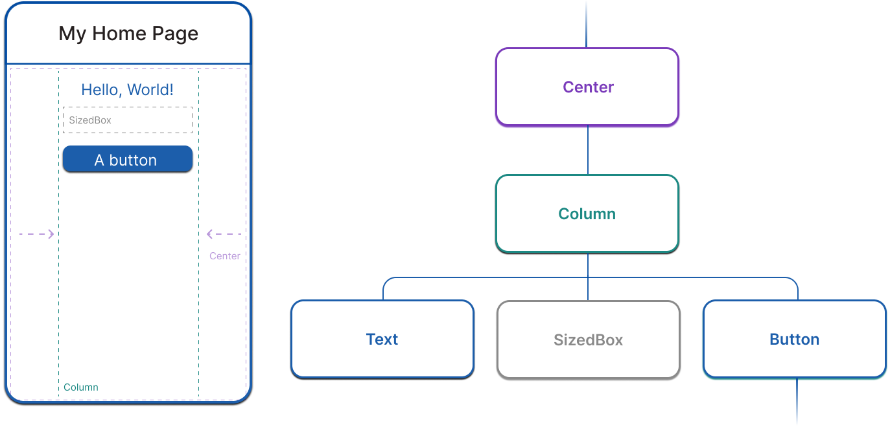

# Widget'lar

 Widget'lar, bir Flutter uygulamasının kullanıcı arayüzünün yapı taşlarıdır ve her widget, kullanıcı arayüzünün bir parçasının değişmez (immutable) bir bildirimidir. Widget'lar, metin ve düğmeler gibi fiziksel yönlerden; dolgu (padding) ve hizalama gibi düzen efektlerine kadar bir kullanıcı arayüzünün tüm yönlerini tanımlamak için kullanılır.

Widget'lar kompozisyona dayalı bir hiyerarşi oluşturur. Her widget ebeveyninin içine yerleşir ve ebeveyninden bağlam (context) alabilir. Bu yapı, aşağıdaki basit örneğin gösterdiği gibi kök (root) widget'a kadar uzanır:

```dart
import 'package:flutter/material.dart';

void main() => runApp(const MyApp());

class MyApp extends StatelessWidget {
  const MyApp({super.key});

  @override
  Widget build(BuildContext context) {
    return MaterialApp( // Root widget
      home: Scaffold(
        appBar: AppBar(
          title: const Text('My Home Page'),
        ),
        body: Center(
          child: Builder(
            builder: (context) {
              return Column(
                children: [
                  const Text('Hello, World!'),
                  const SizedBox(height: 20),
                  ElevatedButton(
                    onPressed: () {
                      print('Click!');
                    },
                    child: const Text('A button'),
                  ),
                ],
              );
            },
          ),
        ),
      ),
    );
  }
}
```

Önceki kodda, örneklenen tüm sınıflar birer widget'tır: `MaterialApp`, `Scaffold`, `AppBar`, `Text`, `Center`, `Builder`, `Column`, `SizedBox` ve `ElevatedButton`.

## Widget Kompozisyonu (Widget Composition)

Belirtildiği gibi, Flutter widget'ları bir kompozisyon birimi olarak vurgular. Widget'lar tipik olarak, güçlü efektler üretmek için birleşen diğer birçok küçük, tek amaçlı widget'tan oluşur.

`Padding`, `Alignment`, `Row`, `Column` ve `Grid` gibi düzen (layout) widget'ları vardır. Bu düzen widget'larının kendi görsel temsilleri yoktur. Bunun yerine, tek amaçları başka bir widget'ın düzeninin bir yönünü kontrol etmektir. Flutter ayrıca bu kompozisyonel yaklaşımdan yararlanan yardımcı (utility) widget'lar da içerir. Örneğin, yaygın olarak kullanılan bir widget olan `Container`; düzen, boyama, konumlandırma ve boyutlandırmadan sorumlu birkaç widget'tan oluşur. Önceki örnekteki `ElevatedButton` ve `Text` gibi widget'ların yanı sıra `Icon` ve `Image` gibi widget'ların görsel temsili vardır.

Önceki örnekteki kodu çalıştırırsanız, Flutter ekrana ortalanmış ve dikey olarak düzenlenmiş "Hello, World!" metnini içeren bir düğme çizer. Bu öğeleri konumlandırmak için, çocuklarını mevcut alanın merkezine yerleştiren bir `Center` widget'ı ve çocuklarını birbiri ardına dikey olarak düzenleyen bir `Column` widget'ı vardır.




## Widget Oluşturma

Flutter'da bir kullanıcı arayüzü oluşturmak için, widget nesnelerindeki `build` metodunu geçersiz kılarsınız (override). Tüm widget'ların bir `build` metodu olmalıdır ve bu metod başka bir widget döndürmelidir. Örneğin, ekrana biraz dolgu (padding) ile metin eklemek istiyorsanız, bunu şöyle yazabilirsiniz:

```dart
class PaddedText extends StatelessWidget {
  const PaddedText({super.key});

  @override
  Widget build(BuildContext context) {
    return Padding(
      padding: const EdgeInsets.all(8.0),
      child: const Text('Hello, World!'),
    );
  }
}
```

Framework, bu widget oluşturulduğunda ve bu widget'ın bağımlılıkları değiştiğinde (widget'a iletilen durum gibi) `build` metodunu çağırır. Bu metod potansiyel olarak her karede (genellikle saniyede 60 kez) çağrılabilir ve bir widget oluşturmanın ötesinde herhangi bir yan etkisi olmamalıdır. Flutter'ın widget'ları nasıl oluşturduğu (render) hakkında daha fazla bilgi edinmek için [Flutter mimari genel bakışına](https://docs.flutter.dev/resources/architectural-overview) göz atın.

## Widget Durumu (Widget State)

Framework iki ana widget sınıfı sunar: **stateful** (durumlu) ve **stateless** (durumsuz) widget'lar.

Değişebilir durumu olmayan (zamanla değişen sınıf özellikleri olmayan) widget'lar `StatelessWidget` sınıfının alt sınıfıdır. `Padding`, `Text` ve `Icon` gibi birçok yerleşik widget stateless'tır. Kendi widget'larınızı oluştururken, çoğu zaman `Stateless` widget'lar oluşturursunuz.

Öte yandan, bir widget'ın benzersiz özelliklerinin kullanıcı etkileşimi veya diğer faktörlere bağlı olarak değişmesi gerekiyorsa, o widget stateful'dur. Örneğin, bir widget'ın kullanıcı bir düğmeye her dokunduğunda artan bir sayacı varsa, sayacın değeri o widget için durumdur (state). Bu değer değiştiğinde, widget'ın kullanıcı arayüzündeki parçasını güncellemek için yeniden oluşturulması gerekir. Bu widget'lar `StatefulWidget` sınıfının alt sınıfıdır ve (widget'ın kendisi değişmez olduğu için) değişebilir durumu `State` sınıfının alt sınıfı olan ayrı bir sınıfta saklarlar. `StatefulWidget`'ların bir `build` metodu yoktur; bunun yerine, kullanıcı arayüzleri aşağıdaki örnekte gösterildiği gibi `State` nesneleri aracılığıyla oluşturulur.

```dart
class CounterWidget extends StatefulWidget {
  @override
  State<CounterWidget> createState() => _CounterWidgetState();
}

class _CounterWidgetState extends State<CounterWidget> {
  int _counter = 0;

  void _incrementCounter() {
    setState(() {
      _counter++;
    });
  }

  @override
  Widget build(BuildContext context) {
    return Text('$_counter');
  }
}
```

Bir `State` nesnesini her değiştirdiğinizde (örneğin, sayacı artırarak), `State`'in `build` metodunu tekrar çağırarak framework'e kullanıcı arayüzünü güncellemesini bildirmek için `setState`'i çağırmalısınız.

Durumu widget nesnelerinden ayırmak, diğer widget'ların hem stateless hem de stateful widget'lara, durumu kaybetme endişesi duymadan tam olarak aynı şekilde davranmasını sağlar. Ebeveynin, durumunu korumak için bir çocuğa tutunması gerekmez; bunun yerine, ebeveyn herhangi bir zamanda çocuğun kalıcı durumunu kaybetmeden çocuğun yeni bir örneğini oluşturabilir. Framework, uygun olduğunda mevcut durum nesnelerini bulma ve yeniden kullanma işini halleder.

`StatefulWidget` nesneleri hakkında daha fazla bilgi, bu serinin ilerleyen kısımlarındaki **durum yönetimi** dersinde mevcuttur.

## Bilinmesi Gereken Önemli Widget'lar

Flutter SDK, `Text` gibi kullanıcı arayüzünün en küçük parçalarından, düzen widget'larına ve uygulamanızı biçimlendiren widget'lara kadar birçok yerleşik widget içerir. Aşağıdaki widget'lar, öğrenme yolunda bir sonraki derse geçerken farkında olmanız gereken en önemli widget'lardır:


* [**Container**](https://api.flutter.dev/flutter/widgets/Container-class.html)
* [**Text**](https://api.flutter.dev/flutter/widgets/Text-class.html)
* [**Scaffold**](https://api.flutter.dev/flutter/material/Scaffold-class.html)
* [**AppBar**](https://api.flutter.dev/flutter/material/AppBar-class.html)
* [**Row**](https://api.flutter.dev/flutter/widgets/Row-class.html) ve [**Column**](https://api.flutter.dev/flutter/widgets/Column-class.html)
* [**ElevatedButton**](https://api.flutter.dev/flutter/material/ElevatedButton-class.html)
* [**Image**](https://api.flutter.dev/flutter/widgets/Image-class.html)
* [**Icon**](https://api.flutter.dev/flutter/widgets/Icon-class.html)

## Widget Önizleyici (Widget Previewer)

Widget'larınızın tam bir uygulamadan bağımsız olarak, gerçek zamanlı bir şekilde oluşturulduğunu görebilirsiniz. Daha fazla bilgi edinmek için [Flutter Widget Önizleyici](https://docs.flutter.dev/tools/widget-previewer) kılavuzuna bakın.


---
---

## 📄 Lisans Bilgisi

Bu doküman, **Flutter resmi dokümantasyonundan** türetilmiş Türkçe ders notudur.

**Orijinal kaynak:**  
https://docs.flutter.dev/get-started/fundamentals/widgets

**Türkçe çeviri ve düzenleme:**  
[Doç. Dr. Hakan Temiz](mailto:htemiz@artvin.edu.tr)

---

### Lisans Kapsamı

Bu dokümandaki içerikler aşağıdaki açık lisanslar kapsamında sunulmaktadır:

**Metin içerikleri (anlatım ve açıklamalar):**  
Flutter resmi dokümantasyonundan alınmış veya uyarlanmıştır.  
**Lisans:** Creative Commons Attribution 4.0 International (CC BY 4.0)  
https://creativecommons.org/licenses/by/4.0/

Bu lisans kapsamında:
- İçerik kopyalanabilir, dağıtılabilir ve uyarlanabilir  
- Ticari kullanım serbesttir  
- Kaynak belirtilmesi zorunludur  

**Kod örnekleri:**  
Flutter resmi dokümantasyonundan alınmış veya uyarlanmıştır.  
**Lisans:** BSD 3-Clause License  
https://opensource.org/licenses/BSD-3-Clause

Bu lisans kapsamında:
- Kodlar kopyalanabilir, değiştirilebilir ve dağıtılabilir  
- Ticari kullanım serbesttir  
- Lisans bildiriminin korunması gerekir  

---
---
