# Düzenler (Layouts)

Flutter'da kullanıcı arayüzü (UI) oluştururken zamanınızın çoğunu düzenler (layouts) oluşturarak geçirirsiniz. Bu bölümde, en yaygın düzen widget'larını nasıl kullanacağınızı, Flutter'ın düzenleri nasıl oluşturduğunu ve "unbounded constraints" (sınırsız kısıtlamalar) hatasıyla nasıl başa çıkacağınızı öğreneceksiniz.

## Flutter'da Düzeni Anlamak

Flutter'ın düzen mekanizmasının çekirdeği **widget**'lardır. Gördüğünüz (resimler, ikonlar, metinler) ve görmediğiniz (satırlar, sütunlar, ızgaralar) her şey birer widget'tır. Karmaşık widget'lar oluşturmak için bu widget'ları birleştirerek (composition) bir düzen oluşturursunuz.

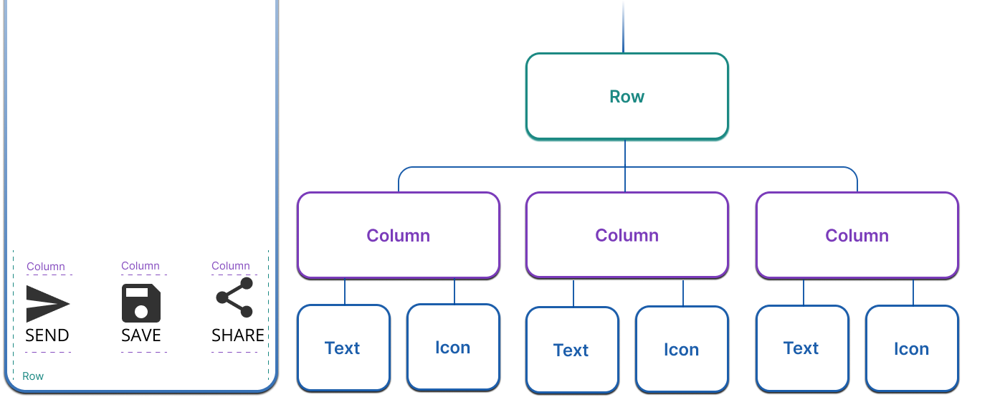

Bu örnekte, her biri bir simge ve bir etiket içeren 3 sütundan oluşan bir satır vardır.
Karmaşık olsun ya da olmasın, tüm düzenler (layout’lar) bu düzen widget’larının birleştirilmesiyle oluşturulur.


### Kısıtlamalar (Constraints)

Flutter'da düzenin nasıl çalıştığını anlamak için **kısıtlamaları (constraints)** anlamak çok önemlidir.

Genel anlamda layout (düzen), widget’ların boyutlarını ve ekrandaki konumlarını ifade eder.
Herhangi bir widget’ın boyutu ve konumu ebeveyni (parent) tarafından sınırlandırılır; yani bir widget istediği herhangi bir boyuta sahip olamaz ve ekrandaki yerini kendi başına belirleyemez.

Bunun yerine, boyut ve konum, widget ile ebeveyni arasındaki bir iletişim (conversation) sonucunda belirlenir.

En basit örnekte, bu layout iletişimi şu şekilde gerçekleşir:


* **Kural:** "Kısıtlamalar aşağıya iner. Boyutlar yukarıya çıkar. Ebeveyn konumu belirler." (Constraints go down. Sizes go up. Parent sets the position.)
* Bir widget, ebeveyninden kısıtlamaları alır (minimum/maksimum genişlik ve yükseklik).
* Widget bu kısıtlamalar içinde kendi boyutunu belirler ve ebeveynine bildirir.
* Ebeveyn, widget'ın hizalamasına ve boyutuna göre konumunu ayarlar.

### Kutu Türleri (Box Types)

Genel olarak üç tür kutu (box) davranışı vardır:

1. **Mümkün olduğunca büyük olmaya çalışanlar:** Örn. `Center`, `ListView`.
2. **Çocuklarıyla aynı boyutta olmaya çalışanlar:** Örn. `Transform`, `Opacity`.
3. **Belirli bir boyutta olmaya çalışanlar:** Örn. `Image`, `Text`.

## Tek Bir Widget'ı Düzenleme
Flutter’da tek bir widget’ı ekranda yerleştirmek için,
Text veya Image gibi görünen bir widget’ı, ekrandaki konumunu değiştirebilen bir widget ile sarmalarsınız.

Örneğin bunu yapmak için Center widget’ı kullanılır.


```dart
Widget build(BuildContext context) {
  return Center(
    child: BorderedImage(),
  );
}
```

✅ Not:
Bu sayfadaki örneklerde BorderedImage adlı bir widget kullanılmaktadır.
Bu, özel (custom) olarak oluşturulmuş bir widget’tır ve burada, bu konuyla doğrudan ilgili olmayan kodları gizlemek amacıyla kullanılmıştır.

Aşağıdaki şekil, sola hizalanmamış bir widget’ı ve sağ tarafta ortalanmış bir widget’ı göstermektedir.

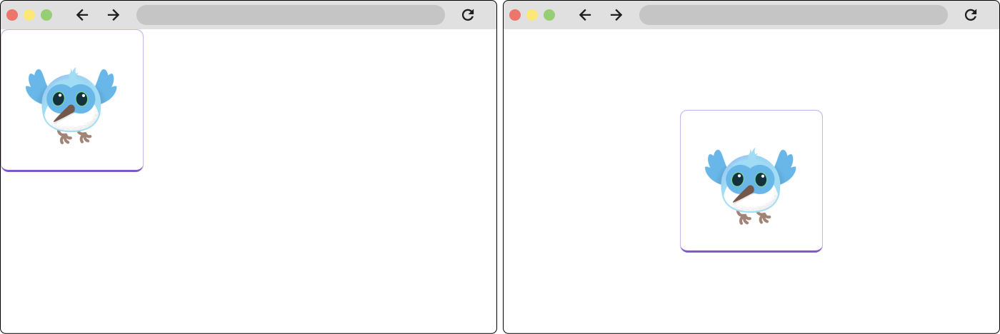

- Eğer tek bir alt widget (child) alıyorsa **child** özelliği kullanılır.  
  Örneğin: `Center`, `Container` veya `Padding`.

- Eğer birden fazla widget alıyorsa **children** özelliği kullanılır.  
  Örneğin: `Row`, `Column`, `ListView` veya `Stack`.


### Container

`Container`, düzen (layout), boyama (painting), konumlandırma (positioning) ve boyutlandırmadan (sizing) sorumlu birkaç widget’ın bir araya getirilmesiyle oluşturulmuş kullanışlı (convenience) bir widget’tır.  

Düzen açısından bakıldığında, bir widget’a **iç boşluk (padding)** ve **dış boşluk (margin)** eklemek için kullanılabilir.  

Aynı etkiyi elde etmek için burada ayrıca `Padding` widget’ı da kullanılabilir.  

Aşağıdaki örnekte `Container` kullanılmaktadır.


```dart
Widget build(BuildContext context) {
  return Container(
    padding: EdgeInsets.all(16.0),
    child: BorderedImage(),
  );
}
```

Aşağıdaki şekil, sol tarafta padding (iç boşluk) olmayan bir widget’ı ve sağ tarafta padding eklenmiş bir widget’ı göstermektedir.


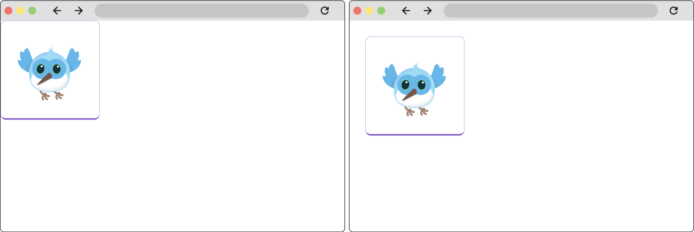


Flutter’da daha karmaşık düzenler (layout’lar) oluşturmak için birçok widget’ı bir araya getirebilirsiniz.  
Örneğin `Container` ve `Center` widget’larını birlikte kullanabilirsiniz:

```dart
Widget build(BuildContext context) {
  return Center(
    child: Container(
      padding: EdgeInsets.all(16.0),
      child: BorderedImage(),
    ),
  );
}
```

## Birden Fazla Widget'ı Düzenleme

Flutter’da en yaygın düzen (layout) kalıplarından biri, widget’ları **dikey** veya **yatay** olarak sıralamaktır.  
Widget’ları yatay olarak sıralamak için `Row`, dikey olarak sıralamak için ise `Column` widget’ı kullanılır.  
Bu sayfadaki ilk şekil her ikisini de kullanmıştır.

Aşağıda `Row` widget’ının en temel kullanım örneği gösterilmektedir.


<table>
<tr>
<td>

```dart
 Widget build(BuildContext context) {
  return Row(
    children: [
      BorderedImage(),
      BorderedImage(),
      BorderedImage(),
    ],
  );
} 

```

</br>
<p> </p>
</td> 

<td> 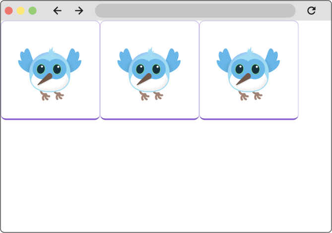
<p> Şekil: Üç alt widget’a sahip bir Row widget’ı.</p>
</td>
</tr>
</table>


`Row` veya `Column` içindeki her bir alt widget (child), kendi içinde başka `Row` veya `Column` yapıları barındırabilir.  
Bu iç içe kombinasyonlar kullanılarak karmaşık düzenler (layout’lar) oluşturulabilir.

Örneğin, yukarıdaki örnekteki her bir görselin altına etiket eklemek için `Column` widget’ları kullanılabilir.


<table>
<tr>
<td>

```dart
Widget build(BuildContext context) {
  return Row(
    children: [
      Column(
        children: [
          BorderedImage(),
          Text('Dash 1'),
        ],
      ),
      Column(
        children: [
          BorderedImage(),
          Text('Dash 2'),
        ],
      ),
      Column(
        children: [
          BorderedImage(),
          Text('Dash 3'),
        ],
      ),
    ],
  );
}

``` 
</td> 

<td > 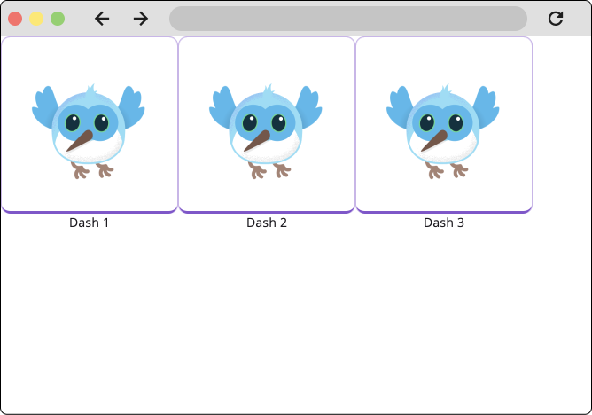
<p> Bu şekil, her biri birer `Column` olan üç alt widget’a sahip bir `Row` widget’ını göstermektedir.
</p>
</td>
</tr>
</table>


### Row (Satır) ve Column (Sütun)

En yaygın düzen modellerinden ikisidir.

* **Row:** Çocuklarını yatay olarak dizer.
* **Column:** Çocuklarını dikey olarak dizer.

Aşağıdaki örnekte her bir widget 200 piksel genişliğindedir ve görünüm alanı (viewport) 700 piksel genişliğindedir.  
Bu nedenle widget’lar soldan başlayarak art arda hizalanır ve tüm fazla boşluk sağ tarafta kalır.


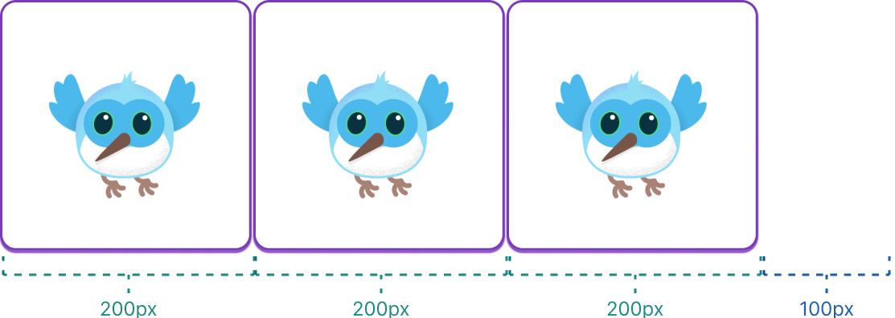


#### Hizalama (Alignment)

Çocukların nasıl hizalanacağını kontrol etmek için `mainAxisAlignment` (ana eksen) ve `crossAxisAlignment` (karşı eksen) özellikleri kullanılır.

* **Row için:** Ana eksen yatay, karşı eksen dikeydir.
* **Column için:** Ana eksen dikey, karşı eksen yataydır.

Örnek hizalama seçenekleri: `MainAxisAlignment.center`, `MainAxisAlignment.spaceBetween`, `CrossAxisAlignment.stretch` vb.


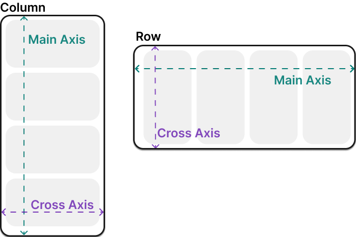

Ana eksen hizalamasını (`mainAxisAlignment`) **spaceEvenly** olarak ayarlamak,  
boşta kalan yatay alanı her bir görselin arasına, önüne ve arkasına eşit şekilde dağıtır.


<table>
<tr>
<td>

```dart
Widget build(BuildContext context) {
  return Row(
    mainAxisAlignment: MainAxisAlignment.spaceEvenly,
    children: [
      BorderedImage(),
      BorderedImage(),
      BorderedImage(),
    ],
  );
}

``` 
</td> 

<td > 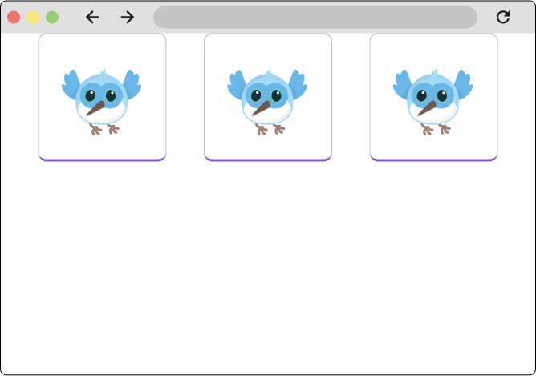
<p> Bu şekil, her biri birer `Column` olan üç alt widget’a sahip bir `Row` widget’ını göstermektedir.
</p>
</td>
</tr>
</table>


`Column` widget’ları, `Row` widget’larıyla aynı şekilde çalışır.  

Aşağıdaki örnek, her biri 100 piksel yüksekliğinde olan 3 görselden oluşan bir `Column` göstermektedir.  
Render kutusunun yüksekliği (bu durumda tüm ekran) 300 pikselden fazladır.  

Bu nedenle ana eksen hizalamasını (`mainAxisAlignment`) **spaceEvenly** olarak ayarlamak,  
boşta kalan dikey alanı her bir görselin **arasına, üstüne ve altına** eşit biçimde dağıtır.


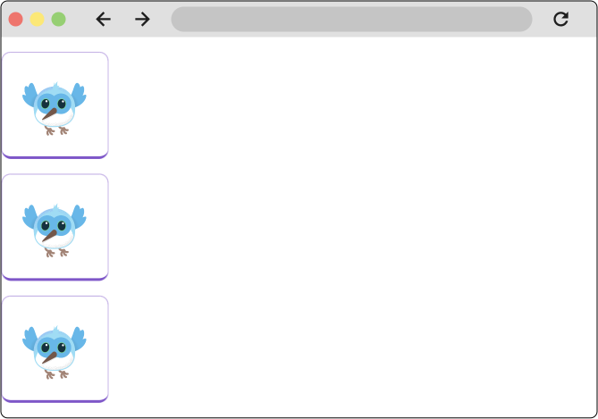

`MainAxisAlignment` ve `CrossAxisAlignment` enum’ları, hizalamayı kontrol etmek için çeşitli sabitler (constants) sunar.

Flutter ayrıca hizalama için kullanılabilecek başka widget’lar da içerir; bunların başında özellikle `Align` widget’ı gelir.


Bir düzen (layout) bir cihaza sığmayacak kadar büyük olduğunda, etkilenen kenar boyunca **sarı ve siyah çizgili bir desen** görünür.  

Bu örnekte görünüm alanı (viewport) 400 piksel genişliğindedir ve her bir alt widget 150 piksel genişliğindedir.


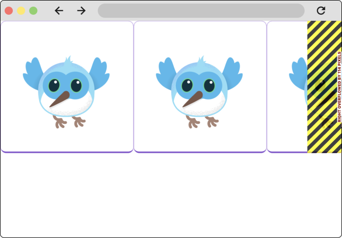


#### Boyutlandırma (Sizing)

Çocuk widget'ların `Row` veya `Column` içinde ne kadar yer kaplayacağını belirlemek için **Expanded** veya **Flexible** widget'ları kullanılır.

* **Expanded:** Çocuğun mevcut boş alanı doldurmasını sağlar. `flex` özelliği ile oran verilebilir.


`Expanded` widget’ı kullanılarak widget’lar `Row` veya `Column` içinde mevcut alana sığacak şekilde boyutlandırılabilir.  

Önceki örnekte, görsellerden oluşan satır render kutusuna sığamayacak kadar genişti.  
Bu durumu düzeltmek için her bir görseli `Expanded` widget’ı ile sarmalayabilirsiniz.


<table>
<tr>
<td>

```dart
Widget build(BuildContext context) {
  return const Row(
    children: [
      Expanded(
        child: BorderedImage(width: 150, height: 150),
      ),
      Expanded(
        child: BorderedImage(width: 150, height: 150),
      ),
      Expanded(
        child: BorderedImage(width: 150, height: 150),
      ),
    ],
  );
}
``` 
</td> 

<td > 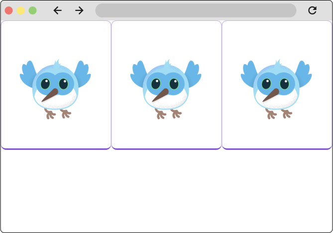
<p> Bu şekil, her biri `Expanded` widget’ı ile sarılmış üç alt widget’a sahip bir `Row` widget’ını göstermektedir.
</p>
</td>
</tr>
</table>


`Expanded` widget’ı, bir widget’ın kardeşlerine (siblings) göre ne kadar alan kaplayacağını da belirleyebilir.  

Örneğin, bir widget’ın kardeşlerinden **iki kat daha fazla alan** kaplamasını isteyebilirsiniz.  
Bunun için `Expanded` widget’ının **flex** özelliği kullanılır. Bu özellik, widget’ın esneklik katsayısını belirleyen bir tamsayıdır.  

Varsayılan flex değeri **1**’dir.  
Aşağıdaki kod, ortadaki görselin flex değerini **2** olarak ayarlamaktadır:


<table>
<tr>
<td width=450>

```dart
Widget build(BuildContext context) {
  return const Row(
    children: [
      Expanded(
        child: BorderedImage(width: 150, height: 150),
      ),
      Expanded(
        flex: 2,
        child: BorderedImage(width: 150, height: 150),
      ),
      Expanded(
        child: BorderedImage(width: 150, height: 150),
      ),
    ],
  );
}
``` 
</td> 

<td width=300> 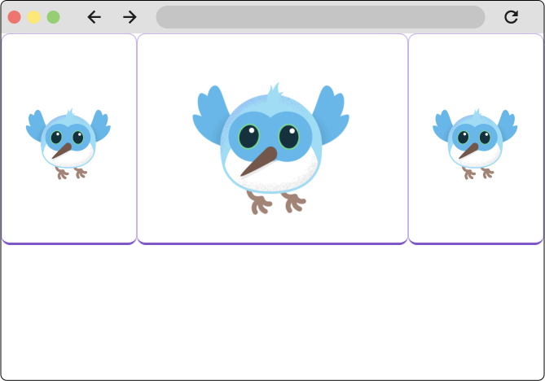
</br>
Bu şekil, her biri `Expanded` widget’ı ile sarılmış üç alt widget’a sahip bir `Row` widget’ını göstermektedir.  
Ortadaki alt widget’ın **flex** özelliği **2** olarak ayarlanmıştır.

</td>
</tr>
</table>


## Kaydırılabilir Widget'lar (Scrolling Widgets)

İçerik ekrana sığmadığında kaydırma özelliği eklemek gerekir.

### ListView

En yaygın kaydırma widget'ıdır. Çocuklarını dikey (veya yatay) bir liste halinde gösterir.


`ListView`’i kullanmanın en temel yolu, `Column` veya `Row` kullanımına oldukça benzer.  
Ancak `Column` veya `Row`’dan farklı olarak, `ListView` alt widget’larının **çapraz eksen boyunca mevcut tüm alanı kaplamasını** ister.  

Aşağıdaki örnekte bu durum gösterilmektedir.


<table>
<tr>
<td width=300>

```dart
Widget build(BuildContext context) {
  return ListView(
    children: const [
      BorderedImage(),
      BorderedImage(),
      BorderedImage(),
    ],
  );
}

``` 
</td> 

<td > 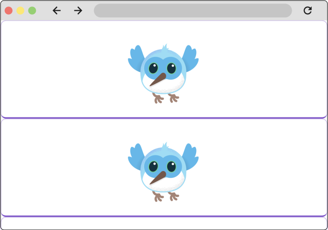
</br>
Bu şekil, üç alt widget’a sahip bir `ListView` widget’ını göstermektedir.


</td>
</tr>
</table>

`ListView`’ler, öğe sayısının bilinmediği veya çok büyük (hatta sonsuz) olduğu durumlarda yaygın olarak kullanılır.  
Bu gibi durumlarda en iyi yöntem `ListView.builder` yapıcısını (constructor) kullanmaktır.  

`builder` yapıcısı yalnızca **ekranda o anda görünen** alt widget’ları oluşturur.

Aşağıdaki örnekte `ListView`, bir yapılacaklar (to-do) listesini görüntülemektedir.  
To-do öğeleri bir repository’den getirildiği için, yapılacaklar sayısı önceden bilinmemektedir.


<table>
<tr>
<td width=400>

```dart
final List<ToDo> items = Repository.fetchTodos();

Widget build(BuildContext context) {
  return ListView.builder(
    itemCount: items.length,
    itemBuilder: (context, idx) {
      var item = items[idx];
      return Padding(
        padding: const EdgeInsets.all(8.0),
        child: Row(
          mainAxisAlignment: MainAxisAlignment.spaceBetween,
          children: [
            Text(item.description),
            Text(item.isComplete),
          ],
        ),
      );
    },
  );
}
``` 
</td> 

<td width=450 > 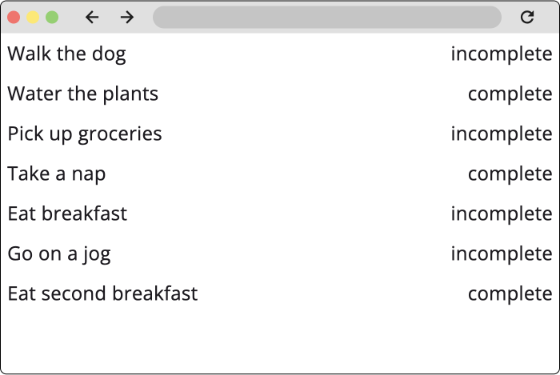
</br>
Bu şekil, bilinmeyen sayıda alt widget’ı görüntülemek için kullanılan `ListView.builder` yapıcısını göstermektedir.
</td>
</tr>
</table>


* **ListView.builder:** Bilinmeyen veya çok sayıda öğe (örn. veritabanından gelen veriler) için kullanılır. Sadece ekranda görünen öğeleri oluşturarak performans sağlar.


## Uyarlanabilir Düzenler (Adaptive Layouts)

Flutter; mobil, tablet, masaüstü ve web uygulamaları oluşturmak için kullanıldığından,  
uygulamanızın ekran boyutu veya giriş cihazı gibi etkenlere bağlı olarak farklı davranmasını sağlamanız gerekebilir.  

Bu yaklaşıma, bir uygulamayı **uyarlanabilir (adaptive)** ve **duyarlı (responsive)** hale getirmek denir.

Uyarlanabilir düzenler oluştururken en kullanışlı widget’lardan biri **LayoutBuilder** widget’ıdır.  
LayoutBuilder, Flutter’daki **"builder" tasarım desenini** kullanan birçok widget’tan biridir.

---

## Builder Tasarım Deseni

Flutter’da adında veya yapıcısında (**constructor**) *builder* kelimesi geçen birçok widget bulunur.  
Aşağıdaki liste tümünü kapsamaz:

- `ListView.builder`
- `GridView.builder`
- `Builder`
- `LayoutBuilder`
- `FutureBuilder`

Bu farklı *builder* yapıları, farklı problemleri çözmek için kullanılır.  

Örneğin:
- `ListView.builder`, liste öğelerini **ihtiyaç oldukça (lazy)** oluşturmak için kullanılır.  
- `Builder` widget’ı ise, derin widget ağaçlarında **BuildContext**’e erişmek için faydalıdır.

---

## Builder’ların Ortak Çalışma Mantığı

Kullanım amaçları farklı olsa da, tüm builder yapıları aynı çalışma prensibini paylaşır.

- Builder widget’larının ve builder constructor’larının hepsinde **builder** adlı (veya `ListView.builder` örneğinde olduğu gibi `itemBuilder` adlı) bir parametre bulunur.
- Bu parametre her zaman bir **callback fonksiyonu** kabul eder.
- Bu callback’e **builder function** denir.

Builder fonksiyonları:
- Ebeveyn widget’a veri aktaran callback’lerdir.
- Ebeveyn widget, bu verileri kullanarak alt widget’ı oluşturur ve geri döndürür.
- Builder fonksiyonları her zaman **en az bir parametre** alır: `BuildContext`.
- Genellikle buna ek olarak **en az bir parametre daha** içerir.

---

## LayoutBuilder Örneği

`LayoutBuilder` widget’ı, görünüm alanının (viewport) boyutuna göre **duyarlı (responsive)** düzenler oluşturmak için kullanılır.

Builder callback fonksiyonuna:
- Ebeveyninden aldığı **BoxConstraints**
- Ve widget’ın **BuildContext**’i

parametre olarak geçirilir.

Bu kısıtlamaları (constraints) kullanarak, mevcut alana göre **farklı widget’lar döndürebilirsiniz**.


Aşağıdaki örnekte, `LayoutBuilder` tarafından döndürülen widget,  
görünüm alanının (viewport) **600 pikselden küçük veya eşit** ya da **600 pikselden büyük** olmasına göre değişmektedir.


<table>
<tr>
<td width=400>

```dart
Widget build(BuildContext context) {
  return LayoutBuilder(
    builder: (BuildContext context, BoxConstraints constraints) {
      if (constraints.maxWidth <= 600) {
        return _MobileLayout();
      } else {
        return _DesktopLayout();
      }
    },
  );
}
``` 
</td> 

<td width=350 > 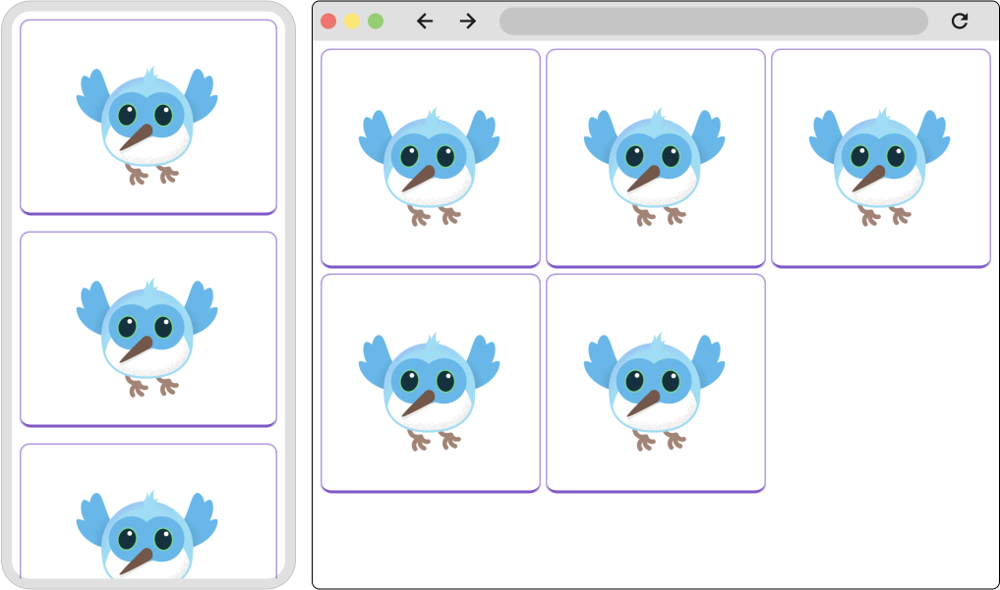
</br>
Bu şekil, alt widget’larını **dikey** olarak düzenleyen dar bir yerleşimi (layout)  
ve alt widget’larını **ızgara (grid)** biçiminde düzenleyen daha geniş bir yerleşimi göstermektedir.
</td>
</tr>
</table>


Bu arada, `ListView.builder` yapıcısındaki `itemBuilder` callback fonksiyonuna  
**BuildContext** ve bir **int** parametresi aktarılır.  

Bu callback, listedeki **her bir öğe** için bir kez çağrılır ve  
`int` parametresi, liste öğesinin **indeksini** temsil eder.  

Flutter arayüzü ilk kez oluştururken `itemBuilder` callback’i ilk çağrıldığında  
fonksiyona geçirilen `int` değeri **0**’dır, ikinci çağrıda **1**, sonra **2** şeklinde devam eder.

Bu durum, **indekse bağlı özel yapılandırmalar** yapabilmenizi sağlar.  

Yukarıda `ListView.builder` yapıcısı ile kullanılan örneği hatırlayalım:

```dart
final List<ToDo> items = Repository.fetchTodos();

Widget build(BuildContext context) {
  return ListView.builder(
    itemCount: items.length,
    itemBuilder: (context, idx) {
      var item = items[idx];
      return Padding(
        padding: const EdgeInsets.all(8.0),
        child: Row(
          mainAxisAlignment: MainAxisAlignment.spaceBetween,
          children: [
            Text(item.description),
            Text(item.isComplete),
          ],
        ),
      );
    },
  );
}
```

Bu örnek kod, builder fonksiyonuna geçirilen **index** değerini kullanarak  
öğe listesinden doğru yapılacaklar (todo) verisini alır ve  
builder tarafından döndürülen widget içinde bu veriyi görüntüler.

Bunu örneklendirmek için, aşağıdaki örnek her **iki listeden birinin**  
arka plan rengini değiştirir.


<table>
<tr>
<td width=500>

```dart
final List<ToDo> items = Repository.fetchTodos();

Widget build(BuildContext context) {
  return ListView.builder(
    itemCount: items.length,
    itemBuilder: (context, idx) {
      var item = items[idx];
      return Container(
        color: idx % 2 == 0 ? Colors.lightBlue : Colors.transparent,
        padding: const EdgeInsets.all(8.0),
        child: Row(
          mainAxisAlignment: MainAxisAlignment.spaceBetween,
          children: [
            Text(item.description),
            Text(item.isComplete),
          ],
        ),
      );
    },
  );
}
``` 
</td> 

<td width=350 > 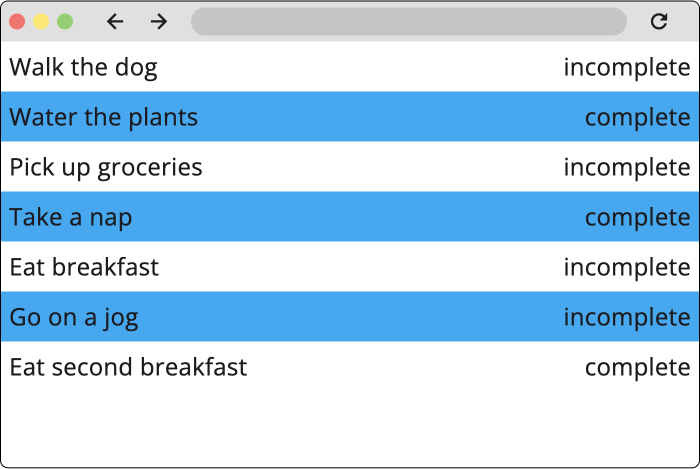
</br>
Bu şekil, alt widget’larının dönüşümlü (alternating) arka plan renklerine sahip olduğu bir `ListView` göstermektedir.  
Arka plan renkleri, her bir alt widget’ın `ListView` içindeki indeksine göre programatik olarak belirlenmiştir.
</td>
</tr>
</table>


## Yaygın Hatalar

**Unbounded Constraints (Sınırsız Kısıtlamalar):**
Bir `Column` veya `Row` gibi esnek boyutlu bir widget'ı, `ListView` gibi kaydırılabilir (ve teorik olarak sonsuz boyuta sahip olabilen) bir alanın içine kısıtlama olmadan yerleştirirseniz bu hatayı alırsınız. Çözüm genellikle içteki widget'ı `Expanded` veya belirli bir boyutlu widget ile sarmalamaktır.


---
---

## 📄 Lisans Bilgisi

Bu doküman, **Flutter resmi dokümantasyonundan** türetilmiş Türkçe ders notudur.

**Orijinal kaynak:**  
https://docs.flutter.dev/get-started/fundamentals/layout


**Türkçe çeviri ve düzenleme:**  
[Doç. Dr. Hakan Temiz](mailto:htemiz@artvin.edu.tr)

---

### Lisans Kapsamı

Bu dokümandaki içerikler aşağıdaki açık lisanslar kapsamında sunulmaktadır:

**Metin içerikleri (anlatım ve açıklamalar):**  
Flutter resmi dokümantasyonundan alınmış veya uyarlanmıştır.  
**Lisans:** Creative Commons Attribution 4.0 International (CC BY 4.0)  
https://creativecommons.org/licenses/by/4.0/

Bu lisans kapsamında:
- İçerik kopyalanabilir, dağıtılabilir ve uyarlanabilir  
- Ticari kullanım serbesttir  
- Kaynak belirtilmesi zorunludur  

**Kod örnekleri:**  
Flutter resmi dokümantasyonundan alınmış veya uyarlanmıştır.  
**Lisans:** BSD 3-Clause License  
https://opensource.org/licenses/BSD-3-Clause

Bu lisans kapsamında:
- Kodlar kopyalanabilir, değiştirilebilir ve dağıtılabilir  
- Ticari kullanım serbesttir  
- Lisans bildiriminin korunması gerekir  

---
---
