# Kullanıcı girdisini işleme (Handling user input)

Çok platformlu bir UI (Kullanıcı Arayüzü) çerçevesi olarak, kullanıcıların bir Flutter uygulamasıyla etkileşime girmesi için birçok farklı yol vardır. Bu bölümdeki kaynaklar, uygulamanızda kullanıcı etkileşimini sağlamak için kullanılan bazı yaygın widget'ları size tanıtır.

Kaydırma (scrolling) gibi bazı kullanıcı girdi mekanizmaları, **Düzenler (Layouts)** bölümünde zaten ele alınmıştı.

## Tasarım sistemi desteği hakkında

Flutter, SDK'nın bir parçası olarak iki tasarım sistemi için önceden oluşturulmuş bileşenlerle birlikte gelir: **Material** ve **Cupertino**. Eğitim amaçlı olarak bu sayfa, **Material 3 tasarım dili** özelliklerine göre stillendirilmiş bileşenler olan Material widget'larına odaklanmaktadır.

Dart ve Flutter için paket deposu olan **pub.dev** üzerindeki Flutter topluluğu, **Fluent UI**, **macOS UI** ve daha fazlası gibi ek tasarım dillerini oluşturur ve destekler. Mevcut tasarım sistemi bileşenleri ihtiyacınıza tam olarak uymuyorsa, Flutter kendi özel widget'larınızı oluşturmanıza olanak tanır; bu konu bu bölümün sonunda ele alınmaktadır. Hangi tasarım sistemini seçerseniz seçin, bu sayfadaki ilkeler geçerlidir.

**Referans:** Widget kataloğu, **Material** ve **Cupertino** kütüphanelerinde yaygın olarak kullanılan widget'ların bir envanterine sahiptir.


## Düğmeler (Buttons)

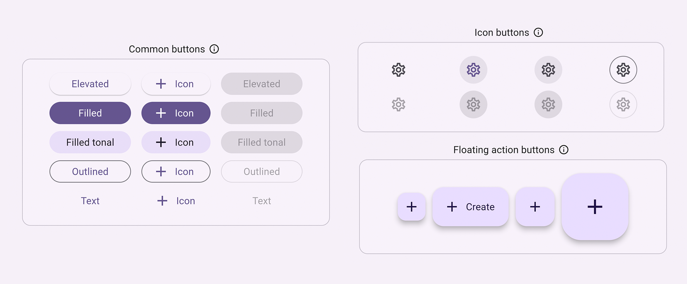


Düğmeler, kullanıcının tıklayarak veya dokunarak kullanıcı arayüzünde bir eylem başlatmasına olanak tanır. Material kütüphanesi, işlevsel olarak benzer olan ancak çeşitli kullanım durumları için farklı şekilde stillendirilmiş çeşitli düğme türleri sağlar; bunlar şunları içerir:

* **ElevatedButton:** Derinliğe sahip bir düğme. Genellikle düz olan düzenlere boyut katmak için yükseltilmiş düğmeleri kullanın.
* **FilledButton:** **Kaydet**, **Şimdi Katıl** veya **Onayla** gibi bir akışı tamamlayan önemli, nihai eylemler için kullanılması gereken içi dolu bir düğme.
* **Tonal Button:** `FilledButton` ve `OutlinedButton` arasında orta yollu bir düğme. **İleri** (Next) gibi, daha düşük öncelikli bir düğmenin sadece bir çerçeveden daha fazla vurgu gerektirdiği bağlamlarda kullanışlıdırlar.
* **OutlinedButton:** Metin ve görünür bir kenarlığa sahip düğme. Bu düğmeler önemli olan ancak bir uygulamadaki birincil eylem olmayan eylemleri içerir.
* **TextButton:** Kenarlığı olmayan tıklanabilir metin. Metin düğmelerinin görünür kenarlıkları olmadığından, bağlam için diğer içeriğe göre konumlarına güvenmeleri gerekir.
* **IconButton:** Simgesi olan bir düğme.
* **FloatingActionButton:** Birincil bir eylemi teşvik etmek için içeriğin üzerinde duran (yüzen) bir simge düğmesi.
* **Video:** FloatingActionButton (Haftanın Widget'ı)

Aşağıdaki `ElevatedButton` örnek kodunda görüldüğü gibi, bir düğme oluşturmanın genellikle 3 ana yönü vardır: stil (style), geri çağırma (callback) ve çocuğu (child):

1. Bir düğmenin geri çağırma işlevi olan `onPressed`, düğmeye tıklandığında ne olacağını belirler; bu nedenle, uygulama durumunuzu güncellediğiniz yer bu işlevdir. Geri çağırma `null` ise, düğme devre dışı bırakılır ve kullanıcı düğmeye bastığında hiçbir şey olmaz.
2. Düğmenin içerik alanında görüntülenen düğmenin çocuğu (`child`), genellikle düğmenin amacını belirten bir metin veya simgedir.
3. Son olarak, bir düğmenin stili (`style`) görünümünü kontrol eder: renk, kenarlık vb.

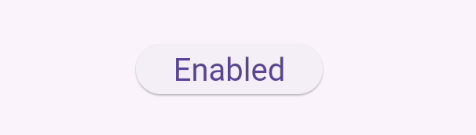


```dart
int count = 0;

@override
Widget build(BuildContext context) {
  return ElevatedButton(
    style: ElevatedButton.styleFrom(
      textStyle: const TextStyle(fontSize: 20),
    ),
    onPressed: () {
      setState(() {
        count += 1;
      });
    },
    child: const Text('Enabled'),
  );
}
```


## Metin (Text)

Birkaç widget metin girişini destekler.

### SelectableText

Flutter'ın `Text` widget'ı ekranda metin görüntüler, ancak kullanıcıların metni vurgulamasına veya kopyalamasına izin vermez. `SelectableText`, kullanıcı tarafından seçilebilir bir metin dizesi görüntüler.

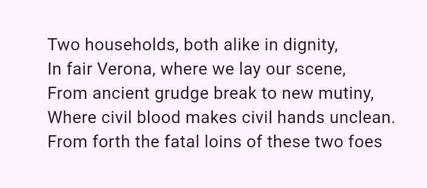


```dart
@override
Widget build(BuildContext context) {
  return const SelectableText('''
Two households, both alike in dignity,
In fair Verona, where we lay our scene,
From ancient grudge break to new mutiny,
Where civil blood makes civil hands unclean.
From forth the fatal loins of these two foes''');
}
```


### RichText

`RichText`, uygulamanızda zengin metin dizeleri görüntülemenizi sağlar. `RichText`'e benzer şekilde `TextSpan`, metnin bölümlerini farklı metin stilleriyle görüntülemenize olanak tanır. Kullanıcı girdisini işlemek için değildir, ancak kullanıcıların metni düzenlemesine ve biçimlendirmesine izin veriyorsanız yararlıdır.

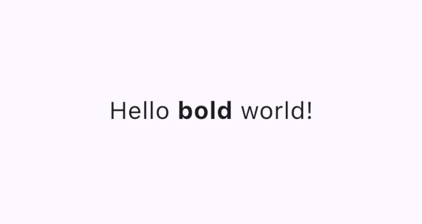


```dart
@override
Widget build(BuildContext context) {
  return RichText(
    text: TextSpan(
      text: 'Hello ',
      style: DefaultTextStyle.of(context).style,
      children: const <TextSpan>[
        TextSpan(text: 'bold', style: TextStyle(fontWeight: FontWeight.bold)),
        TextSpan(text: ' world!'),
      ],
    ),
  );
}
```


### TextField

Bir `TextField`, kullanıcıların donanım veya ekran klavyesi kullanarak bir metin kutusuna metin girmesini sağlar.

`TextField`'ların birçok farklı özelliği ve yapılandırması vardır. Öne çıkanlardan birkaçı:

* `InputDecoration`, renk ve kenarlık gibi metin alanının görünümünü belirler.
* `controller`: Bir `TextEditingController`, düzenlenen metni kontrol eder. Neden bir denetleyiciye ihtiyacınız olabilir? Varsayılan olarak, uygulamanızın kullanıcıları metin alanına yazabilir, ancak `TextField`'ı programatik olarak kontrol etmek ve örneğin değerini temizlemek istiyorsanız, bir `TextEditingController`'a ihtiyacınız olacaktır.
* `onChanged`: Bu geri çağırma (callback) işlevi, metin ekleme veya kaldırma gibi durumlarda kullanıcı metin alanının değerini değiştirdiğinde tetiklenir.
* `onSubmitted`: Bu geri çağırma, kullanıcı alandaki metni düzenlemeyi bitirdiğini belirttiğinde tetiklenir; örneğin, metin alanı odaktayken "enter" tuşuna basıldığında.

Sınıf, girilen her harfi bir daireye dönüştüren `obscureText` ve kullanıcının metni değiştirmesini engelleyen `readOnly` gibi diğer yapılandırılabilir özellikleri de destekler.

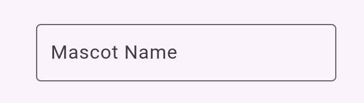


Bu şekil, seçili bir kenarlığı ve etiketi olan bir TextField'a yazılan metni göstermektedir.


```dart
final TextEditingController _controller = TextEditingController();

@override
Widget build(BuildContext context) {
  return TextField(
    controller: _controller,
    decoration: const InputDecoration(
      border: OutlineInputBorder(),
      labelText: 'Mascot Name',
    ),
  );
}
```


### Form

`Form`, `TextField` gibi birden fazla form alanı widget'ını bir arada gruplamak için isteğe bağlı bir kapsayıcıdır.

Her bir form alanı, ortak ata olarak `Form` widget'ı ile bir `FormField` widget'ına sarılmalıdır. Form alanı widget'larını sizin için bir `FormField` içine önceden saran kolaylık widget'ları mevcuttur. Örneğin, `TextField`'ın `Form` widget versiyonu `TextFormField`'dır.

Bir `Form` kullanmak, bu `Form`'dan türeyen her `FormField`'ı kaydetmenizi, sıfırlamanızı ve doğrulamanızı sağlayan bir `FormState`'e erişim sağlar. Aşağıdaki kodda gösterildiği gibi, belirli bir formu tanımlamak için bir `GlobalKey` de sağlayabilirsiniz:

```dart
final GlobalKey<FormState> _formKey = GlobalKey<FormState>();

@override
Widget build(BuildContext context) {
  return Form(
    key: _formKey,
    child: Column(
      crossAxisAlignment: CrossAxisAlignment.start,
      children: <Widget>[
        TextFormField(
          decoration: const InputDecoration(
            hintText: 'Enter your email',
          ),
          validator: (String? value) {
            if (value == null || value.isEmpty) {
              return 'Please enter some text';
            }
            return null;
          },
        ),
        Padding(
          padding: const EdgeInsets.symmetric(vertical: 16.0),
          child: ElevatedButton(
            onPressed: () {
              // Validate returns true if the form is valid, or false otherwise.
              if (_formKey.currentState!.validate()) {
                // Process data.
              }
            },
            child: const Text('Submit'),
          ),
        ),
      ],
    ),
  );
}
```


## Seçenek Grupları

Flutter, kullanıcılara birkaç seçenek arasından seçim yapmaları için araçlar sağlar.

### SegmentedButton

`SegmentedButton`, kullanıcıların 2-5 öğeden oluşan minimal bir gruptan seçim yapmasına olanak tanır.

Veri türü, `<T>`, `int`, `String`, `bool` gibi yerleşik bir tür veya bir `enum` olabilir. Bir `SegmentedButton`'ın birkaç ilgili özelliği vardır:

* `segments`, kullanıcının seçebileceği bir "segmenti" veya seçeneği temsil eden `ButtonSegment`'lerin bir listesidir. Görsel olarak, her `ButtonSegment` bir simgeye, metin etiketine veya her ikisine birden sahip olabilir.
* `multiSelectionEnabled`, kullanıcının birden fazla seçenek seçip seçemeyeceğini belirtir. Bu özellik varsayılan olarak `false`'tur.
* `selected`, o anda seçili olan değer(ler)i tanımlar. **Not:** `selected`, `Set<T>` türündedir, bu nedenle kullanıcıların yalnızca bir değer seçmesine izin veriyorsanız, bu değer tek elemanlı bir `Set` olarak sağlanmalıdır.
* `onSelectionChanged` geri çağırması (callback), bir kullanıcı herhangi bir segmenti seçtiğinde tetiklenir. Uygulama durumunuzu güncelleyebilmeniz için seçilen segmentlerin bir listesini sağlar.

Ek stil parametreleri düğmenin görünümünü değiştirmenize olanak tanır. Örneğin `style`, bir `selectedIcon` yapılandırmanın bir yolunu sağlayan bir `ButtonStyle` alır.

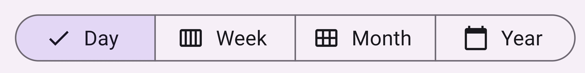

Bu şekil, her bir segmentin değerini temsil eden bir simge ve metne sahip olduğu bir `SegmentedButton`'ı göstermektedir.

```dart
enum Calendar { day, week, month, year }

// StatefulWidget...
Calendar calendarView = Calendar.day;

@override
Widget build(BuildContext context) {
  return SegmentedButton<Calendar>(
    segments: const <ButtonSegment<Calendar>>[
      ButtonSegment<Calendar>(
          value: Calendar.day,
          label: Text('Day'),
          icon: Icon(Icons.calendar_view_day)),
      ButtonSegment<Calendar>(
          value: Calendar.week,
          label: Text('Week'),
          icon: Icon(Icons.calendar_view_week)),
      ButtonSegment<Calendar>(
          value: Calendar.month,
          label: Text('Month'),
          icon: Icon(Icons.calendar_view_month)),
      ButtonSegment<Calendar>(
          value: Calendar.year,
          label: Text('Year'),
          icon: Icon(Icons.calendar_today)),
    ],
    selected: <Calendar>{calendarView},
    onSelectionChanged: (Set<Calendar> newSelection) {
      setState(() {
        // By default, there is only a single segment that can be
        // selected at a time, so its value is always the first
        calendarView = newSelection.first;
      });
    },
  );
}
```

### Chip (Çip)

`Chip`, belirli bir bağlam için bir niteliği, metni, varlığı veya eylemi temsil etmenin kompakt bir yoludur. Belirli kullanım durumları için özelleşmiş `Chip` widget'ları mevcuttur:

* `InputChip`, bir varlık (kişi, yer veya nesne) veya konuşma metni gibi karmaşık bir bilgi parçasını kompakt bir biçimde temsil eder.
* `ChoiceChip`, bir seçenek kümesinden tek bir seçim yapılmasına izin verir. Seçim çipleri (Choice chips) ilgili açıklayıcı metinler veya kategoriler içerir.
* `FilterChip`, içeriği filtrelemek için etiketler veya açıklayıcı kelimeler kullanır.
* `ActionChip`, birincil içerikle ilgili bir eylemi temsil eder.

Her `Chip` widget'ı bir `label` (etiket) gerektirir. İsteğe bağlı olarak bir `avatar`'a (simge veya kullanıcının profil resmi gibi) ve tetiklendiğinde çipi silen bir silme simgesi gösteren bir `onDeleted` geri çağırmasına sahip olabilir. Bir `Chip` widget'ının görünümü `shape`, `color` ve `iconTheme` gibi bir dizi isteğe bağlı parametre ayarlanarak da özelleştirilebilir.

Çiplerinizin kaydığından ve uygulamanızın kenarında kesilmediğinden emin olmak için genellikle çocuklarını birden fazla yatay veya dikey dizide görüntüleyen bir widget olan `Wrap` kullanırsınız.

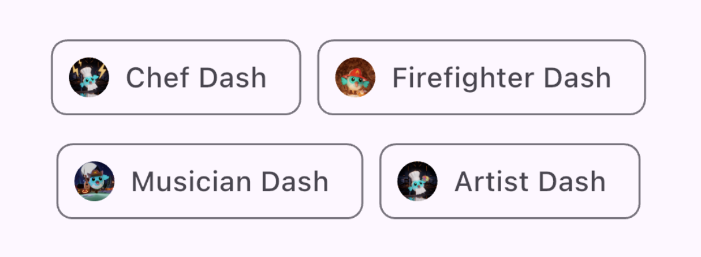

Bu şekil, her biri yuvarlak bir profil resmi ve içerik metni içeren iki satırlık `Chip` widget'larını göstermektedir.

```dart
@override
Widget build(BuildContext context) {
  return const SizedBox(
    width: 500,
    child: Wrap(
      alignment: WrapAlignment.center,
      spacing: 8,
      runSpacing: 4,
      children: [
        Chip(
          avatar: CircleAvatar(
              backgroundImage: AssetImage('assets/images/dash_chef.png')),
          label: Text('Chef Dash'),
        ),
        Chip(
          avatar: CircleAvatar(
              backgroundImage:
                  AssetImage('assets/images/dash_firefighter.png')),
          label: Text('Firefighter Dash'),
        ),
        Chip(
          avatar: CircleAvatar(
              backgroundImage: AssetImage('assets/images/dash_musician.png')),
          label: Text('Musician Dash'),
        ),
        Chip(
          avatar: CircleAvatar(
              backgroundImage: AssetImage('assets/images/dash_artist.png')),
          label: Text('Artist Dash'),
        ),
      ],
    ),
  );
}
```


### DropdownMenu

Bir `DropdownMenu`, kullanıcıların bir seçenek menüsünden seçim yapmasına ve seçilen metni bir `TextField` içine yerleştirmesine olanak tanır. Ayrıca kullanıcıların metin girişine dayalı olarak menü öğelerini filtrelemesine de izin verir.

Yapılandırma parametreleri şunları içerir:

* `dropdownMenuEntries`, her menü öğesini tanımlayan bir `DropdownMenuEntry` listesi sağlar. Menü, metin etiketi ve baştaki veya sondaki simge gibi bilgiler içerebilir. (Bu aynı zamanda tek zorunlu parametredir.)
* `TextEditingController`, `TextField`'ın programatik olarak kontrol edilmesini sağlar.
* `onSelected` geri çağırması (callback), kullanıcı bir seçenek seçtiğinde tetiklenir.
* `initialSelection`, varsayılan değeri yapılandırmanıza olanak tanır.

Widget'ın görünümünü ve davranışını özelleştirmek için ek parametreler de mevcuttur.

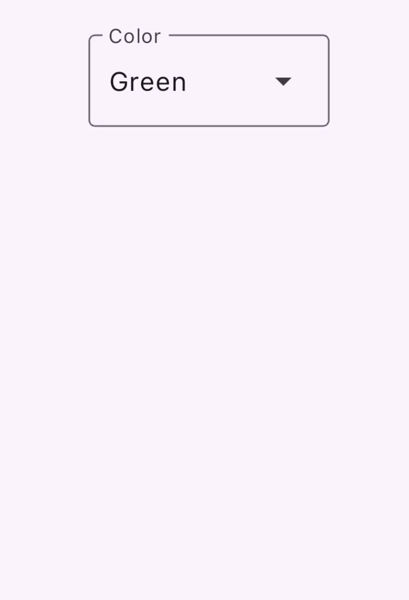


Bu şekil, 5 değer seçeneğine sahip bir DropdownMenu widget'ını göstermektedir. Her seçeneğin metin rengi, renk değerini temsil edecek şekilde stillendirilmiştir.

```dart
enum ColorLabel {
  blue('Blue', Colors.blue),
  pink('Pink', Colors.pink),
  green('Green', Colors.green),
  orange('Orange', Colors.orange),
  grey('Grey', Colors.grey);

  const ColorLabel(this.label, this.color);
  final String label;
  final Color color;
}

// StatefulWidget...
@override
Widget build(BuildContext context) {
  return DropdownMenu<ColorLabel>(
    initialSelection: ColorLabel.green,
    controller: colorController,
    // requestFocusOnTap is enabled/disabled by platforms when it is null.
    // On mobile platforms, this is false by default. Setting this to true will
    // trigger focus request on the text field and virtual keyboard will appear
    // afterward. On desktop platforms however, this defaults to true.
    requestFocusOnTap: true,
    label: const Text('Color'),
    onSelected: (ColorLabel? color) {
      setState(() {
        selectedColor = color;
      });
    },
    dropdownMenuEntries: ColorLabel.values
      .map<DropdownMenuEntry<ColorLabel>>(
          (ColorLabel color) {
            return DropdownMenuEntry<ColorLabel>(
              value: color,
              label: color.label,
              enabled: color.label != 'Grey',
              style: MenuItemButton.styleFrom(
                foregroundColor: color.color,
              ),
            );
      }).toList(),
  );
}
```


### Slider (Kaydırıcı)

`Slider` widget'ı, ses çubuğu gibi, kullanıcının bir göstergeyi hareket ettirerek bir değeri ayarlamasını sağlar.

`Slider` widget'ı için yapılandırma parametreleri:

* `value`, kaydırıcının mevcut değerini temsil eder.
* `onChanged`, tutamaç hareket ettirildiğinde tetiklenen geri çağırmadır.
* `min` ve `max`, kaydırıcının izin verdiği minimum ve maksimum değerleri belirler.
* `divisions`, kullanıcının tutamacı yol boyunca hareket ettirebileceği ayrık bir aralık (bölümleme) belirler.

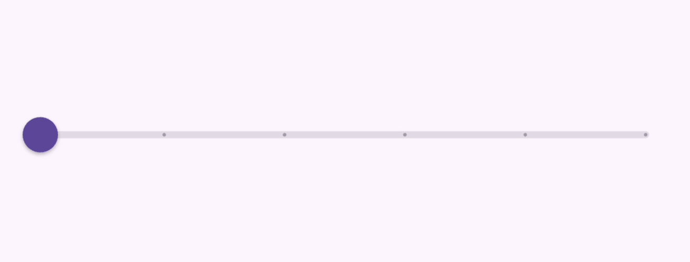


Bu şekil, 0.0 ile 5.0 arasında değişen ve 5 bölüme ayrılmış bir değere sahip kaydırıcı widget'ını göstermektedir. Gösterge sürüklendikçe mevcut değeri bir etiket olarak gösterir.

```dart
double _currentVolume = 1;

@override
Widget build(BuildContext context) {
  return Slider(
    value: _currentVolume,
    max: 5,
    divisions: 5,
    label: _currentVolume.toString(),
    onChanged: (double value) {
      setState(() {
        _currentVolume = value;
      });
    },
  );
}
```


## Değerler arasında geçiş yapma (Toggle)

Kullanıcı arayüzünüzün değerler arasında geçiş yapmasına izin vermenin birkaç yolu vardır.

### Checkbox, Switch ve Radio

Tek bir değeri açıp kapatmak için bir seçenek sunun. Bu widget'ların arkasındaki işlevsel mantık aynıdır, çünkü her 3'ü de `ToggleableStateMixin` üzerine inşa edilmiştir, ancak her biri küçük sunum farklılıkları sağlar:

* **Checkbox (Onay Kutusu):** Yanlış (false) olduğunda boş, doğru (true) olduğunda bir onay işaretiyle dolu olan bir kutudur.
* **Switch (Anahtar):** Yanlış olduğunda solda duran ve doğru olduğunda sağa kayan bir tutamaca (handle) sahiptir.
* **Radio (Radyo Düğmesi):** Yanlış olduğunda boş, doğru olduğunda dolu bir kutu olması bakımından `Checkbox`'a benzer.

`Checkbox` ve `Switch` yapılandırması şunları içerir:

* `true` veya `false` olan bir `value` (değer)
* Kullanıcı widget'ı değiştirdiğinde tetiklenen bir `onChanged` geri çağırma (callback) işlevi

#### Checkbox

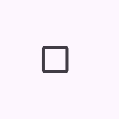


Bu şekil, işaretlenen ve işareti kaldırılan bir onay kutusunu göstermektedir.

```dart
bool isChecked = false;

@override
Widget build(BuildContext context) {
  return Checkbox(
    checkColor: Colors.white,
    value: isChecked,
    onChanged: (bool? value) {
      setState(() {
        isChecked = value!;
      });
    },
  );
}
```

#### Switch

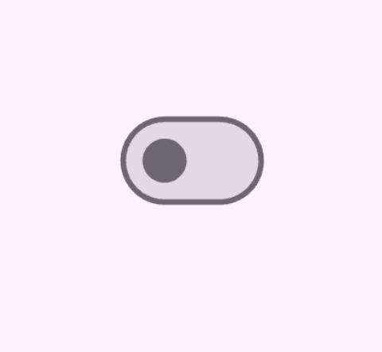


Bu şekil, açılıp kapanan bir Switch widget'ını göstermektedir.

```dart
bool light = true;

@override
Widget build(BuildContext context) {
  return Switch(
    // This bool value toggles the switch.
    value: light,
    activeThumbColor: Colors.red,
    onChanged: (bool value) {
      // This is called when the user toggles the switch.
      setState(() {
        light = value;
      });
    },
  );
}
```


#### Radyo Düğmesi (Radio)

Bir `RadioGroup`, kullanıcının birbirini dışlayan değerler arasında seçim yapmasına olanak tanıyan `Radio` düğmeleri içerir. Kullanıcı bir gruptaki bir radyo düğmesini seçtiğinde, diğer radyo düğmelerinin seçimi kaldırılır.

* Belirli bir `Radio` düğmesinin `value` özelliği, o düğmenin değerini temsil eder.
* Bir `RadioGroup` için seçilen değer, `groupValue` parametresi ile tanımlanır.
* `RadioGroup`, `Switch` ve `Checkbox` gibi, kullanıcılar tıkladığında tetiklenen bir `onChanged` geri çağırma (callback) işlevine sahiptir.

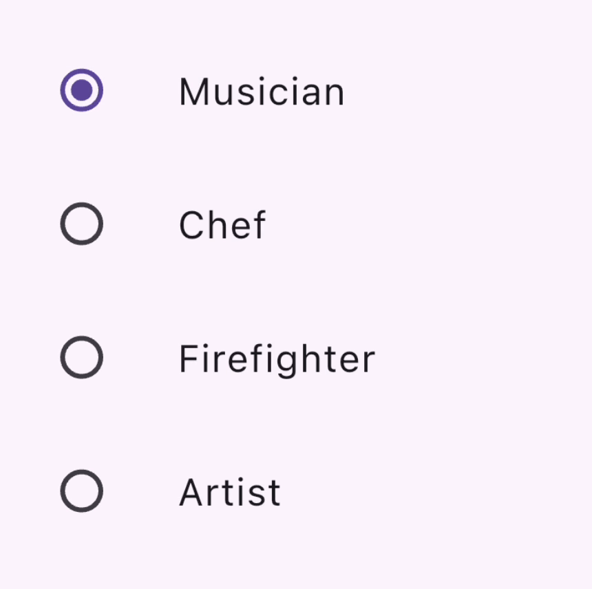


Bu şekil, bir radyo düğmesi ve etiket içeren `ListTile`'lardan oluşan bir sütunu göstermektedir; burada aynı anda yalnızca bir radyo düğmesi seçilebilir.

```dart
enum Character { musician, chef, firefighter, artist }

class RadioExample extends StatefulWidget {
  const RadioExample({super.key});

  @override
  State<RadioExample> createState() => _RadioExampleState();
}

class _RadioExampleState extends State<RadioExample> {
  Character? _character = Character.musician;

  void setCharacter(Character? value) {
    setState(() {
      _character = value;
    });
  }

  @override
  Widget build(BuildContext context) {
    return RadioGroup(
      groupValue: _character,
      onChanged: setCharacter,
      child: Column(
        children: <Widget>[
          ListTile(
            title: const Text('Musician'),
            leading: Radio<Character>(value: Character.musician),
          ),
          ListTile(
            title: const Text('Chef'),
            leading: Radio<Character>(value: Character.chef),
          ),
          ListTile(
            title: const Text('Firefighter'),
            leading: Radio<Character>(value: Character.firefighter),
          ),
          ListTile(
            title: const Text('Artist'),
            leading: Radio<Character>(value: Character.artist),
          ),
        ],
      ),
    );
  }
}
```

#### Bonus: CheckboxListTile ve SwitchListTile

Bu kolaylık sağlayan widget'lar, aynı onay kutusu ve anahtar widget'larıdır, ancak bir etiketi (bir `ListTile` olarak) desteklerler.

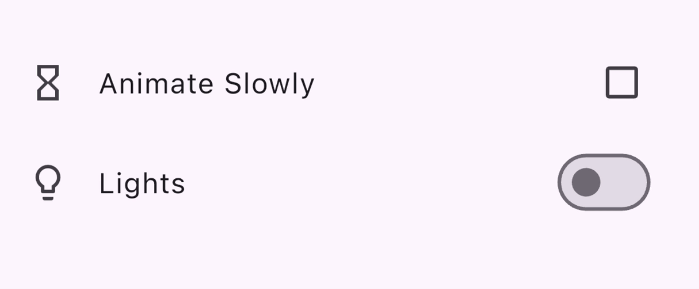

Bu şekil, açılıp kapanan bir `CheckboxListTile` ve bir `SwitchListTile` içeren bir sütunu göstermektedir.

```dart
double timeDilation = 1.0;
bool _lights = false;

@override
Widget build(BuildContext context) {
  return Column(
    children: [
      CheckboxListTile(
        title: const Text('Animate Slowly'),
        value: timeDilation != 1.0,
        onChanged: (bool? value) {
          setState(() {
            timeDilation = value! ? 10.0 : 1.0;
          });
        },
        secondary: const Icon(Icons.hourglass_empty),
      ),
      SwitchListTile(
        title: const Text('Lights'),
        value: _lights,
        onChanged: (bool value) {
          setState(() {
            _lights = value;
          });
        },
        secondary: const Icon(Icons.lightbulb_outline),
      ),
    ],
  );
}
```


## Tarih / Saat Seçimi

Kullanıcının bir tarih ve saat seçebilmesi için widget'lar sağlanmıştır.

Aşağıdaki bölümlerde göreceğiniz gibi, kullanıcıların bir tarih veya saat seçmesini sağlayan bir dizi iletişim kutusu (dialog) vardır. Farklı tarih türleri haricinde (tarihler için `DateTime`'a karşı saat için `TimeOfDay`), bu iletişim kutuları benzer şekilde çalışır; şunları sağlayarak yapılandırabilirsiniz:

* Varsayılan bir `initialDate` (başlangıç tarihi) veya `initialTime` (başlangıç saati)
* Görüntülenen seçici arayüzünü belirleyen bir `initialEntryMode`

### DatePickerDialog

Bu iletişim kutusu, kullanıcının bir tarih veya tarih aralığı seçmesine olanak tanır. `Future<DateTime>` döndüren `showDatePicker` işlevini çağırarak etkinleştirilir, bu nedenle asenkron işlev çağrısını beklemeyi (await) unutmayın!

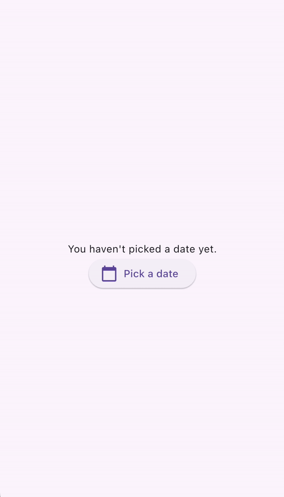

Bu şekil, 'Pick a date' düğmesine tıklandığında görüntülenen bir DatePicker'ı göstermektedir.

```dart
DateTime? selectedDate;

@override
Widget build(BuildContext context) {
  var date = selectedDate;

  return Column(children: [
    Text(
      date == null
          ? 'You haven\\\'t picked a date yet.'
          : DateFormat('MM-dd-yyyy').format(date),
    ),
    ElevatedButton.icon(
      icon: const Icon(Icons.calendar_today),
      onPressed: () async {
        var pickedDate = await showDatePicker(
          context: context,
          initialEntryMode: DatePickerEntryMode.calendarOnly,
          initialDate: DateTime.now(),
          firstDate: DateTime(2019),
          lastDate: DateTime(2050),
        );

        setState(() {
          selectedDate = pickedDate;
        });
      },
      label: const Text('Pick a date'),
    )
  ]);
}
```

### TimePickerDialog

`TimePickerDialog`, bir saat seçici sunan bir iletişim kutusudur. `showTimePicker()` işlevi çağrılarak etkinleştirilebilir. `showTimePicker`, `Future<DateTime>` yerine `Future<TimeOfDay>` döndürür. Bir kez daha, işlev çağrısını beklemeyi (await) unutmayın!

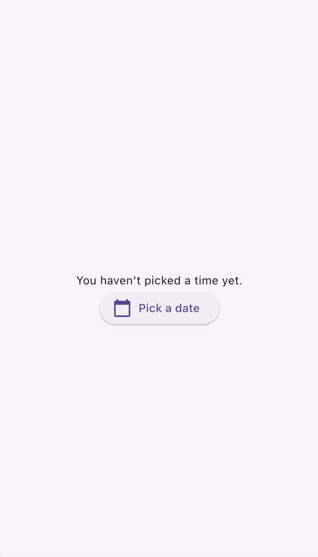


Bu şekil, 'Pick a time' düğmesine tıklandığında görüntülenen bir TimePicker'ı göstermektedir.

```dart
TimeOfDay? selectedTime;

@override
Widget build(BuildContext context) {
  var time = selectedTime;

  return Column(children: [
    Text(
      time == null ? 'You haven\\\'t picked a time yet.' : time.format(context),
    ),
    ElevatedButton.icon(
      icon: const Icon(Icons.calendar_today),
      onPressed: () async {
        var pickedTime = await showTimePicker(
          context: context,
          initialEntryMode: TimePickerEntryMode.dial,
          initialTime: TimeOfDay.now(),
        );

        setState(() {
          selectedTime = pickedTime;
        });
      },
      label: const Text('Pick a time'),
    )
  ]);
}
```

**İpucu:**
`showDatePicker()` ve `showTimePicker()` çağırmak, sırasıyla `DatePickerDialog()` ve `TimePickerDialog()` ile `showDialog()` çağırmaya eşdeğerdir. Dahili olarak, her iki işlev de kendi `Dialog` widget'larıyla `showDialog()` işlevini kullanır. Durum geri yüklemeyi (state restoration) etkinleştirmek için, `DatePickerDialog()` ve `TimePickerDialog()`'u doğrudan `Navigator` yığınına da ekleyebilirsiniz (push).


## Kaydırma ve Sürükleme (Swipe & slide)

### Dismissible

`Dismissible`, kullanıcıların kaydırarak bir öğeyi kaldırmasını (dismiss) sağlayan bir widget'tır. Aşağıdakiler dahil olmak üzere bir dizi yapılandırma parametresine sahiptir:

* Bir `child` (çocuk) widget'ı
* Kullanıcı kaydırdığında tetiklenen bir `onDismissed` geri çağırması (callback)
* `background` gibi stillendirme parametreleri

Ayrıca bir `key` nesnesi eklemek de önemlidir, böylece widget ağacındaki kardeş `Dismissible` widget'larından benzersiz bir şekilde ayırt edilebilirler.

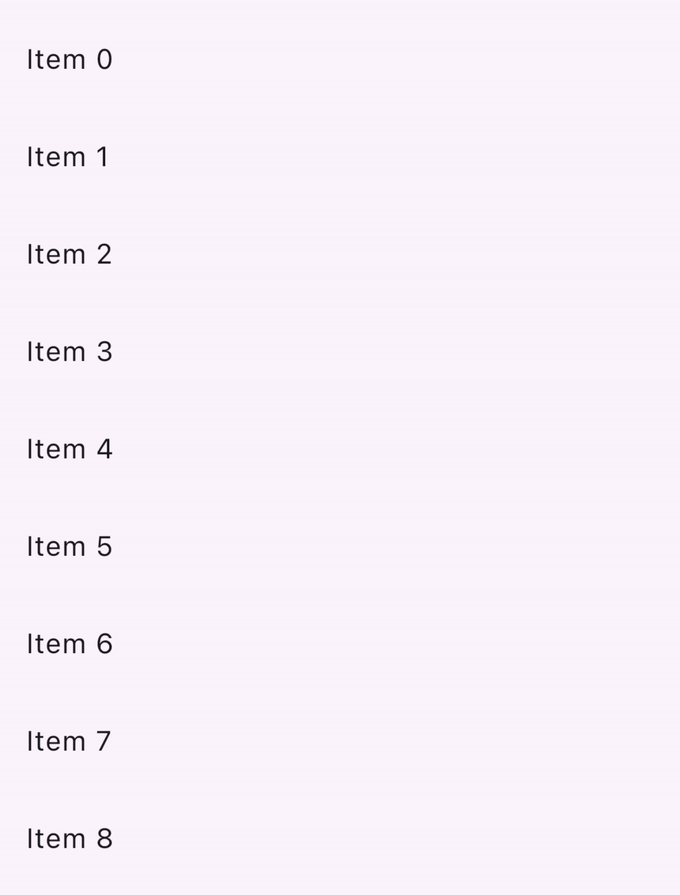


Bu şekil, her biri bir `ListTile` içeren `Dismissible` widget'lardan oluşan bir listeyi göstermektedir. `ListTile` üzerinde kaydırma yapmak yeşil bir arka planı ortaya çıkarır ve döşemenin kaybolmasını sağlar.

```dart
List<int> items = List<int>.generate(100, (int index) => index);

@override
Widget build(BuildContext context) {
  return ListView.builder(
    itemCount: items.length,
    padding: const EdgeInsets.symmetric(vertical: 16),
    itemBuilder: (BuildContext context, int index) {
      return Dismissible(
        background: Container(
          color: Colors.green,
        ),
        key: ValueKey<int>(items[index]),
        onDismissed: (DismissDirection direction) {
          setState(() {
            items.removeAt(index);
          });
        },
        child: ListTile(
          title: Text(
            'Item ${items[index]}',
          ),
        ),
      );
    },
  );
}
```

`Dismissible` widget'ını kullanarak [kaydırarak silme (swipe to dismiss) özelliğini nasıl uygulayacağınıza](https://docs.flutter.dev/cookbook/gestures/dismissible) dair bu eğitime bakabilirsiniz.

## Diğer Widgetler?

Bu sayfa, Flutter uygulamanızda kullanıcı girdilerini işlemek için kullanabileceğiniz yaygın Material widget'larından sadece birkaçını içermektedir. Widget'ların tam listesi için [Material Widget kütüphanesine](https://docs.flutter.dev/ui/widgets/material) ve [Material Kütüphanesi API dokümanlarına](https://api.flutter.dev/flutter/material/material-library.html) göz atın.

* **Demo:** Material kütüphanesinde bulunan kullanıcı girişi widget'larının derlenmiş bir örneği için Flutter'ın [Material 3 Demosuna](https://www.google.com/search?q=https://flutter.github.io/samples/web/material_3_demo/) bakın.

Eğer Material ve Cupertino kütüphanelerinde ihtiyacınız olanı yapan bir widget yoksa, Flutter & Dart topluluğu tarafından sahiplenilen ve sürdürülen paketleri bulmak için [pub.dev](https://pub.dev/) adresine göz atın. Örneğin, `flutter_slidable` paketi, önceki bölümde açıklanan `Dismissible` widget'ından daha özelleştirilebilir bir `Slidable` widget'ı sağlar.


---
---

## 📄 Lisans Bilgisi

Bu doküman, **Flutter resmi dokümantasyonundan** türetilmiş Türkçe ders notudur.

**Orijinal kaynak:**  
https://docs.flutter.dev/get-started/fundamentals/user-input

**Türkçe çeviri ve düzenleme:**  
[Doç. Dr. Hakan Temiz](mailto:htemiz@artvin.edu.tr)

---

### Lisans Kapsamı

Bu dokümandaki içerikler aşağıdaki açık lisanslar kapsamında sunulmaktadır:

**Metin içerikleri (anlatım ve açıklamalar):**  
Flutter resmi dokümantasyonundan alınmış veya uyarlanmıştır.  
**Lisans:** Creative Commons Attribution 4.0 International (CC BY 4.0)  
https://creativecommons.org/licenses/by/4.0/

Bu lisans kapsamında:
- İçerik kopyalanabilir, dağıtılabilir ve uyarlanabilir  
- Ticari kullanım serbesttir  
- Kaynak belirtilmesi zorunludur  

**Kod örnekleri:**  
Flutter resmi dokümantasyonundan alınmış veya uyarlanmıştır.  
**Lisans:** BSD 3-Clause License  
https://opensource.org/licenses/BSD-3-Clause

Bu lisans kapsamında:
- Kodlar kopyalanabilir, değiştirilebilir ve dağıtılabilir  
- Ticari kullanım serbesttir  
- Lisans bildiriminin korunması gerekir  

---
---
