# Flutter'da Düzenler (Layouts)

Flutter'ın düzen mekanizmasının nasıl çalıştığını ve uygulamanızın düzenini nasıl oluşturacağınızı öğrenin.

## Genel Bakış

### Amaç ne?

* Flutter'da düzenler widget'larla oluşturulur.
* Widget'lar, UI (Kullanıcı Arayüzü) oluşturmak için kullanılan sınıflardır.
* Widget'lar ayrıca UI öğelerini oluşturmak için de kullanılır.
* Karmaşık widget'lar oluşturmak için basit widget'ları birleştirin.

Flutter'ın düzen mekanizmasının çekirdeği widget'lardır. Flutter'da neredeyse her şey bir widget'tır; düzen modelleri bile widget'tır. Bir Flutter uygulamasında gördüğünüz resimler, simgeler ve metinlerin hepsi birer widget'tır. Ancak satırlar, sütunlar ve ızgaralar gibi görünür widget'ları düzenleyen, kısıtlayan ve hizalayan göremediğiniz şeyler de widget'tır. Daha karmaşık widget'lar oluşturmak için widget'ları birleştirerek bir düzen oluşturursunuz.

### Kavramsal örnek

Aşağıdaki örnekte, ilk ekran görüntüsü etiketli üç simgeyi görüntülerken, ikinci ekran görüntüsü satırlar ve sütunlar için görsel düzeni içerir. İkinci ekran görüntüsünde, görsel düzeni görebilmeniz için `debugPaintSizeEnabled` özelliği `true` olarak ayarlanmıştır.

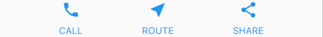 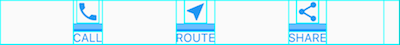


Önceki örnek için widget ağacının bir diyagramı şöyledir:

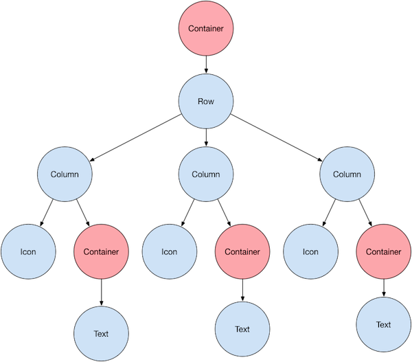

Bunun çoğu beklediğiniz gibi görünebilir, ancak kapsayıcıları (pembe renkte gösterilen) merak ediyor olabilirsiniz. `Container`, alt widget'ını özelleştirmenize olanak tanıyan bir widget sınıfıdır. Dolgu (padding), kenar boşlukları (margins), kenarlıklar (borders) veya arka plan rengi eklemek istediğinizde (yeteneklerinden sadece birkaçı) bir `Container` kullanın.

Her `Text` widget'ı, kenar boşlukları eklemek için bir `Container` içine yerleştirilir. Tüm `Row` (Satır) da satırın etrafına dolgu eklemek için bir `Container` içine yerleştirilir.

UI'ın geri kalanı özellikler (properties) tarafından kontrol edilir. Bir `Icon`'un rengini `color` özelliğini kullanarak ayarlayın. Yazı tipini, rengini, kalınlığını vb. ayarlamak için `Text.style` özelliğini kullanın. Sütunlar ve satırlar, çocuklarının dikey veya yatay olarak nasıl hizalanacağını ve çocukların ne kadar alan kaplayacağını belirtmenize olanak tanıyan özelliklere sahiptir.

**Not**
Bu eğitimdeki ekran görüntülerinin çoğu, görsel düzeni görebilmeniz için `debugPaintSizeEnabled` özelliği `true` olarak ayarlanmış şekilde görüntülenir. Daha fazla bilgi için, "Düzen sorunlarını görsel olarak hata ayıklama" konusuna bakın.

## Bir widget'ı düzenleme

Flutter'da tek bir widget'ı nasıl düzenlersiniz? Bu bölüm, basit bir widget'ın nasıl oluşturulacağını ve görüntüleneceğini gösterir. Ayrıca basit bir Hello World uygulaması için tüm kodu da gösterir.

Flutter'da ekrana metin, simge veya resim koymak sadece birkaç adım sürer.

### 1. Bir düzen widget'ı seçin

Görünür bir widget'ı nasıl hizalamak veya kısıtlamak istediğinize bağlı olarak çeşitli düzen widget'ları arasından seçim yapın, çünkü bu özellikler genellikle içerilen widget'a aktarılır.
Örneğin, görünür bir widget'ı hem yatay hem de dikey olarak ortalamak için `Center` düzen widget'ını kullanabilirsiniz:

```dart
Center(
  // Content to be centered here.
)
```

### 2. Görünür bir widget oluşturun

Uygulamanızın `metin`, `resim` veya `simge` gibi görünür öğeler içermesi için görünür bir widget seçin.
Örneğin, bir metin görüntülemek için `Text` widget'ını kullanabilirsiniz:

```dart
Text('Hello World')
```

### 3. Görünür widget'ı düzen widget'ına ekleyin

Tüm düzen widget'ları aşağıdakilerden birine sahiptir:

* Tek bir çocuk alıyorlarsa bir `child` özelliği (örneğin, `Center` veya `Container`).
* Bir widget listesi alıyorlarsa bir `children` özelliği (örneğin, `Row`, `Column`, `ListView` veya `Stack`).

`Text` widget'ını `Center` widget'ına ekleyin:

```dart
const Center(
  child: Text('Hello World'),
),
```

### 4. Düzen widget'ını sayfaya ekleyin

Bir Flutter uygulaması kendisi de bir widget'tır ve çoğu widget'ın bir `build()` yöntemi vardır. Uygulamanın `build()` yönteminde bir widget'ı örneklemek ve döndürmek widget'ı görüntüler.

Genel bir uygulama için, `Container` widget'ını uygulamanın `build()` yöntemine ekleyebilirsiniz:

```dart
class MyApp extends StatelessWidget {
  const MyApp({super.key});

  @override
  Widget build(BuildContext context) {
    return Container(
      decoration: const BoxDecoration(color: Colors.white),
      child: const Center(
        child: Text(
          'Hello World',
          textDirection: TextDirection.ltr,
          style: TextStyle(fontSize: 32, color: Colors.black87),
        ),
      ),
    );
  }
}
```

Varsayılan olarak, genel bir uygulama bir `AppBar`, başlık veya arka plan rengi içermez. Genel bir uygulamada bu özellikleri istiyorsanız, bunları kendiniz oluşturmalısınız. Bu uygulama, bir Material uygulamasını taklit etmek için arka plan rengini beyaza ve metni koyu griye değiştirir.

### 5. Uygulamanızı çalıştırın

Widget'larınızı ekledikten sonra uygulamanızı çalıştırın. Uygulamayı çalıştırdığınızda `Hello World` görmelisiniz.

Uygulama kaynak kodu:

* [Material uygulaması](https://github.com/flutter/website/tree/main/examples/layout/base)
* [Material olmayan uygulama](https://github.com/flutter/website/tree/main/examples/layout/non_material)

## Birden fazla widget'ı dikey ve yatay olarak düzenleme

En yaygın düzen desenlerinden biri widget'ları dikey veya yatay olarak düzenlemektir. Widget'ları yatay olarak düzenlemek için bir `Row` widget'ı, dikey olarak düzenlemek için ise bir `Column` widget'ı kullanabilirsiniz.

### Amaç ne?

* `Row` ve `Column`, en sık kullanılan düzen desenlerinden ikisidir.
* `Row` ve `Column` her biri bir alt widget listesi alır.
* Bir alt widget'ın kendisi de bir `Row`, `Column` veya diğer karmaşık widget'lar olabilir.
* Bir `Row` veya `Column`'un çocuklarını hem dikey hem de yatay olarak nasıl hizalayacağını belirleyebilirsiniz.
* Belirli alt widget'ları uzatabilir veya kısıtlayabilirsiniz.
* Alt widget'ların `Row` veya `Column`'un kullanılabilir alanını nasıl kullanacağını belirleyebilirsiniz.

Flutter'da bir satır veya sütun oluşturmak için, bir `Row` veya `Column` widget'ına çocuk widget'lardan oluşan bir liste eklersiniz. Buna karşılık, her çocuk kendisi de bir satır veya sütun olabilir ve bu böyle devam eder. Aşağıdaki örnek, satırların veya sütunların satırlar veya sütunlar içine nasıl iç içe yerleştirilebileceğini göstermektedir.

Bu düzen bir `Row` olarak organize edilmiştir. Satır iki çocuk içerir: solda bir sütun ve sağda bir resim:

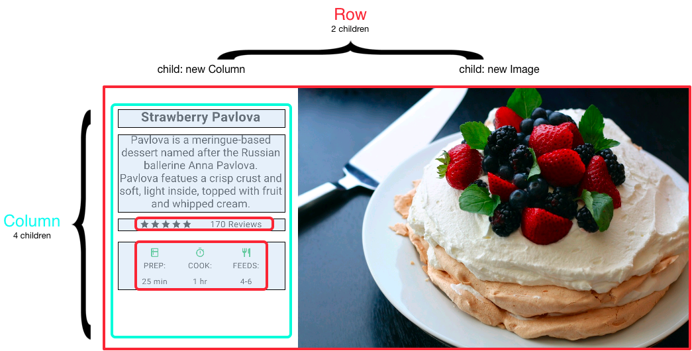

Sol sütunun widget ağacı satırları ve sütunları iç içe barındırır.

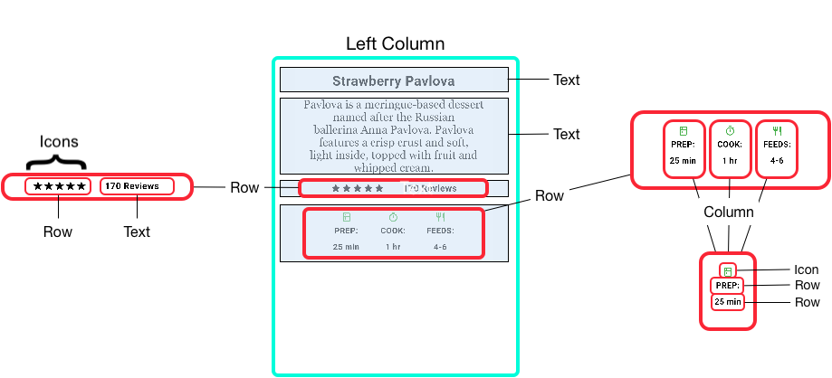


Pavlova'nın düzen kodunun bir kısmını "Satırları ve sütunları iç içe yerleştirme" bölümünde uygulayacaksınız.

**Not**
`Row` ve `Column`, yatay ve dikey düzenler için temel ilkel widget'lardır; bu düşük seviyeli widget'lar maksimum özelleştirme sağlar. Flutter ayrıca ihtiyaçlarınız için yeterli olabilecek özelleşmiş, daha yüksek seviyeli widget'lar da sunar. Örneğin, `Row` yerine, baştaki ve sondaki simgeler ve 3 satıra kadar metin için özelliklere sahip kullanımı kolay bir widget olan `ListTile`'ı tercih edebilirsiniz. `Column` yerine, içeriği kullanılabilir alana sığmayacak kadar uzunsa otomatik olarak kayan sütun benzeri bir düzen olan `ListView`'ı tercih edebilirsiniz. Daha fazla bilgi için "Yaygın düzen widget'ları"na bakın.

### Widget'ları hizalama

`mainAxisAlignment` ve `crossAxisAlignment` özelliklerini kullanarak bir satır veya sütunun çocuklarını nasıl hizalayacağını kontrol edersiniz. Bir satır için ana eksen (main axis) yatay olarak çalışır ve çapraz eksen (cross axis) dikey olarak çalışır. Bir sütun için ana eksen dikey olarak çalışır ve çapraz eksen yatay olarak çalışır.

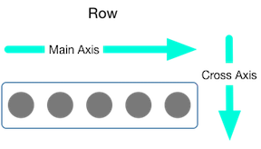 &nbsp;&nbsp;&nbsp;&nbsp;
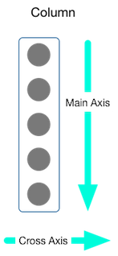

`MainAxisAlignment` ve `CrossAxisAlignment` enum'ları, hizalamayı kontrol etmek için çeşitli sabitler sunar.

**Not**
Projenize resim eklediğinizde, bunlara erişmek için `pubspec.yaml` dosyasını güncellemeniz gerekir; bu örnek resimleri görüntülemek için `Image.asset` kullanır. Daha fazla bilgi için bu örneğin `pubspec.yaml` dosyasına veya "Varlıklar ve resimler ekleme" konusuna bakın. Çevrimiçi resimlere `Image.network` kullanarak başvuruyorsanız bunu yapmanıza gerek yoktur.

Aşağıdaki örnekte, 3 resmin her biri 100 piksel genişliğindedir. Render kutusu (bu durumda tüm ekran) 300 pikselden daha geniştir, bu nedenle ana eksen hizalamasını `spaceEvenly` olarak ayarlamak, boş yatay alanı her resmin arasına, önüne ve arkasına eşit olarak böler.

```dart
Row(
  mainAxisAlignment: MainAxisAlignment.spaceEvenly,
  children: [
    Image.asset('images/pic1.jpg'),
    Image.asset('images/pic2.jpg'),
    Image.asset('images/pic3.jpg'),
  ],
);
```

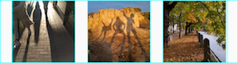

Uygulama kaynağı: [`row_column`](https://github.com/flutter/website/tree/main/examples/layout/row_column)

Sütunlar satırlarla aynı şekilde çalışır. Aşağıdaki örnek, her biri 100 piksel yüksekliğinde olan 3 resimden oluşan bir sütunu göstermektedir. Render kutusunun yüksekliği (bu durumda tüm ekran) 300 pikselden fazladır, bu nedenle ana eksen hizalamasını `spaceEvenly` olarak ayarlamak, boş dikey alanı her resmin arasına, üstüne ve altına eşit olarak böler.

```dart
Column(
  mainAxisAlignment: MainAxisAlignment.spaceEvenly,
  children: [
    Image.asset('images/pic1.jpg'),
    Image.asset('images/pic2.jpg'),
    Image.asset('images/pic3.jpg'),
  ],
);
```
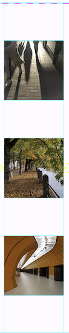


Uygulama kaynağı: [`row_column`](https://github.com/flutter/website/tree/main/examples/layout/row_column)

### Widget'ları boyutlandırma

Bir düzen bir cihaza sığmayacak kadar büyük olduğunda, etkilenen kenar boyunca sarı ve siyah çizgili bir desen görünür. İşte çok geniş bir satırın örneği:

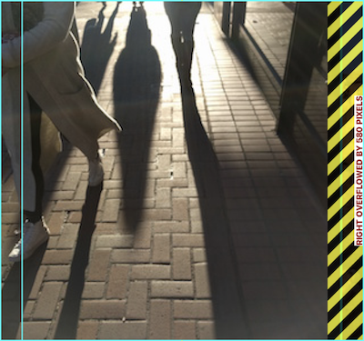


Widget'lar, [`Expanded`](https://api.flutter.dev/flutter/widgets/Expanded-class.html) widget'ı kullanılarak bir satıra veya sütuna sığacak şekilde boyutlandırılabilir. Resim satırının render kutusu için çok geniş olduğu önceki örneği düzeltmek için, her resmi bir `Expanded` widget'ı ile sarın.

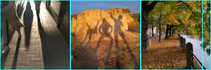


```dart
Row(
  crossAxisAlignment: CrossAxisAlignment.center,
  children: [
    Expanded(child: Image.asset('images/pic1.jpg')),
    Expanded(child: Image.asset('images/pic2.jpg')),
    Expanded(child: Image.asset('images/pic3.jpg')),
  ],
);
```

Uygulama kaynağı: [`sizing`](https://github.com/flutter/website/tree/main/examples/layout/sizing)

Belki bir widget'ın kardeşlerinden iki kat daha fazla yer kaplamasını istiyorsunuz. Bunun için, bir widget için esneme faktörünü belirleyen bir tamsayı olan `Expanded` widget'ının `flex` özelliğini kullanın. Varsayılan esneme faktörü 1'dir. Aşağıdaki kod, ortadaki resmin esneme faktörünü 2 olarak ayarlar:

```dart
Row(
  crossAxisAlignment: CrossAxisAlignment.center,
  children: [
    Expanded(child: Image.asset('images/pic1.jpg')),
    Expanded(flex: 2, child: Image.asset('images/pic2.jpg')),
    Expanded(child: Image.asset('images/pic3.jpg')),
  ],
);
```

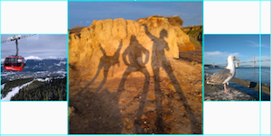


Uygulama kaynağı: [`sizing`](https://github.com/flutter/website/tree/main/examples/layout/sizing)

### Widget'ları sıkıştırma (Packing widgets)

Varsayılan olarak, bir satır veya sütun ana ekseni boyunca mümkün olduğunca fazla yer kaplar, ancak çocukları birbirine yakın bir şekilde sıkıştırmak istiyorsanız, `mainAxisSize` özelliğini `MainAxisSize.min` olarak ayarlayın. Aşağıdaki örnek, yıldız simgelerini bir arada toplamak için bu özelliği kullanır.

```dart
Row(
  mainAxisSize: MainAxisSize.min,
  children: [
    Icon(Icons.star, color: Colors.green[500]),
    Icon(Icons.star, color: Colors.green[500]),
    Icon(Icons.star, color: Colors.green[500]),
    const Icon(Icons.star, color: Colors.black),
    const Icon(Icons.star, color: Colors.black),
  ],
)
```
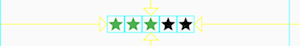

Uygulama kaynağı: [`pavlova`](https://github.com/flutter/website/tree/main/examples/layout/pavlova)

### Satırları ve sütunları iç içe yerleştirme

Düzen çerçevesi, satırları ve sütunları ihtiyaç duyduğunuz derinlikte satırlar ve sütunlar içine yerleştirmenize olanak tanır. Aşağıdaki düzenin ana hatları çizilmiş bölümünün koduna bakalım:

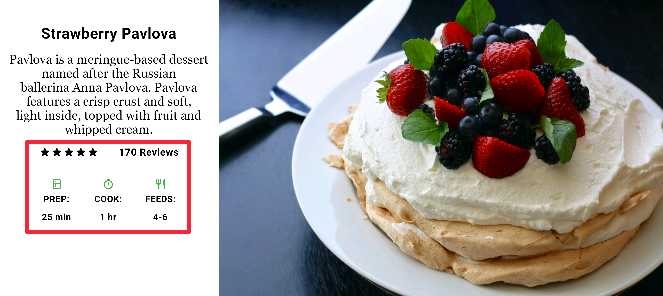


Ana hatları çizilen bölüm iki satır olarak uygulanmıştır. Derecelendirme (ratings) satırı beş yıldız ve inceleme sayısını içerir. Simgeler (icons) satırı üç sütun simge ve metin içerir.

Derecelendirme satırı için widget ağacı:

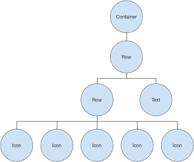


`ratings` değişkeni, 5 yıldız simgesinden oluşan daha küçük bir satır ve metin içeren bir satır oluşturur:

```dart
final stars = Row(
  mainAxisSize: MainAxisSize.min,
  children: [
    Icon(Icons.star, color: Colors.green[500]),
    Icon(Icons.star, color: Colors.green[500]),
    Icon(Icons.star, color: Colors.green[500]),
    const Icon(Icons.star, color: Colors.black),
    const Icon(Icons.star, color: Colors.black),
  ],
);

final ratings = Container(
  padding: const EdgeInsets.all(20),
  child: Row(
    mainAxisAlignment: MainAxisAlignment.spaceEvenly,
    children: [
      stars,
      const Text(
        '170 Reviews',
        style: TextStyle(
          color: Colors.black,
          fontWeight: FontWeight.w800,
          fontFamily: 'Roboto',
          letterSpacing: 0.5,
          fontSize: 20,
        ),
      ),
    ],
  ),
);
```

**İpucu**
Yoğun şekilde iç içe geçmiş düzen kodunun neden olabileceği görsel karışıklığı en aza indirmek için, UI parçalarını değişkenler ve fonksiyonlar içinde uygulayın.

Derecelendirme satırının altındaki simgeler satırı 3 sütun içerir; her sütun bir simge ve iki satır metin içerir, widget ağacında görebileceğiniz gibi:

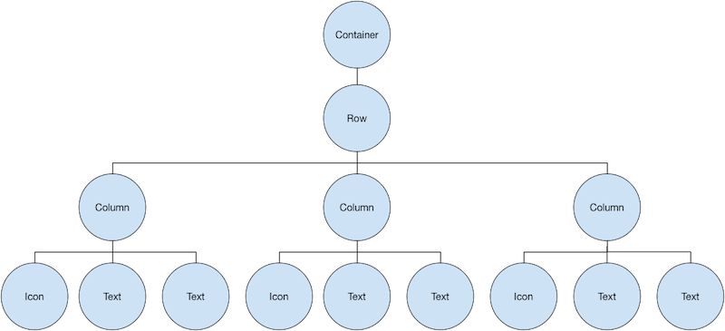


`iconList` değişkeni simgeler satırını tanımlar:

```dart
const descTextStyle = TextStyle(
  color: Colors.black,
  fontWeight: FontWeight.w800,
  fontFamily: 'Roboto',
  letterSpacing: 0.5,
  fontSize: 18,
  height: 2,
);

// DefaultTextStyle.merge() allows you to create a default text
// style that is inherited by its child and all subsequent children.
final iconList = DefaultTextStyle.merge(
  style: descTextStyle,
  child: Container(
    padding: const EdgeInsets.all(20),
    child: Row(
      mainAxisAlignment: MainAxisAlignment.spaceEvenly,
      children: [
        Column(
          children: [
            Icon(Icons.kitchen, color: Colors.green[500]),
            const Text('PREP:'),
            const Text('25 min'),
          ],
        ),
        Column(
          children: [
            Icon(Icons.timer, color: Colors.green[500]),
            const Text('COOK:'),
            const Text('1 hr'),
          ],
        ),
        Column(
          children: [
            Icon(Icons.restaurant, color: Colors.green[500]),
            const Text('FEEDS:'),
            const Text('4-6'),
          ],
        ),
      ],
    ),
  ),
);
```

`leftColumn` değişkeni derecelendirme ve simge satırlarını, ayrıca Pavlova'yı açıklayan başlığı ve metni içerir:

```dart
final leftColumn = Container(
  padding: const EdgeInsets.fromLTRB(20, 30, 20, 20),
  child: Column(children: [titleText, subTitle, ratings, iconList]),
);
```

Sol sütun, genişliğini kısıtlamak için bir `SizedBox` içine yerleştirilir. Son olarak, UI, bir `Card` içindeki tüm satır (sol sütunu ve resmi içeren) ile oluşturulur.

Pavlova resmi Pixabay'dan alınmıştır. `Image.network()` kullanarak netten bir resim gömebilirsiniz ancak bu örnek için resim projedeki bir images dizinine kaydedilmiş, `pubspec` dosyasına eklenmiş ve `Images.asset()` kullanılarak erişilmiştir. Daha fazla bilgi için "Varlıklar ve resimler ekleme" konusuna bakın.

```dart
body: Center(
  child: Container(
    margin: const EdgeInsets.fromLTRB(0, 40, 0, 30),
    height: 600,
    child: Card(
      child: Row(
        crossAxisAlignment: CrossAxisAlignment.start,
        children: [
          SizedBox(width: 440, child: leftColumn),
          mainImage,
        ],
      ),
    ),
  ),
),
```

**İpucu**
Pavlova örneği en iyi tablet gibi geniş bir cihazda yatay olarak çalışır. Bu örneği iOS simülatöründe çalıştırıyorsanız, **Hardware > Device** menüsünü kullanarak farklı bir cihaz seçebilirsiniz. Bu örnek için iPad Pro'yu öneririz. Yönünü **Hardware > Rotate** kullanarak yatay moda değiştirebilirsiniz. Ayrıca simülatör penceresinin boyutunu (mantıksal piksel sayısını değiştirmeden) **Window > Scale** kullanarak değiştirebilirsiniz.

Uygulama kaynağı: `pavlova`

## Yaygın düzen widget'ları

Flutter zengin bir düzen widget kütüphanesine sahiptir. İşte en sık kullanılanlardan birkaçı. Amaç sizi tam bir listeyle bunaltmak yerine mümkün olduğunca çabuk işe koyulmanızı sağlamaktır. Diğer mevcut widget'lar hakkında bilgi için "Widget kataloğu"na bakın veya API referans belgelerindeki Arama kutusunu kullanın. Ayrıca, API belgelerindeki widget sayfaları genellikle ihtiyaçlarınıza daha uygun olabilecek benzer widget'lar hakkında önerilerde bulunur.

Aşağıdaki widget'lar iki kategoriye ayrılır: widget kütüphanesinden standart widget'lar ve Material kütüphanesinden özel widget'lar. Herhangi bir uygulama widget kütüphanesini kullanabilir ancak yalnızca Material uygulamaları Material Components kütüphanesini kullanabilir.

* **Container**: Bir widget'a dolgu, kenar boşlukları, kenarlıklar, arka plan rengi veya diğer süslemeler ekler.
* **GridView**: Widget'ları kaydırılabilir bir ızgara olarak düzenler.
* **ListView**: Widget'ları kaydırılabilir bir liste olarak düzenler.
* **Stack**: Bir widget'ı diğerinin üzerine bindirir.

### Container

Birçok düzen, widget'ları dolgu kullanarak ayırmak veya kenarlıklar veya kenar boşlukları eklemek için `Container`'ları bolca kullanır. Tüm düzeni bir `Container` içine yerleştirerek ve arka plan rengini veya resmini değiştirerek cihazın arka planını değiştirebilirsiniz.

**Özet (Container)**

* Dolgu, kenar boşlukları, kenarlıklar ekler.
* Arka plan rengini veya resmini değiştirir.
* Tek bir çocuk widget içerir, ancak bu çocuk bir `Row`, `Column` veya hatta bir widget ağacının kökü olabilir.

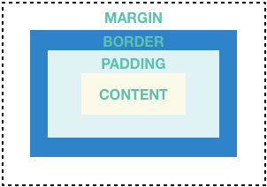


**Örnekler (Container)**
Bu düzen, her biri 2 resim içeren iki satıra sahip bir sütundan oluşur. Sütunun arka plan rengini daha açık bir griye değiştirmek için bir `Container` kullanılır.

```dart
Widget _buildImageColumn() {
  return Container(
    decoration: const BoxDecoration(color: Colors.black26),
    child: Column(children: [_buildImageRow(1), _buildImageRow(3)]),
  );
}
```
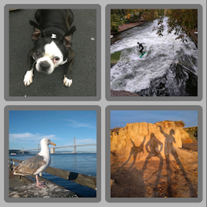

Her resme yuvarlatılmış bir kenarlık ve kenar boşlukları eklemek için de bir `Container` kullanılır:

```dart
Widget _buildDecoratedImage(int imageIndex) => Expanded(
  child: Container(
    decoration: BoxDecoration(
      border: Border.all(width: 10, color: Colors.black38),
      borderRadius: const BorderRadius.all(Radius.circular(8)),
    ),
    margin: const EdgeInsets.all(4),
    child: Image.asset('images/pic$imageIndex.jpg'),
  ),
);

Widget _buildImageRow(int imageIndex) => Row(
  children: [
    _buildDecoratedImage(imageIndex),
    _buildDecoratedImage(imageIndex + 1),
  ],
);
```

Daha fazla `Container` örneğini eğitimde bulabilirsiniz.
Uygulama kaynağı: `container`

### GridView

Widget'ları iki boyutlu bir liste olarak düzenlemek için `GridView` kullanın. `GridView` önceden hazırlanmış iki liste sağlar veya kendi özel ızgaranızı oluşturabilirsiniz. Bir `GridView` içeriğinin render kutusuna sığmayacak kadar uzun olduğunu algıladığında otomatik olarak kayar.

**Özet (GridView)**

* Widget'ları bir ızgara içinde düzenler.
* Sütun içeriği render kutusunu aştığında algılar ve otomatik olarak kaydırma sağlar.
* Kendi özel ızgaranızı oluşturun veya sağlanan ızgaralardan birini kullanın:
* `GridView.count`: Sütun sayısını belirtmenize olanak tanır.
* `GridView.extent`: Bir döşemenin maksimum piksel genişliğini belirtmenize olanak tanır.


**Not**
Bir hücrenin hangi satır ve sütunu işgal ettiğinin önemli olduğu iki boyutlu bir liste görüntülerken (örneğin, "avokado" satırı için "kalori" sütunundaki giriş), `Table` veya `DataTable` kullanın.

**Örnekler (GridView)**

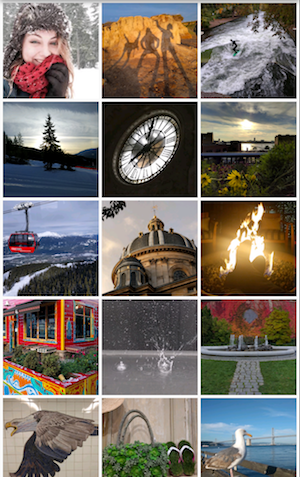

Maksimum 150 piksel genişliğinde döşemelere sahip bir ızgara oluşturmak için `GridView.extent` kullanır. Uygulama kaynağı: [`grid_and_list`](https://github.com/flutter/website/tree/main/examples/layout/grid_and_list)


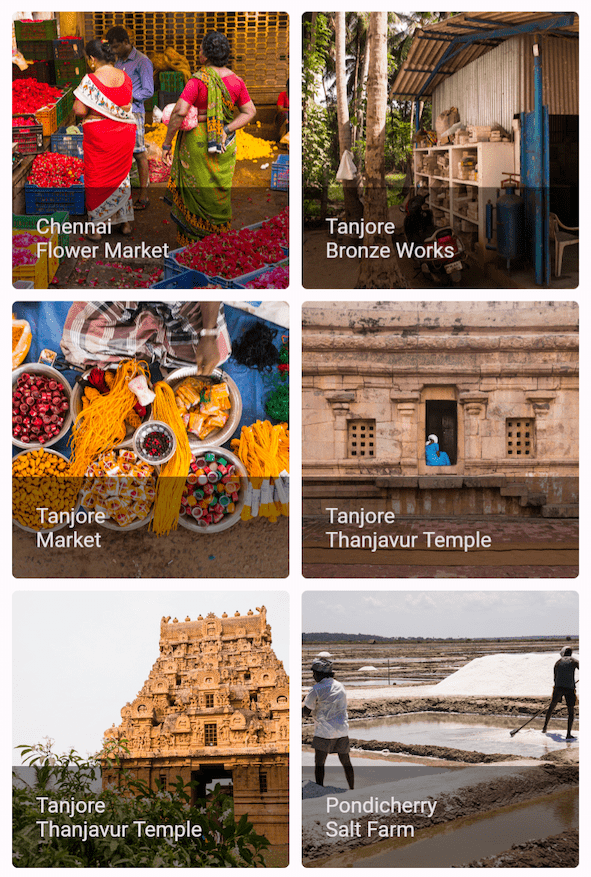

Portre modunda 2 döşeme genişliğinde ve manzara modunda 3 döşeme genişliğinde bir ızgara oluşturmak için `GridView.count` kullanır. Başlıklar, her `GridTile` için `footer` özelliği ayarlanarak oluşturulur.

Dart kodu: [`grid_list_demo.dart`](https://github.com/flutter/website/tree/main/examples/layout/gallery/lib/grid_list_demo.dart)

```dart
Widget _buildGrid() => GridView.extent(
  maxCrossAxisExtent: 150,
  padding: const EdgeInsets.all(4),
  mainAxisSpacing: 4,
  crossAxisSpacing: 4,
  children: _buildGridTileList(30),
);

// The images are saved with names pic0.jpg, pic1.jpg...pic29.jpg.
// The List.generate() constructor allows an easy way to create
// a list when objects have a predictable naming pattern.
List<Widget> _buildGridTileList(int count) =>
    List.generate(count, (i) => Image.asset('images/pic$i.jpg'));

```

### ListView

`ListView`, sütun benzeri bir widget'tır ve içeriği render kutusu için çok uzun olduğunda otomatik olarak kaydırma sağlar.

**Özet (ListView)**

* Bir kutu listesini düzenlemek için özelleşmiş bir `Column`.
* Yatay veya dikey olarak düzenlenebilir.
* İçeriği sığmadığında algılar ve kaydırma sağlar.
* `Column`'dan daha az yapılandırılabilir, ancak kullanımı daha kolaydır ve kaydırmayı destekler.

**Örnekler (ListView)**
`ListTiles` kullanarak bir işletme listesi görüntülemek için `ListView` kullanır. Bir `Divider`, tiyatroları restoranlardan ayırır.

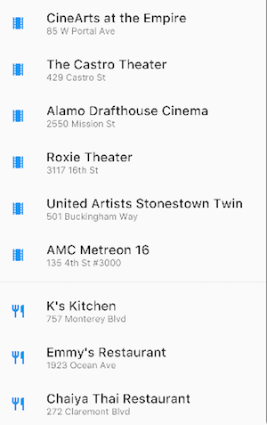

Uygulama kaynağı: [`grid_and_list`](https://github.com/flutter/website/tree/main/examples/layout/grid_and_list)

Belirli bir renk ailesi için Material 2 Tasarım paletindeki `Renkleri` görüntülemek için `ListView` kullanır.

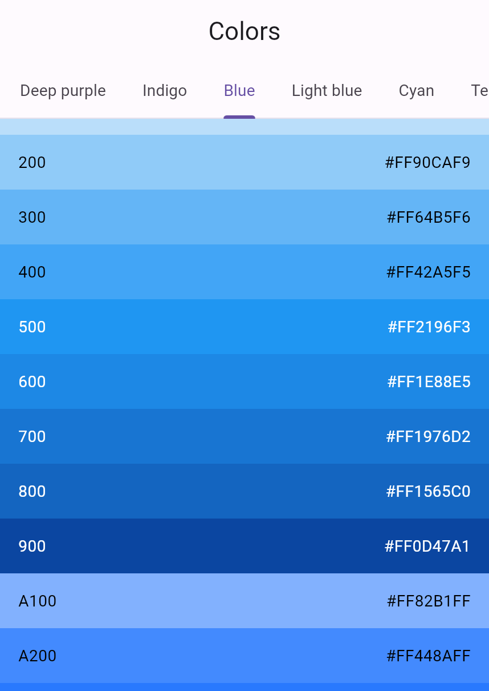

Dart kodu: [`colors_demo.dart`](https://github.com/flutter/website/tree/main/examples/layout/gallery/lib/colors_demo.dart)

```dart
Widget _buildList() {
  return ListView(
    children: [
      _tile('CineArts at the Empire', '85 W Portal Ave', Icons.theaters),
      _tile('The Castro Theater', '429 Castro St', Icons.theaters),
      _tile('Alamo Drafthouse Cinema', '2550 Mission St', Icons.theaters),
      _tile('Roxie Theater', '3117 16th St', Icons.theaters),
      _tile(
        'United Artists Stonestown Twin',
        '501 Buckingham Way',
        Icons.theaters,
      ),
      _tile('AMC Metreon 16', '135 4th St #3000', Icons.theaters),
      const Divider(),
      _tile('K\'s Kitchen', '757 Monterey Blvd', Icons.restaurant),
      _tile('Emmy\'s Restaurant', '1923 Ocean Ave', Icons.restaurant),
      _tile('Chaiya Thai Restaurant', '272 Claremont Blvd', Icons.restaurant),
      _tile('La Ciccia', '291 30th St', Icons.restaurant),
    ],
  );
}

ListTile _tile(String title, String subtitle, IconData icon) {
  return ListTile(
    title: Text(
      title,
      style: const TextStyle(fontWeight: FontWeight.w500, fontSize: 20),
    ),
    subtitle: Text(subtitle),
    leading: Icon(icon, color: Colors.blue[500]),
  );
}
```

### Stack

Widget'ları bir temel widget'ın (genellikle bir resim) üzerine düzenlemek için `Stack` kullanın. Widget'lar temel widget ile tamamen veya kısmen örtüşebilir.

**Özet (Stack)**

* Başka bir widget ile örtüşen widget'lar için kullanın.
* Çocuk listesindeki ilk widget temel widget'tır; sonraki çocuklar o temel widget'ın üzerine bindirilir.
* Bir `Stack`'in içeriği kaydırılamaz.
* Render kutusunu aşan çocukları kırpmayı seçebilirsiniz.

**Örnekler (Stack)**


Bir `CircleAvatar`'ın üzerine (`Text`'ini yarı saydam siyah bir arka planda görüntüleyen) bir `Container` bindirmek için `Stack` kullanır. `Stack`, metni `alignment` özelliği ve `Alignments` kullanarak kaydırır.

Uygulama kaynağı: `card_and_stack`


Bir resmin üzerine bir simge bindirmek için `Stack` kullanır.


Dart kodu: [`bottom_navigation_demo.dart`](https://github.com/flutter/website/tree/main/examples/layout/gallery/lib/bottom_navigation_demo.dart)

```dart
Widget _buildStack() {
  return Stack(
    alignment: const Alignment(0.6, 0.6),
    children: [
      const CircleAvatar(
        backgroundImage: AssetImage('images/pic.jpg'),
        radius: 100,
      ),
      Container(
        decoration: const BoxDecoration(color: Colors.black45),
        child: const Text(
          'Mia B',
          style: TextStyle(
            fontSize: 20,
            fontWeight: FontWeight.bold,
            color: Colors.white,
          ),
        ),
      ),
    ],
  );
}
```

### Card

Material kütüphanesinden bir `Card`, ilgili bilgi parçacıklarını içerir ve neredeyse her widget'tan oluşturulabilir, ancak genellikle `ListTile` ile birlikte kullanılır. `Card` tek bir çocuğa sahiptir, ancak çocuğu bir sütun, satır, liste, ızgara veya birden fazla çocuğu destekleyen diğer widget'lar olabilir. Varsayılan olarak, bir `Card` boyutunu 0'a 0 piksele küçültür. Bir kartın boyutunu kısıtlamak için `SizedBox` kullanabilirsiniz.

Flutter'da bir `Card`, hafifçe yuvarlatılmış köşelere ve bir gölgeye sahiptir ve bu ona 3B efekti verir. Bir `Card`'ın `elevation` özelliğini değiştirmek, gölge efektini kontrol etmenizi sağlar. Örneğin, yüksekliği 24'e ayarlamak, `Card`'ı görsel olarak yüzeyden daha yukarı kaldırır ve gölgenin daha dağılmasına neden olur. Desteklenen yükseklik değerlerinin bir listesi için Material yönergelerindeki Yükseklik (Elevation) bölümüne bakın. Desteklenmeyen bir değer belirtmek gölgeyi tamamen devre dışı bırakır.

**Özet (Card)**

* Bir Material kartı uygular.
* İlgili bilgi parçacıklarını sunmak için kullanılır.
* Tek bir çocuk kabul eder, ancak bu çocuk bir çocuk listesi tutan `Row`, `Column` veya başka bir widget olabilir.
* Yuvarlatılmış köşeler ve bir gölge ile görüntülenir.
* Bir `Card`'ın içeriği kaydırılamaz.
* Material kütüphanesinden gelir.

**Örnekler (Card)**
3 ListTile içeren ve bir `SizedBox` ile sarılarak boyutlandırılmış bir `Card`. Bir `Divider` birinci ve ikinci `ListTiles`'ı ayırır.


Uygulama kaynağı: [`card_and_stack`](https://github.com/flutter/website/tree/main/examples/layout/card_and_stack)

Bir resim ve metin içeren bir `Card`.

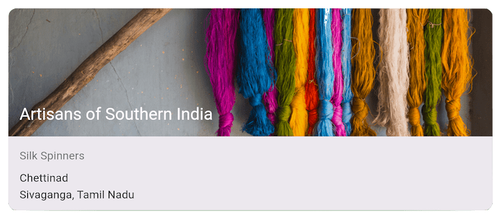

Dart kodu: [`cards_demo.dart`](https://github.com/flutter/website/tree/main/examples/layout/gallery/lib/cards_demo.dart)

```dart
Widget _buildCard() {
  return SizedBox(
    height: 210,
    child: Card(
      child: Column(
        children: [
          ListTile(
            title: const Text(
              '1625 Main Street',
              style: TextStyle(fontWeight: FontWeight.w500),
            ),
            subtitle: const Text('My City, CA 99984'),
            leading: Icon(Icons.restaurant_menu, color: Colors.blue[500]),
          ),
          const Divider(),
          ListTile(
            title: const Text(
              '(408) 555-1212',
              style: TextStyle(fontWeight: FontWeight.w500),
            ),
            leading: Icon(Icons.contact_phone, color: Colors.blue[500]),
          ),
          ListTile(
            title: const Text('costa@example.com'),
            leading: Icon(Icons.contact_mail, color: Colors.blue[500]),
          ),
        ],
      ),
    ),
  );
}
```

### ListTile

3 satıra kadar metin ve isteğe bağlı baştaki ve sondaki simgeleri içeren bir satır oluşturmanın kolay bir yolu için Material kütüphanesinden özel bir satır widget'ı olan `ListTile` kullanın. `ListTile` en yaygın olarak `Card` veya `ListView` içinde kullanılır, ancak başka yerlerde de kullanılabilir.

**Özet (ListTile)**

* 3 satıra kadar metin ve isteğe bağlı simgeler içeren özel bir satır.
* `Row`'dan daha az yapılandırılabilir, ancak kullanımı daha kolaydır.
* Material kütüphanesinden gelir.

**Örnekler (ListTile)**
3 `ListTiles` içeren bir `Card`.

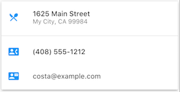

Uygulama kaynağı: [`card_and_stack`](https://github.com/flutter/website/tree/main/examples/layout/card_and_stack)

Öncü widget'larla `ListTile` kullanımı.

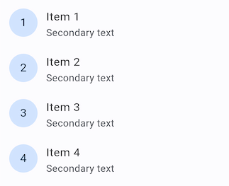

Dart kodu: [`list_demo.dart`](https://github.com/flutter/website/tree/main/examples/layout/gallery/lib/list_demo.dart)

## Kısıtlamalar (Constraints)

Flutter'ın düzen sistemini tam olarak anlamak için, Flutter'ın bir düzendeki bileşenleri nasıl konumlandırdığını ve boyutlandırdığını öğrenmeniz gerekir. Daha fazla bilgi için "Kısıtlamaları Anlamak" (Understanding constraints) konusuna bakın.

## Videolar

"Flutter in Focus" serisinin bir parçası olan aşağıdaki videolar, `Stateless` ve `Stateful` widget'ları açıklar.

[Flutter in Focus playlist placeholder]

"Widget of the Week" (Haftanın Widget'ı) serisinin her bölümü bir widget'a odaklanır. Bunların birçoğu düzen widget'larını içerir.

[Flutter Widget of the Week playlist placeholder]

## Diğer kaynaklar

Aşağıdaki kaynaklar düzen kodu yazarken yardımcı olabilir.

* **Düzen eğitimi (Layout tutorial)**: Bir düzenin nasıl oluşturulacağını öğrenin.
* **Widget kataloğu (Widget catalog)**: Flutter'da bulunan birçok widget'ı tanımlar.
* **Flutter'da HTML/CSS Karşılıkları (HTML/CSS Analogs in Flutter)**: Web programlamaya aşina olanlar için bu sayfa HTML/CSS işlevselliğini Flutter özellikleriyle eşleştirir.
* **API referans belgeleri (API reference docs)**: Tüm Flutter kütüphaneleri için referans belgeleri.
* **Varlıklar ve resimler ekleme (Adding assets and images)**: Uygulamanızın paketine resimlerin ve diğer varlıkların nasıl ekleneceğini açıklar.
* **Flutter ile Sıfırdan Bire (Zero to One with Flutter)**: Bir kişinin ilk Flutter uygulamasını yazma deneyimi.


---
---

## 📄 Lisans Bilgisi

Bu doküman, **Flutter resmi dokümantasyonundan** türetilmiş Türkçe ders notudur.

**Orijinal kaynak:**  
https://docs.flutter.dev/ui/layout

**Türkçe çeviri ve düzenleme:**  
[Doç. Dr. Hakan Temiz](mailto:htemiz@artvin.edu.tr)

---

### Lisans Kapsamı

Bu dokümandaki içerikler aşağıdaki açık lisanslar kapsamında sunulmaktadır:

**Metin içerikleri (anlatım ve açıklamalar):**  
Flutter resmi dokümantasyonundan alınmış veya uyarlanmıştır.  
**Lisans:** Creative Commons Attribution 4.0 International (CC BY 4.0)  
https://creativecommons.org/licenses/by/4.0/

Bu lisans kapsamında:
- İçerik kopyalanabilir, dağıtılabilir ve uyarlanabilir  
- Ticari kullanım serbesttir  
- Kaynak belirtilmesi zorunludur  

**Kod örnekleri:**  
Flutter resmi dokümantasyonundan alınmış veya uyarlanmıştır.  
**Lisans:** BSD 3-Clause License  
https://opensource.org/licenses/BSD-3-Clause

Bu lisans kapsamında:
- Kodlar kopyalanabilir, değiştirilebilir ve dağıtılabilir  
- Ticari kullanım serbesttir  
- Lisans bildiriminin korunması gerekir  

---
---
