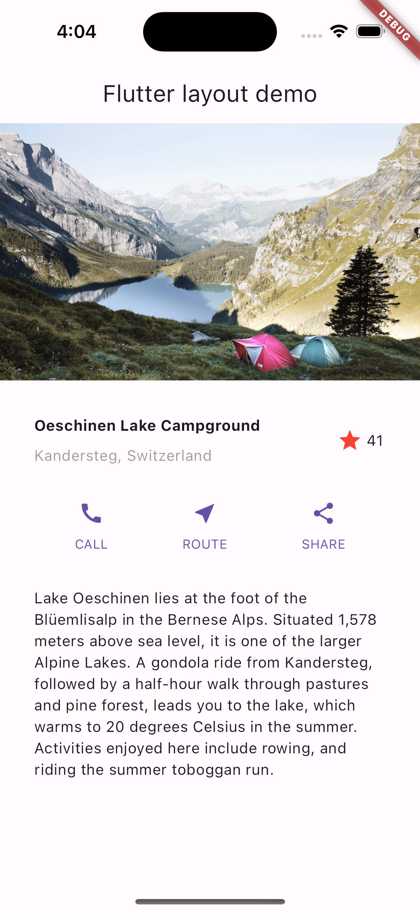
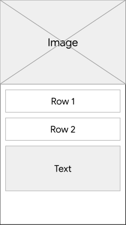
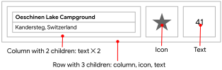
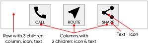
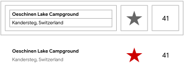
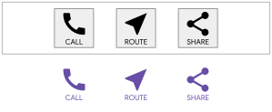
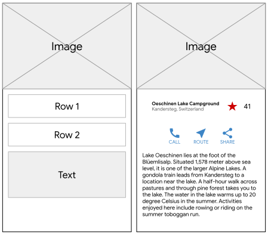

# Flutter düzeni oluşturun

## Öğrenecekleriniz

* Widget'ları yan yana nasıl yerleştirebilirsiniz?
* Widget'lar arasına nasıl boşluk eklenir?
* Flutter'da widget ekleme ve iç içe yerleştirmenin düzeni nasıl etkilediği.

Bu eğitimde Flutter'da düzenlerin nasıl tasarlanıp oluşturulacağı açıklanmaktadır.

Verilen örnek kodu kullanırsanız, aşağıdaki uygulamayı oluşturabilirsiniz.



*Tamamlanmış uygulama. Fotoğraf: Dino Reichmuth / Unsplash . Metin: İsviçre Turizm .*

Yerleşim mekanizmasına daha iyi bir genel bakış elde etmek için, [Flutter'ın yerleşim yaklaşımıyla](https://www.google.com/search?q=placeholder_link) başlayın.

## Yerleşim planını şematik olarak çizin

Bu bölümde, uygulamanızın kullanıcıları için ne tür bir kullanıcı deneyimi istediğinizi düşünün.

Kullanıcı arayüzünüzün bileşenlerini nasıl konumlandıracağınızı düşünün. Bir düzen, bu konumlandırmaların toplam nihai sonucundan oluşur. Kodlama hızınızı artırmak için düzeninizi planlamayı düşünün. Ekranda bir şeyin nereye yerleştirileceğini bilmek için görsel ipuçları kullanmak büyük bir yardımcı olabilir.

İster arayüz tasarım aracı, ister kalem ve kağıt olsun, hangisini tercih ederseniz edin. Kod yazmadan önce ekranınızda öğeleri nereye yerleştirmek istediğinizi belirleyin. Bu, programlamanın "İki kere ölç, bir kere kes" atasözüne benzer.

Düzeni temel unsurlarına ayırmak için şu soruları sorun:

* Satırları ve sütunları belirleyebilir misiniz?
* Tasarımda ızgara yapısı var mı?
* Birbiriyle örtüşen unsurlar var mı?
* Kullanıcı arayüzünde sekmelere ihtiyaç var mı?
* Hizalama, dolgu veya kenarlık eklemek için neye ihtiyacınız var?

Daha büyük öğeleri belirleyin. Bu örnekte, resmi, başlığı, düğmeleri ve açıklamayı bir sütun halinde düzenliyorsunuz.

*Sayfa düzenindeki temel unsurlar: resim, satır, satır ve metin bloğu.*



### Her bir satırı şematik olarak gösterin

**1. satır, Başlık bölümü**, üç alt öğeye sahiptir: bir metin sütunu, bir yıldız simgesi ve bir sayı. İlk alt öğesi olan sütun, iki satır metin içerir. Bu ilk sütun daha fazla alana ihtiyaç duyabilir. 



*Metin blokları ve bir simge içeren başlık bölümü.*


**2. satırdaki Düğme bölümü** üç alt öğeye sahiptir: her alt öğe, bir simge ve metin içeren bir sütun içerir.


*Üç adet etiketli düğmenin bulunduğu Düğme bölümü*

Yerleşim planını çizdikten sonra, nasıl kodlayacağınızı düşünün.

Kodun tamamını tek bir sınıfta mı yazardınız? Yoksa düzenin her bir parçası için ayrı bir sınıf mı oluştururdunuz?

Flutter'ın en iyi uygulamalarını takip etmek için, düzeninizin her bir bölümünü içerecek bir sınıf veya Widget oluşturun. Flutter, bir kullanıcı arayüzünün bir bölümünü yeniden oluşturması gerektiğinde, değişen en küçük bölümü günceller. Bu nedenle Flutter, "her şeyi bir widget" yapar. Bir widget'ta yalnızca metin değişirse `Text`, Flutter yalnızca o metni yeniden çizer. Flutter, kullanıcı girdisine yanıt olarak kullanıcı arayüzünün mümkün olan en az miktarda değişikliğini yapar.

Bu eğitimde, belirlediğiniz her bir öğeyi ayrı bir widget olarak yazın.

## Uygulama temel kodunu oluşturun

Bu bölümde, uygulamanızı başlatmak için temel Flutter uygulama kodunu yazacağız.

1. Flutter ortamınızı kurun.
2. Yeni bir Flutter uygulaması oluşturun.
3. İçeriği `lib/main.dart` aşağıdaki kodla değiştirin. Bu uygulama, uygulama başlığı ve uygulamanın ana sayfasında gösterilen başlık için bir parametre kullanır `appBar`. Bu karar kodu basitleştirir.

```dart
import 'package:flutter/material.dart';

void main() => runApp(const MyApp());

class MyApp extends StatelessWidget {
  const MyApp({super.key});

  @override
  Widget build(BuildContext context) {
    const String appTitle = 'Flutter layout demo';
    return MaterialApp(
      title: appTitle,
      home: Scaffold(
        appBar: AppBar(title: const Text(appTitle)),
        body: const Center(
          child: Text('Hello World'),
        ),
      ),
    );
  }
}
```

## Başlık bölümünü ekleyin

Bu bölümde, `TitleSection` aşağıdaki düzene benzeyen bir widget oluşturun.


*Başlık bölümünün taslak ve prototip kullanıcı arayüzü*

### TitleSection Widget'ı ekle

Sınıfın sonuna aşağıdaki kodu ekleyin `MyApp`.

```dart
class TitleSection extends StatelessWidget {
  const TitleSection({super.key, required this.name, required this.location});

  final String name;
  final String location;

  @override
  Widget build(BuildContext context) {
    return Padding(
      padding: const EdgeInsets.all(32),
      child: Row(
        children: [
          Expanded(
            /*1*/
            child: Column(
              crossAxisAlignment: CrossAxisAlignment.start,
              children: [
                /*2*/
                Padding(
                  padding: const EdgeInsets.only(bottom: 8),
                  child: Text(
                    name,
                    style: const TextStyle(fontWeight: FontWeight.bold),
                  ),
                ),
                Text(location, style: TextStyle(color: Colors.grey[500])),
              ],
            ),
          ),
          /*3*/
          Icon(Icons.star, color: Colors.red[500]),
          const Text('41'),
        ],
      ),
    );
  }
}
```

* Satırdaki kalan tüm boş alanı kullanmak için, `Expanded` widget'ı genişletmek üzere widget'ı kullanın `Column`. Sütunu satırın başına yerleştirmek için `crossAxisAlignment` özelliği olarak ayarlayın `CrossAxisAlignment.start`.
* Metin satırları arasına boşluk eklemek için, bu satırları bir `Padding` widget'ın içine yerleştirin.
* Başlık satırı kırmızı bir yıldız simgesi ve metinle bitiyor `41`. Tüm satır bir `Padding` widget'ın içine yerleşiyor ve her kenarı 32 piksel boşlukla çevreleniyor.

### Uygulama gövdesini kaydırılabilir bir görünüme dönüştürün

Özellik içinde, `body` widget'ı başka bir widget ile değiştirin. Widget'ın içinde, `Center` widget'ı başka bir widget ile değiştirin `SingleChildScrollView`. `SingleChildScrollView`, `Text`, `Column`.

```dart
body: const Center(
  child: Text('Hello World'),
```

**Yerine:**

```dart
body: const SingleChildScrollView(
  child: Column(
    children: [
```

Bu kod güncellemeleri uygulamada aşağıdaki değişiklikleri yapar:

* Bir `SingleChildScrollView` widget kaydırılabilir. Bu, mevcut ekrana sığmayan öğelerin görüntülenmesini sağlar.
* Bir widget `Column`, özelliğindeki tüm öğeleri listelenen sırayla görüntüler `children`. Listedeki ilk öğe listenin en üstünde görüntülenir. Listedeki öğeler `children` ekranda yukarıdan aşağıya doğru dizi halinde görüntülenir.

### Başlık bölümünün görüntülenmesi için uygulamayı güncelleyin

`TitleSection` Widget'ı listenin ilk öğesi olarak ekleyin `children`. Bu, widget'ı ekranın en üstüne yerleştirir. Sağlanan adı ve konumu yapıcıya iletin `TitleSection`.

```dart
children: [
  TitleSection(
    name: 'Oeschinen Lake Campground',
    location: 'Kandersteg, Switzerland',
  ),
],
```

> **İpucu:** Uygulamanıza kod yapıştırırken girintiler bozulabilir. Bunu Flutter editörünüzde düzeltmek için otomatik yeniden biçimlendirme desteğini kullanın.
> Geliştirme sürecinizi hızlandırmak için Flutter'ın hızlı yeniden yükleme özelliğini deneyin.
> Sorun yaşıyorsanız, kodunuzu `lib/main.dart` ile karşılaştırın.

## Düğme bölümünü ekleyin

Bu bölümde, uygulamanıza işlevsellik katacak düğmeleri ekleyin.

Düğme bölümü, aynı düzeni kullanan üç sütun içerir: bir metin satırının üzerinde bir simge.


*Düğme bölümü, taslak ve prototip kullanıcı arayüzü olarak.*

Bu sütunları tek bir satırda, her biri aynı alanı kaplayacak şekilde dağıtmayı planlayın. Tüm metinleri ve simgeleri ana renkle boyayın.

### ButtonSection Widget'ı ekle

`TitleSection` Düğme satırını oluşturacak kodu içerecek şekilde widget'ın sonuna aşağıdaki kodu ekleyin.

```dart
class ButtonSection extends StatelessWidget {
  const ButtonSection({super.key});

  @override
  Widget build(BuildContext context) {
    final Color color = Theme.of(context).primaryColor;
    // ···
  }
}
```

### Düğmeler oluşturmak için bir widget oluşturun

Her sütun için kod aynı sözdizimini kullanabileceğinden, adlı bir widget oluşturun `ButtonWithText`. Widget'ın yapıcı fonksiyonu, düğme için bir renk, simge verileri ve bir etiket kabul eder. Bu değerleri kullanarak, widget, alt öğeleri olarak bir `Icon` ve stilize edilmiş bir widget `Text` içeren bir oluşturur `Column`. Bu alt öğeleri ayırmaya yardımcı olmak için, widget'ı bir widget'ı ile sarmalayan bir `Padding` widget oluşturulur.

Sınıfın sonuna aşağıdaki kodu ekleyin `ButtonSection`.

```dart
class ButtonSection extends StatelessWidget {
  const ButtonSection({super.key});
  // ···
}

class ButtonWithText extends StatelessWidget {
  const ButtonWithText({
    super.key,
    required this.color,
    required this.icon,
    required this.label,
  });

  final Color color;
  final IconData icon;
  final String label;

  @override
  Widget build(BuildContext context) {
    return Column(
      mainAxisSize: MainAxisSize.min,
      mainAxisAlignment: MainAxisAlignment.center,
      children: [
        Icon(icon, color: color),
        Padding(
          padding: const EdgeInsets.only(top: 8),
          child: Text(
            label,
            style: TextStyle(
              fontSize: 12,
              fontWeight: FontWeight.w400,
              color: color,
            ),
          ),
        ),
      ],
    );
  }
}
```

### Düğmeleri bir Row widget kullanarak konumlandırın

Aşağıdaki kodu widget'a ekleyin `ButtonSection`.
Butonların her biri için bir tane olmak üzere, widget'tan üç örnek ekleyin `ButtonWithText`.
Belirtilen düğme için `Icon` rengi, simgeyi ve metni geçirin.

Sütunları ana eksen boyunca değerle hizalayın `MainAxisAlignment.spaceEvenly`. Bir widget'ın ana ekseni `Row` yatay, diğer bir `Column` widget'ın ana ekseni ise dikeydir. Bu değer, Flutter'a her sütunun öncesinde, arasında ve sonrasında eşit miktarda boş alan bırakmasını söyler `Row`.

```dart
class ButtonSection extends StatelessWidget {
  const ButtonSection({super.key});

  @override
  Widget build(BuildContext context) {
    final Color color = Theme.of(context).primaryColor;
    return SizedBox(
      child: Row(
        mainAxisAlignment: MainAxisAlignment.spaceEvenly,
        children: [
          ButtonWithText(color: color, icon: Icons.call, label: 'CALL'),
          ButtonWithText(color: color, icon: Icons.near_me, label: 'ROUTE'),
          ButtonWithText(color: color, icon: Icons.share, label: 'SHARE'),
        ],
      ),
    );
  }
}

class ButtonWithText extends StatelessWidget {
  const ButtonWithText({
    super.key,
    required this.color,
    required this.icon,
    required this.label,
  });

  final Color color;
  final IconData icon;
  final String label;

  @override
  Widget build(BuildContext context) {
    return Column(
      // ···
    );
  }
}
```

### Uygulamayı güncelleyerek düğme bölümünü görüntüleyin

Listeye düğme bölümünü ekleyin `children`.

```dart
  TitleSection(
    name: 'Oeschinen Lake Campground',
    location: 'Kandersteg, Switzerland',
  ),
  ButtonSection(),
],
```

## Metin bölümünü ekleyin

Bu bölüme, bu uygulamaya ait metin açıklamasını ekleyin.



*Metin bloğu, taslak ve prototip kullanıcı arayüzü olarak.*

### TextSection Widget'ı ekle

Aşağıdaki kodu, mevcut `ButtonSection` widget'ın ardından ayrı bir widget olarak ekleyin.

```dart
class TextSection extends StatelessWidget {
  const TextSection({super.key, required this.description});

  final String description;

  @override
  Widget build(BuildContext context) {
    return Padding(
      padding: const EdgeInsets.all(32),
      child: Text(description, softWrap: true),
    );
  }
}
```

`softWrap` Bu ayarı kullanarak `true`, metin satırları kelime sınırında satır atlamadan önce sütun genişliğini doldurur.

### Metin bölümünün görüntülenmesi için uygulamayı güncelleyin

`TextSection` etiketinden sonra yeni bir widget ekleyin `ButtonSection`. Widget eklerken `TextSection`, özelliğini `description` konum açıklamasının metnine ayarlayın.

```dart
    location: 'Kandersteg, Switzerland',
  ),
  ButtonSection(),
  TextSection(
    description:
        'Lake Oeschinen lies at the foot of the Blüemlisalp in the '
        'Bernese Alps. Situated 1,578 meters above sea level, it '
        'is one of the larger Alpine Lakes. A gondola ride from '
        'Kandersteg, followed by a half-hour walk through pastures '
        'and pine forest, leads you to the lake, which warms to 20 '
        'degrees Celsius in the summer. Activities enjoyed here '
        'include rowing, and riding the summer toboggan run.',
  ),
],
```

## Resim bölümünü ekleyin

Bu bölümde, düzeninizi tamamlamak için resim dosyasını ekleyin.

### Uygulamanızı sağlanan görselleri kullanacak şekilde yapılandırın

Uygulamanızın görselleri referans almasını sağlamak için, uygulama `pubspec.yaml` dosyasını değiştirin.

1. Projenin en üstüne `images` bir klasör oluşturun.
2. Görüntüyü indirin `lake.jpg` ve yeni klasöre ekleyin `images`.

> **Not:** Bu ikili dosyayı kaydetmek için kullanamazsınız. Resmi Unsplash Lisansı altında Unsplash'ten indirebilirsiniz `wget`. Küçük boyutu 94,4 kB'dir.

Görselleri eklemek için, uygulamanızın kök dizinindeki dosyaya bir `assets` etiketi ekleyin. `<image>` etiketini eklediğinizde, bu etiket kodunuzda kullanılabilir görsellere işaretçiler kümesi görevi görür `pubspec.yaml`.

```yaml
pubspec.yaml
flutter:
  uses-material-design: true
  assets:
    - images/lake.jpg
```

> **İpucu:** Metinde `pubspec.yaml` boşluk ve büyük/küçük harf kullanımına dikkat edin. Önceki örnekte verildiği gibi değişiklikleri dosyaya yazın.
> Bu değişiklik, görüntünün görüntülenmesi için çalışan programı yeniden başlatmanızı gerektirebilir.

### ImageSection Widget'ı oluşturun

`ImageSection` Diğer tanımlamaların ardından aşağıdaki bileşeni tanımlayın.

```dart
class ImageSection extends StatelessWidget {
  const ImageSection({super.key, required this.image});

  final String image;

  @override
  Widget build(BuildContext context) {
    return Image.asset(image, width: 600, height: 240, fit: BoxFit.cover);
  }
}
```

Bu `BoxFit.cover` değer, Flutter'a görüntüyü iki kısıtlama ile görüntülemesini söyler. Birincisi, görüntüyü mümkün olduğunca küçük göstermek. İkincisi, düzenin ayırdığı tüm alanı, yani render kutusunu kaplamak.

### Uygulamayı güncelleyerek resim bölümünü görüntüleyin

`ImageSection` Listeye ilk alt öğe olarak bir widget ekleyin `children`. Özelliği `image`, "Uygulamanızı sağlanan resimleri kullanacak şekilde yapılandırın" bölümünde eklediğiniz resmin yoluna ayarlayın.

```dart
children: [
  ImageSection(
    image: 'images/lake.jpg',
  ),
  TitleSection(
    name: 'Oeschinen Lake Campground',
    location: 'Kandersteg, Switzerland',
  ),
```

# Tebrikler

İşte bu kadar! Uygulamayı yeniden başlattığınızda, uygulamanız şöyle görünmelidir.


*Tamamlanmış uygulama*


---
---

## 📄 Lisans Bilgisi

Bu doküman, **Flutter resmi dokümantasyonundan** türetilmiş Türkçe ders notudur.

**Orijinal kaynak:**  
https://docs.flutter.dev/ui/layout/tutorial

**Türkçe çeviri ve düzenleme:**  
[Doç. Dr. Hakan Temiz](mailto:htemiz@artvin.edu.tr)

---

### Lisans Kapsamı

Bu dokümandaki içerikler aşağıdaki açık lisanslar kapsamında sunulmaktadır:

**Metin içerikleri (anlatım ve açıklamalar):**  
Flutter resmi dokümantasyonundan alınmış veya uyarlanmıştır.  
**Lisans:** Creative Commons Attribution 4.0 International (CC BY 4.0)  
https://creativecommons.org/licenses/by/4.0/

Bu lisans kapsamında:
- İçerik kopyalanabilir, dağıtılabilir ve uyarlanabilir  
- Ticari kullanım serbesttir  
- Kaynak belirtilmesi zorunludur  

**Kod örnekleri:**  
Flutter resmi dokümantasyonundan alınmış veya uyarlanmıştır.  
**Lisans:** BSD 3-Clause License  
https://opensource.org/licenses/BSD-3-Clause

Bu lisans kapsamında:
- Kodlar kopyalanabilir, değiştirilebilir ve dağıtılabilir  
- Ticari kullanım serbesttir  
- Lisans bildiriminin korunması gerekir  

---
---
