# Uyarlanabilir uygulamalara genel yaklaşım

Flutter uygulamanızı uyarlanabilir hale getirmeye nasıl yaklaşacağınıza dair genel tavsiyeler.

Peki, geleneksel mobil cihazlar için tasarlanmış bir uygulamayı alıp geniş bir cihaz yelpazesinde güzel görünmesini sağlamaya nasıl yaklaşırsınız? Hangi adımlar gereklidir?

Büyük uygulamalar için tam olarak bunu yapma deneyimine sahip Google mühendisleri, aşağıdaki 3 adımlı yaklaşımı önermektedir.

## Adım 1: Soyutlayın (Abstract)

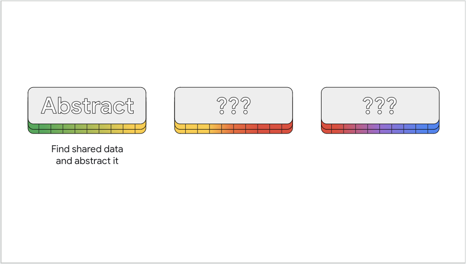

İlk olarak, dinamik hale getirmeyi planladığınız widget'ları belirleyin. Bu widget'ların kurucularını (constructors) analiz edin ve paylaşabileceğiniz verileri soyutlayın.

Uyarlanabilirlik gerektiren yaygın widget'lar şunlardır:

* İletişim kutuları (Dialogs), hem tam ekran hem de kalıcı (modal).
* Gezinme kullanıcı arayüzü (Navigation UI), hem ray (rail) hem de alt çubuk (bottom bar).
* Özel düzen, örneğin "Kullanıcı arayüzü alanı daha mı uzun yoksa daha mı geniş?" gibi.

Örneğin, bir `Dialog` widget'ında, diyaloğun `content` (içeriğini) barındıran bilgiyi paylaşabilirsiniz.

Veya, uygulama penceresi küçükken bir `NavigationBar`, uygulama penceresi büyükken bir `NavigationRail` arasında geçiş yapmak isteyebilirsiniz. Bu widget'lar muhtemelen gezilebilir hedeflerin bir listesini paylaşacaktır. Bu durumda, bu bilgiyi tutmak için bir `Destination` widget'ı oluşturabilir ve `Destination`'ı hem bir simgeye hem de bir metin etiketine sahip olacak şekilde belirtebilirsiniz.

Ardından, arayüzünüzü nasıl görüntüleyeceğinize karar vermek için ekran boyutunuzu değerlendireceksiniz.

## Adım 2: Ölçün (Measure)

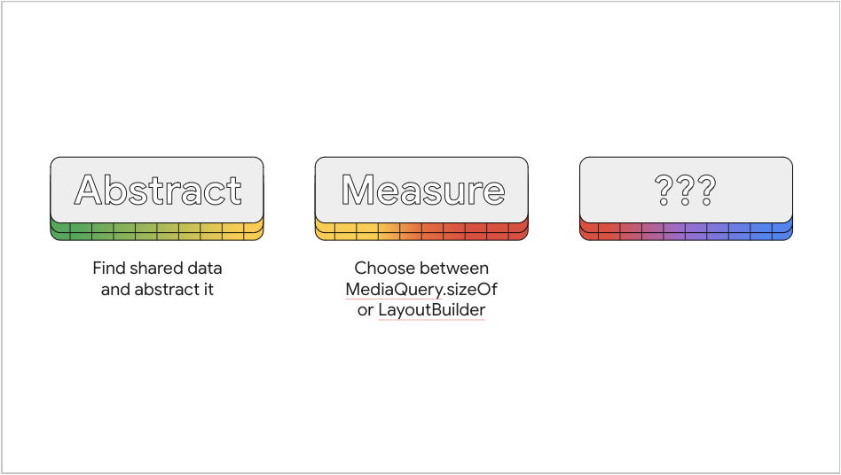


Görüntüleme alanınızın boyutunu belirlemenin iki yolu vardır: `MediaQuery` ve `LayoutBuilder`.

### MediaQuery

Geçmişte, cihazın ekran boyutunu belirlemek için `MediaQuery.of` kullanmış olabilirsiniz. Ancak günümüz cihazları çok çeşitli boyut ve şekillerde ekranlara sahiptir ve bu test yanıltıcı olabilir.

Örneğin, belki uygulamanız şu anda büyük bir ekranda küçük bir pencerede yer alıyor. `MediaQuery.of` yöntemini kullanır ve ekranın küçük olduğu sonucuna varırsanız (aslında uygulama büyük bir ekranda küçük bir pencerede görüntülenirken) ve uygulamanızı portre moduna kilitlediyseniz, bu durum uygulamanın penceresinin ekranın ortasına kilitlenmesine ve etrafının siyahla çevrelenmesine neden olur. Bu, büyük bir ekranda ideal bir kullanıcı arayüzü değildir.

**Not**
Material Yönergeleri, uygulamanızı (manzara modunu devre dışı bırakarak) asla **portre moduna kilitlememenizi** (portrait lock) önerir. Ancak, gerçekten yapmanız gerektiğini hissediyorsanız, o zaman portre modunu aşağıdan yukarıya olduğu gibi yukarıdan aşağıya (ters portre) modunda da çalışacak şekilde tanımlayın.

`MediaQuery.sizeOf`'un sadece tek bir widget'ın değil, uygulamanın tüm ekranının mevcut boyutunu döndürdüğünü unutmayın.

Ekran alanınızı ölçmenin iki yolu vardır. Tüm uygulama penceresinin boyutunu mu yoksa daha yerel bir boyutlandırmayı mı istediğinize bağlı olarak `MediaQuery.sizeOf` veya `LayoutBuilder` kullanabilirsiniz.

Widget'ınızın uygulama penceresi küçük olsa bile tam ekran olmasını istiyorsanız, kullanıcı arayüzünü uygulama penceresinin boyutuna göre seçebilmek için `MediaQuery.sizeOf` kullanın. Önceki bölümde, boyutlandırma davranışını tüm uygulamanın penceresine dayandırmak istiyordunuz, bu nedenle `MediaQuery.sizeOf` kullanırdınız.

#### Neden `MediaQuery.of` yerine `MediaQuery.sizeOf` kullanılmalı?

Önceki tavsiyeler, uygulama penceresinin boyutlarını elde etmek için `MediaQuery`'nin `of` yöntemini kullanmanızı öneriyordu. Bu tavsiye neden değişti? Kısa cevap **performans nedeniyledir**.

`MediaQuery` çok fazla veri içerir, ancak yalnızca size (boyut) özelliğiyle ilgileniyorsanız, `sizeOf` yöntemini kullanmak daha verimlidir. Her iki yöntem de uygulama penceresinin boyutunu mantıksal pikseller (yoğunluktan bağımsız pikseller olarak da bilinir) cinsinden döndürür. Mantıksal piksel boyutları, tüm cihazlarda kabaca aynı görsel boyutta olduğu için genellikle en iyi sonucu verir. `MediaQuery` sınıfı, aynı nedenden ötürü her bir özelliği için başka özel işlevlere de sahiptir.

Uygulama penceresinin boyutunu `build` yöntemi içinden istemek, `MediaQuery.sizeOf(context)` örneğinde olduğu gibi, size özelliği her değiştiğinde verilen `BuildContext`'in yeniden oluşturulmasına neden olur.

### LayoutBuilder

`LayoutBuilder`, bazı ayrımlarla `MediaQuery.sizeOf` ile benzer bir amaca ulaşır.

Uygulama penceresinin boyutunu sağlamak yerine, `LayoutBuilder` ebeveyn `Widget`'tan düzen kısıtlamalarını sağlar. Bu, `LayoutBuilder`'ı eklediğiniz widget ağacındaki belirli noktaya dayalı boyutlandırma bilgisi aldığınız anlamına gelir. Ayrıca, `LayoutBuilder` bir `Size` nesnesi yerine bir `BoxConstraints` nesnesi döndürür, böylece size sadece sabit bir boyut yerine içerik için geçerli genişlik ve yükseklik aralıkları (minimum ve maksimum) verilir. Bu, özel widget'lar için yararlı olabilir.

Örneğin, boyutlandırmanın genel olarak uygulama penceresine değil, özellikle o widget'a verilen alana dayanmasını istediğiniz özel bir widget hayal edin. Bu senaryoda `LayoutBuilder` kullanın.

## Adım 3: Dallandırın (Branch)

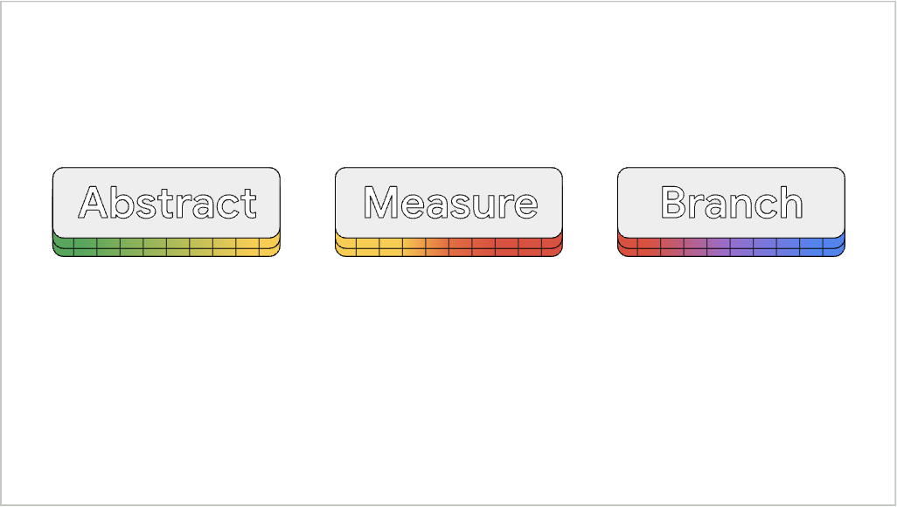


Bu noktada, görüntülenecek kullanıcı arayüzü sürümünü seçerken hangi boyutlandırma kırılma noktalarını (breakpoints) kullanacağınıza karar vermelisiniz. Örneğin, `Material layout` yönergeleri, 600 mantıksal pikselden daha dar pencereler için bir alt gezinme çubuğu (bottom nav bar) ve 600 piksel veya daha geniş olanlar için bir gezinme rayı (nav rail) kullanılmasını önerir. Yine, seçiminiz cihazın **türüne** değil, cihazın mevcut pencere boyutuna bağlı olmalıdır.

Bir `NavigationRail` ve bir `NavigationBar` arasında geçiş yapan bir örnek üzerinde çalışmak için, *Material 3 ile animasyonlu, duyarlı bir uygulama düzeni oluşturma* konusuna göz atın.

Sonraki sayfa, uygulamanızın büyük ekranlarda ve katlanabilir cihazlarda en iyi şekilde görünmesini nasıl sağlayacağınızı tartışmaktadır.


# SafeArea & MediaQuery

Uyarlanabilir bir uygulama oluşturmak için `SafeArea` ve `MediaQuery`'yi nasıl kullanacağınızı öğrenin.

Bu sayfa `SafeArea` ve `MediaQuery` widget'larının nasıl ve ne zaman kullanılacağını tartışır.

## SafeArea

Uygulamanızı en yeni cihazlarda çalıştırırken, kullanıcı arayüzünün bazı kısımlarının cihaz ekranındaki kesikler (cutouts) tarafından engellendiğini görebilirsiniz. Bunu, çocuk widget'ını müdahalelerden (çentikler ve kamera kesikleri gibi), işletim sistemi kullanıcı arayüzünden (Android'deki durum çubuğu gibi) veya fiziksel ekranın yuvarlatılmış köşelerinden kaçınmak için içe doğru yerleştiren (insets) `SafeArea` widget'ı ile düzeltebilirsiniz.

Bu davranışı istemiyorsanız, `SafeArea` widget'ı dört tarafından herhangi birinde dolguyu devre dışı bırakmanıza olanak tanır. Varsayılan olarak dört taraf da etkindir.

Genellikle bir başlangıç noktası olarak bir `Scaffold` widget'ının gövdesini `SafeArea` içine sarmak önerilir, ancak bunu her zaman `Widget` ağacında bu kadar yükseğe koymanız gerekmez.

Örneğin, uygulamanızın bilerek kesiklerin altına uzanmasını istiyorsanız, `SafeArea`'yı mantıklı olan içeriği saracak şekilde taşıyabilir ve uygulamanın geri kalanının tam ekranı kaplamasına izin verebilirsiniz.

`SafeArea` kullanmak, uygulama içeriğinizin fiziksel ekran özellikleri veya işletim sistemi kullanıcı arayüzü tarafından kesilmemesini sağlar ve pazara farklı şekil ve stillerde kesiklere sahip yeni cihazlar girdikçe uygulamanızı başarıya hazırlar.

`SafeArea` az miktarda kodla nasıl bu kadar çok şey yapıyor? Sahne arkasında `MediaQuery` nesnesini kullanır.

## MediaQuery

`SafeArea` bölümünde tartışıldığı gibi, `MediaQuery` uyarlanabilir uygulamalar oluşturmak için güçlü bir widget'tır. Bazen `MediaQuery`'yi doğrudan kullanırsınız, bazen de sahne arkasında `MediaQuery` kullanan `SafeArea`'yı kullanırsınız.

`MediaQuery`, uygulamanın mevcut pencere boyutu da dahil olmak üzere birçok bilgi sağlar. Yüksek kontrast modu ve metin ölçeklendirme gibi erişilebilirlik ayarlarını veya kullanıcının TalkBack veya VoiceOver gibi bir erişilebilirlik hizmeti kullanıp kullanmadığını gösterir. `MediaQuery` ayrıca cihazınızın ekranının bir menteşeye veya kat yerine sahip olması gibi özellikleri hakkında da bilgi içerir.

`SafeArea`, alt `Widget`'ını ne kadar içe yerleştireceğini (inset) bulmak için `MediaQuery`'den gelen verileri kullanır. Özellikle, temel olarak ekranın sistem kullanıcı arayüzü, ekran çentikleri veya durum çubuğu tarafından kısmen gizlenen miktarı olan `MediaQuery` dolgu (padding) özelliğini kullanır.

Peki, neden `MediaQuery`'yi doğrudan kullanmıyorsunuz?

Cevap, `SafeArea`'nın sadece ham `MediaQueryData` kullanmaya göre onu kullanmayı faydalı kılan akıllıca bir şey yapmasıdır. Özellikle, `SafeArea`'ya eklenen dolgu sanki yokmuş gibi görünmesi için `SafeArea`'nın çocuklarına sunulan `MediaQuery`'yi değiştirir. Bu, `SafeArea`'ları iç içe yerleştirebileceğiniz ve yalnızca en üsttekinin, çentiklerden sistem kullanıcı arayüzü olarak kaçınmak için gereken dolguyu uygulayacağı anlamına gelir.

Uygulamanız büyüdükçe ve widget'ları hareket ettirdikçe, birden fazla `SafeArea`nız varsa çok fazla dolgu uygulanması konusunda endişelenmenize gerek kalmaz; oysa `MediaQueryData.padding`i doğrudan kullanırsanız sorun yaşarsınız.

Bir `Scaffold` widget'ının gövdesini bir `SafeArea` ile sarabilirsiniz, ancak bunu widget ağacında bu kadar yükseğe koymak zorunda değilsiniz. `SafeArea`'nın yalnızca daha önce bahsedilen donanım özellikleri tarafından kesilirse bilgi kaybına neden olacak içerikleri sarması gerekir.

Örneğin, uygulamanızın bilerek kesiklerin altına uzanmasını istiyorsanız, `SafeArea`'yı mantıklı olan içeriği saracak şekilde taşıyabilir ve uygulamanın geri kalanının tam ekranı kaplamasına izin verebilirsiniz. Bir yan not olarak, `AppBar` widget'ının varsayılan olarak yaptığı budur, bu da sistem durum çubuğunun altına nasıl girdiğini açıklar. Bu aynı zamanda `Scaffold`'un tamamını sarmak yerine bir `Scaffold`'un gövdesini bir `SafeArea` içinde sarmanın önerilmesinin nedenidir.

`SafeArea`, uygulama içeriğinizin genel bir şekilde kesilmemesini sağlar ve pazara farklı şekil ve stillerde kesiklere sahip yeni cihazlar girdikçe uygulamanızı başarıya hazırlar.


# Büyük ekranlı cihazlar

## Uygulamaları büyük ekranlara uyarlarken akılda tutulması gerekenler

Bu sayfa, uygulamanızın davranışını büyük ekranlarda iyileştirmek için optimize etme konusunda rehberlik sağlar.

Flutter, Android gibi, **büyük ekranları** tabletler, katlanabilir cihazlar ve Android çalıştıran ChromeOS cihazları olarak tanımlar. Flutter ayrıca web, masaüstü ve iPad'leri de büyük ekranlı cihazlar olarak tanımlar.

### Büyük ekranlar neden özellikle önemlidir?

Büyük ekranlara olan talep artmaya devam ediyor. Ocak 2024 itibarıyla, Android üzerinde çalışan **270 milyondan fazla aktif büyük ekranlı** ve katlanabilir cihaz ve **14,9 milyondan fazla iPad kullanıcısı** bulunmaktadır.

Uygulamanız büyük ekranları desteklediğinde, başka avantajlar da elde eder. Uygulamanızı ekranı dolduracak şekilde optimize etmek, örneğin:

* Uygulamanızın kullanıcı etkileşimi metriklerini iyileştirir.
* Uygulamanızın Play Store'daki görünürlüğünü artırır. Son [Play Store güncellemeleri](https://www.google.com/search?q=https://android-developers.googleblog.com/2022/10/giving-play-users-more-ways-to-discover.html), derecelendirmeleri cihaz türüne göre gösterir ve bir uygulamanın büyük ekran desteğinden yoksun olduğunu belirtir.
* Uygulamanızın iPadOS gönderim yönergelerini karşılamasını ve [App Store'da kabul edilmesini](https://www.google.com/search?q=https://developer.apple.com/design/human-interface-guidelines/layout%23iPad) sağlar.

### GridView ile Düzen

Bir uygulamanın aşağıdaki ekran görüntülerini düşünün. Uygulama kullanıcı arayüzünü bir `ListView` içinde görüntüler. Soldaki resim uygulamayı bir mobil cihazda çalışırken gösterir. Sağdaki resim, bu sayfadaki tavsiyeler uygulanmadan önce uygulamayı büyük ekranlı bir cihazda çalışırken gösterir.

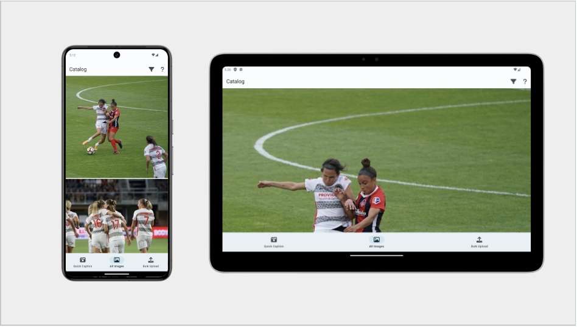


**Bu optimal değildir.**

[Android Büyük Ekran Uygulama Kalitesi Yönergeleri](https://developer.android.com/docs/quality-guidelines/large-screen-app-quality) ve [iOS eşdeğeri](https://www.google.com/search?q=https://developer.apple.com/design/human-interface-guidelines/layout%23iPad), ne metnin ne de kutuların tam ekran genişliğini kaplamaması gerektiğini söyler. Bu durum uyarlanabilir bir şekilde nasıl çözülür?

Yaygın bir çözüm, bir sonraki bölümde gösterildiği gibi `GridView` kullanmaktır.

#### GridView

Mevcut `ListView`'ınızı daha makul boyutlu öğelere dönüştürmek için `GridView` widget'ını kullanabilirsiniz.

`GridView`, `ListView` widget'ına benzerdir, ancak yalnızca doğrusal olarak düzenlenmiş bir widget listesini işlemek yerine, `GridView` widget'ları iki boyutlu bir dizide düzenleyebilir.

`GridView` ayrıca `ListView`'a benzer kuruculara (constructors) sahiptir. `ListView` varsayılan kurucusu `GridView.count` ile eşleşir ve `ListView.builder`, `GridView.builder` ile benzerdir.

`GridView`, daha özel düzenler için bazı ek kuruculara sahiptir. Daha fazla bilgi için [GridView API sayfasını](https://api.flutter.dev/flutter/widgets/GridView-class.html) ziyaret edin.

Örneğin, orijinal uygulamanız bir `ListView.builder` kullanıyorsa, bunu bir `GridView.builder` ile değiştirin. Uygulamanız çok sayıda öğeye sahipse, yalnızca gerçekten görünür olan öğe widget'larını oluşturmak için bu oluşturucu kurucusunu kullanmanız önerilir.

Kurucudaki parametrelerin çoğu iki widget arasında aynıdır, bu nedenle basit bir değişimdir. Ancak, `gridDelegate` için ne ayarlayacağınızı bulmanız gerekir.

Flutter, kullanabileceğiniz güçlü önceden hazırlanmış `gridDelegate`'ler sağlar, bunlar:

* **SliverGridDelegateWithFixedCrossAxisCount**
Izgaranıza belirli sayıda sütun atamanıza olanak tanır.
* **SliverGridDelegateWithMaxCrossAxisExtent**
Maksimum öğe genişliği tanımlamanıza olanak tanır.

Bu sınıflar için, sütun sayısını doğrudan ayarlamanıza izin veren ve ardından cihazın tablet olup olmamasına veya başka bir şeye göre sütun sayısını kod içine gömen (hardcode) ızgara temsilcisini (grid delegate) **kullanmayın**. Sütun sayısı, fiziksel cihazın boyutuna değil, pencerenin boyutuna dayanmalıdır.

Bu ayrım önemlidir çünkü birçok mobil cihaz, uygulamanızın ekranın fiziksel boyutundan daha küçük bir alanda oluşturulmasına neden olabilen çoklu pencere modunu destekler. Ayrıca, Flutter uygulamaları web ve masaüstünde çalışabilir ve bunlar birçok şekilde boyutlandırılabilir. Bu nedenle, fiziksel cihaz boyutu yerine uygulama penceresi boyutunu almak için `MediaQuery` kullanın.

#### Diğer çözümler

Bu durumlara yaklaşmanın bir başka yolu da `BoxConstraints`'in `maxWidth` özelliğini kullanmaktır. Bu şunları içerir:

1. `GridView`'ı bir `ConstrainedBox` içine sarın ve ona maksimum genişlik ayarlanmış bir `BoxConstraints` verin.
2. Arka plan rengini ayarlama gibi başka işlevler istiyorsanız `ConstrainedBox` yerine bir `Container` kullanın.

Maksimum genişlik değerini seçmek için, [Düzen uygulama](https://m3.material.io/foundations/layout/applying-layout/window-size-classes) kılavuzunda Material 3 tarafından önerilen değerleri kullanmayı düşünün.

### Katlanabilir Cihazlar (Foldables)

Daha önce belirtildiği gibi, hem Android hem de Flutter tasarım rehberlerinde ekran yönünü kilitlememeyi (lock screen orientation) önerir, ancak bazı uygulamalar yine de ekran yönünü kilitler. Bunun, uygulamanızı katlanabilir bir cihazda çalıştırırken sorunlara neden olabileceğinin farkında olun.

Katlanabilir bir cihazda çalışırken, uygulama cihaz katlandığında iyi görünebilir. Ancak açıldığında, uygulamanın "letterboxed" (üstten ve alttan siyah şeritli) olduğunu görebilirsiniz.

**SafeArea & MediaQuery** sayfasında açıklandığı gibi, letterboxing, pencere siyahla çevriliyken uygulama penceresinin ekranın ortasına kilitlenmesi anlamına gelir.

**Bu neden olabilir?**

Bu, uygulamanızın pencere boyutunu bulmak için `MediaQuery` kullanıldığında olabilir. Cihaz katlandığında, yön portre moduyla sınırlıdır. Kaputun altında, `setPreferredOrientations`, Android'in bir portre uyumluluk modu kullanmasına neden olur ve uygulama letterbox durumunda görüntülenir. Letterbox durumunda, `MediaQuery` kullanıcı arayüzünün genişlemesine izin veren daha büyük pencere boyutunu asla almaz.

Bunu iki yoldan biriyle çözebilirsiniz:

1. Tüm yönleri destekleyin.
2. **Fiziksel ekranın** boyutlarını kullanın. Aslında bu, pencere boyutlarını **değil**, fiziksel ekran boyutlarını kullanacağınız ender durumlardan biridir.

#### Fiziksel ekran boyutları nasıl elde edilir?

Fiziksel cihazın boyutunu, piksel oranını ve yenileme hızını içeren, Flutter 3.13'te tanıtılan `Display` API'sini kullanabilirsiniz.

Aşağıdaki örnek kod bir `Display` nesnesini alır:

```dart
/// AppState object.
ui.FlutterView? _view;

@override
void didChangeDependencies() {
  super.didChangeDependencies();
  _view = View.maybeOf(context);
}

void didChangeMetrics() {
  final ui.Display? display = _view?.display;
}
```

Önemli olan, ilgilendiğiniz görünümün (view) ekranını bulmaktır. Bu, mevcut **ve** gelecekteki çoklu ekran ve çoklu görünüm cihazlarını ele alması gereken ileriye dönük bir API oluşturur.

### Uyarlanabilir girdi

Daha fazla ekran için destek eklemek, girdi kontrollerini genişletmek anlamına da gelir.
Android yönergeleri, üç seviye geniş formatlı cihaz desteği tanımlar.

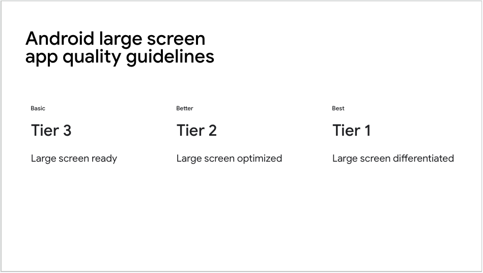


* **Seviye 3 (Tier 3)**, en düşük destek seviyesi, fare ve kalem girişi desteğini içerir ([Material 3 yönergeleri](https://m3.material.io/foundations/interaction/states/overview), [Apple yönergeleri](https://developer.apple.com/design/human-interface-guidelines/inputs/pointing-devices/)).

Uygulamanız Material 3 ve düğmelerini ve seçicilerini kullanıyorsa, uygulamanız zaten çeşitli ek girdi durumları için yerleşik desteğe sahiptir.

Peki ya özel bir widget'ınız varsa? Widget'lar için giriş desteği ekleme konusunda rehberlik için **Kullanıcı girişi** sayfasına göz atın.


# Kullanıcı girişi ve erişilebilirlik

Gerçekten uyarlanabilir bir uygulama, kullanıcı girişinin işleyişindeki farklılıkları ele alır ve ayrıca erişilebilirlik sorunları olan kişilere yardımcı olacak şekilde programlanır.

Uygulamanızın görünümünü uyarlamak yeterli değildir, aynı zamanda çeşitli kullanıcı girişlerini de desteklemeniz gerekir. Fare ve klavye; kaydırma tekerleği, sağ tıklama, üzerine gelme (hover) etkileşimleri, sekme (tab) geçişi ve klavye kısayolları gibi dokunmatik bir cihazda bulunanların ötesinde giriş türleri sunar.

Bu özelliklerin bazıları Material widget'larında varsayılan olarak çalışır. Ancak, özel bir widget oluşturduysanız, bunları doğrudan uygulamanız gerekebilir.

İyi tasarlanmış bir uygulamayı kapsayan bazı özellikler, yardımcı teknolojilerle çalışan kullanıcılara da yardımcı olur. Örneğin, **iyi bir uygulama tasarımı** olmasının yanı sıra, sekme geçişi ve klavye kısayolları gibi bazı özellikler, yardımcı cihazlarla çalışan kullanıcılar için **kritiktir**. **Erişilebilir uygulamalar oluşturmak** için standart tavsiyelere ek olarak, bu sayfa hem uyarlanabilir **hem de** erişilebilir uygulamalar oluşturmak için bilgiler kapsar.

## Özel widget'lar için kaydırma tekerleği

`ScrollView` veya `ListView` gibi kaydırma widget'ları kaydırma tekerleğini varsayılan olarak destekler ve neredeyse her kaydırılabilir özel widget bunlardan biri kullanılarak oluşturulduğu için onlarla da çalışır.

Özel kaydırma davranışı uygulamanız gerekiyorsa, kullanıcı arayüzünüzün kaydırma tekerleğine nasıl tepki vereceğini özelleştirmenize olanak tanıyan `Listener` widget'ını kullanabilirsiniz.

```dart
return Listener(
  onPointerSignal: (event) {
    if (event is PointerScrollEvent) print(event.scrollDelta.dy);
  },
  child: ListView(),
);
```

## Sekme (Tab) geçişi ve odak etkileşimleri

Fiziksel klavyeye sahip kullanıcılar, bir uygulamada hızlıca gezinmek için sekme (tab) tuşunu kullanabilmeyi beklerler; motor veya görme farklılıkları olan kullanıcılar ise genellikle tamamen klavye navigasyonuna güvenirler.

Sekme etkileşimleri için iki husus vardır: odaklanmanın widget'tan widget'a nasıl geçtiği (geçiş/traversal olarak bilinir) ve bir widget odaklandığında gösterilen görsel vurgu.

Düğmeler ve metin alanları gibi çoğu yerleşik bileşen, geçişi ve vurgulamaları varsayılan olarak destekler. Geçişe dahil edilmesini istediğiniz kendi widget'ınız varsa, kendi kontrollerinizi oluşturmak için `FocusableActionDetector` widget'ını kullanabilirsiniz. `FocusableActionDetector` widget'ı; odak, fare girişi ve kısayolları tek bir widget'ta birleştirmek için yararlıdır. Eylemleri ve tuş bağlantılarını tanımlayan ve odak ve üzerine gelme vurgularını işlemek için geri aramalar (callbacks) sağlayan bir dedektör oluşturabilirsiniz.

```dart
class _BasicActionDetectorState extends State<BasicActionDetector> {
  bool _hasFocus = false;
  @override
  Widget build(BuildContext context) {
    return FocusableActionDetector(
      onFocusChange: (value) => setState(() => _hasFocus = value),
      actions: <Type, Action<Intent>>{
        ActivateIntent: CallbackAction<Intent>(
          onInvoke: (intent) {
            print('Enter or Space was pressed!');
            return null;
          },
        ),
      },
      child: Stack(
        clipBehavior: Clip.none,
        children: [
          const FlutterLogo(size: 100),
          // Position focus in the negative margin for a cool effect
          if (_hasFocus)
            Positioned(
              left: -4,
              top: -4,
              bottom: -4,
              right: -4,
              child: _roundedBorder(),
            ),
        ],
      ),
    );
  }
}
```

### Geçiş sırasını kontrol etme

Kullanıcı sekme tuşuyla ilerlerken widget'ların odaklanma sırası üzerinde daha fazla kontrol sahibi olmak için, sekme tuşuna basıldığında bir grup olarak ele alınması gereken ağaç bölümlerini tanımlamak üzere `FocusTraversalGroup` kullanabilirsiniz.

Örneğin, gönder düğmesine geçmeden önce bir formdaki tüm alanlarda sekme ile gezmek isteyebilirsiniz:

```dart
return Column(
  children: [
    FocusTraversalGroup(child: MyFormWithMultipleColumnsAndRows()),
    SubmitButton(),
  ],
);
```

Flutter, varsayılan olarak `ReadingOrderTraversalPolicy` sınıfını kullanan, widget'lar ve gruplar arasında geçiş yapmak için birkaç yerleşik yola sahiptir. Bu sınıf genellikle iyi çalışır, ancak bunu önceden tanımlanmış başka bir `TraversalPolicy` sınıfı kullanarak veya özel bir politika oluşturarak değiştirmek mümkündür.

## Klavye hızlandırıcıları

Masaüstü ve web kullanıcıları, sekme geçişine ek olarak, belirli eylemlere bağlı çeşitli klavye kısayollarına sahip olmaya alışıktır. İster hızlı silme işlemleri için `Delete` tuşu, ister yeni bir belge için `Control+N` olsun, kullanıcılarınızın beklediği farklı hızlandırıcıları göz önünde bulundurduğunuzdan emin olun. Klavye güçlü bir giriş aracıdır, bu yüzden ondan olabildiğince fazla verim almaya çalışın. Kullanıcılarınız bunu takdir edecektir!

Klavye hızlandırıcıları, hedeflerinize bağlı olarak Flutter'da birkaç yolla gerçekleştirilebilir.

Halihazırda bir odak düğümüne sahip olan `TextField` veya `Button` gibi tek bir widget'ınız varsa, onu bir `KeyboardListener` veya `Focus` widget'ına sarabilir ve klavye olaylarını dinleyebilirsiniz:

```dart
  @override
  Widget build(BuildContext context) {
    return Focus(
      onKeyEvent: (node, event) {
        if (event is KeyDownEvent) {
          print(event.logicalKey);
        }
        return KeyEventResult.ignored;
      },
      child: ConstrainedBox(
        constraints: const BoxConstraints(maxWidth: 400),
        child: const TextField(
          decoration: InputDecoration(border: OutlineInputBorder()),
        ),
      ),
    );
  }
}
```

Ağacın büyük bir bölümüne bir dizi klavye kısayolu uygulamak için `Shortcuts` widget'ını kullanın:

```dart
// Define a class for each type of shortcut action you want
class CreateNewItemIntent extends Intent {
  const CreateNewItemIntent();
}

Widget build(BuildContext context) {
  return Shortcuts(
    // Bind intents to key combinations
    shortcuts: const <ShortcutActivator, Intent>{
      SingleActivator(LogicalKeyboardKey.keyN, control: true):
          CreateNewItemIntent(),
    },
    child: Actions(
      // Bind intents to an actual method in your code
      actions: <Type, Action<Intent>>{
        CreateNewItemIntent: CallbackAction<CreateNewItemIntent>(
          onInvoke: (intent) => _createNewItem(),
        ),
      },
      // Your sub-tree must be wrapped in a focusNode, so it can take focus.
      child: Focus(autofocus: true, child: Container()),
    ),
  );
}
```

`Shortcuts` widget'ı kullanışlıdır çünkü kısayolların yalnızca bu widget ağacı veya çocuklarından biri odağa sahip olduğunda ve görünür olduğunda ateşlenmesine izin verir.

Son seçenek küresel (global) bir dinleyicidir. Bu dinleyici, her zaman açık olan, uygulama genelindeki kısayollar için veya göründükleri her an (odak durumlarından bağımsız olarak) kısayolları kabul edebilen paneller için kullanılabilir. `HardwareKeyboard` ile küresel dinleyiciler eklemek kolaydır:

```dart
@override
void initState() {
  super.initState();
  HardwareKeyboard.instance.addHandler(_handleKey);
}

@override
void dispose() {
  HardwareKeyboard.instance.removeHandler(_handleKey);
  super.dispose();
}
```

Küresel dinleyici ile tuş kombinasyonlarını kontrol etmek için `HardwareKeyboard.instance.logicalKeysPressed` kümesini kullanabilirsiniz. Örneğin, aşağıdaki gibi bir yöntem, sağlanan tuşlardan herhangi birinin basılı tutulup tutulmadığını kontrol edebilir:

```dart
static bool isKeyDown(Set<LogicalKeyboardKey> keys) {
  return keys
      .intersection(HardwareKeyboard.instance.logicalKeysPressed)
      .isNotEmpty;
}
```

Bu iki şeyi bir araya getirerek, `Shift+N` tuşuna basıldığında bir eylemi tetikleyebilirsiniz:

```dart
bool _handleKey(KeyEvent event) {
  bool isShiftDown = isKeyDown({
    LogicalKeyboardKey.shiftLeft,
    LogicalKeyboardKey.shiftRight,
  });

  if (isShiftDown && event.logicalKey == LogicalKeyboardKey.keyN) {
    _createNewItem();
    return true;
  }

  return false;
}
```

Statik dinleyiciyi kullanırken dikkat edilmesi gereken bir nokta, kullanıcının bir alana yazı yazdığı veya ilişkili olduğu widget'ın görünümden gizlendiği durumlarda genellikle devre dışı bırakmanız gerektiğidir. `Shortcuts` veya `KeyboardListener`'ın aksine, bunu yönetmek sizin sorumluluğunuzdadır. Bu, `Delete` (Sil) işlemi için bir Delete/Backspace hızlandırıcısı bağladığınızda, ancak kullanıcının yazı yazabileceği alt `TextField`'larınız (Metin Alanları) olduğunda özellikle önemli olabilir.

## Özel widget'lar için fare girişi, çıkışı ve üzerine gelme (hover)

Masaüstünde, farenin üzerinde gezindiği içerikle ilgili işlevselliği belirtmek için fare imlecini değiştirmek yaygındır. Örneğin, bir düğmenin üzerine geldiğinizde genellikle bir el imleci veya metnin üzerine geldiğinizde bir **I** imleci görürsünüz.

Flutter'ın Material düğmeleri, standart düğme ve metin imleçleri için temel odak durumlarını işler. (Önemli bir istisna, `overlayColor` özelliğini şeffaf olarak ayarlamak için varsayılan Material düğme stillerini değiştirmenizdir.)

Uygulamanızdaki tüm özel düğmeler veya hareket dedektörleri için bir odak durumu uygulayın. Varsayılan Material düğme stillerini değiştirirseniz, klavye odak durumlarını test edin ve gerekirse kendinizinkini uygulayın.

İmleci özel widget'larınızın içinden değiştirmek için `MouseRegion` kullanın:

```dart
// Show hand cursor
return MouseRegion(
  cursor: SystemMouseCursors.click,
  // Request focus when clicked
  child: GestureDetector(
    onTap: () {
      Focus.of(context).requestFocus();
      _submit();
    },
    child: Logo(showBorder: hasFocus),
  ),
);
```

`MouseRegion` ayrıca özel üzerine gelme (rollover ve hover) efektleri oluşturmak için de yararlıdır:

```dart
return MouseRegion(
  onEnter: (_) => setState(() => _isMouseOver = true),
  onExit: (_) => setState(() => _isMouseOver = false),
  onHover: (e) => print(e.localPosition),
  child: Container(
    height: 500,
    color: _isMouseOver ? Colors.blue : Colors.black,
  ),
);
```

Odaklandığında düğmenin ana hatlarını çizecek şekilde düğme stilini değiştiren bir örnek için, Wonderous uygulamasının **düğme koduna** göz atın. Uygulama, düğmenin odaklanıp odaklanmadığını kontrol etmek için `FocusNode.hasFocus` özelliğini değiştirir ve odaklanmışsa bir anahat ekler.

## Görsel yoğunluk (Visual density)

Örneğin, bir dokunmatik ekranı barındırmak için bir widget'ın "vuruş alanını" (hit area) genişletmeyi düşünebilirsiniz.

Farklı giriş cihazları, farklı boyutlarda vuruş alanlarını gerektiren çeşitli hassasiyet seviyeleri sunar. Flutter'ın `VisualDensity` sınıfı, örneğin bir düğmeyi dokunmatik bir cihazda daha büyük (ve dolayısıyla dokunulması daha kolay) hale getirerek, görünümlerinizin yoğunluğunu tüm uygulama genelinde ayarlamayı kolaylaştırır.

`MaterialApp`'iniz için `VisualDensity`'yi değiştirdiğinizde, bunu destekleyen `MaterialComponents` yoğunluklarını eşleşecek şekilde canlandırır (animate). Varsayılan olarak hem yatay hem de dikey yoğunluklar 0.0 olarak ayarlanmıştır, ancak yoğunlukları istediğiniz herhangi bir negatif veya pozitif değere ayarlayabilirsiniz. Farklı yoğunluklar arasında geçiş yaparak kullanıcı arayüzünüzü kolayca ayarlayabilirsiniz.

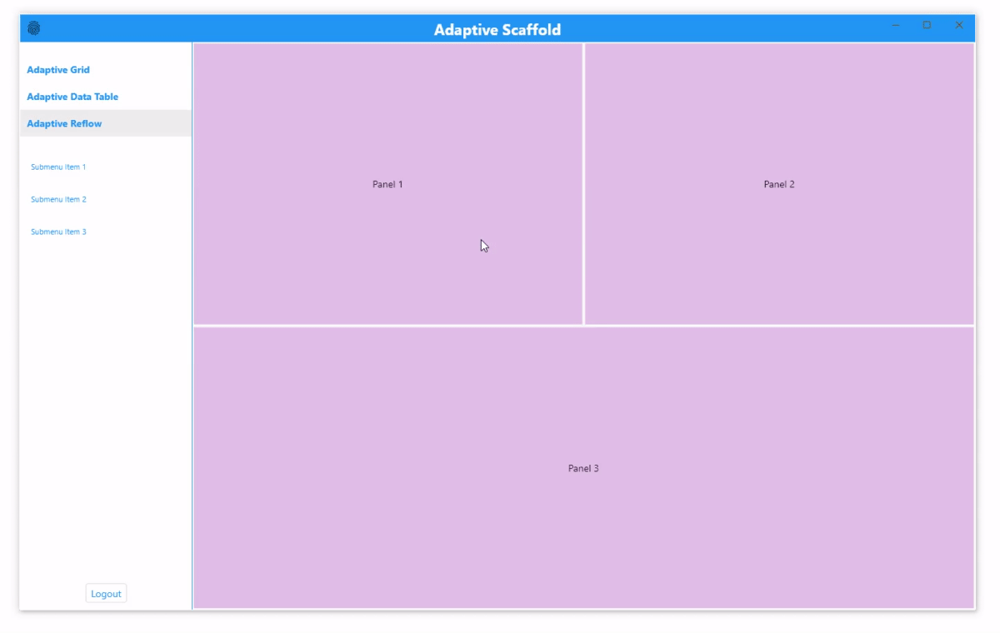


Özel bir görsel yoğunluk ayarlamak için, yoğunluğu `MaterialApp` temanıza enjekte edin:

```dart
double densityAmt = touchMode ? 0.0 : -1.0;
VisualDensity density = VisualDensity(
  horizontal: densityAmt,
  vertical: densityAmt,
);
return MaterialApp(
  theme: ThemeData(visualDensity: density),
  home: MainAppScaffold(),
  debugShowCheckedModeBanner: false,
);
```

`VisualDensity`'yi kendi görünümleriniz içinde kullanmak için arayabilirsiniz:

```dart
VisualDensity density = Theme.of(context).visualDensity;
```

Konteyner (container) yalnızca yoğunluktaki değişikliklere otomatik olarak tepki vermekle kalmaz, aynı zamanda değiştiğinde animasyon da yapar. Bu, uygulama genelinde yumuşak bir geçiş efekti için özel bileşenlerinizi yerleşik bileşenlerle birlikte birbirine bağlar.

Gösterildiği gibi, `VisualDensity` birimsizdir, bu nedenle farklı görünümler için farklı şeyler ifade edebilir. Aşağıdaki örnekte, 1 yoğunluk birimi 6 piksele eşittir, ancak buna karar vermek tamamen size kalmıştır. Birimsiz olması onu oldukça çok yönlü kılar ve çoğu bağlamda çalışmalıdır.

Material'ın genellikle her görsel yoğunluk birimi için yaklaşık 4 mantıksal piksel değeri kullandığını belirtmekte fayda var. Desteklenen bileşenler hakkında daha fazla bilgi için `VisualDensity` API'sine bakın. Genel olarak yoğunluk ilkeleri hakkında daha fazla bilgi için **Material Tasarım kılavuzuna** bakın.


# Yetenekler ve Politikalar (Capabilities & policies)

Uygulamanızı platform, uygulama mağazası, şirketiniz vb. tarafından gerektirilen yeteneklere ve politikalara nasıl uyarlayacağınızı öğrenin.

Çoğu gerçek dünya uygulaması, farklı cihazların ve platformların yeteneklerine ve politikalarına uyum sağlama ihtiyacı duyar. Bu sayfa, kodunuzda bu senaryoların nasıl ele alınacağına dair tavsiyeler içerir.

## Her cihaz türünün güçlü yönlerine göre tasarlayın

Farklı cihazların benzersiz güçlü ve zayıf yönlerini göz önünde bulundurun. Dokunmatik ekran, fare, klavye gibi ekran boyutu ve giriş yöntemlerinin ötesinde, yararlanabileceğiniz başka hangi benzersiz yetenekler var? Flutter, kodunuzun farklı cihazlarda **çalışmasını** sağlar, ancak güçlü tasarım sadece kodun çalışmasından ibaret değildir. Her platformun en iyi neyi yaptığını düşünün ve yararlanabileceğiniz benzersiz yetenekler olup olmadığına bakın.

Örneğin: Apple'ın App Store'u ve Google'ın Play Store'u, uygulamaların uyması gereken farklı kurallara sahiptir. Farklı barındırıcı (host) işletim sistemleri, hem zaman içinde hem de birbirlerine kıyasla farklı yeteneklere sahiptir.

Başka bir örnek, web'in paylaşım için son derece düşük engelinden yararlanmaktır. Bir web uygulaması dağıtıyorsanız, hangi derin bağlantıları (deep links) destekleyeceğinize karar verin ve gezinme rotalarını bunları göz önünde bulundurarak tasarlayın.

Flutter'ın bu benzersiz yeteneklere dayalı farklı davranışları ele almak için önerdiği model, uygulamanız için bir dizi **Yetenek** (Capability) ve **Politika** (Policy) sınıfı oluşturmaktır.

### Yetenekler (Capabilities)

Bir **yetenek**, kodun veya cihazın ne **yapabileceğini** tanımlar. Yetenek örnekleri şunlardır:

* Bir API'nin varlığı
* İşletim sistemi tarafından uygulanan kısıtlamalar
* Fiziksel donanım gereksinimleri (kamera gibi)

### Politikalar (Policies)

Bir **politika**, kodun ne **yapması gerektiğini** tanımlar.
Politika örnekleri şunlardır:

* Uygulama mağazası yönergeleri
* Tasarım tercihleri
* Barındırıcı cihaza atıfta bulunan varlıklar veya metinler
* Sunucu tarafında etkinleştirilen özellikler

## Politika kodu nasıl yapılandırılır

En basit mekanik yol `Platform.isAndroid`, `Platform.isIOS` ve `kIsWeb` kullanmaktır. Bu API'ler mekanik olarak kodun nerede çalıştığını size bildirir ancak uygulama çalışabileceği yerleri genişlettikçe ve barındırıcı platformlar işlevsellik ekledikçe bazı sorunlar yaratır.

Aşağıdaki yönergeler, uygulamanız için yetenekleri ve politikaları geliştirirken en iyi uygulamaları açıklar:

* Düzen kararları vermek veya bir cihazın neler yapabileceği hakkında varsayımlarda bulunmak için `Platform.isAndroid` ve benzeri işlevleri kullanmaktan kaçının.
* Bunun yerine, neye göre dallanmak (branch) istediğinizi bir yöntem içinde tanımlayın.

Örnek: Uygulamanızın bir web sitesinde bir şeyler satın almak için bir bağlantısı var, ancak politika nedenleriyle bu bağlantıyı iOS cihazlarda göstermek istemiyorsunuz.

```dart
bool shouldAllowPurchaseClick() {
  // Banned by Apple App Store guidelines.
  return !Platform.isIOS;
}

...
TextSpan(
  text: 'Buy in browser',
  style: new TextStyle(color: Colors.blue),
  recognizer: shouldAllowPurchaseClick ? TapGestureRecognizer()
    ..onTap = () { launch('<some url>') : null;
  } : null,

```

Ek bir dolaylılık katmanı (layer of indirection) ekleyerek ne elde ettiniz? Kod, dallanmış yolun neden var olduğunu daha net hale getirir. Bu yöntem doğrudan sınıfta bulunabilir, ancak kodun diğer bölümlerinin de aynı kontrole ihtiyaç duyması muhtemeldir. Eğer öyleyse, kodu bir sınıfa koyun.

`policy.dart`

```dart
class Policy {

  bool shouldAllowPurchaseClick() {
    // Banned by Apple App Store guidelines.
    return !Platform.isIOS;
  }
}
```

Bu kod bir sınıfta olduğunda, herhangi bir widget testi `Policy().shouldAllowPurchaseClick`'i taklit edebilir (mock) ve cihazın nerede çalıştığından bağımsız olarak davranışı doğrulayabilir. Bu aynı zamanda daha sonra, web üzerinden satın almanın Android kullanıcıları için doğru akış olmadığına karar verirseniz, uygulamayı değiştirebileceğiniz ve tıklanabilir metin testlerinin değişmesine gerek kalmayacağı anlamına gelir.

## Yetenekler

Bazen kodunuzun bir şey yapmasını istersiniz ancak API mevcut değildir veya belki de desteklediğiniz tüm platformlarda henüz uygulanmamış bir eklenti özelliğine bağımlısınızdır. Bu, cihazın ne **yapabileceğinin** bir sınırlamasıdır.

Bu durumlar yukarıda açıklanan politika kararlarına benzerdir, ancak bunlara **yetenekler** denir. Sınıfların yapısı benzerken neden politika sınıflarını yeteneklerden ayıralım? Flutter ekibi, üretim aşamasındaki uygulamalarda, uygulamaların ne **yapabileceği** ile ne **yapması gerektiği** arasında mantıksal bir ayrım yapmanın; büyük ürünlerin, ilk kod yazıldıktan sonra platformların yapabilecekleri veya gerektirebilecekleri değişikliklere (kendi tercihlerinizin yanı sıra) yanıt vermesine yardımcı olduğunu bulmuştur.

Örneğin, bir platformun kodunuz hassas bir API çağırmadan önce kullanıcıların bir sistem iletişim kutusuyla etkileşime girmesini gerektiren yeni bir izin eklediği durumu düşünün. Ekibiniz platform 1 için çalışmayı yapar ve `requirePermissionDialogFlow` (izin iletişim kutusu akışı gerektir) adında bir yetenek oluşturur. Daha sonra, eğer platform 2 benzer bir gereksinimi sadece yeni API sürümleri için eklerse, o zaman `requirePermissionDialogFlow` uygulaması artık API seviyesini kontrol edebilir ve platform 2 için `true` döndürebilir. Zaten yaptığınız işten yararlanmış olursunuz.

## Politikalar

Başlangıçta çok fazla politikaya dayalı karar vermeyecekmişsiniz gibi görünse bile, başlangıçta bir `Policy` sınıfı ile başlamanızı öneririz. Sınıfın karmaşıklığı arttıkça veya girdi sayısı genişledikçe, politika sınıfını özelliğe veya başka kriterlere göre bölmeye karar verebilirsiniz.

Politika uygulaması için derleme zamanı (compile time), çalışma zamanı (run time) veya Uzaktan Yordam Çağrısı (RPC) destekli uygulamalar kullanabilirsiniz.

* **Derleme zamanı** politika kontrolleri, tercihin değişme ihtimalinin düşük olduğu ve değerin yanlışlıkla değiştirilmesinin büyük sonuçlar doğurabileceği platformlar için iyidir. Örneğin, bir platformun Play Store'a bağlantı vermemenizi gerektirmesi veya uygulamanızın içeriği göz önüne alındığında belirli bir ödeme sağlayıcısını kullanmanızı gerektirmesi gibi.
* **Çalışma zamanı** kontrolleri, kullanıcının kullanabileceği bir dokunmatik ekran olup olmadığını belirlemek için iyi olabilir. Android'in kontrol edebileceğiniz bir özelliği vardır ve web uygulamanız maksimum dokunma noktalarını kontrol edebilir.
* **RPC destekli** politika değişiklikleri, aşamalı özellik sunumu veya daha sonra değişebilecek kararlar için iyidir.

## Özet

* Kodun ne **yapabileceğini** tanımlamak için bir **Yetenek** (Capability) sınıfı kullanın. Bir API'nin varlığını, işletim sistemi tarafından uygulanan kısıtlamaları ve fiziksel donanım gereksinimlerini (kamera gibi) kontrol edebilirsiniz. Bir yetenek genellikle derleme veya çalışma zamanı kontrollerini içerir.
* Kodun App Store yönergelerine, tasarım tercihlerine ve barındırıcı cihaza atıfta bulunması gereken varlık veya metinlere uymak için ne **yapması gerektiğini** tanımlamak üzere bir **Politika** (Policy) sınıfı (veya karmaşıklığa bağlı olarak sınıflar) kullanın. Politikalar; derleme, çalışma zamanı veya RPC kontrollerinin bir karışımı olabilir.
* Dallanan kodu, yetenekleri ve politikaları taklit ederek (mocking) test edin, böylece yetenekler veya politikalar değiştiğinde widget testlerinin değişmesi gerekmez.
* Yetenekler ve politikalar sınıflarınızdaki yöntemleri, cihaz türüne göre değil, neyi dallandırmaya çalıştıklarına göre adlandırın.


# Otomatik platform uyarlamaları

Flutter'ın platforma uyarlanabilirliği hakkında daha fazla bilgi edinin.

## Uyarlama felsefesi

Genel olarak, iki platform uyarlanabilirliği durumu mevcuttur:

1.  İşletim sistemi ortamının davranışları olan (metin düzenleme ve kaydırma gibi) ve farklı bir davranış gerçekleşseydi 'yanlış' olacak şeyler.
2.  Uygulamalarda geleneksel olarak OEM SDK'leri kullanılarak uygulanan şeyler (iOS'te paralel sekmeler kullanmak veya Android'de bir `android.app.AlertDialog` göstermek gibi).

Bu makale esas olarak Android ve iOS'te 1. durumdaki Flutter tarafından sağlanan otomatik uyarlamaları kapsar.

2. durum için Flutter, platform kurallarının uygun etkilerini üretmek için araçları bir araya getirir ancak uygulama tasarım seçimleri gerektiğinde otomatik olarak uyum sağlamaz. Bir tartışma için, sorun #8410'a ve Material/Cupertino uyarlanabilir widget sorun tanımına bakın.

Android ve iOS'te farklı bilgi mimarisi yapıları kullanan ancak aynı içerik kodunu paylaşan bir uygulama örneği için, `platform_design` kod örneklerine bakın.

2. durumu ele alan ön kılavuzlar UI bileşenleri bölümüne eklenmektedir. Sorun #8427'ye yorum yaparak ek kılavuzlar talep edebilirsiniz.

## Sayfa gezintisi

Flutter, Android ve iOS'te görülen gezinme modellerini sağlar ve ayrıca gezinme animasyonunu otomatik olarak mevcut platforma uyarlar.

[Flutter sayfa gezinme geçiş diyagramı görseli Android ve iOS karşılaştırması]

### Gezinme geçişleri

* **Android'de:** Varsayılan `Navigator.push()` geçişi, genellikle aşağıdan yukarıya bir animasyon varyantına sahip olan `startActivity()` sonrasında modellenmiştir.
* **iOS'te:**
    * Varsayılan `Navigator.push()` API'si, yerel ayarın RTL (sağdan sola) ayarına bağlı olarak sondan başa doğru canlanan bir iOS Göster/İt (Show/Push) tarzı geçiş üretir. Yeni rotanın arkasındaki sayfa da iOS'te olduğu gibi aynı yönde paralaks kayması yapar.
    * `PageRoute.fullscreenDialog` değerinin true olduğu bir sayfa rotası itildiğinde (push) ayrı bir aşağıdan yukarıya geçiş stili mevcuttur. Bu, iOS'in Sunum/Modal (Present/Modal) tarzı geçişini temsil eder ve genellikle tam ekran modal sayfalarda kullanılır.

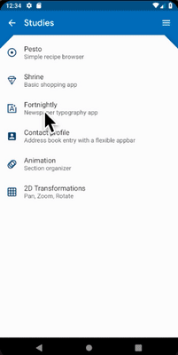  &nbsp;
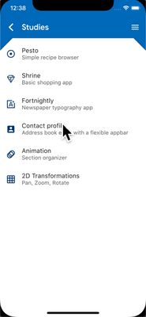 &nbsp;
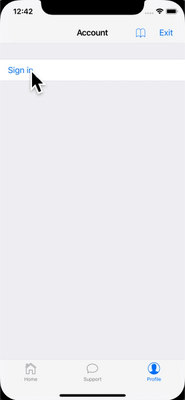

&nbsp; [Android sayfa geçişi] &nbsp; &nbsp;&nbsp;
[iOS itme (push) geçişi] &nbsp;&nbsp;&nbsp;&nbsp;&nbsp;
[iOS sunum geçişi]

### Platforma özgü geçiş ayrıntıları

* **Android'de:** Flutter, `ZoomPageTransitionsBuilder` animasyonunu kullanır. Kullanıcı bir öğeye dokunduğunda, arayüz o öğeyi içeren bir ekrana yakınlaşır (zoom in). Kullanıcı geri gitmek için dokunduğunda, arayüz önceki ekrana uzaklaşır (zoom out).
* **iOS'te:** İtme (push) tarzı geçiş kullanıldığında, Flutter'ın paketlenmiş `CupertinoNavigationBar` ve `CupertinoSliverNavigationBar` gezinme çubukları, her alt bileşeni bir sonraki veya önceki sayfanın `CupertinoNavigationBar` veya `CupertinoSliverNavigationBar` üzerindeki karşılık gelen alt bileşenine otomatik olarak canlandırır.

  &nbsp; &nbsp;&nbsp;&nbsp;&nbsp;&nbsp;&nbsp;&nbsp;&nbsp;&nbsp;
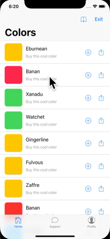  &nbsp;

&nbsp;&nbsp;[Android görseli] &nbsp;&nbsp;&nbsp;&nbsp;&nbsp;&nbsp;&nbsp;&nbsp;&nbsp;&nbsp;&nbsp;&nbsp;&nbsp;&nbsp;&nbsp;&nbsp;&nbsp;&nbsp;&nbsp;&nbsp;&nbsp;
[iOS Gezinme Çubuğu]

### Geri gezinme

* **Android'de:** İşletim sistemi geri düğmesi varsayılan olarak Flutter'a gönderilir ve `WidgetsApp`'in Navigator'ının en üst rotasını çıkarır (pop).
* **iOS'te:** En üst rotayı çıkarmak için bir kenar kaydırma hareketi (edge swipe gesture) kullanılabilir.

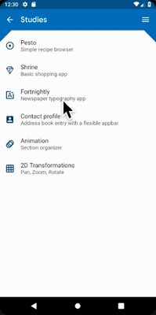  &nbsp; &nbsp;&nbsp;&nbsp;&nbsp;&nbsp;&nbsp;&nbsp;
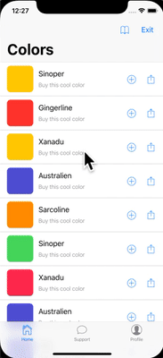  


&nbsp;[Android geri düğmesi ]&nbsp;&nbsp;&nbsp;&nbsp;&nbsp;&nbsp;
[iOS geri kaydırma hareketi]

## Kaydırma

Kaydırma, platformun görünüm ve hissinin önemli bir parçasıdır ve Flutter, kaydırma davranışını otomatik olarak mevcut platformla eşleşecek şekilde ayarlar.

[Flutter kaydırma fiziği ve aşırı kaydırma davranışı görseli Android ve iOS karşılaştırması]

### Fizik simülasyonu

Android ve iOS'in her ikisi de sözlü olarak tanımlanması zor olan karmaşık kaydırma fiziği simülasyonlarına sahiptir. Genel olarak, iOS'in kaydırılabilir öğesi daha fazla ağırlığa ve dinamik sürtünmeye sahiptir, ancak Android daha fazla statik sürtünmeye sahiptir. Bu nedenle iOS yüksek hızı daha kademeli olarak kazanır ancak daha az ani durur ve yavaş hızlarda daha kaygandır.

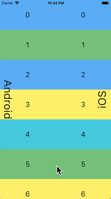  &nbsp;&nbsp;&nbsp;&nbsp;&nbsp;&nbsp;&nbsp;&nbsp;&nbsp;&nbsp;&nbsp;&nbsp;&nbsp;&nbsp;&nbsp;&nbsp;&nbsp;
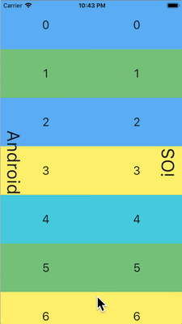  &nbsp;&nbsp;&nbsp;&nbsp;&nbsp;&nbsp;&nbsp;&nbsp;&nbsp;&nbsp;
  

[Yumuşak fırlatma karşılaştırması] &nbsp;
[Orta fırlatma karşılaştırması]&nbsp;&nbsp;
[Güçlü fırlatma karşılaştırması]

### Aşırı kaydırma davranışı

* **Android'de:** Kaydırılabilir bir alanın kenarını geçmek, bir aşırı kaydırma parıltı göstergesi (mevcut Material temasının rengine dayalı) gösterir.
* **iOS'te:** Kaydırılabilir bir alanın kenarını geçmek artan dirençle aşırı kaydırma yapar ve geri yaslanır (snaps back).

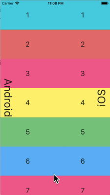  &nbsp;&nbsp;&nbsp;&nbsp;&nbsp;&nbsp;
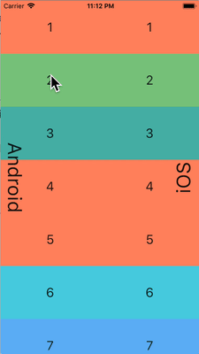  

[Dinamik aşırı kaydırma]&nbsp;&nbsp;&nbsp;&nbsp;&nbsp;&nbsp;&nbsp;&nbsp;
[Statik aşırı kaydırma]

### Kaydırma çubukları

* **Material tabanlı platformlarda (Android ve web gibi):** Kaydırma çubukları tipik olarak kaydırma sırasında görünürdür ve platforma ve temaya bağlı olarak görünür kalabilir.
* **Cupertino tabanlı platformlarda (iOS gibi):** Kaydırma çubukları daha minimaldir ve genellikle yalnızca kullanıcı aktif olarak kaydırma yaparken kısa bir süre görünür ve etkileşim durduğunda kaybolur.

Bu fark, her platformun görsel kurallarını yansıtır ve cihazlar arasında yerel bir görünüm ve hissin korunmasına yardımcı olur.

### Momentum

* **iOS'te:** Aynı yöndeki tekrarlanan fırlatmalar momentumu yığar ve birbirini izleyen her fırlatma ile daha fazla hız oluşturur. Android'de eşdeğer bir davranış yoktur.

&nbsp;&nbsp;&nbsp;&nbsp;&nbsp;&nbsp;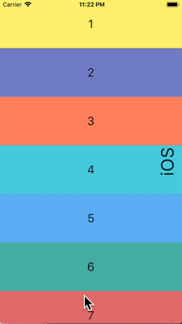  

[iOS kaydırma momentumu görseli]

### Başa dön

* **iOS'te:** İşletim sistemi durum çubuğuna dokunmak, birincil kaydırma denetleyicisini en üst konuma kaydırır. Android'de eşdeğer bir davranış yoktur.

&nbsp;&nbsp;&nbsp;&nbsp;&nbsp;&nbsp;&nbsp;&nbsp;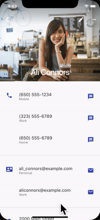  

[iOS durum çubuğu tepeye dokunma]

## Tipografi

* **Material paketi** kullanıldığında, tipografi otomatik olarak platform için uygun yazı tipi ailesine varsayılan olarak ayarlanır. Android **Roboto** yazı tipini kullanır. iOS **San Francisco** yazı tipini kullanır.
* **Cupertino paketi** kullanıldığında, varsayılan tema **San Francisco** yazı tipini kullanır.

San Francisco yazı tipi lisansı, kullanımını yalnızca iOS, macOS veya tvOS üzerinde çalışan yazılımlarla sınırlar. Bu nedenle, platform hata ayıklama (debug) amacıyla iOS olarak geçersiz kılınmışsa veya varsayılan Cupertino teması kullanılıyorsa, Android üzerinde çalışırken bir yedek yazı tipi kullanılır.

Material widget'larının metin stilini iOS'teki varsayılan metin stiliyle eşleşecek şekilde uyarlamayı seçebilirsiniz. UI Bileşeni bölümünde widget'a özgü örnekleri görebilirsiniz.

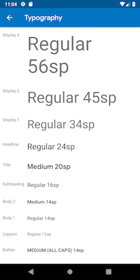  &nbsp;&nbsp;&nbsp;&nbsp;&nbsp;&nbsp;&nbsp;&nbsp;
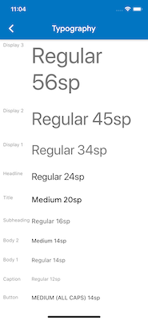  

&nbsp;&nbsp;[Android'de Roboto]&nbsp;&nbsp;&nbsp;&nbsp;&nbsp;&nbsp;&nbsp;&nbsp;&nbsp;&nbsp;&nbsp;&nbsp;&nbsp;&nbsp;&nbsp;&nbsp;
[iOS'te San Francisco]

## İkonografi

Material paketi kullanıldığında, belirli simgeler platforma bağlı olarak otomatik olarak farklı grafikler gösterir. Örneğin, taşma (overflow) düğmesinin üç noktası iOS'te yatay ve Android'de dikeydir. Geri düğmesi iOS'te basit bir köşeli ayraçtır (chevron) ve Android'de bir gövdeye/şafta sahiptir.


Material kütüphanesi ayrıca `Icons.adaptive` aracılığıyla bir dizi platforma uyarlanabilir simge sağlar.

## Dokunsal geribildirim

Material ve Cupertino paketleri, belirli senaryolarda platforma uygun dokunsal geri bildirimi otomatik olarak tetikler.

* Örneğin, metin alanı uzun basma yoluyla bir kelime seçimi Android'de bir 'vıziltı' titreşimi tetiklerken iOS'te tetiklemez.
* iOS'te seçici (picker) öğeleri arasında gezinmek 'hafif bir çarpma' vuruşu tetikler ve Android'de geri bildirim yoktur.

## Metin düzenleme

Hem Material hem de Cupertino Metin Giriş alanları yazım denetimini destekler ve platform için uygun yazım denetimi yapılandırmasını ve uygun yazım denetimi menüsünü ve vurgu renklerini kullanacak şekilde uyarlanır.
Flutter ayrıca metin alanlarının içeriğini düzenlerken mevcut platformla eşleşmesi için aşağıdaki uyarlamaları yapar.

[Flutter metin seçim araç çubuğu ve tutamaçları görseli Android ve iOS karşılaştırması]

### Klavye hareketiyle gezinme

* **Android'de:** Material ve Cupertino metin alanlarında imleci hareket ettirmek için sanal klavyenin boşluk tuşu üzerinde yatay kaydırmalar yapılabilir.
* **iOS'te:** 3D Touch özelliklerine sahip cihazlarda, imleci yüzen bir imleç aracılığıyla 2D olarak hareket ettirmek için sanal klavye üzerinde bir kuvvetli bas-sürükle hareketi yapılabilir. Bu hem Material hem de Cupertino metin alanlarında çalışır.

&nbsp;&nbsp;&nbsp;&nbsp;&nbsp;&nbsp;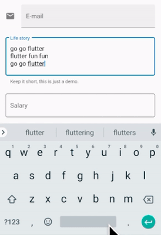  &nbsp;&nbsp;&nbsp;&nbsp;&nbsp;&nbsp;&nbsp;&nbsp;&nbsp;&nbsp;&nbsp;&nbsp;&nbsp;&nbsp;&nbsp;&nbsp;&nbsp;&nbsp;&nbsp;&nbsp;&nbsp;&nbsp;&nbsp;&nbsp;
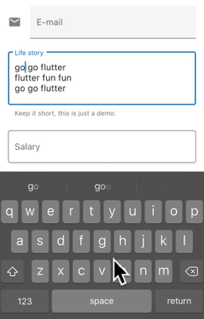  

[Android boşluk tuşu imleç hareketi]&nbsp;&nbsp;
[iOS 3D Touch sürükle imleç hareketi]

### Metin seçim araç çubuğu

* **Android'de Material ile:** Bir metin alanında metin seçimi yapıldığında Android tarzı seçim araç çubuğu gösterilir.
* **iOS'te Material ile veya Cupertino kullanırken:** Bir metin alanında metin seçimi yapıldığında iOS tarzı seçim araç çubuğu gösterilir.


&nbsp;&nbsp;&nbsp;&nbsp;&nbsp;&nbsp;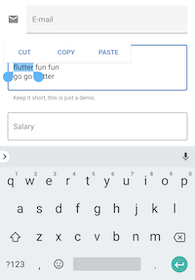  &nbsp;&nbsp;&nbsp;&nbsp;&nbsp;&nbsp;&nbsp;&nbsp;&nbsp;&nbsp;&nbsp;&nbsp;&nbsp;&nbsp;&nbsp;&nbsp;&nbsp;&nbsp;&nbsp;&nbsp;
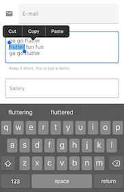  

[Android metin seçim araç çubuğu]&nbsp;&nbsp;&nbsp;&nbsp;&nbsp;&nbsp;
[iOS metin seçim araç çubuğu]

### Tek dokunma hareketi

* **Android'de Material ile:** Bir metin alanına tek dokunuş imleci dokunulan konuma yerleştirir. Daraltılmış bir metin seçimi ayrıca imleci daha sonra hareket ettirmek için sürüklenebilir bir tutamaç gösterir.
* **iOS'te Material ile veya Cupertino kullanırken:** Bir metin alanına tek dokunuş imleci dokunulan kelimenin en yakın kenarına yerleştirir. Daraltılmış metin seçimleri iOS'te sürüklenebilir tutamaçlara sahip değildir.

&nbsp;&nbsp;&nbsp;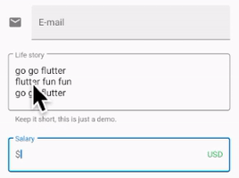  &nbsp;&nbsp;&nbsp;&nbsp;&nbsp;&nbsp;&nbsp;&nbsp;&nbsp;&nbsp;&nbsp;
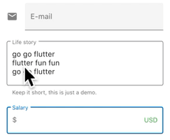  

&nbsp;&nbsp;&nbsp;&nbsp;&nbsp;&nbsp;[Android dokunma] &nbsp;&nbsp;&nbsp;&nbsp;&nbsp;&nbsp;&nbsp;&nbsp;&nbsp;&nbsp;&nbsp;&nbsp;&nbsp;&nbsp;&nbsp;&nbsp;&nbsp;&nbsp;&nbsp;&nbsp;&nbsp;&nbsp;
[iOS dokunma]

### Uzun basma hareketi

* **Android'de Material ile:** Uzun basma, uzun basılan kelimeyi seçer. Bırakıldığında seçim araç çubuğu gösterilir.
* **iOS'te Material ile veya Cupertino kullanırken:** Uzun basma imleci uzun basılan konuma yerleştirir. Bırakıldığında seçim araç çubuğu gösterilir.

&nbsp;&nbsp;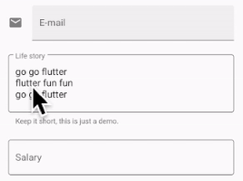  &nbsp;&nbsp; &nbsp;&nbsp;&nbsp;&nbsp;&nbsp;&nbsp;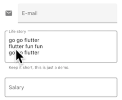  

&nbsp;&nbsp;&nbsp;&nbsp;[Android uzun basma] &nbsp;&nbsp;&nbsp;&nbsp;&nbsp;&nbsp;&nbsp;&nbsp;&nbsp;&nbsp;&nbsp;&nbsp;&nbsp;&nbsp;&nbsp;
[iOS uzun basma]

### Uzun basıp sürükleme hareketi

* **Android'de Material ile:** Uzun basarken sürüklemek seçilen kelimeleri genişletir.
* **iOS'te Material ile veya Cupertino kullanırken:** Uzun basarken sürüklemek imleci hareket ettirir.

&nbsp;&nbsp;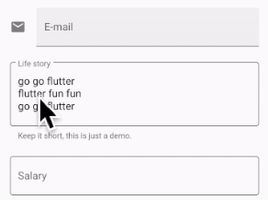  &nbsp;&nbsp; &nbsp;&nbsp;&nbsp;&nbsp;&nbsp;&nbsp;&nbsp;&nbsp;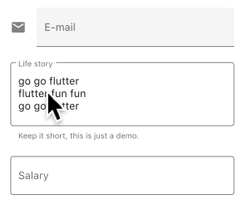  

[Android uzun basıp sürükleme]
[iOS uzun basıp sürükleme]

### Çift dokunma hareketi

* **Hem Android hem de iOS'te:** Çift dokunma, çift dokunulan kelimeyi seçer ve seçim araç çubuğunu gösterir.

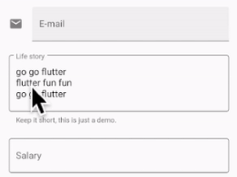  &nbsp;&nbsp; &nbsp;&nbsp;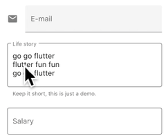  
  &nbsp;&nbsp; &nbsp;&nbsp;


[Android çift dokunma]&nbsp;&nbsp;&nbsp;&nbsp;&nbsp;&nbsp;&nbsp;&nbsp;&nbsp;
[iOS çift dokunma]

## UI bileşenleri

Bu bölüm, iOS'te doğal ve ilgi çekici bir deneyim sunmak için Material widget'larının nasıl uyarlanacağına dair ön önerileri içerir. Geri bildiriminiz sorun #8427'de memnuniyetle karşılanır.

### .adaptive() kurucularına sahip widget'lar

Çeşitli widget'lar `.adaptive()` kurucularını destekler. Aşağıdaki tablo bu widget'ları listeler. Uyarlanabilir kurucular, uygulama bir iOS cihazında çalıştırıldığında ilgili Cupertino bileşenlerini ikame eder.

Aşağıdaki tablodaki widget'lar öncelikle giriş, seçim ve sistem bilgilerini görüntülemek için kullanılır. Bu kontroller işletim sistemiyle sıkı bir şekilde entegre olduğundan, kullanıcılar bunları tanımak ve bunlara yanıt vermek üzere eğitilmiştir. Bu nedenle, platform kurallarına uymanızı öneririz.

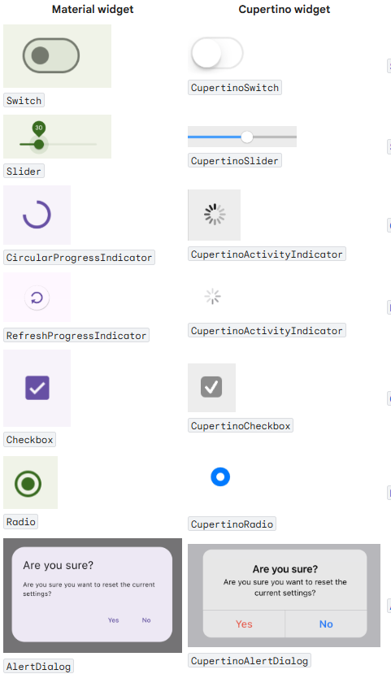  


| Material widget | Cupertino widget | Adaptive constructor |
| :--- | :--- | :--- |
| Switch | CupertinoSwitch | `Switch.adaptive()` |
| Slider | CupertinoSlider | `Slider.adaptive()` |
| CircularProgressIndicator | CupertinoActivityIndicator | `CircularProgressIndicator.adaptive()` |
| RefreshProgressIndicator | CupertinoActivityIndicator | `RefreshIndicator.adaptive()` |
| Checkbox | CupertinoCheckbox | `Checkbox.adaptive()` |
| Radio | CupertinoRadio | `Radio.adaptive()` |
| AlertDialog | CupertinoAlertDialog | `AlertDialog.adaptive()` |

### Üst uygulama çubuğu ve gezinme çubuğu

Android 12'den bu yana, üst uygulama çubukları için varsayılan UI, Material 3'te tanımlanan tasarım yönergelerini izler. iOS'te, Apple'ın İnsan Arayüzü Yönergeleri'nde (HIG) "Gezinme Çubukları" (Navigation Bars) adı verilen eşdeğer bir bileşen tanımlanmıştır.

&nbsp;&nbsp;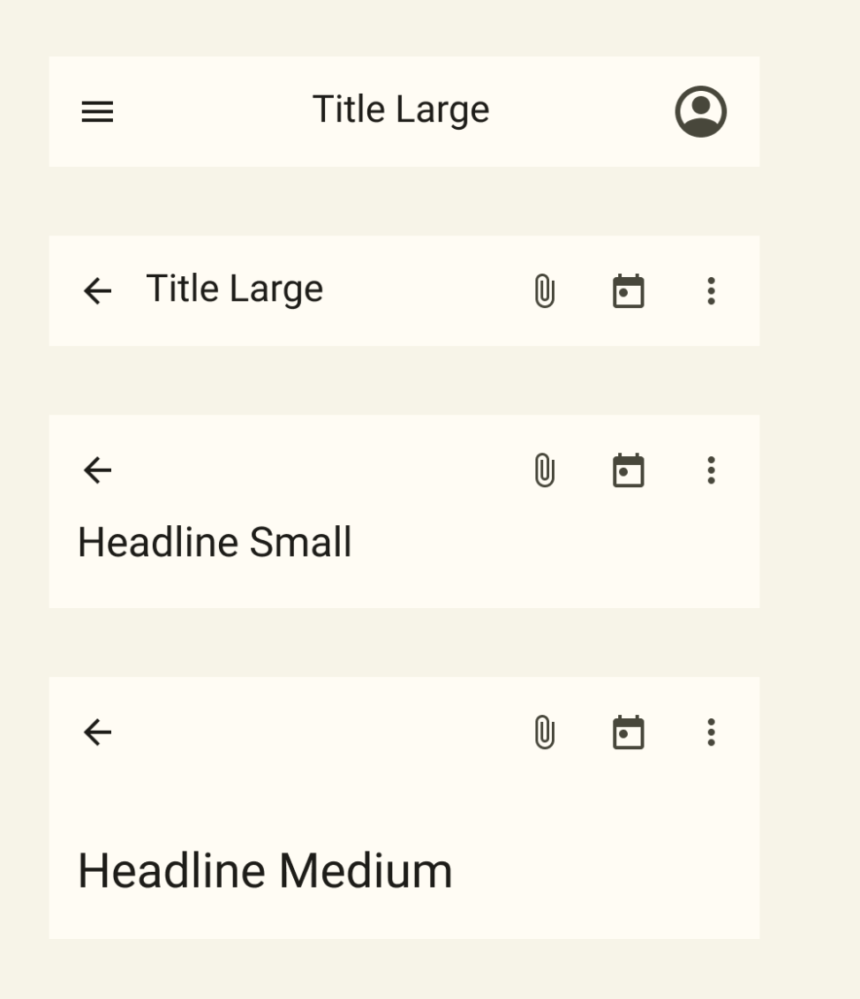  &nbsp;&nbsp;&nbsp;&nbsp;&nbsp;&nbsp;&nbsp;&nbsp;&nbsp;&nbsp;&nbsp;&nbsp;&nbsp;&nbsp;&nbsp;&nbsp;&nbsp;&nbsp;
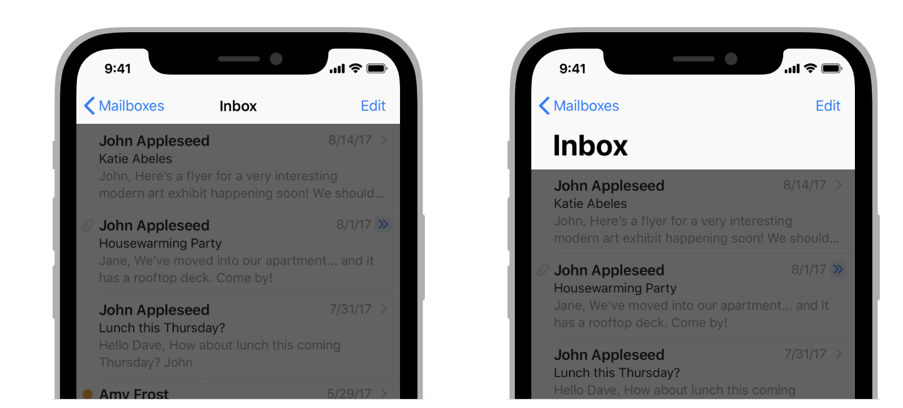  

[Material 3'te Üst Uygulama Çubuğu]&nbsp;&nbsp;
[İnsan Arayüzü Yönergeleri'nde Gezinme Çubuğu]

Flutter uygulamalarındaki uygulama çubuklarının belirli özellikleri, sistem simgeleri ve sayfa geçişleri gibi uyarlanmalıdır. Bunlar, Material `AppBar` ve `SliverAppBar` widget'ları kullanıldığında zaten otomatik olarak uyarlanır. Ayrıca, aşağıda gösterildiği gibi iOS platform stilleriyle daha iyi eşleşmesi için bu widget'ların özelliklerini daha da özelleştirebilirsiniz.

```dart
// Map the text theme to iOS styles
TextTheme cupertinoTextTheme = TextTheme(
    headlineMedium: CupertinoThemeData()
        .textTheme
        .navLargeTitleTextStyle
         // fixes a small bug with spacing
        .copyWith(letterSpacing: -1.5),
    titleLarge: CupertinoThemeData().textTheme.navTitleTextStyle)
...

// Use iOS text theme on iOS devices
ThemeData(
      textTheme: Platform.isIOS ? cupertinoTextTheme : null,
      ...
)
...

// Modify AppBar properties
AppBar(
        surfaceTintColor: Platform.isIOS ? Colors.transparent : null,
        shadowColor: Platform.isIOS ? CupertinoColors.darkBackgroundGray : null,
        scrolledUnderElevation: Platform.isIOS ? .1 : null,
        toolbarHeight: Platform.isIOS ? 44 : null,
        ...
      ),
```

Ancak, uygulama çubukları sayfanızdaki diğer içeriklerle birlikte görüntülendiğinden, stilin yalnızca uygulamanızın geri kalanıyla uyumlu olduğu sürece uyarlanması önerilir. Uygulama çubuğu uyarlamaları hakkındaki GitHub tartışmasında ek kod örnekleri ve daha fazla açıklama görebilirsiniz.

### Alt gezinme çubukları

Android 12'den bu yana, alt gezinme çubukları için varsayılan UI, Material 3'te tanımlanan tasarım yönergelerini izler. iOS'te, Apple'ın İnsan Arayüzü Yönergeleri'nde (HIG) "Sekme Çubukları" (Tab Bars) adı verilen eşdeğer bir bileşen tanımlanmıştır.

&nbsp;&nbsp;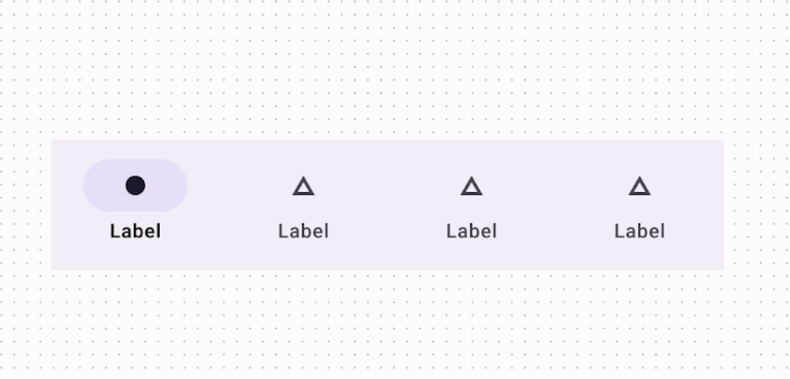  &nbsp;&nbsp;&nbsp;&nbsp;&nbsp;&nbsp;&nbsp;&nbsp;&nbsp;&nbsp;&nbsp;&nbsp;&nbsp;&nbsp;&nbsp;
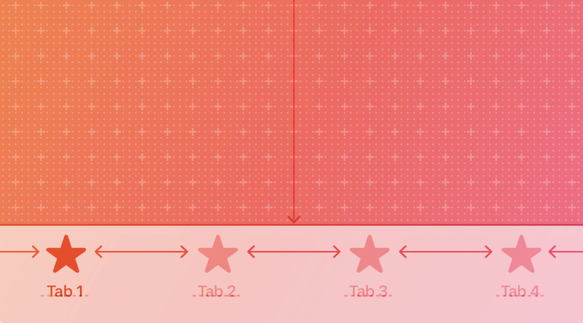  


[Material 3'te Alt Gezinme Çubuğu]&nbsp;&nbsp;&nbsp;&nbsp;&nbsp;&nbsp;
[İnsan Arayüzü Yönergeleri'nde Sekme Çubuğu]

Sekme çubukları uygulamanızda kalıcı olduğundan, kendi markanızla eşleşmelidir. Ancak, Android'de Material'ın varsayılan stilini kullanmayı seçerseniz, varsayılan iOS sekme çubuklarına uyarlamayı düşünebilirsiniz.

Platforma özgü alt gezinme çubukları uygulamak için, Android'de Flutter'ın `NavigationBar` widget'ını ve iOS'te `CupertinoTabBar` widget'ını kullanabilirsiniz. Aşağıda, platforma özgü bir gezinme çubuğu göstermek için uyarlayabileceğiniz bir kod parçacığı bulunmaktadır.

```dart
final Map<String, Icon> _navigationItems = {
    'Menu': Platform.isIOS ? Icon(CupertinoIcons.house_fill) : Icon(Icons.home),
    'Order': Icon(Icons.adaptive.share),
  };

...

Scaffold(
  body: _currentWidget,
  bottomNavigationBar: Platform.isIOS
          ? CupertinoTabBar(
              currentIndex: _currentIndex,
              onTap: (index) {
                setState(() => _currentIndex = index);
                _loadScreen();
              },
              items: _navigationItems.entries
                  .map<BottomNavigationBarItem>(
                      (entry) => BottomNavigationBarItem(
                            icon: entry.value,
                            label: entry.key,
                          ))
                  .toList(),
            )
          : NavigationBar(
              selectedIndex: _currentIndex,
              onDestinationSelected: (index) {
                setState(() => _currentIndex = index);
                _loadScreen();
              },
              destinations: _navigationItems.entries
                  .map<Widget>((entry) => NavigationDestination(
                        icon: entry.value,
                        label: entry.key,
                      ))
                  .toList(),
            ));
```

### Metin alanları

Android 12'den bu yana, metin alanları Material 3 (M3) tasarım yönergelerini izler. iOS'te, Apple'ın İnsan Arayüzü Yönergeleri (HIG) eşdeğer bir bileşen tanımlar.

&nbsp;&nbsp;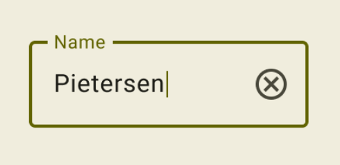  &nbsp;&nbsp;&nbsp;&nbsp;&nbsp;&nbsp;
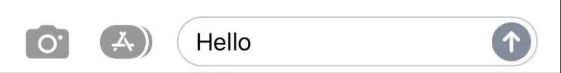  

[Material 3'te Metin Alanı] &nbsp;&nbsp;&nbsp;&nbsp;&nbsp;&nbsp;&nbsp;&nbsp;
[HIG'de Metin Alanı]

Metin alanları kullanıcı girişi gerektirdiğinden, tasarımları platform kurallarını izlemelidir.
Flutter'da platforma özgü bir `TextField` uygulamak için, Material `TextField`'ın stilini uyarlayabilirsiniz.

```dart
Widget _createAdaptiveTextField() {
  final _border = OutlineInputBorder(
    borderSide: BorderSide(color: CupertinoColors.lightBackgroundGray),
  );

  final iOSDecoration = InputDecoration(
    border: _border,
    enabledBorder: _border,
    focusedBorder: _border,
    filled: true,
    fillColor: CupertinoColors.white,
    hoverColor: CupertinoColors.white,
    contentPadding: EdgeInsets.fromLTRB(10, 0, 0, 0),
  );

  return Platform.isIOS
      ? SizedBox(
          height: 36.0,
          child: TextField(
            decoration: iOSDecoration,
          ),
        )
      : TextField();
}
```

Metin alanlarını uyarlama hakkında daha fazla bilgi edinmek için, metin alanları hakkındaki GitHub tartışmasına göz atın. Tartışmada geri bildirim bırakabilir veya soru sorabilirsiniz.


---
---

## 📄 Lisans Bilgisi

Bu doküman, **Flutter resmi dokümantasyonundan** türetilmiş Türkçe ders notudur.

**Orijinal kaynak:**  
https://docs.flutter.dev/ui/adaptive-responsive

**Türkçe çeviri ve düzenleme:**  
[Doç. Dr. Hakan Temiz](mailto:htemiz@artvin.edu.tr)

---

### Lisans Kapsamı

Bu dokümandaki içerikler aşağıdaki açık lisanslar kapsamında sunulmaktadır:

**Metin içerikleri (anlatım ve açıklamalar):**  
Flutter resmi dokümantasyonundan alınmış veya uyarlanmıştır.  
**Lisans:** Creative Commons Attribution 4.0 International (CC BY 4.0)  
https://creativecommons.org/licenses/by/4.0/

Bu lisans kapsamında:
- İçerik kopyalanabilir, dağıtılabilir ve uyarlanabilir  
- Ticari kullanım serbesttir  
- Kaynak belirtilmesi zorunludur  

**Kod örnekleri:**  
Flutter resmi dokümantasyonundan alınmış veya uyarlanmıştır.  
**Lisans:** BSD 3-Clause License  
https://opensource.org/licenses/BSD-3-Clause

Bu lisans kapsamında:
- Kodlar kopyalanabilir, değiştirilebilir ve dağıtılabilir  
- Ticari kullanım serbesttir  
- Lisans bildiriminin korunması gerekir  

---
---
