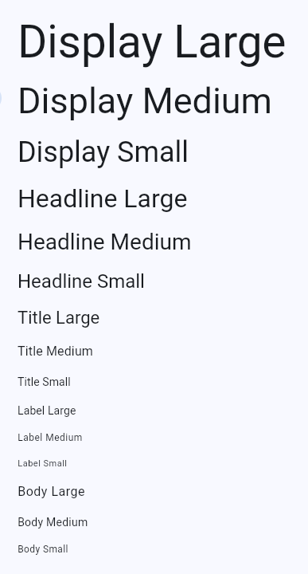

# Renkleri ve yazı tipi stillerini paylaşmak için temaları kullanın

Temaları (Themes) kullanarak bir uygulama genelinde renklerin ve yazı tipi stillerinin nasıl paylaşılacağını öğrenin.

**Not:** Bu tarif, Flutter'ın [Material 3](https://m3.material.io/) desteğini ve `google_fonts` paketini kullanır. Flutter 3.16 sürümünden itibaren Material 3, Flutter'ın varsayılan temasıdır.

Uygulama genelinde renkleri ve yazı tipi stillerini paylaşmak için temaları kullanın.

Uygulama çapında temalar tanımlayabilirsiniz. Bir bileşen için tema stilini değiştirmek üzere bir temayı genişletebilirsiniz. Her tema; renkleri, yazı tipini ve Material bileşeni türü için geçerli olan diğer parametreleri tanımlar.

Flutter stillendirmeyi aşağıdaki sırayla uygular:

1. Belirli bir widget'a uygulanan stiller.
2. Doğrudan üst temayı geçersiz kılan temalar.
3. Tüm uygulama için ana tema.

Bir `Theme` tanımladıktan sonra, bunu kendi widget'larınızda kullanın. Flutter'ın Material widget'ları; uygulama çubukları, düğmeler, onay kutuları ve daha fazlası için arka plan renklerini ve yazı tipi stillerini ayarlamak üzere temanızı kullanır.

## Bir uygulama teması oluşturun

Bir `Theme`'i tüm uygulamanızda paylaşmak için, `MaterialApp` kurucunuzdaki (constructor) `theme` özelliğini ayarlayın. Bu özellik bir `ThemeData` örneği alır.

Flutter 3.16 sürümünden itibaren Material 3, Flutter'ın varsayılan temasıdır.

Eğer kurucuda bir tema belirtmezseniz, Flutter sizin için varsayılan bir tema oluşturur.

```dart
MaterialApp(
  title: appName,
  theme: ThemeData(
    // Define the default brightness and colors.
    colorScheme: ColorScheme.fromSeed(
      seedColor: Colors.purple,
      // ···
      brightness: Brightness.dark,
    ),

    // Define the default `TextTheme`. Use this to specify the default
    // text styling for headlines, titles, bodies of text, and more.
    textTheme: TextTheme(
      displayLarge: const TextStyle(
        fontSize: 72,
        fontWeight: FontWeight.bold,
      ),
      // ···
      titleLarge: GoogleFonts.oswald(
        fontSize: 30,
        fontStyle: FontStyle.italic,
      ),
      bodyMedium: GoogleFonts.merriweather(),
      displaySmall: GoogleFonts.pacifico(),
    ),
  ),
  home: const MyHomePage(title: appName),
);
```

Çoğu `ThemeData` örneği aşağıdaki iki özellik için değer ayarlar. Bu özellikler tüm uygulamayı etkiler.

* `colorScheme` renkleri tanımlar.
* `textTheme` metin stillendirmesini tanımlar.

Hangi renkleri, yazı tiplerini ve diğer özellikleri tanımlayabileceğinizi öğrenmek için `ThemeData` belgelerine göz atın.

## Bir tema uygulayın

Yeni temanızı uygulamak için, bir widget'ın stil özelliklerini belirtirken `Theme.of(context)` yöntemini kullanın. Bunlar `style` ve `color` özelliklerini içerebilir ancak bunlarla sınırlı değildir.

`Theme.of(context)` yöntemi widget ağacını (widget tree) yukarı doğru arar ve ağaçtaki en yakın `Theme`'i alır. Eğer bağımsız bir `Theme` varsa, o uygulanır. Yoksa, Flutter uygulamanın temasını uygular.

Aşağıdaki örnekte, `Container` kurucusu `color` özelliğini ayarlamak için bu tekniği kullanır.

```dart
Container(
  padding: const EdgeInsets.symmetric(horizontal: 12, vertical: 12),
  color: Theme.of(context).colorScheme.primary,
  child: Text(
    'Text with a background color',
    // ···
    style: Theme.of(context).textTheme.bodyMedium!.copyWith(
      color: Theme.of(context).colorScheme.onPrimary,
    ),
  ),
),

```

## Bir temayı geçersiz kılın (Override)

Uygulamanın bir bölümünde genel temayı geçersiz kılmak için, uygulamanın o bölümünü bir `Theme` widget'ı içine sarın.

Bir temayı iki şekilde geçersiz kılabilirsiniz:

1. Benzersiz bir `ThemeData` örneği oluşturarak.
2. Üst temayı genişleterek.

### Benzersiz bir ThemeData örneği oluşturun

Uygulamanızın bir bileşeninin genel temayı görmezden gelmesini istiyorsanız, bir `ThemeData` örneği oluşturun. Bu örneği `Theme` widget'ına iletin.

```dart
Theme(
  // Create a unique theme with `ThemeData`.
  data: ThemeData(colorScheme: ColorScheme.fromSeed(seedColor: Colors.pink)),
  child: FloatingActionButton(onPressed: () {}, child: const Icon(Icons.add)),
);

```

### Üst temayı genişletin

Her şeyi geçersiz kılmak yerine, üst temayı genişletmeyi düşünün. Bir temayı genişletmek için `copyWith()` yöntemini kullanın.

```dart
Theme(
  // Find and extend the parent theme using `copyWith`.
  // To learn more, check out the section on `Theme.of`.
  data: Theme.of(
    context,
  ).copyWith(colorScheme: ColorScheme.fromSeed(seedColor: Colors.pink)),
  child: const FloatingActionButton(onPressed: null, child: Icon(Icons.add)),
);

```

## Theme hakkında bir video izleyin

Daha fazla bilgi edinmek için, `Theme` widget'ı hakkındaki bu kısa "Haftanın Widget'ı" [videosunu](https://www.youtube.com/watch?v=oTvQDJOBXmM&t=2s) izleyin:

## Bir örnek yapın

```dart
import 'package:flutter/material.dart';
// Include the Google Fonts package to provide more text format options
// https://pub.dev/packages/google_fonts
import 'package:google_fonts/google_fonts.dart';

void main() {
  runApp(const MyApp());
}

class MyApp extends StatelessWidget {
  const MyApp({super.key});

  @override
  Widget build(BuildContext context) {
    const appName = 'Custom Themes';

    return MaterialApp(
      title: appName,
      theme: ThemeData(
        // Define the default brightness and colors.
        colorScheme: ColorScheme.fromSeed(
          seedColor: Colors.purple,
          // TRY THIS: Change to "Brightness.light"
          //           and see that all colors change
          //           to better contrast a light background.
          brightness: Brightness.dark,
        ),

        // Define the default `TextTheme`. Use this to specify the default
        // text styling for headlines, titles, bodies of text, and more.
        textTheme: TextTheme(
          displayLarge: const TextStyle(
            fontSize: 72,
            fontWeight: FontWeight.bold,
          ),
          // TRY THIS: Change one of the GoogleFonts
          //           to "lato", "poppins", or "lora".
          //           The title uses "titleLarge"
          //           and the middle text uses "bodyMedium".
          titleLarge: GoogleFonts.oswald(
            fontSize: 30,
            fontStyle: FontStyle.italic,
          ),
          bodyMedium: GoogleFonts.merriweather(),
          displaySmall: GoogleFonts.pacifico(),
        ),
      ),
      home: const MyHomePage(title: appName),
    );
  }
}

class MyHomePage extends StatelessWidget {
  final String title;

  const MyHomePage({super.key, required this.title});

  @override
  Widget build(BuildContext context) {
    return Scaffold(
      appBar: AppBar(
        title: Text(
          title,
          style: Theme.of(context).textTheme.titleLarge!.copyWith(
            color: Theme.of(context).colorScheme.onSecondary,
          ),
        ),
        backgroundColor: Theme.of(context).colorScheme.secondary,
      ),
      body: Center(
        child: Container(
          padding: const EdgeInsets.symmetric(horizontal: 12, vertical: 12),
          color: Theme.of(context).colorScheme.primary,
          child: Text(
            'Text with a background color',
            // TRY THIS: Change the Text value
            //           or change the Theme.of(context).textTheme
            //           to "displayLarge" or "displaySmall".
            style: Theme.of(context).textTheme.bodyMedium!.copyWith(
              color: Theme.of(context).colorScheme.onPrimary,
            ),
          ),
        ),
      ),
      floatingActionButton: Theme(
        data: Theme.of(context).copyWith(
          // TRY THIS: Change the seedColor to "Colors.red" or
          //           "Colors.blue".
          colorScheme: ColorScheme.fromSeed(
            seedColor: Colors.pink,
            brightness: Brightness.dark,
          ),
        ),
        child: FloatingActionButton(
          onPressed: () {},
          child: const Icon(Icons.add),
        ),
      ),
    );
  }
}
```


# Flutter için Material Design

Flutter için Material Design hakkında bilgi edinin.

Material Design, Google tasarımcıları ve geliştiricileri tarafından oluşturulan ve desteklenen açık kaynaklı bir tasarım sistemidir.

En son sürüm olan **Material 3**; dinamik renkler ve gelişmiş erişilebilirlikten, büyük ekran düzenleri ve tasarım belirteçleri (design tokens) için temellere kadar kişisel, uyarlanabilir ve etkileyici deneyimler sağlar.


## Uyarı

**Flutter 3.16 sürümü itibarıyla Material 3 varsayılan olarak etkindir.**

Şimdilik, `useMaterial3` özelliğini `false` olarak ayarlayarak Material 3 kullanımından vazgeçebilirsiniz. Ancak, `useMaterial3` özelliğinin ve Material 2 desteğinin, Flutter'ın kullanımdan kaldırma (deprecation) politikasına göre sonunda kaldırılacağını unutmayın.

**Çoğu** Flutter widget'ı için Material 3'e yükseltme sorunsuzdur. Ancak **bazı** widget'lar güncellenemedi; `NavigationBar` gibi tamamen yeni uygulamalar (implementations) gerekti. Bu değişiklikleri kodunuzda manuel olarak yapmalısınız. Uygulamanız tamamen güncellenene kadar, kullanıcı arayüzü biraz garip görünebilir veya davranabilir. Tamamen yeni Material bileşenlerini **Etkilenen widget'lar** (Affected widgets) sayfasını ziyaret ederek bulabilirsiniz.

Güncellenmiş bileşenleri, tipografiyi, renk sistemini ve yükseklik (elevation) desteğini **Material 3 demosu** ile keşfedin.

## Daha fazla bilgi

Material Design ve Flutter hakkında daha fazla bilgi edinmek için şunlara göz atın:

* Material.io geliştirici belgeleri
* Taha Tesser tarafından yazılan "Bir Flutter uygulamasını Material 3'e taşıma" blog yazısı
* GitHub'daki şemsiye (ana) konu (Umbrella issue)


# Material 3'e Geçiş

Flutter uygulamanızın arayüzünü Material 2'den Material 3'e nasıl taşıyacağınızı öğrenin.

> **Önemli**
> Bu, kırılmaya neden olan değişiklik belgeleri (breaking change docs), yayınlandığı sürüm itibarıyla doğrudur. Zamanla, burada açıklanan geçici çözümler geçerliliğini yitirebilir. Genel olarak, bu tür belgeleri her sürümde güncel tutmuyoruz.
> [Kırılmaya neden olan değişiklikler dizin dosyası](https://docs.flutter.dev/release/breaking-changes), her sürüm için oluşturulan belgeleri listeler.

## Özet

Material kütüphanesi, Material 3 Tasarım şartnamesine uyacak şekilde güncellendi. Değişiklikler yeni bileşenleri, bileşen temalarını, güncellenmiş bileşen görsellerini ve çok daha fazlasını içerir. Bu güncellemelerin çoğu sorunsuz bir şekilde gerçekleşir. Uygulamanızı 3.16 (veya üzeri) sürümle yeniden derlediğinizde etkilenen widget'ın yeni sürümünü göreceksiniz. Ancak geçişi tamamlamak için bazı manuel işlemler de gereklidir.

## Geçiş Kılavuzu

3.16 sürümünden önce, `useMaterial3` bayrağını `true` yaparak Material 3 değişikliklerini isteğe bağlı olarak kullanabiliyordunuz. Flutter 3.16 sürümü (Kasım 2023) itibarıyla, **`useMaterial3` varsayılan olarak `true`'dur.**

Bu arada, `useMaterial3` değerini `false` yaparak uygulamanızda Material 2 davranışına geri dönebilirsiniz. Ancak bu sadece geçici bir çözümdür. `useMaterial3` bayrağı ve Material 2 uygulaması, Flutter'ın kullanımdan kaldırma (deprecation) politikasının bir parçası olarak sonunda kaldırılacaktır.

### Renkler (Colors)

`ThemeData.colorScheme` için varsayılan değerler, Material 3 Tasarım şartnamesine uyacak şekilde güncellendi.

`ColorScheme.fromSeed` kurucusu (constructor), verilen `seedColor`'dan türetilen bir `ColorScheme` oluşturur. Bu kurucu tarafından oluşturulan renkler, birlikte iyi çalışacak ve Material 3 Tasarım sistemindeki erişilebilirlik için kontrast gereksinimlerini karşılayacak şekilde tasarlanmıştır.

3.16 sürümüne güncellerken, arayüzünüz doğru `ColorScheme` olmadan biraz tuhaf görünebilir. Bunu düzeltmek için `ColorScheme.fromSeed` kurucusuyla oluşturulan `ColorScheme` yapısına geçiş yapın.

**Geçiş öncesi kod:**

```dart
theme: ThemeData(
  colorScheme: ColorScheme.light(primary: Colors.blue),
),
```

**Geçiş sonrası kod:**

```dart
theme: ThemeData(
  colorScheme: ColorScheme.fromSeed(seedColor: Colors.blue),
),
```

İçeriğe dayalı dinamik bir renk şeması oluşturmak için `ColorScheme.fromImageProvider` statik yöntemini kullanın. Bir renk şeması oluşturma örneği için, [ağ görselinden ColorScheme oluşturma örneğine](https://api.flutter.dev/flutter/material/ColorScheme/fromImageProvider.html) göz atın.

Flutter Material 3 değişiklikleri yeni bir arka plan rengi içerir. `ColorScheme.surfaceTint`, yükseltilmiş (elevated) bir widget'ı belirtir. Bazı widget'lar farklı renkler kullanır.

Uygulamanızın arayüzünü önceki davranışına döndürmek için (ki bunu önermiyoruz):

* `Colors.grey[50]!` değerini `ColorScheme.background` olarak ayarlayın (tema `Brightness.light` olduğunda).
* `Colors.grey[850]!` değerini `ColorScheme.background` olarak ayarlayın (tema `Brightness.dark` olduğunda).

**Geçiş öncesi kod:**

```dart
theme: ThemeData(
  colorScheme: ColorScheme.fromSeed(seedColor: Colors.deepPurple),
),
```

**Geçiş sonrası kod:**

```dart
theme: ThemeData(
  colorScheme: ColorScheme.fromSeed(seedColor: Colors.deepPurple).copyWith(
    background: Colors.grey[50]!,
  ),
),
darkTheme: ThemeData(
  colorScheme: ColorScheme.fromSeed(
    seedColor: Colors.deepPurple,
    brightness: Brightness.dark,
  ).copyWith(background: Colors.grey[850]!),
),
```

`ColorScheme.surfaceTint` değeri, Material 3'te bir bileşenin yüksekliğini (elevation) belirtir. Bazı widget'lar yüksekliği belirtmek için hem `surfaceTint` hem de `shadowColor` kullanabilir (örneğin `Card` ve `ElevatedButton`), diğerleri ise yüksekliği belirtmek için sadece `surfaceTint` kullanabilir (örneğin `AppBar`).

Widget'ın önceki davranışına dönmek için, temada `ColorScheme.surfaceTint` değerini `Colors.transparent` olarak ayarlayın. Bir widget'ın gölgesini içerikten ayırt etmek için (gölgesi olmadığında), varsayılan gölge rengi olmayan widget temasında `ColorScheme.shadow` rengini `shadowColor` özelliğine ayarlayın.

**Geçiş öncesi kod:**

```dart
theme: ThemeData(
  colorScheme: ColorScheme.fromSeed(seedColor: Colors.deepPurple),
),
```

**Geçiş sonrası kod:**

```dart
theme: ThemeData(
  colorScheme: ColorScheme.fromSeed(seedColor: Colors.deepPurple).copyWith(
    surfaceTint: Colors.transparent,
  ),
  appBarTheme: AppBarTheme(
   elevation: 4.0,
   shadowColor: Theme.of(context).colorScheme.shadow,
 ),
),
```

`ElevatedButton` artık kendini yeni bir renk kombinasyonuyla stillendiriyor. Daha önce, `useMaterial3` bayrağı `false` olduğunda, `ElevatedButton` arka plan için `ColorScheme.primary` ve ön plan için `ColorScheme.onPrimary` kullanıyordu. Aynı görselleri elde etmek için, yükseklik değişiklikleri veya gölge olmadan yeni `FilledButton` widget'ına geçin.

**Geçiş öncesi kod:**

```dart
ElevatedButton(
  onPressed: () {},
  child: const Text('Button'),
),
```

**Geçiş sonrası kod:**

```dart
ElevatedButton(
  style: ElevatedButton.styleFrom(
    backgroundColor: Theme.of(context).colorScheme.primary,
    foregroundColor: Theme.of(context).colorScheme.onPrimary,
  ),
  onPressed: () {},
  child: const Text('Button'),
),
```

### Tipografi (Typography)

`ThemeData.textTheme` için varsayılan değerler, Material 3 varsayılanlarıyla eşleşecek şekilde güncellendi. Değişiklikler arasında güncellenmiş yazı tipi boyutu, yazı tipi ağırlığı, harf aralığı ve satır yüksekliği bulunur. Daha fazla ayrıntı için [TextTheme dokümantasyonuna](https://api.flutter.dev/flutter/material/TextTheme-class.html) göz atın.

Aşağıdaki örnekte gösterildiği gibi, 3.16 sürümünden önce, kısıtlı bir düzende `TextTheme.bodyLarge` kullanan uzun bir dizeye sahip `Text` widget'ı metni iki satıra sarıyordu. Ancak, 3.16 sürümü metni üç satıra sarar. Önceki davranışı elde etmeniz gerekiyorsa, metin stilini ve gerekirse harf aralığını ayarlayın.

**Geçiş öncesi kod:**

```dart
ConstrainedBox(
  constraints: const BoxConstraints(maxWidth: 200),
    child: Text(
      'This is a very long text that should wrap to multiple lines.',
      style: Theme.of(context).textTheme.bodyLarge,
  ),
),
```

**Geçiş sonrası kod:**

```dart
ConstrainedBox(
  constraints: const BoxConstraints(maxWidth: 200),
    child: Text(
      'This is a very long text that should wrap to multiple lines.',
      style: Theme.of(context).textTheme.bodyMedium!.copyWith(
        letterSpacing: 0.0,
      ),
  ),
),
```

### Bileşenler (Components)

Bazı bileşenler sadece Material 3 Tasarım şartnamesine uyacak şekilde güncellenemedi, tamamen yeni bir uygulama gerektiriyordu. Flutter SDK tam olarak ne istediğinizi bilemeyeceğinden, bu tür bileşenler manuel geçiş gerektirir.

Material 2 tarzı `BottomNavigationBar` widget'ını yeni `NavigationBar` widget'ı ile değiştirin. Bu widget biraz daha uzundur, hap şeklinde gezinme göstergeleri içerir ve yeni renk eşlemeleri kullanır.

**Geçiş öncesi kod:**

```dart
BottomNavigationBar(
  items: const <BottomNavigationBarItem>[
    BottomNavigationBarItem(
      icon: Icon(Icons.home),
      label: 'Home',
    ),
    BottomNavigationBarItem(
      icon: Icon(Icons.business),
      label: 'Business',
    ),
    BottomNavigationBarItem(
      icon: Icon(Icons.school),
      label: 'School',
    ),
  ],
),
```

**Geçiş sonrası kod:**

```dart
NavigationBar(
  destinations: const <Widget>[
    NavigationDestination(
      icon: Icon(Icons.home),
      label: 'Home',
    ),
    NavigationDestination(
      icon: Icon(Icons.business),
      label: 'Business',
    ),
    NavigationDestination(
      icon: Icon(Icons.school),
      label: 'School',
    ),
  ],
),
```

[BottomNavigationBar'dan NavigationBar'a geçiş](https://www.google.com/search?q=https://flutter.github.io/samples/web/material_3_navigation_bar/) hakkındaki tam örneğe göz atın.

`Drawer` widget'ını, hap şeklinde gezinme göstergeleri, yuvarlatılmış köşeler ve yeni renk eşlemeleri sağlayan `NavigationDrawer` ile değiştirin.

**Geçiş öncesi kod:**

```dart
Drawer(
  child: ListView(
    children: <Widget>[
      DrawerHeader(
        child: Text(
          'Drawer Header',
          style: Theme.of(context).textTheme.titleLarge,
        ),
      ),
      ListTile(
        leading: const Icon(Icons.message),
        title: const Text('Messages'),
        onTap: () { },
      ),
      ListTile(
        leading: const Icon(Icons.account_circle),
        title: const Text('Profile'),
        onTap: () {},
      ),
      ListTile(
        leading: const Icon(Icons.settings),
        title: const Text('Settings'),
        onTap: () { },
      ),
    ],
  ),
),
```

**Geçiş sonrası kod:**

```dart
NavigationDrawer(
  children: <Widget>[
    DrawerHeader(
      child: Text(
        'Drawer Header',
        style: Theme.of(context).textTheme.titleLarge,
      ),
    ),
    const NavigationDrawerDestination(
      icon: Icon(Icons.message),
      label: Text('Messages'),
    ),
    const NavigationDrawerDestination(
      icon: Icon(Icons.account_circle),
      label: Text('Profile'),
    ),
    const NavigationDrawerDestination(
      icon: Icon(Icons.settings),
      label: Text('Settings'),
    ),
  ],
),
```

[Drawer'dan NavigationDrawer'a geçiş](https://www.google.com/search?q=https://flutter.github.io/samples/web/material_3_navigation_drawer/) hakkındaki tam örneğe göz atın.

Material 3, kaydırmadan önce daha büyük bir başlık görüntüleyen orta ve büyük uygulama çubuklarını (app bars) tanıtır. Kaydırma sırasında içerikten ayrım oluşturmak için gölge yerine `ColorScheme.surfaceTint` rengi kullanılır.

Aşağıdaki kod, orta boy uygulama çubuğunun nasıl uygulanacağını gösterir:

```dart
CustomScrollView(
  slivers: <Widget>[
    const SliverAppBar.medium(
      title: Text('Title'),
    ),
    SliverToBoxAdapter(
      child: Card(
        child: SizedBox(
          height: 1200,
          child: Padding(
            padding: const EdgeInsets.fromLTRB(8, 100, 8, 100),
            child: Text(
              'Here be scrolling content...',
              style: Theme.of(context).textTheme.headlineSmall,
            ),
          ),
        ),
      ),
    ),
  ],
),
```

Artık iki tür `TabBar` widget'ı vardır: birincil ve ikincil. İkincil sekmeler, ilgili içeriği daha fazla ayırmak ve hiyerarşi kurmak için bir içerik alanı içinde kullanılır. [TabBar.secondary](https://api.flutter.dev/flutter/material/TabBar/TabBar.secondary.html) örneğine göz atın.

Yeni `TabBar.tabAlignment` özelliği, sekmelerin yatay hizalamasını belirtir.

Aşağıdaki örnek, kaydırılabilir bir `TabBar` içinde sekme hizalamasının nasıl değiştirileceğini gösterir:

```dart
AppBar(
  title: const Text('Title'),
  bottom: const TabBar(
    tabAlignment: TabAlignment.start,
    isScrollable: true,
    tabs: <Widget>[
      Tab(
        icon: Icon(Icons.cloud_outlined),
      ),
      Tab(
        icon: Icon(Icons.beach_access_sharp),
      ),
      Tab(
        icon: Icon(Icons.brightness_5_sharp),
      ),
    ],
  ),
),
```

`ToggleButtons`'ın güncellenmiş bir sürümü olan `SegmentedButton`, tamamen yuvarlatılmış köşeler kullanır, düzen yüksekliği ve boyutu bakımından farklılık gösterir ve seçili öğeleri belirlemek için bir Dart `Set` (küme) kullanır.

**Geçiş öncesi kod:**

```dart
enum Weather { cloudy, rainy, sunny }

ToggleButtons(
  isSelected: const [false, true, false],
  onPressed: (int newSelection) { },
  children: const <Widget>[
    Icon(Icons.cloud_outlined),
    Icon(Icons.beach_access_sharp),
    Icon(Icons.brightness_5_sharp),
  ],
),
```

**Geçiş sonrası kod:**

```dart
enum Weather { cloudy, rainy, sunny }

SegmentedButton<Weather>(
  selected: const <Weather>{Weather.rainy},
  onSelectionChanged: (Set<Weather> newSelection) { },
  segments: const <ButtonSegment<Weather>>[
    ButtonSegment(
      icon: Icon(Icons.cloud_outlined),
      value: Weather.cloudy,
    ),
    ButtonSegment(
      icon: Icon(Icons.beach_access_sharp),
      value: Weather.rainy,
    ),
    ButtonSegment(
      icon: Icon(Icons.brightness_5_sharp),
      value: Weather.sunny,
    ),
  ],
),
```

[ToggleButtons'tan SegmentedButton'a geçiş](https://api.flutter.dev/flutter/material/SegmentedButton-class.html) hakkındaki tam örneğe göz atın.

## Yeni Bileşenler

* **"Menü çubukları ve basamaklı menüler"**, fare veya klavye ile tamamen gezilebilen masaüstü tarzı bir menü sistemi sağlar. Menüler bir `MenuBar` veya `MenuAnchor` ile sabitlenir. Yeni menü sistemi, mevcut uygulamaların geçiş yapması gereken bir şey değildir, ancak web veya masaüstü platformlarında dağıtılan uygulamalar `PopupMenuButton` (ve ilgili) sınıfları yerine bunu kullanmayı düşünmelidir.
* **DropdownMenu**, bazen "combo box" olarak adlandırılan bir yapı oluşturmak için bir metin alanı ve bir menüyü birleştirir. Kullanıcılar, eşleşen bir dize girerek veya dokunma, fare ya da klavye ile menüyle etkileşime girerek potansiyel olarak büyük bir listeden bir menü öğesi seçebilirler. Bu, zorunlu olmasa da `DropdownButton` widget'ı için iyi bir alternatif olabilir.
* **SearchBar** ve **SearchAnchor**, kullanıcının bir arama sorgusu girdiği, uygulamanın eşleşen yanıtların bir listesini hesapladığı ve ardından kullanıcının birini seçtiği veya sorguyu ayarladığı etkileşimler içindir.
* **Badge**, çocuğunu (child widget) '+1' gibi birkaç karakterlik küçük bir etiketle süsler. Rozetler tipik olarak bir `NavigationDestination`, `NavigationRailDestination`, `NavigationDrawerDestination` içindeki simgeyi veya `TextButton.icon`'da olduğu gibi bir düğmenin simgesini süslemek için kullanılır.
* **FilledButton** ve **FilledButton.tonal**, yükseklik değişiklikleri ve gölge olmadan `ElevatedButton`'a çok benzer.
* **FilterChip.elevated**, **ChoiceChip.elevated** ve **ActionChip.elevated**, aynı çiplerin gölge ve dolgu rengine sahip yükseltilmiş varyantlarıdır.
* **Dialog.fullscreen**, tüm ekranı kaplar ve tipik olarak üstte bir başlık, bir eylem düğmesi ve bir kapat düğmesi içerir.

## Zaman Çizelgesi

Kararlı sürümde: **3.16**

## Referanslar

**Dokümantasyon:**

* [Flutter için Material Design](https://docs.flutter.dev/ui/design/material)

**API Dokümantasyonu:**

* [ThemeData.useMaterial3](https://api.flutter.dev/flutter/material/ThemeData/useMaterial3.html)

**İlgili Sorunlar:**

* [Material 3 çatı sorunu](https://github.com/flutter/flutter/issues/91605)

**İlgili PR'lar:**

* [`ThemeData.useMaterial3` varsayılan değerini true olarak değiştir](https://www.google.com/search?q=https://github.com/flutter/flutter/pull/130773)
* [Güncellenmiş `ThemeData.useMaterial3` API dökümanı, varsayılan değer true](https://www.google.com/search?q=https://github.com/flutter/flutter/pull/136060)


# Flutter Ders Notları: Yazı Tipleri ve Tipografi (Fonts & Typography)

Flutter, uygulamanızdaki metinlerin stilini ve görünümünü yönetmek için güçlü tipografi özellikleri sunar. Tipografi; yazı tipinin ağırlığını (kalınlık), eğimini, harfler arasındaki boşluğu ve metnin diğer görsel yönlerini kapsar.

---

## 1. Yazı Tipi Türleri

Her yazı tipi (font) aynı şekilde oluşturulmaz. Temelde iki ana kategori vardır:

### A. Statik Yazı Tipleri (Static Fonts)

Geleneksel yazı tipleridir. Bir yazı tipi stili en az şunlarla tanımlanır:

* **Yazı Tipi Ailesi (Typeface):** `Roboto` veya `Noto` gibi ortak karakter kurallarını taşıyan set.
* **Ağırlık (Weight):** Regular, Bold veya sayısal bir değer (örn: 400, 700).
* **Stil (Style):** Regular, Italic vb.

Bu özelliklerin tümü bir araya gelerek "statik" bir yazı tipi dosyasını oluşturur.

### B. Değişken Yazı Tipleri (Variable Fonts)

Değişken yazı tipleri, normalde birden fazla statik dosya gerektirecek stilleri **tek bir dosyada** saklar ve çalışma zamanında (runtime) değiştirilmesine olanak tanır.

* **Eksenler (Axes):** Genişlik, ağırlık veya eğim gibi önceden tanımlanmış eksenler üzerinde kontrol sağlar.
* **Esneklik:** Kullanıcı veya geliştirici, sürekli bir eksen boyunca **herhangi bir değeri** seçebilir (Örneğin sadece 400 veya 700 değil, 550 kalınlığını seçmek gibi).

---

## 2. Tipografik Ölçek (Typographic Scale)

Tipografik ölçek, uygulamanızda denge, bütünlük ve görsel çeşitlilik sağlamak için oluşturulmuş ilişkili metin stilleri setidir.

Flutter'da `TextTheme` tarafından sağlanan yaygın ölçek **5 kategori** içerir:

1. **Display:** Büyük, dikkat çekici metinler.
2. **Headline:** Manşetler.
3. **Title:** Başlıklar.
4. **Label:** Etiketler (Buton yazıları vb.).
5. **Body:** Gövde metinleri (Paragraflar).

Her kategorinin **3 boyut varyasyonu** vardır:

* Small (Küçük)
* Medium (Orta)
* Large (Büyük)

Bu kombinasyonlar toplamda **15 farklı `TextStyle**` oluşturur (Örn: `bodyLarge`, `displaySmall`).




> **Not:** Flutter, platforma özgü ölçekleri `Typography` sınıfında tutar. Ancak genellikle `TextTheme` sınıfı hedef platforma göre yerelleştirildiği için `Typography` sınıfını doğrudan çağırmanız gerekmez.

---

## 3. Google Fonts Paketi Kullanımı

Yazı tiplerini manuel olarak indirip projenize eklemek yerine, `pub.dev` üzerindeki `google_fonts` paketini kullanarak doğrudan kod içinden erişebilirsiniz.


### Kurulum

`pubspec.yaml` dosyanıza paketi ekledikten sonra şu şekilde kullanabilirsiniz:

### Basit Kullanım

Sadece yazı tipi adını referans alarak kullanım:

```dart
Text(
  'Bu bir Google Fontu',
  style: GoogleFonts.lato(),
),
```

### Özelleştirilmiş Kullanım

Mevcut bir `TextStyle` üzerine özellik ekleyerek veya ezerek kullanım:

```dart
Text(
  'Bu özelleştirilmiş bir Google Fontu',
  style: GoogleFonts.lato(
    textStyle: Theme.of(context).textTheme.displayLarge, // Mevcut temayı baz al
    fontSize: 48,
    fontWeight: FontWeight.w700,
    fontStyle: FontStyle.italic,
  ),
),

```

---

## 4. Yazı Tiplerini Programatik Olarak Değiştirme

Bir yazı tipini (destekliyorsa) kod ile değiştirmek için aşağıdaki API'ler kullanılır:

| Sınıf / Özellik | Açıklama |
| --- | --- |
| **`FontFeature`** | Belirli glifleri (karakter şekillerini) seçmek için kullanılır (OpenType özellik etiketlerine karşılık gelir). |
| **`FontWeight`** | Yazının ağırlığını (kalınlığını) değiştirmek için kullanılır. |
| **`FontStyle`** | Yazıyı italik yapmak için kullanılır. |
| **`FontVariation`** | Değişken yazı tiplerinde (Variable Fonts), belirli bir özellik için değer aralığı belirtir. OpenType değişken spesifikasyonuna uyar. |

### İpucu: Google Fonts Type Tester

Google Fonts web sitesindeki "Type Tester" aracı, değişken yazı tiplerinin (Variable Fonts) yeteneklerini görmek için harikadır. Sitedeki kaydırıcıları (sliders) hareket ettirerek, kod tarafında `FontVariation` sınıfı ile hangi eksenleri değiştirebileceğinizi görebilirsiniz.


---
---

## 📄 Lisans Bilgisi

Bu doküman, **Flutter resmi dokümantasyonundan** türetilmiş Türkçe ders notudur.

**Orijinal kaynak:**  
https://docs.flutter.dev/cookbook/design/themes

**Türkçe çeviri ve düzenleme:**  
[Doç. Dr. Hakan Temiz](mailto:htemiz@artvin.edu.tr)

---

### Lisans Kapsamı

Bu dokümandaki içerikler aşağıdaki açık lisanslar kapsamında sunulmaktadır:

**Metin içerikleri (anlatım ve açıklamalar):**  
Flutter resmi dokümantasyonundan alınmış veya uyarlanmıştır.  
**Lisans:** Creative Commons Attribution 4.0 International (CC BY 4.0)  
https://creativecommons.org/licenses/by/4.0/

Bu lisans kapsamında:
- İçerik kopyalanabilir, dağıtılabilir ve uyarlanabilir  
- Ticari kullanım serbesttir  
- Kaynak belirtilmesi zorunludur  

**Kod örnekleri:**  
Flutter resmi dokümantasyonundan alınmış veya uyarlanmıştır.  
**Lisans:** BSD 3-Clause License  
https://opensource.org/licenses/BSD-3-Clause

Bu lisans kapsamında:
- Kodlar kopyalanabilir, değiştirilebilir ve dağıtılabilir  
- Ticari kullanım serbesttir  
- Lisans bildiriminin korunması gerekir  

---
---
