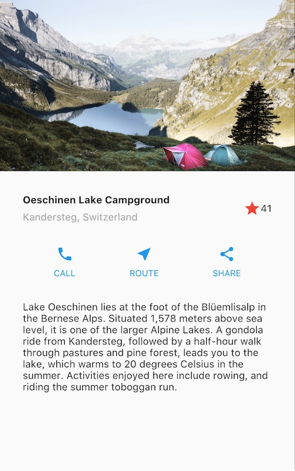
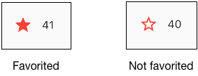
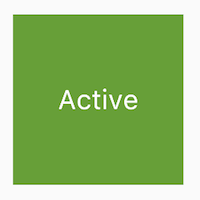
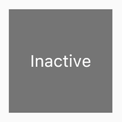

# Flutter uygulamanıza etkileşim ekleyin

Dokunmalara yanıt veren durumlu (stateful) bir widget nasıl uygulanır.

**Neler öğreneceksiniz:**
* Dokunmalara (taps) nasıl yanıt verilir.
* Özel bir widget nasıl oluşturulur.
* Durumsuz (stateless) ve durumlu (stateful) widget'lar arasındaki fark.

Uygulamanızı kullanıcı girdilerine tepki verecek şekilde nasıl değiştirirsiniz? Bu eğitimde, yalnızca etkileşimli olmayan widget'lar içeren bir uygulamaya etkileşim ekleyeceksiniz. Özellikle, iki durumsuz widget'ı yöneten özel bir durumlu widget oluşturarak bir simgeyi dokunulabilir hale getireceksiniz.

Düzen oluşturma (building layouts) eğitimi, aşağıdaki ekran görüntüsü için düzenin nasıl oluşturulacağını göstermişti.



**Düzen eğitimi uygulaması**

Uygulama ilk açıldığında, yıldız koyu kırmızıdır; bu, bu gölün daha önce favorilere eklendiğini gösterir. Yıldızın yanındaki sayı, 41 kişinin bu gölü favorilere eklediğini belirtir. Bu eğitimi tamamladıktan sonra, yıldıza dokunmak favori durumunu kaldıracak, dolu yıldızı bir dış çizgiyle değiştirecek ve sayıyı azaltacaktır. Tekrar dokunmak gölü favorilere ekleyecek, dolu bir yıldız çizecek ve sayıyı artıracaktır.




Bunu başarmak için, kendileri de birer widget olan hem yıldızı hem de sayıyı içeren tek bir özel widget oluşturacaksınız. Yıldıza dokunmak her iki widget'ın da durumunu değiştirir, bu nedenle aynı widget her ikisini de yönetmelidir.

Doğrudan koda geçmek isterseniz **Adım 2: StatefulWidget'ın alt sınıfını oluşturma** bölümüne gidebilirsiniz. Durumu yönetmenin farklı yollarını denemek isterseniz, **Durumu yönetmek (Managing state)** bölümüne atlayın.

## Stateful ve stateless widget'lar

Bir widget ya durumlu (stateful) ya da durumsuzdur (stateless). Eğer bir widget değişebiliyorsa—örneğin bir kullanıcı onunla etkileşime girdiğinde—o widget durumludur.


* **Stateless (Durumsuz)** bir widget asla değişmez. `Icon`, `IconButton` ve `Text` durumsuz widget örnekleridir. Stateless widget'lar `StatelessWidget` sınıfının alt sınıfıdır.
* **Stateful (Durumlu)** bir widget dinamiktir: örneğin, kullanıcı etkileşimleri tarafından tetiklenen olaylara yanıt olarak veya veri aldığında görünümünü değiştirebilir. `Checkbox`, `Radio`, `Slider`, `InkWell`, `Form` ve `TextField` durumlu widget örnekleridir. Stateful widget'lar `StatefulWidget` sınıfının alt sınıfıdır.

Bir widget'ın durumu, widget'ın durumunu görünümünden ayıran bir `State` nesnesinde saklanır. Durum, bir kaydırıcının (slider) mevcut değeri veya bir onay kutusunun işaretli olup olmadığı gibi değişebilen değerlerden oluşur. Widget'ın durumu değiştiğinde, durum nesnesi `setState()` öğesini çağırarak çerçeveye (framework) widget'ı yeniden çizmesini söyler.

## Durumlu bir widget oluşturma

**Bunun amacı ne?**
* Durumlu bir widget iki sınıf tarafından uygulanır: `StatefulWidget`'ın bir alt sınıfı ve `State`'in bir alt sınıfı.
* Durum (state) sınıfı, widget'ın değiştirilebilir durumunu ve widget'ın `build()` yöntemini içerir.
* Widget'ın durumu değiştiğinde, durum nesnesi `setState()` öğesini çağırarak çerçeveye widget'ı yeniden çizmesini söyler.

Bu bölümde, özel bir durumlu widget oluşturacaksınız. İki durumsuz widget'ı—koyu kırmızı yıldız ve yanındaki sayısal sayım—bir satırı (`Row`) ve iki çocuk widget'ı (`IconButton` ve `Text`) yöneten tek bir özel durumlu widget ile değiştireceksiniz.

Özel bir durumlu widget uygulamak iki sınıf oluşturmayı gerektirir:
1.  Widget'ı tanımlayan `StatefulWidget`'ın bir alt sınıfı.
2.  O widget için durumu içeren ve widget'ın `build()` yöntemini tanımlayan `State`'in bir alt sınıfı.

Bu bölüm, göller uygulaması için `FavoriteWidget` adlı durumlu bir widget'ın nasıl oluşturulacağını gösterir. Kurulumdan sonra ilk adımınız, `FavoriteWidget` için durumun nasıl yönetileceğini seçmektir.

### Adım 0: Hazırlık
Uygulamayı düzen oluşturma eğitiminde zaten oluşturduysanız, bir sonraki bölüme geçin.
1.  Ortamınızı kurduğunuzdan emin olun.
2.  Yeni bir Flutter uygulaması oluşturun.
3.  `lib/main.dart` dosyasını `main.dart` ile değiştirin.
4.  `pubspec.yaml` dosyasını `pubspec.yaml` ile değiştirin.
5.  Projenizde bir `images` dizini oluşturun ve `lake.jpg` dosyasını ekleyin.

Bağlı ve etkin bir cihazınız olduğunda veya iOS simülatörünü (Flutter kurulumunun parçası) ya da Android emülatörünü (Android Studio kurulumunun parçası) başlattığınızda hazırsınız demektir!

### Adım 1: Widget'ın durumunu hangi nesnenin yöneteceğine karar verin
Bir widget'ın durumu çeşitli şekillerde yönetilebilir, ancak örneğimizde widget'ın kendisi, `FavoriteWidget`, kendi durumunu yönetecektir. Bu örnekte, yıldızı değiştirmek, üst widget'ı veya kullanıcı arayüzünün geri kalanını etkilemeyen izole bir eylemdir, bu nedenle widget durumunu dahili olarak ele alabilir.

Widget ve durumun ayrılması ve durumun nasıl yönetilebileceği hakkında daha fazla bilgiyi **Durumu yönetmek** bölümünde bulabilirsiniz.

### Adım 2: StatefulWidget'ın alt sınıfını oluşturun
`FavoriteWidget` sınıfı kendi durumunu yönetir, bu nedenle bir `State` nesnesi oluşturmak için `createState()` yöntemini geçersiz kılar (override). Çerçeve, widget'ı oluşturmak istediğinde `createState()` yöntemini çağırır. Bu örnekte, `createState()`, bir sonraki adımda uygulayacağınız `_FavoriteWidgetState`'in bir örneğini döndürür.

```dart
class FavoriteWidget extends StatefulWidget {
  const FavoriteWidget({super.key});

  @override
  State<FavoriteWidget> createState() => _FavoriteWidgetState();
}

```

**Not:** Alt çizgi (_) ile başlayan üyeler veya sınıflar özeldir (private). Daha fazla bilgi için Dart dili belgelerindeki *Kütüphaneler ve importlar* bölümüne bakın.

### Adım 3: State'in alt sınıfını oluşturun

`_FavoriteWidgetState` sınıfı, widget'ın ömrü boyunca değişebilen verileri saklar. Uygulama ilk açıldığında, kullanıcı arayüzü gölün "favori" durumuna sahip olduğunu gösteren koyu kırmızı bir yıldız ve 41 beğeni görüntüler. Bu değerler `_isFavorited` ve `_favoriteCount` alanlarında saklanır:

```dart
class _FavoriteWidgetState extends State<FavoriteWidget> {
  bool _isFavorited = true;
  int _favoriteCount = 41;

```

Sınıf ayrıca, kırmızı bir `IconButton` ve `Text` içeren bir satır oluşturan `build()` yöntemini de tanımlar. `IconButton` kullanırsınız (Icon yerine) çünkü bir dokunmayı işlemek için geri çağırma işlevini (`_toggleFavorite`) tanımlayan bir `onPressed` özelliği vardır. Geri çağırma işlevini bir sonraki adımda tanımlayacaksınız.

```dart
class _FavoriteWidgetState extends State<FavoriteWidget> {
  // ···
  @override
  Widget build(BuildContext context) {
    return Row(
      mainAxisSize: MainAxisSize.min,
      children: [
        Container(
          padding: const EdgeInsets.all(0),
          child: IconButton(
            padding: const EdgeInsets.all(0),
            alignment: Alignment.center,
            icon: (_isFavorited
                ? const Icon(Icons.star)
                : const Icon(Icons.star_border)),
            color: Colors.red[500],
            onPressed: _toggleFavorite,
          ),
        ),
        SizedBox(width: 18, child: SizedBox(child: Text('$_favoriteCount'))),
      ],
    );
  }

  // ···
}
```

**İpucu:** `Text`'i bir `SizedBox` içine yerleştirmek ve genişliğini ayarlamak, metin 40 ve 41 değerleri arasında değiştiğinde fark edilebilir bir "zıplamayı" önler — aksi takdirde bu değerlerin farklı genişlikleri olduğu için bir zıplama meydana gelirdi.

`IconButton`'a basıldığında çağrılan `_toggleFavorite()` yöntemi, `setState()`'i çağırır. `setState()`'i çağırmak kritiktir, çünkü bu çerçeveye widget'ın durumunun değiştiğini ve widget'ın yeniden çizilmesi gerektiğini söyler. `setState()`'e verilen işlev argümanı, kullanıcı arayüzünü şu iki durum arasında değiştirir:

* Bir `star` simgesi ve 41 sayısı
* Bir `star_border` simgesi ve 40 sayısı

```dart
void _toggleFavorite() {
  setState(() {
    if (_isFavorited) {
      _favoriteCount -= 1;
      _isFavorited = false;
    } else {
      _favoriteCount += 1;
      _isFavorited = true;
    }
  });
}
```

### Adım 4: Durumlu widget'ı widget ağacına yerleştirin

Uygulamanın `build()` yönteminde özel durumlu widget'ınızı widget ağacına ekleyin. İlk olarak, `Icon` ve `Text`'i oluşturan kodu bulun ve silin. Aynı konumda, durumlu widget'ı oluşturun:

```dart
child: Row(
  children: [
    // ...
    Icon(
      Icons.star,
      color: Colors.red[500],
    ),
    const Text('41'),
    const FavoriteWidget(),
  ],
),
```

İşte bu kadar! Uygulamayı "hot reload" yaptığınızda, yıldız simgesi artık dokunmalara yanıt vermelidir.

---

## Durumu yönetmek (Managing state)

**Bunun amacı ne?**

* Durumu yönetmek için farklı yaklaşımlar vardır.
* Siz, widget tasarımcısı olarak, hangi yaklaşımın kullanılacağını seçersiniz.
* Şüpheniz varsa, durumu üst widget'ta (parent widget) yöneterek başlayın.

Durumlu widget'ın durumunu kim yönetir? Widget'ın kendisi mi? Üst widget mı? Her ikisi mi? Başka bir nesne mi? Cevap... duruma göre değişir. Widget'ınızı etkileşimli hale getirmenin birkaç geçerli yolu vardır. Siz, widget tasarımcısı olarak, widget'ınızın nasıl kullanılmasını beklediğinize bağlı olarak kararı verirsiniz. İşte durumu yönetmenin en yaygın yolları:

1. Widget kendi durumunu yönetir
2. Üst widget (Parent) widget'ın durumunu yönetir
3. Karışık (mix-and-match) yaklaşım

Hangi yaklaşımı kullanacağınıza nasıl karar verirsiniz? Aşağıdaki ilkeler karar vermenize yardımcı olmalıdır:

* Söz konusu durum kullanıcı verisi ise, örneğin bir onay kutusunun işaretli veya işaretsiz modu ya da bir kaydırıcının konumu gibi, o zaman durum en iyi **üst widget** tarafından yönetilir.
* Söz konusu durum estetik ise, örneğin bir animasyon, o zaman durum en iyi **widget'ın kendisi** tarafından yönetilir.
* **Şüpheniz varsa, durumu üst widget'ta yöneterek başlayın.**

Üç basit örnek oluşturarak durumu yönetmenin farklı yollarını göstereceğiz: TapboxA, TapboxB ve TapboxC. Örneklerin hepsi benzer şekilde çalışır—her biri dokunulduğunda yeşil veya gri kutu arasında geçiş yapan bir kapsayıcı (container) oluşturur. `_active` boolean değeri rengi belirler: aktif için yeşil veya pasif için gri.





Bu örnekler, `Container` üzerindeki etkinlikleri yakalamak için `GestureDetector` kullanır.

### Widget kendi durumunu yönetir

Bazen widget'ın durumunu dahili olarak yönetmesi en mantıklısıdır. Örneğin, `ListView` içeriği render kutusunu aştığında otomatik olarak kayar. `ListView` kullanan çoğu geliştirici `ListView`'ın kaydırma davranışını yönetmek istemez, bu nedenle `ListView` kendi kaydırma ofsetini (scroll offset) kendisi yönetir.

`_TapboxAState` sınıfı:

* `TapboxA` için durumu yönetir.
* Kutunun mevcut rengini belirleyen `_active` boolean değerini tanımlar.
* Kutuya dokunulduğunda `_active` değerini güncelleyen ve UI'ı güncellemek için `setState()` işlevini çağıran `_handleTap()` işlevini tanımlar.
* Widget için tüm etkileşimli davranışları uygular.

```dart
import 'package:flutter/material.dart';

// TapboxA kendi durumunu yönetir.

//------------------------- TapboxA ----------------------------------

class TapboxA extends StatefulWidget {
  const TapboxA({super.key});

  @override
  State<TapboxA> createState() => _TapboxAState();
}

class _TapboxAState extends State<TapboxA> {
  bool _active = false;

  void _handleTap() {
    setState(() {
      _active = !_active;
    });
  }

  @override
  Widget build(BuildContext context) {
    return GestureDetector(
      onTap: _handleTap,
      child: Container(
        width: 200,
        height: 200,
        decoration: BoxDecoration(
          color: _active ? Colors.lightGreen[700] : Colors.grey[600],
        ),
        child: Center(
          child: Text(
            _active ? 'Active' : 'Inactive',
            style: const TextStyle(fontSize: 32, color: Colors.white),
          ),
        ),
      ),
    );
  }
}
// ... (MyApp kodu kısalık için atlanmıştır)
```

### Üst widget, widget'ın durumunu yönetir

Genellikle üst widget'ın durumu yönetmesi ve alt widget'ına ne zaman güncelleneceğini söylemesi en mantıklısıdır. Örneğin, `IconButton` bir simgeye dokunulabilir bir düğme muamelesi yapmanıza olanak tanır. `IconButton` durumsuz bir widget'tır çünkü üst widget'ın düğmenin dokunulup dokunulmadığını bilmesi gerektiğine karar verdik, böylece uygun eylemi gerçekleştirebilir.

Aşağıdaki örnekte, TapboxB durumunu bir geri çağırma (callback) aracılığıyla üstüne dışa aktarır. TapboxB herhangi bir durum yönetmediği için StatelessWidget alt sınıfıdır.

`ParentWidgetState` sınıfı:

* TapboxB için `_active` durumunu yönetir.
* Kutuya dokunulduğunda çağrılan yöntem olan `_handleTapboxChanged()`'i uygular.
* Durum değiştiğinde, UI'ı güncellemek için `setState()`'i çağırır.

`TapboxB` sınıfı:

* Tüm durum üstü tarafından ele alındığı için `StatelessWidget`'ı genişletir (extends).
* Bir dokunma algılandığında, üstünü bilgilendirir.

```dart
import 'package:flutter/material.dart';

// ParentWidget, TapboxB için durumu yönetir.

//------------------------ ParentWidget --------------------------------

class ParentWidget extends StatefulWidget {
  const ParentWidget({super.key});

  @override
  State<ParentWidget> createState() => _ParentWidgetState();
}

class _ParentWidgetState extends State<ParentWidget> {
  bool _active = false;

  void _handleTapboxChanged(bool newValue) {
    setState(() {
      _active = newValue;
    });
  }

  @override
  Widget build(BuildContext context) {
    return SizedBox(
      child: TapboxB(active: _active, onChanged: _handleTapboxChanged),
    );
  }
}

//------------------------- TapboxB ----------------------------------

class TapboxB extends StatelessWidget {
  const TapboxB({super.key, this.active = false, required this.onChanged});

  final bool active;
  final ValueChanged<bool> onChanged;

  void _handleTap() {
    onChanged(!active);
  }

  @override
  Widget build(BuildContext context) {
    return GestureDetector(
      onTap: _handleTap,
      child: Container(
        width: 200,
        height: 200,
        decoration: BoxDecoration(
          color: active ? Colors.lightGreen[700] : Colors.grey[600],
        ),
        child: Center(
          child: Text(
            active ? 'Active' : 'Inactive',
            style: const TextStyle(fontSize: 32, color: Colors.white),
          ),
        ),
      ),
    );
  }
}
```

### Karışık yaklaşım (Mix-and-match)

Bazı widget'lar için karışık bir yaklaşım en mantıklısıdır. Bu senaryoda, durumlu widget durumun bir kısmını yönetir ve üst widget durumun diğer yönlerini yönetir.

`TapboxC` örneğinde, dokunulduğunda (tap down), kutunun etrafında koyu yeşil bir sınır belirir. Dokunma bırakıldığında (tap up), sınır kaybolur ve kutunun rengi değişir. `TapboxC`, `_active` durumunu üstüne dışa aktarır ancak `_highlight` durumunu dahili olarak yönetir. Bu örnekte iki `State` nesnesi vardır: `_ParentWidgetState` ve `_TapboxCState`.

`_ParentWidgetState` nesnesi:

* `_active` durumunu yönetir.
* Kutuya dokunulduğunda çağrılan yöntem olan `_handleTapboxChanged()`'i uygular.
* Bir dokunma gerçekleştiğinde ve `_active` durumu değiştiğinde UI'ı güncellemek için `setState()`'i çağırır.

`_TapboxCState` nesnesi:

* `_highlight` durumunu yönetir.
* `GestureDetector` tüm dokunma olaylarını dinler. Kullanıcı aşağı bastığında (taps down), vurgulamayı ekler (koyu yeşil bir sınır olarak uygulanır). Kullanıcı dokunmayı bıraktığında, vurgulamayı kaldırır.
* Tap down, tap up veya tap cancel durumlarında ve `_highlight` durumu değiştiğinde UI'ı güncellemek için `setState()`'i çağırır.
* Bir dokunma olayında, `widget` özelliğini kullanarak uygun eylemi gerçekleştirmek için bu durum değişikliğini üst widget'a iletir.

```dart
// (Kodun tam yapısı yukarıdaki mantığı takip eder, kısalık için burada özetlenmiştir)
// TapboxC hem kendi iç vurgu durumunu (_highlight) yönetir
// hem de aktiflik durumunu (_active) üst widget'a bildirir.
```

Alternatif bir uygulama, vurgu durumunu üst widget'a dışa aktarırken aktif durumu dahili olarak tutabilirdi, ancak birinden o dokunma kutusunu kullanmasını isteseydiniz, muhtemelen bunun pek mantıklı olmadığından şikayet ederdi. Geliştirici, kutunun aktif olup olmadığını önemser. Geliştirici muhtemelen vurgulamanın nasıl yönetildiğini önemsemez ve dokunma kutusunun bu ayrıntıları halletmesini tercih eder.


---
---

## 📄 Lisans Bilgisi

Bu doküman, **Flutter resmi dokümantasyonundan** türetilmiş Türkçe ders notudur.

**Orijinal kaynak:**  
https://docs.flutter.dev/ui/interactivity

**Türkçe çeviri ve düzenleme:**  
[Doç. Dr. Hakan Temiz](mailto:htemiz@artvin.edu.tr)

---

### Lisans Kapsamı

Bu dokümandaki içerikler aşağıdaki açık lisanslar kapsamında sunulmaktadır:

**Metin içerikleri (anlatım ve açıklamalar):**  
Flutter resmi dokümantasyonundan alınmış veya uyarlanmıştır.  
**Lisans:** Creative Commons Attribution 4.0 International (CC BY 4.0)  
https://creativecommons.org/licenses/by/4.0/

Bu lisans kapsamında:
- İçerik kopyalanabilir, dağıtılabilir ve uyarlanabilir  
- Ticari kullanım serbesttir  
- Kaynak belirtilmesi zorunludur  

**Kod örnekleri:**  
Flutter resmi dokümantasyonundan alınmış veya uyarlanmıştır.  
**Lisans:** BSD 3-Clause License  
https://opensource.org/licenses/BSD-3-Clause

Bu lisans kapsamında:
- Kodlar kopyalanabilir, değiştirilebilir ve dağıtılabilir  
- Ticari kullanım serbesttir  
- Lisans bildiriminin korunması gerekir  

---
---
