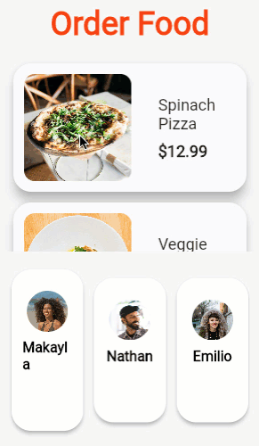

# Dokunmalar, sürüklemeler ve diğer jestler

Flutter'da dokunma (tap) ve sürükleme (drag) gibi jestlerin (gestures) nasıl çalıştığını öğrenin.

Bu belge, Flutter'da **jestlerin** nasıl dinleneceğini ve bunlara nasıl yanıt verileceğini açıklar. Jest örnekleri arasında dokunmalar, sürüklemeler ve ölçeklendirmeler (scaling) yer alır.

Flutter'daki jest sistemi iki ayrı katmana sahiptir. İlk katman, işaretçilerin (örneğin dokunuşlar, fareler ve kalemler) ekran üzerindeki konumunu ve hareketini tanımlayan **ham işaretçi olaylarına (raw pointer events)** sahiptir. İkinci katman ise, bir veya daha fazla işaretçi hareketinden oluşan anlamsal eylemleri tanımlayan **jestlere** sahiptir.

## İşaretçiler (Pointers)

İşaretçiler, kullanıcının cihaz ekranıyla etkileşimi hakkındaki ham verileri temsil eder. Dört tür işaretçi olayı vardır:

* `PointerDownEvent`: İşaretçi belirli bir konumda ekrana temas etti.
* `PointerMoveEvent`: İşaretçi ekran üzerinde bir konumdan diğerine hareket etti.
* `PointerUpEvent`: İşaretçi ekranla temasını kesti.
* `PointerCancelEvent`: Bu işaretçiden gelen girdi artık bu uygulamaya yönlendirilmiyor.


İşaretçi aşağı indiğinde (pointer down), çerçeve (framework), işaretçinin ekrana temas ettiği konumda hangi widget'ın bulunduğunu belirlemek için uygulamanızda bir **hit testi** (isabet testi) yapar. İşaretçi aşağı olayı (ve o işaretçi için sonraki olaylar) daha sonra hit testi tarafından bulunan **en içteki** widget'a dağıtılır. Oradan olaylar ağaçta yukarı doğru çıkar (bubble up) ve en içteki widget'tan ağacın köküne kadar olan yoldaki tüm widget'lara dağıtılır. İşaretçi olaylarının daha fazla dağıtılmasını iptal etmek veya durdurmak için bir mekanizma yoktur.

İşaretçi olaylarını doğrudan widget katmanından dinlemek için bir `Listener` widget'ı kullanın. Ancak, genellikle bunun yerine (aşağıda tartışıldığı gibi) jestleri kullanmayı düşünün.

## Jestler (Gestures)

Jestler; birden fazla bireysel işaretçi olayından, hatta potansiyel olarak birden fazla bireysel işaretçiden tanınan anlamsal eylemleri (örneğin dokunma, sürükleme ve ölçeklendirme) temsil eder. Jestler, jestin yaşam döngüsüne karşılık gelen birden fazla olay dağıtabilir (örneğin sürükleme başlangıcı, sürükleme güncellemesi ve sürükleme bitişi):


### Dokunma (Tap)
* `onTapDown`: Dokunmaya neden olabilecek bir işaretçi belirli bir konumda ekrana temas etti.
* `onTapUp`: Dokunmayı tetikleyen bir işaretçi belirli bir konumda ekranla temasını kesti.
* `onTap`: Daha önce `onTapDown`'ı tetikleyen işaretçi, `onTapUp`'ı da tetikledi ve sonuçta bir dokunmaya neden oldu.
* `onTapCancel`: Daha önce `onTapDown`'ı tetikleyen işaretçi, sonuçta bir dokunmaya neden olmayacak.

### Çift Dokunma (Double tap)
* `onDoubleTap`: Kullanıcı ekranda aynı konuma hızlı bir şekilde art arda iki kez dokundu.

### Uzun Basma (Long press)
* `onLongPress`: Bir işaretçi uzun bir süre boyunca ekranda aynı konumda temas halinde kaldı.

### Dikey Sürükleme (Vertical drag)
* `onVerticalDragStart`: Bir işaretçi ekrana temas etti ve dikey olarak hareket etmeye başlayabilir.
* `onVerticalDragUpdate`: Ekranla temas halinde olan ve dikey olarak hareket eden bir işaretçi dikey yönde hareket etti.
* `onVerticalDragEnd`: Daha önce ekranla temas halinde olan ve dikey olarak hareket eden bir işaretçi artık ekranla temas halinde değil ve teması kestiğinde belirli bir hızda hareket ediyordu.

### Yatay Sürükleme (Horizontal drag)
* `onHorizontalDragStart`: Bir işaretçi ekrana temas etti ve yatay olarak hareket etmeye başlayabilir.
* `onHorizontalDragUpdate`: Ekranla temas halinde olan ve yatay olarak hareket eden bir işaretçi yatay yönde hareket etti.
* `onHorizontalDragEnd`: Daha önce ekranla temas halinde olan ve yatay olarak hareket eden bir işaretçi artık ekranla temas halinde değil ve teması kestiğinde belirli bir hızda hareket ediyordu.

### Kaydırma (Pan)
* `onPanStart`: Bir işaretçi ekrana temas etti ve yatay veya dikey olarak hareket etmeye başlayabilir. `onHorizontalDragStart` veya `onVerticalDragStart` ayarlanmışsa bu geri çağırma (callback) çökmeye neden olur.
* `onPanUpdate`: Ekranla temas halinde olan bir işaretçi dikey veya yatay yönde hareket ediyor. `onHorizontalDragUpdate` veya `onVerticalDragUpdate` ayarlanmışsa bu geri çağırma çökmeye neden olur.
* `onPanEnd`: Daha önce ekranla temas halinde olan bir işaretçi artık ekranla temas halinde değil ve teması kestiğinde belirli bir hızda hareket ediyordu. `onHorizontalDragEnd` veya `onVerticalDragEnd` ayarlanmışsa bu geri çağırma çökmeye neden olur.

## Widget'lara jest algılama ekleme

Widget katmanından gelen jestleri dinlemek için bir `GestureDetector` kullanın.

> **Not:** Daha fazla bilgi edinmek için `GestureDetector` widget'ı hakkındaki bu kısa "Haftanın Widget'ı" videosunu izleyin.

Eğer Material Bileşenlerini (Material Components) kullanıyorsanız, bu widget'ların çoğu zaten dokunmalara veya jestlere yanıt verir. Örneğin, `IconButton` ve `TextButton` basışlara (dokunmalara) yanıt verir ve `ListView` kaydırmayı tetiklemek için kaydırma hareketlerine (swipes) yanıt verir. Eğer bu widget'ları kullanmıyorsanız ancak bir dokunma işleminde "mürekkep sıçraması" (ink splash) efekti istiyorsanız, `InkWell` kullanabilirsiniz.

## Jest belirsizliğinin giderilmesi (Gesture disambiguation)

Ekrandaki belirli bir konumda birden fazla jest algılayıcı (gesture detector) olabilir. Örneğin:

1.  Bir `ListTile`, tüm `ListTile`'a yanıt veren bir dokunma tanıyıcısına (tap recognizer) ve sondaki simge düğmesinin (trailing icon button) etrafında iç içe geçmiş bir tanıyıcıya sahiptir. Sondaki simgenin ekran karesi (rect) artık, eğer eylem bir dokunma olursa jesti kimin işleyeceğini müzakere etmesi gereken iki jest tanıyıcı tarafından kapsanmaktadır.
2.  Tek bir `GestureDetector`, uzun basma ve dokunma gibi birden fazla jesti işlemek üzere yapılandırılmış bir ekran alanını kapsar. Kullanıcı ekranın o kısmına dokunduğunda, `tap` (dokunma) tanıyıcısı artık `long press` (uzun basma) tanıyıcısı ile müzakere etmelidir. O işaretçiyle bir sonraki aşamada ne olacağına bağlı olarak, iki tanıyıcıdan biri jesti alır veya kullanıcı ne dokunma ne de uzun basma olan bir şey yaparsa hiçbiri jesti almaz.

Bu jest algılayıcıların tümü, işaretçi olayları akışını dinler ve belirli jestleri tanımaya çalışır. `GestureDetector` widget'ı, hangi geri aramalarının (callbacks) null olmadığına (dolu olduğuna) bağlı olarak hangi jestleri tanımaya çalışacağına karar verir.


Ekranda belirli bir işaretçi için birden fazla jest tanıyıcı olduğunda, çerçeve (framework), her tanıyıcının **jest arenasına (gesture arena)** katılmasını sağlayarak kullanıcının hangi jesti kastettiğini ayırt eder. Jest arenası, aşağıdaki kuralları kullanarak hangi jestin kazanacağını belirler:

* Herhangi bir zamanda, bir tanıyıcı kendini eleyebilir ve arenadan ayrılabilir. Arenada sadece bir tanıyıcı kalırsa, o tanıyıcı kazanır.
* Herhangi bir zamanda, bir tanıyıcı kendini kazanan ilan edebilir ve kalan tüm tanıyıcıların kaybetmesine neden olabilir.

Örneğin, yatay ve dikey sürüklemeyi ayırt ederken, her iki tanıyıcı da işaretçi aşağı (pointer down) olayını aldıklarında arenaya girerler. Tanıyıcılar işaretçi hareket olaylarını gözlemler. Kullanıcı işaretçiyi yatay olarak belirli bir mantıksal piksel sayısından fazla hareket ettirirse, yatay tanıyıcı zaferini ilan eder ve jest yatay bir sürükleme olarak yorumlanır. Benzer şekilde, kullanıcı dikey olarak belirli bir mantıksal piksel sayısından fazla hareket ederse, dikey tanıyıcı kendini kazanan ilan eder.

Jest arenası, yalnızca yatay (veya dikey) bir sürükleme tanıyıcısı olduğunda faydalıdır. Bu durumda, arenada yalnızca bir tanıyıcı vardır ve yatay sürükleme hemen tanınır; bu da yatay hareketin ilk pikselinin bir sürükleme olarak ele alınabileceği ve kullanıcının daha fazla jest ayrımı beklemesine gerek kalmayacağı anlamına gelir.


# Dokunmaları işleme (Handle taps)

Dokunma ve sürüklemenin nasıl işleneceği.

Kullanıcılara yalnızca bilgi görüntülemek istemezsiniz, kullanıcıların uygulamanızla etkileşime girmesini de istersiniz. Dokunma ve sürükleme gibi temel eylemlere yanıt vermek için `GestureDetector` widget'ını kullanın.


[video](https://www.youtube.com/watch?v=WhVXkCFPmK4&t=1s)

> **Not:** Daha fazla bilgi edinmek için `GestureDetector` widget'ı hakkındaki bu kısa "Haftanın Widget'ı" videosunu izleyin.


Bu tarif, aşağıdaki adımlarla dokunulduğunda bir `snackbar` gösteren özel bir düğmenin nasıl yapılacağını gösterir:

1.  Düğmeyi oluşturun.
2.  Onu bir `GestureDetector` ile sarın ve bir `onTap()` geri çağırma işlevi (callback) sağlayın.

```dart
// GestureDetector düğmeyi sarar.
GestureDetector(
  // Çocuğa (child) dokunulduğunda bir snackbar göster.
  onTap: () {
    const snackBar = SnackBar(content: Text('Tap'));

    ScaffoldMessenger.of(context).showSnackBar(snackBar);
  },
  // Özel düğme
  child: Container(
    padding: const EdgeInsets.all(12),
    decoration: BoxDecoration(
      color: Colors.lightBlue,
      borderRadius: BorderRadius.circular(8),
    ),
    child: const Text('My Button'),
  ),
)
```

## Notlar

* Düğmenize Material dalgalanma efekti (ripple effect) ekleme hakkında bilgi için, **Material dokunma dalgalanmaları ekle** tarifine bakın.
* Bu örnek özel bir düğme oluştursa da, Flutter bir dizi düğme uygulaması içerir; örneğin: `ElevatedButton`, `TextButton` ve `CupertinoButton`.

**Etkileşimli örnek**

```dart
import 'package:flutter/material.dart';

void main() => runApp(const MyApp());

class MyApp extends StatelessWidget {
  const MyApp({super.key});

  @override
  Widget build(BuildContext context) {
    const title = 'Gesture Demo';

    return const MaterialApp(
      title: title,
      home: MyHomePage(title: title),
    );
  }
}

class MyHomePage extends StatelessWidget {
  final String title;

  const MyHomePage({super.key, required this.title});

  @override
  Widget build(BuildContext context) {
    return Scaffold(
      appBar: AppBar(title: Text(title)),
      body: const Center(child: MyButton()),
    );
  }
}

class MyButton extends StatelessWidget {
  const MyButton({super.key});

  @override
  Widget build(BuildContext context) {
    // The GestureDetector wraps the button.
    return GestureDetector(
      // When the child is tapped, show a snackbar.
      onTap: () {
        const snackBar = SnackBar(content: Text('Tap'));

        ScaffoldMessenger.of(context).showSnackBar(snackBar);
      },
      // The custom button
      child: Container(
        padding: const EdgeInsets.all(12),
        decoration: BoxDecoration(
          color: Colors.lightBlue,
          borderRadius: BorderRadius.circular(8),
        ),
        child: const Text('My Button'),
      ),
    );
  }
}
```


# Sürükle ve Bırak (Drag and Drop)

Bu doküman, Flutter uygulamanızda sürükle-bırak (drag and drop) işlevselliğinin nasıl uygulanacağını, özellikle de uygulama içi ve uygulamalar arası (işletim sistemi ile etkileşimli) yöntemleri ele almaktadır.

---

## Yaklaşım Belirleme

Sürükle ve bırak işlemlerini uygulamanızda gerçekleştirmek için temelde iki farklı yol izleyebilirsiniz:

1. **Doğrudan Flutter Widget'larını Kullanmak:** Sadece uygulama içi işlemler için.
2. **Harici Paket Kullanmak:** Hem uygulama içi hem de uygulamalar arası işlemler için (`super_drag_and_drop` paketi).

---

## 1. Uygulama İçi Sürüklenebilir Widget'lar Oluşturma

Eğer amacınız sadece kendi uygulamanızın sınırları içinde bir öğeyi bir yerden başka bir yere taşımaksa, Flutter'ın yerleşik widget'larını kullanabilirsiniz.

* **Kullanılan Widget:** `Draggable`
* **Nasıl Çalışır:** `Draggable` widget'ı, kullanıcının ekrandaki bir öğeyi sürüklemesine olanak tanır.
* **Avantajı:** `Draggable` ve `DragTarget` kullanmanın en büyük avantajı, bir bırakma işleminin kabul edilip edilmeyeceğine karar vermek için **Dart kodu** kullanabilmenizdir. Tam kontrol sizdedir.

---

## 2. Uygulamalar Arası Sürükle ve Bırak (Cross-App)

Eğer uygulamanızdan başka bir uygulamaya (örneğin bir dosyayı işletim sisteminin masaüstüne veya Flutter ile yazılmamış başka bir uygulamaya) veri sürüklemek istiyorsanız yerleşik widget'lar yeterli olmayacaktır.

* **Kullanılan Araç:** `super_drag_and_drop` paketi (pub.dev üzerinden erişilebilir).
* **Platform Desteği:** Masaüstü, Mobil ve Web.

### Neden Bu Paketi Seçmelisiniz?

1. **Tek Bir Yapı:** Hem uygulama dışına hem de uygulama içine sürükleme işlemleri için iki ayrı kod yapısı kurmanıza gerek kalmaz. Pakete **yerel veriler (local data)** sağlayarak uygulama içi sürüklemeleri de bu paketle yönetebilirsiniz.
2. **Platform Uyumluluğu:** Yerel platform API'leri (Android, iOS, Windows vb.) genellikle senkron (eşzamanlı) bir yanıt bekler. Flutter framework'ü doğası gereği asenkron çalışır. Bu paket, uygulamanızın hangi verileri kabul edeceğini sisteme **önceden (up front)** bildirerek bu senkronizasyon sorununu çözer. Bu, standart `Draggable` kullanımından temel bir farktır.

---

## Özet Karşılaştırma

| Özellik | `Draggable` Widget | `super_drag_and_drop` Paketi |
| --- | --- | --- |
| **Kullanım Alanı** | Sadece Uygulama İçi | Uygulama İçi ve Uygulamalar Arası |
| **Kontrol Mekanizması** | Dart kodu ile anlık karar | Önceden tanımlanmış veri tipleri |
| **Platform İletişimi** | Yok | Var (İşletim sistemi ile konuşur) |
| **Yapı** | Yerleşik (Native) | Harici Paket (External) |


# Bir UI öğesini sürükleyin

Sürükle ve bırak (Drag and drop), yaygın bir mobil uygulama etkileşimidir. Kullanıcı bir widget'a uzun bastığında (bazen "dokun ve basılı tut" olarak adlandırılır), kullanıcının parmağının altında başka bir widget belirir ve kullanıcı widget'ı son bir konuma sürükleyip bırakır. Bu tarifte, kullanıcının bir yiyecek seçeneğine uzun bastığı ve ardından o yiyeceği ödemeyi yapan müşterinin resmine sürüklediği bir sürükle-bırak etkileşimi oluşturacaksınız.




Bu tarif, önceden oluşturulmuş bir menü öğeleri listesi ve bir müşteri satırı ile başlar. İlk adım, uzun basmayı tanımak ve bir menü öğesinin sürüklenebilir bir fotoğrafını görüntülemektir.

## Bas ve sürükle (Press and drag)

Flutter, bir sürükle-bırak etkileşimini başlatmak için tam olarak ihtiyacınız olan davranışı sağlayan **`LongPressDraggable`** adlı bir widget sunar. `LongPressDraggable` widget'ı, uzun bir basışın ne zaman gerçekleştiğini tanır ve ardından kullanıcının parmağının yakınında yeni bir widget görüntüler. Kullanıcı sürükledikçe, widget kullanıcının parmağını takip eder. `LongPressDraggable`, kullanıcının sürüklediği widget üzerinde size tam kontrol sağlar.

Her menü listesi öğesi özel bir `MenuListItem` widget'ı ile görüntülenir.

```dart
MenuListItem(
  name: item.name,
  price: item.formattedTotalItemPrice,
  photoProvider: item.imageProvider,
)
```

`MenuListItem` widget'ını bir `LongPressDraggable` widget'ı ile sarın.

```dart
LongPressDraggable<Item>(
  data: item,
  dragAnchorStrategy: pointerDragAnchorStrategy,
  feedback: DraggingListItem(
    dragKey: _draggableKey,
    photoProvider: item.imageProvider,
  ),
  child: MenuListItem(
    name: item.name,
    price: item.formattedTotalItemPrice,
    photoProvider: item.imageProvider,
  ),
);
```

Bu durumda, kullanıcı `MenuListItem` widget'ına uzun bastığında, `LongPressDraggable` widget'ı bir `DraggingListItem` görüntüler. Bu `DraggingListItem`, seçilen yiyecek öğesinin bir fotoğrafını kullanıcının parmağının altında ortalanmış olarak gösterir.

`dragAnchorStrategy` özelliği `pointerDragAnchorStrategy` olarak ayarlanmıştır. Bu özellik değeri, `LongPressDraggable`'a `DraggableListItem`'ın konumunu kullanıcının parmağına dayandırmasını söyler. Kullanıcı parmağını hareket ettirdikçe, `DraggableListItem` da onunla birlikte hareket eder.

Öğe bırakıldığında hiçbir bilgi iletilmezse sürükleyip bırakmanın pek bir yararı yoktur. Bu nedenle, `LongPressDraggable` bir **`data`** parametresi alır. Bu durumda, `data`'nın türü, kullanıcının bastığı yiyecek menüsü öğesi hakkında bilgi tutan `Item`'dır.

Bir `LongPressDraggable` ile ilişkili `data`, kullanıcı sürükleme hareketini bıraktığında **`DragTarget`** adlı özel bir widget'a gönderilir. Bırakma davranışını bir sonraki adımda uygulayacaksınız.

## Sürüklenebilir öğeyi bırak (Drop the draggable)

Kullanıcı `LongPressDraggable` öğesini istediği yere bırakabilir, ancak sürüklenebilir öğe bir `DragTarget` üzerine bırakılmadığı sürece hiçbir etkisi olmaz. Kullanıcı bir sürüklenebilir öğeyi bir `DragTarget` widget'ının üzerine bıraktığında, `DragTarget` widget'ı sürüklenebilir öğeden gelen verileri kabul edebilir veya reddedebilir.

Bu tarifte, kullanıcı bir menü öğesini kullanıcının sepetine eklemek için bir `CustomerCart` widget'ına bırakmalıdır.

```dart
CustomerCart(
  hasItems: customer.items.isNotEmpty,
  highlighted: candidateItems.isNotEmpty,
  customer: customer,
);
```

`CustomerCart` widget'ını bir `DragTarget` widget'ı ile sarın.

```dart
DragTarget<Item>(
  builder: (context, candidateItems, rejectedItems) {
    return CustomerCart(
      hasItems: customer.items.isNotEmpty,
      highlighted: candidateItems.isNotEmpty,
      customer: customer,
    );
  },
  onAcceptWithDetails: (details) {
    _itemDroppedOnCustomerCart(item: details.data, customer: customer);
  },
)
```

`DragTarget`, mevcut widget'ınızı görüntüler ve ayrıca kullanıcının bir sürüklenebilir öğeyi `DragTarget` üzerine ne zaman sürüklediğini tanımak için `LongPressDraggable` ile koordine olur. `DragTarget` ayrıca kullanıcının bir sürüklenebilir öğeyi `DragTarget` widget'ının üzerine ne zaman bıraktığını da tanır.

Kullanıcı bir sürüklenebilir öğeyi `DragTarget` widget'ı üzerinde sürüklediğinde, `candidateItems` kullanıcının sürüklediği veri öğelerini içerir. Bu, kullanıcı üzerindeyken widget'ınızın nasıl görüneceğini değiştirmenize olanak tanır. Bu durumda, herhangi bir öğe `DragTarget` widget'ının üzerine sürüklendiğinde `Customer` widget'ı kırmızıya döner. Kırmızı görsel görünüm, `CustomerCart` widget'ındaki `highlighted` özelliği ile yapılandırılır.

Kullanıcı bir sürüklenebilir öğeyi `DragTarget` widget'ına bıraktığında, `onAcceptWithDetails` geri çağrısı (callback) çağrılır. Bu, bırakılan verileri kabul edip etmeyeceğinize karar verdiğiniz andır. Bu durumda, öğe her zaman kabul edilir ve işlenir. Farklı bir karar vermek için gelen öğeyi incelemeyi seçebilirsiniz.

`DragTarget` üzerine bırakılan öğenin türünün, `LongPressDraggable`'dan sürüklenen öğenin türüyle eşleşmesi gerektiğini unutmayın. Türler uyumlu değilse, `onAcceptWithDetails` yöntemi çağrılmaz.

İstediğiniz verileri kabul edecek şekilde yapılandırılmış bir `DragTarget` widget'ı ile artık verileri sürükleyip bırakarak kullanıcı arayüzünüzün bir bölümünden diğerine aktarabilirsiniz.

Bir sonraki adımda, müşterinin sepetini bırakılan menü öğesiyle güncelleyeceksiniz.

## Sepete bir menü öğesi ekle

Her müşteri, bir ürün sepeti ve toplam fiyat tutan bir `Customer` nesnesi ile temsil edilir.

```dart
class Customer {
  Customer({required this.name, required this.imageProvider, List<Item>? items})
    : items = items ?? [];

  final String name;
  final ImageProvider imageProvider;
  final List<Item> items;

  String get formattedTotalItemPrice {
    final totalPriceCents = items.fold<int>(
      0,
      (prev, item) => prev + item.totalPriceCents,
    );
    return '\$${(totalPriceCents / 100.0).toStringAsFixed(2)}';
  }
}
```

`CustomerCart` widget'ı, bir `Customer` örneğine dayalı olarak müşterinin fotoğrafını, adını, toplamını ve ürün sayısını görüntüler.

Bir menü öğesi bırakıldığında bir müşterinin sepetini güncellemek için, bırakılan öğeyi ilgili `Customer` nesnesine ekleyin.

```dart
void _itemDroppedOnCustomerCart({
  required Item item,
  required Customer customer,
}) {
  setState(() {
    customer.items.add(item);
  });
}
```

`_itemDroppedOnCustomerCart` yöntemi, kullanıcı bir menü öğesini bir `CustomerCart` widget'ına bıraktığında `onAcceptWithDetails()` içinde çağrılır. Bırakılan öğeyi `customer` nesnesine ekleyerek ve bir düzen güncellemesine neden olmak için `setState()`'i çağırarak, kullanıcı arayüzü yeni müşterinin fiyat toplamı ve ürün sayısıyla yenilenir.

Tebrikler! Müşterinin alışveriş sepetine yiyecek öğeleri ekleyen bir sürükle-bırak etkileşimine sahipsiniz.

### Etkileşimli örnek

Uygulamayı çalıştırın:

1. Yiyecek öğeleri arasında gezinin.
2. Parmağınızla birine basılı tutun veya fare ile tıklayıp basılı tutun.
3. Basılı tutarken, yiyecek öğesinin resmi listenin üzerinde belirecektir.
4. Resmi sürükleyin ve ekranın altındaki kişilerden birinin üzerine bırakın. Resmin altındaki metin, o kişi için ücreti yansıtacak şekilde güncellenir. Yiyecek öğeleri eklemeye devam edebilir ve ücretlerin birikmesini izleyebilirsiniz.


# Flutter Ders Notları: Material Ripple Efekti

Material Design yönergelerini takip eden widget'lar, kullanıcı üzerlerine dokunduğunda bir **dalgalanma (ripple)** animasyonu görüntüler. Bu, kullanıcıya etkileşimin algılandığına dair görsel bir geri bildirim sağlar.

Flutter'da bu efekti uygulamak için **`InkWell`** widget'ı kullanılır.

---

## Nasıl Uygulanır?

Bir widget'a dalgalanma efekti eklemek için şu adımları izleyin:

1. Dokunulabilir olmasını istediğiniz widget'ı oluşturun.
2. Bu widget'ı, dokunma geri çağrılarını (callbacks) ve dalgalanma animasyonlarını yönetecek olan bir **`InkWell`** widget'ı ile sarın.

---

## Örnek Kod

Aşağıdaki örnekte, basit bir metin widget'ı `InkWell` ile sarılarak tıklanabilir hale getirilmiş ve tıklandığında Material dalgalanma efekti vermesi sağlanmıştır.

```dart
// InkWell, oluşturduğumuz özel butonu sarmalar
InkWell(
  // Kullanıcı butona dokunduğunda çalışacak fonksiyon
  onTap: () {
    ScaffoldMessenger.of(context).showSnackBar(
      const SnackBar(content: Text('Dokunuldu (Tap)')),
    );
  },
  // Görünecek olan içerik (Buton tasarımı)
  child: const Padding(
    padding: EdgeInsets.all(12),
    child: Text('Flat Button'),
  ),
)
```

### Önemli Not

`InkWell` widget'ının dalgalanma efektinin düzgün görünebilmesi için genellikle bir `Material` widget'ı üzerinde olması veya arka plan renginin `Ink` widget'ı ile verilmesi gerekir. Eğer `InkWell`'in çocuğu (child) opak bir renk içeren bir `Container` ise, dalgalanma efekti o rengin altında kalabilir ve görünmeyebilir.


# Flutter Ders Notları: Kaydırarak Silme (Swipe to Dismiss)

"Kaydırarak silme" (Swipe to dismiss) deseni, birçok mobil uygulamada yaygındır. Örneğin, bir e-posta uygulamasında kullanıcıların mesajları listeden silmek için yana kaydırmasına izin vermek isteyebilirsiniz.

Flutter, bu görevi **`Dismissible`** widget'ı ile oldukça kolaylaştırır.

Bu özelliği uygulamak için şu 3 temel adımı izleyeceğiz:

1. Bir öğe listesi oluşturmak.
2. Her öğeyi bir `Dismissible` widget'ı ile sarmalamak.
3. "Arkada kalan" (leave behind) görsel indikatörler eklemek.

---

## 1. Öğe Listesi Oluşturma

Öncelikle üzerinde çalışacağımız bir veri kaynağına ihtiyacımız var. Basit olması için 20 adet String içeren bir liste oluşturalım.

### Veri Kaynağı

```dart
final items = List<String>.generate(20, (i) => 'Öğe ${i + 1}');
```

### Listeyi Görüntüleme

Başlangıçta, bu öğeleri ekranda göstermek için `ListView.builder` kullanırız. Ancak şu aşamada kullanıcılar henüz kaydırma yapamazlar.

```dart
ListView.builder(
  itemCount: items.length,
  itemBuilder: (context, index) {
    return ListTile(title: Text(items[index]));
  },
)
```

---

## 2. Öğeyi Dismissible Widget ile Sarmalama

Kullanıcılara öğeyi kaydırarak listeden atma özelliği kazandırmak için `Dismissible` widget'ını kullanırız.

Kullanıcı bir öğeyi kaydırıp attıktan sonra, bu öğeyi veri listesinden silmemiz ve kullanıcıya bir geri bildirim (örneğin bir Snackbar) göstermemiz gerekir. Gerçek bir uygulamada, bu aşamada veritabanından veya sunucudan silme işlemi de yapılabilir.

`itemBuilder` fonksiyonunu şu şekilde güncelleyin:

```dart
itemBuilder: (context, index) {
  final item = items[index];
  
  return Dismissible(
    // Her Dismissible bir Key içermelidir. Key'ler Flutter'ın
    // widget'ları benzersiz şekilde tanımlamasını sağlar.
    key: Key(item),
    
    // Öğe kaydırıldıktan sonra ne yapılacağını söyleyen fonksiyon
    onDismissed: (direction) {
      // 1. Öğeyi veri kaynağından silin
      setState(() {
        items.removeAt(index);
      });

      // 2. Kullanıcıya bilgi veren bir Snackbar gösterin
      ScaffoldMessenger.of(context).showSnackBar(
        SnackBar(content: Text('$item silindi')),
      );
    },
    // Listede görünen asıl öğe
    child: ListTile(title: Text(item)),
  );
},
```

---

## 3. Arka Plan İndikatörü Ekleme (Leave Behind)

Mevcut durumda öğeler kaydırılabiliyor ancak kaydırma esnasında arkada ne olduğu veya ne olacağıyla ilgili görsel bir ipucu yok. Kullanıcıya öğenin silindiğini hissettirmek için, öğe kaydırıldığında arkada görünen bir renk (genellikle kırmızı) eklemeliyiz.

Bunun için `Dismissible` widget'ının **`background`** parametresini kullanırız.

```dart
Dismissible(
  key: Key(item),
  onDismissed: (direction) {
    // ... silme işlemleri ...
  },
  // Öğe kaydırıldığında arkada görünen kırmızı zemin
  background: Container(color: Colors.red),
  
  child: ListTile(title: Text(item)),
);
```


## Örnek

```dart
import 'package:flutter/material.dart';

void main() {
  runApp(const MyApp());
}

// MyApp is a StatefulWidget. This allows updating the state of the
// widget when an item is removed.
class MyApp extends StatefulWidget {
  const MyApp({super.key});

  @override
  MyAppState createState() {
    return MyAppState();
  }
}

class MyAppState extends State<MyApp> {
  final items = List<String>.generate(20, (i) => 'Item ${i + 1}');

  @override
  Widget build(BuildContext context) {
    const title = 'Dismissing Items';

    return MaterialApp(
      title: title,
      theme: ThemeData(
        colorScheme: ColorScheme.fromSeed(seedColor: Colors.deepPurple),
      ),
      home: Scaffold(
        appBar: AppBar(title: const Text(title)),
        body: ListView.builder(
          itemCount: items.length,
          itemBuilder: (context, index) {
            final item = items[index];
            return Dismissible(
              // Each Dismissible must contain a Key. Keys allow Flutter to
              // uniquely identify widgets.
              key: Key(item),
              // Provide a function that tells the app
              // what to do after an item has been swiped away.
              onDismissed: (direction) {
                // Remove the item from the data source.
                setState(() {
                  items.removeAt(index);
                });

                // Then show a snackbar.
                ScaffoldMessenger.of(
                  context,
                ).showSnackBar(SnackBar(content: Text('$item dismissed')));
              },
              // Show a red background as the item is swiped away.
              background: Container(color: Colors.red),
              child: ListTile(title: Text(item)),
            );
          },
        ),
      ),
    );
  }
}
```


---
---

## 📄 Lisans Bilgisi

Bu doküman, **Flutter resmi dokümantasyonundan** türetilmiş Türkçe ders notudur.

**Orijinal kaynak:**  
https://docs.flutter.dev/ui/interactivity/gestures

**Türkçe çeviri ve düzenleme:**  
[Doç. Dr. Hakan Temiz](mailto:htemiz@artvin.edu.tr)

---

### Lisans Kapsamı

Bu dokümandaki içerikler aşağıdaki açık lisanslar kapsamında sunulmaktadır:

**Metin içerikleri (anlatım ve açıklamalar):**  
Flutter resmi dokümantasyonundan alınmış veya uyarlanmıştır.  
**Lisans:** Creative Commons Attribution 4.0 International (CC BY 4.0)  
https://creativecommons.org/licenses/by/4.0/

Bu lisans kapsamında:
- İçerik kopyalanabilir, dağıtılabilir ve uyarlanabilir  
- Ticari kullanım serbesttir  
- Kaynak belirtilmesi zorunludur  

**Kod örnekleri:**  
Flutter resmi dokümantasyonundan alınmış veya uyarlanmıştır.  
**Lisans:** BSD 3-Clause License  
https://opensource.org/licenses/BSD-3-Clause

Bu lisans kapsamında:
- Kodlar kopyalanabilir, değiştirilebilir ve dağıtılabilir  
- Ticari kullanım serbesttir  
- Lisans bildiriminin korunması gerekir  

---
---
