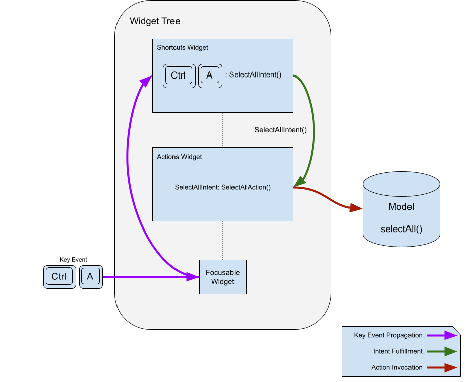

# Actions ve Shortcuts Kullanımı (Eylemler ve Kısayollar)

Bu sayfa, fiziksel klavye olaylarını kullanıcı arayüzündeki eylemlere nasıl bağlayacağınızı açıklar. Örneğin, uygulamanızda klavye kısayolları tanımlamak istiyorsanız, doğru yerdesiniz.

## Genel Bakış

Bir GUI (Grafiksel Kullanıcı Arayüzü) uygulamasının bir şeyler yapabilmesi için eylemlere (actions) ihtiyacı vardır: kullanıcılar uygulamaya *bir şey yapmasını* söylemek ister.

Basit uygulamalarda eylemler genellikle doğrudan işlevi gerçekleştiren fonksiyonlardır (bir değeri ayarlamak veya bir dosyayı kaydetmek gibi). Ancak daha büyük uygulamalarda işler karmaşıklaşır: Eylemi çağıran kod ile eylemin kendisini içeren kod farklı yerlerde olabilir. Kısayollar (tuş bağlamaları), hangi eylemi çağırdıklarını bilmeyen bir seviyede tanımlanmak zorunda kalabilir.




İşte Flutter'ın **Actions** ve **Shortcuts** sistemi burada devreye girer:
1.  **Shortcuts (Kısayollar):** Bir tuşa veya tuş kombinasyonuna basıldığında tetiklenir. Tuşları bir **Intent (Niyet)** ile eşleştirir.
2.  **Intent (Niyet):** Kullanıcının ne yapmak istediğini (örneğin "Kopyala" veya "Tümünü Seç") temsil eden genel bir eylemdir.
3.  **Actions (Eylemler):** Bir Intent'i yerine getiren mantıktır.

Bu sistem, geliştiricilerin kendilerine bağlanan niyetleri (intents) yerine getiren eylemler tanımlamasına olanak tanır. Bir `Intent` genel amaçlı olabilir ve farklı bağlamlarda farklı eylemler tarafından yerine getirilebilir.

### Neden Actions ve Intents Ayrılmalı?

"Neden bir tuş kombinasyonunu doğrudan bir fonksiyona bağlamıyoruz? Neden Intent'lere ihtiyacımız var?" diye düşünebilirsiniz.

Bunun temel nedenleri şunlardır:
* **İlgi Alanlarının Ayrılması (Separation of Concerns):** Tuş tanımlarının yapıldığı yer (genellikle üst seviyede) ile eylem tanımlarının yapıldığı yerin (genellikle alt seviyede) ayrılması yararlıdır.
* **Bağlam Duyarlılığı:** Uygulamada tek bir tuş kombinasyonunun (örneğin `Ctrl+A`), o an odaklanılan (focused) bağlama göre doğru eylemi gerçekleştirmesi gerekir. Örneğin, bir metin kutusunda "Tüm Metni Seç", bir çizim alanında "Tüm Şekilleri Seç" anlamına gelebilir. Tuş aynıdır, Niyet (`SelectAllIntent`) aynıdır, ancak Eylem (`Action`) farklıdır.

### Neden Callback (Geri Çağırma) Kullanılmasın?

Sadece callback kullanmak yerine neden `Action` nesneleri kullanalım?
Ana neden, eylemlerin `isEnabled` (etkin mi?) özelliğini uygulayarak kendi kendilerini etkinleştirip devre dışı bırakabilmeleridir. Ayrıca tuş bağlamaları ile bu bağlamaların uygulamasının farklı yerlerde olması genellikle yardımcı olur.

Eğer `Actions` ve `Shortcuts` esnekliğine ihtiyacınız yoksa ve sadece callback istiyorsanız, `CallbackShortcuts` widget'ını kullanabilirsiniz:

```dart
@override
Widget build(BuildContext context) {
  return CallbackShortcuts(
    bindings: <ShortcutActivator, VoidCallback>{
      const SingleActivator(LogicalKeyboardKey.arrowUp): () {
        setState(() => count = count + 1);
      },
      const SingleActivator(LogicalKeyboardKey.arrowDown): () {
        setState(() => count = count - 1);
      },
    },
    child: Focus(
      autofocus: true,
      child: Column(
        children: <Widget>[
          const Text('Sayacı artırmak için yukarı ok tuşuna basın'),
          const Text('Sayacı azaltmak için aşağı ok tuşuna basın'),
          Text('Sayaç: $count'),
        ],
      ),
    ),
  );
}
```

---

## Shortcuts (Kısayollar)

En yaygın kullanım durumu, eylemleri bir klavye kısayoluna bağlamaktır. `Shortcuts` widget'ı bunun için vardır.

Widget hiyerarşisine eklenir ve tuş kombinasyonlarını (kullanıcının niyetini temsil eden) tanımlar. Bu niyeti somut bir eyleme dönüştürmek için ise `Actions` widget'ı kullanılır.

```dart
@override
Widget build(BuildContext context) {
  return Shortcuts(
    // Tuşları Intent'e bağlar
    shortcuts: <LogicalKeySet, Intent>{
      LogicalKeySet(LogicalKeyboardKey.control, LogicalKeyboardKey.keyA):
          const SelectAllIntent(),
    },
    child: Actions(
      dispatcher: LoggingActionDispatcher(),
      // Intent'i Action'a bağlar
      actions: <Type, Action<Intent>>{
        SelectAllIntent: SelectAllAction(model),
      },
      child: Builder(
        builder: (context) => TextButton(
          // Butona basıldığında da aynı Intent tetiklenir
          onPressed: Actions.handler<SelectAllIntent>(
            context,
            const SelectAllIntent(),
          ),
          child: const Text('TÜMÜNÜ SEÇ'),
        ),
      ),
    ),
  );
}
```

### ShortcutManager

`ShortcutManager`, tuş olaylarını aldığında ileten ve `Shortcuts` widget'ından daha uzun ömürlü bir nesnedir. Tuşların nasıl işleneceğine karar verme mantığını içerir. Özel işlevsellik (örneğin loglama) için alt sınıflandırılabilir.

```dart
class LoggingShortcutManager extends ShortcutManager {
  @override
  KeyEventResult handleKeypress(BuildContext context, KeyEvent event) {
    final KeyEventResult result = super.handleKeypress(context, event);
    if (result == KeyEventResult.handled) {
      print('İşlenen kısayol: $event, bağlam: $context');
    }
    return result;
  }
}
```

---

## Actions (Eylemler)

Eylemler, uygulamanın bir `Intent` ile çağırarak gerçekleştirebileceği işlemlerin tanımlanmasını sağlar.

### Eylemleri Tanımlama

En basit haliyle eylemler, bir `invoke()` metoduna sahip `Action<Intent>` alt sınıflarıdır:

```dart
class SelectAllAction extends Action<SelectAllIntent> {
  SelectAllAction(this.model);

  final Model model;

  @override
  void invoke(covariant SelectAllIntent intent) => model.selectAll();
}
```

Veya yeni bir sınıf oluşturmak zahmetli geliyorsa `CallbackAction` kullanabilirsiniz:

```dart
CallbackAction(onInvoke: (intent) => model.selectAll());
```

### Eylemleri Çağırma (Invoking)

Eylemleri çağırmanın en yaygın yolu `Shortcuts` widget'ı olsa da, başka yollar da vardır. Örneğin bir butona basıldığında bir eylemi tetikleyebilirsiniz.

`Actions.handler` fonksiyonu, eğer Intent için geçerli bir eylem varsa bir işleyici (handler) oluşturur, yoksa `null` döner. Bu sayede, eğer bağlamda uygun bir eylem yoksa buton otomatik olarak devre dışı (disabled) kalabilir.

```dart
TextButton(
  onPressed: Actions.handler<SelectAllIntent>(
    context,
    SelectAllIntent(controller: controller),
  ),
  child: const Text('TÜMÜNÜ SEÇ'),
),
```

### Action Dispatchers (Eylem Dağıtıcıları)

Çoğu zaman sadece bir eylemi çağırmak yeterlidir. Ancak bazen çalıştırılan eylemleri loglamak (kayıt altına almak) isteyebilirsiniz. Bunun için varsayılan `ActionDispatcher`'ı kendi özel dağıtıcınızla değiştirebilirsiniz.

```dart
class LoggingActionDispatcher extends ActionDispatcher {
  @override
  Object? invokeAction(
    covariant Action<Intent> action,
    covariant Intent intent, [
    BuildContext? context,
  ]) {
    print('Eylem çağrıldı: $action($intent) - Yer: $context');
    super.invokeAction(action, intent, context);
    return null;
  }
}
```

Bunu en üst seviyedeki `Actions` widget'ınıza ileterek tüm eylemleri izleyebilirsiniz.

## Özet: Nasıl Bir Araya Gelir?

`Actions` ve `Shortcuts` kombinasyonu güçlüdür: Widget seviyesinde belirli eylemlere eşlenen genel niyetler (Intent) tanımlayabilirsiniz. Böylece hem klavye kısayolları hem de butonlar aynı mantığı (Action) çalıştırır ve kodunuz temiz kalır.


## İnteraktif Örnek

```dart

import 'package:flutter/material.dart';
import 'package:flutter/services.dart';

/// A text field that also has buttons to select all the text and copy the
/// selected text to the clipboard.
class CopyableTextField extends StatefulWidget {
  const CopyableTextField({super.key, required this.title});

  final String title;

  @override
  State<CopyableTextField> createState() => _CopyableTextFieldState();
}

class _CopyableTextFieldState extends State<CopyableTextField> {
  late final TextEditingController controller = TextEditingController();
  late final FocusNode focusNode = FocusNode();

  @override
  void dispose() {
    controller.dispose();
    focusNode.dispose();
    super.dispose();
  }

  @override
  Widget build(BuildContext context) {
    return Actions(
      dispatcher: LoggingActionDispatcher(),
      actions: <Type, Action<Intent>>{
        ClearIntent: ClearAction(controller),
        CopyIntent: CopyAction(controller),
        SelectAllIntent: SelectAllAction(controller, focusNode),
      },
      child: Builder(
        builder: (context) {
          return Scaffold(
            body: Center(
              child: Row(
                children: <Widget>[
                  const Spacer(),
                  Expanded(
                    child: TextField(
                      controller: controller,
                      focusNode: focusNode,
                    ),
                  ),
                  IconButton(
                    icon: const Icon(Icons.copy),
                    onPressed: Actions.handler<CopyIntent>(
                      context,
                      const CopyIntent(),
                    ),
                  ),
                  IconButton(
                    icon: const Icon(Icons.select_all),
                    onPressed: Actions.handler<SelectAllIntent>(
                      context,
                      const SelectAllIntent(),
                    ),
                  ),
                  const Spacer(),
                ],
              ),
            ),
          );
        },
      ),
    );
  }
}

/// A ShortcutManager that logs all keys that it handles.
class LoggingShortcutManager extends ShortcutManager {
  @override
  KeyEventResult handleKeypress(BuildContext context, KeyEvent event) {
    final KeyEventResult result = super.handleKeypress(context, event);
    if (result == KeyEventResult.handled) {
      print('Handled shortcut $event in $context');
    }
    return result;
  }
}

/// An ActionDispatcher that logs all the actions that it invokes.
class LoggingActionDispatcher extends ActionDispatcher {
  @override
  Object? invokeAction(
    covariant Action<Intent> action,
    covariant Intent intent, [
    BuildContext? context,
  ]) {
    print('Action invoked: $action($intent) from $context');
    super.invokeAction(action, intent, context);

    return null;
  }
}

/// An intent that is bound to ClearAction in order to clear its
/// TextEditingController.
class ClearIntent extends Intent {
  const ClearIntent();
}

/// An action that is bound to ClearIntent that clears its
/// TextEditingController.
class ClearAction extends Action<ClearIntent> {
  ClearAction(this.controller);

  final TextEditingController controller;

  @override
  Object? invoke(covariant ClearIntent intent) {
    controller.clear();

    return null;
  }
}

/// An intent that is bound to CopyAction to copy from its
/// TextEditingController.
class CopyIntent extends Intent {
  const CopyIntent();
}

/// An action that is bound to CopyIntent that copies the text in its
/// TextEditingController to the clipboard.
class CopyAction extends Action<CopyIntent> {
  CopyAction(this.controller);

  final TextEditingController controller;

  @override
  Object? invoke(covariant CopyIntent intent) {
    final String selectedString = controller.text.substring(
      controller.selection.baseOffset,
      controller.selection.extentOffset,
    );
    Clipboard.setData(ClipboardData(text: selectedString));

    return null;
  }
}

/// An intent that is bound to SelectAllAction to select all the text in its
/// controller.
class SelectAllIntent extends Intent {
  const SelectAllIntent();
}

/// An action that is bound to SelectAllAction that selects all text in its
/// TextEditingController.
class SelectAllAction extends Action<SelectAllIntent> {
  SelectAllAction(this.controller, this.focusNode);

  final TextEditingController controller;
  final FocusNode focusNode;

  @override
  Object? invoke(covariant SelectAllIntent intent) {
    controller.selection = controller.selection.copyWith(
      baseOffset: 0,
      extentOffset: controller.text.length,
      affinity: controller.selection.affinity,
    );

    focusNode.requestFocus();

    return null;
  }
}

/// The top level application class.
///
/// Shortcuts defined here are in effect for the whole app,
/// although different widgets may fulfill them differently.
class MyApp extends StatelessWidget {
  const MyApp({super.key});

  static const String title = 'Shortcuts and Actions Demo';

  @override
  Widget build(BuildContext context) {
    return MaterialApp(
      title: title,
      theme: ThemeData(
        colorScheme: ColorScheme.fromSeed(seedColor: Colors.deepPurple),
      ),
      home: Shortcuts(
        shortcuts: <LogicalKeySet, Intent>{
          LogicalKeySet(LogicalKeyboardKey.escape): const ClearIntent(),
          LogicalKeySet(LogicalKeyboardKey.control, LogicalKeyboardKey.keyC):
              const CopyIntent(),
          LogicalKeySet(LogicalKeyboardKey.control, LogicalKeyboardKey.keyA):
              const SelectAllIntent(),
        },
        child: const CopyableTextField(title: title),
      ),
    );
  }
}

void main() => runApp(const MyApp());
```


---
---

## 📄 Lisans Bilgisi

Bu doküman, **Flutter resmi dokümantasyonundan** türetilmiş Türkçe ders notudur.

**Orijinal kaynak:**  
https://docs.flutter.dev/ui/interactivity/actions-and-shortcuts

**Türkçe çeviri ve düzenleme:**  
[Doç. Dr. Hakan Temiz](mailto:htemiz@artvin.edu.tr)

---

### Lisans Kapsamı

Bu dokümandaki içerikler aşağıdaki açık lisanslar kapsamında sunulmaktadır:

**Metin içerikleri (anlatım ve açıklamalar):**  
Flutter resmi dokümantasyonundan alınmış veya uyarlanmıştır.  
**Lisans:** Creative Commons Attribution 4.0 International (CC BY 4.0)  
https://creativecommons.org/licenses/by/4.0/

Bu lisans kapsamında:
- İçerik kopyalanabilir, dağıtılabilir ve uyarlanabilir  
- Ticari kullanım serbesttir  
- Kaynak belirtilmesi zorunludur  

**Kod örnekleri:**  
Flutter resmi dokümantasyonundan alınmış veya uyarlanmıştır.  
**Lisans:** BSD 3-Clause License  
https://opensource.org/licenses/BSD-3-Clause

Bu lisans kapsamında:
- Kodlar kopyalanabilir, değiştirilebilir ve dağıtılabilir  
- Ticari kullanım serbesttir  
- Lisans bildiriminin korunması gerekir  

---
---
