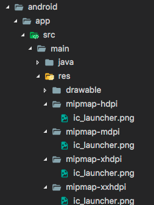
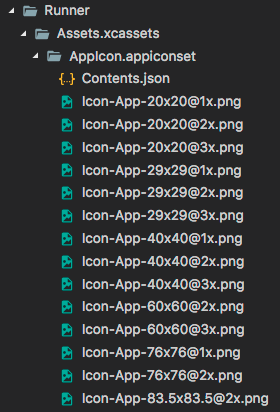

# Varlıklar (Assets) ve Görseller Ekleme

Flutter uygulamaları hem kod hem de *varlıklar* (bazen kaynaklar/resources olarak adlandırılır) içerebilir. Bir varlık, uygulamanızla birlikte paketlenen, dağıtılan ve çalışma zamanında erişilebilen bir dosyadır. Yaygın varlık türleri arasında statik veriler (örneğin JSON dosyaları), yapılandırma dosyaları, simgeler ve görseller (JPEG, WebP, GIF, animasyonlu WebP/GIF, PNG, BMP ve WBMP) bulunur.

## Varlıkları Belirtme

Flutter, bir uygulama için gerekli varlıkları tanımlamak amacıyla projenizin kök dizininde bulunan `pubspec.yaml` dosyasını kullanır.

İşte bir örnek:

```yaml
flutter:
  assets:
    - assets/my_icon.png
    - assets/background.png
```

Bir dizin altındaki tüm varlıkları dahil etmek için, dizin adını sonuna `/` karakteri koyarak belirtin:

```yaml
flutter:
  assets:
    - directory/
    - directory/subdirectory/
```

> **Not:** Yalnızca doğrudan dizinde bulunan dosyalar dahil edilir. [Çözünürlüğe duyarlı varlık görsel varyantları](https://www.google.com/search?q=%23cozunurluge-duyarli-gorsel-varliklari) tek istisnadır. Alt dizinlerde bulunan dosyaları eklemek için her dizin için ayrı bir giriş oluşturun.

> **Not:** YAML'da girinti (indentation) önemlidir. Eğer `Error: unable to find directory entry in pubspec.yaml` gibi bir hata görürseniz, `pubspec` dosyanızda yanlış girinti yapmış olabilirsiniz. Aşağıdaki **hatalı** örneği inceleyin:
> ```yaml
> flutter:
> assets:
>   - directory/
> 
> ```
> 
> 
> `assets:` satırı, `flutter:` satırının altından tam olarak iki boşluk içeriden başlamalıdır:
> ```yaml
> flutter:
>   assets:
>     - directory/
> 
> ```
> 
> 

### Varlık Paketleme (Asset Bundling)

`flutter` bölümünün `assets` alt bölümü, uygulama ile birlikte dahil edilmesi gereken dosyaları belirtir. Her varlık, varlık dosyasının bulunduğu yerin açık bir yoluyla ( `pubspec.yaml` dosyasına göreli olarak) tanımlanır. Varlıkların bildirilme sırası önemli değildir. Kullanılan gerçek dizin adı (ilk örnekteki `assets` veya yukarıdaki örnekteki `directory`) önemli değildir.

Derleme (build) sırasında Flutter, varlıkları uygulamaların çalışma zamanında okuduğu *varlık demeti* (asset bundle) adı verilen özel bir arşive yerleştirir.

### Derleme Zamanında Varlık Dosyalarının Otomatik Dönüştürülmesi

Flutter, uygulamanızı derlerken varlık dosyalarını dönüştürmek için bir Dart paketi kullanmayı destekler. Bunu yapmak için, `pubspec` dosyanızda varlık dosyalarını ve dönüştürücü paketini belirtin. Bunu nasıl yapacağınızı ve kendi varlık dönüştüren paketlerinizi nasıl yazacağınızı öğrenmek için "Transforming assets at build time" belgelerine bakabilirsiniz.

## Varlıkları Yükleme

Uygulamanız varlıklarına bir `AssetBundle` nesnesi aracılığıyla erişebilir.

Bir varlık demeti üzerindeki iki ana yöntem, mantıksal bir anahtar (logical key) verildiğinde, demetten bir dize/metin varlığı (`loadString()`) veya bir görsel/ikili varlık (`load()`) yüklemenize olanak tanır. Mantıksal anahtar, derleme zamanında `pubspec.yaml` dosyasında belirtilen varlığın yoluyla eşleşir.

### Metin Varlıklarını Yükleme

Her Flutter uygulamasının ana varlık demetine kolay erişim için bir `rootBundle` nesnesi vardır. Varlıkları doğrudan `package:flutter/services.dart` içindeki `rootBundle` global statiğini kullanarak yüklemek mümkündür.

Ancak, uygulamayla birlikte oluşturulan varsayılan varlık demeti yerine `DefaultAssetBundle` kullanarak mevcut `BuildContext` için `AssetBundle`'ı elde etmek önerilir; bu yaklaşım, bir ebeveyn widget'ın çalışma zamanında farklı bir `AssetBundle` ikame etmesine olanak tanır, bu da yerelleştirme (localization) veya test senaryoları için yararlı olabilir.

Genellikle, örneğin bir JSON dosyası gibi bir varlığı uygulamanın çalışma zamanı `rootBundle`'ından dolaylı olarak yüklemek için `DefaultAssetBundle.of()` kullanırsınız.

Bir `Widget` bağlamının dışında veya bir `AssetBundle` tanıtıcısının mevcut olmadığı durumlarda, bu tür varlıkları doğrudan yüklemek için `rootBundle` kullanabilirsiniz. Örneğin:

```dart
import 'package:flutter/services.dart' show rootBundle;

Future<String> loadAsset() async {
  return await rootBundle.loadString('assets/config.json');
}
```

### Görselleri Yükleme

Bir görseli yüklemek için, bir widget'ın `build()` yönteminde `AssetImage` sınıfını kullanın.

Örneğin, uygulamanız önceki örnekteki varlık bildirimlerinden arka plan görselini yükleyebilir:

```dart
return const Image(image: AssetImage('assets/background.png'));
```

### Çözünürlüğe Duyarlı Görsel Varlıkları

Flutter, mevcut cihaz piksel oranı (device pixel ratio) için uygun çözünürlükteki görselleri yükleyebilir. `AssetImage`, talep edilen mantıksal bir varlığı, mevcut cihaz piksel oranıyla en yakından eşleşen varlığa eşler.

Bu eşlemenin çalışması için, varlıklar belirli bir dizin yapısına göre düzenlenmelidir:

```text
.../image.png
.../Mx/image.png
.../Nx/image.png
...vb.
```

Burada `M` ve `N`, içerilen görsellerin nominal çözünürlüğüne karşılık gelen sayısal tanımlayıcılardır. Başka bir deyişle, görsellerin amaçlandığı cihaz piksel oranını belirtirler.

Bu örnekte, `image.png` **ana varlık** (main asset) olarak kabul edilirken, `Mx/image.png` ve `Nx/image.png` **varyantlar** olarak kabul edilir.

Ana varlığın 1.0 çözünürlüğüne karşılık geldiği varsayılır. Örneğin, `my_icon.png` adlı bir görsel için aşağıdaki varlık düzenini düşünün:

```text
.../my_icon.png       (mdpi temel)
.../1.5x/my_icon.png  (hdpi)
.../2.0x/my_icon.png  (xhdpi)
.../3.0x/my_icon.png  (xxhdpi)
.../4.0x/my_icon.png  (xxxhdpi)
```

Cihaz piksel oranı 1.8 olan cihazlarda, `.../2.0x/my_icon.png` varlığı seçilir. Cihaz piksel oranı 2.7 olan bir cihaz için `.../3.0x/my_icon.png` varlığı seçilir.

Eğer oluşturulan görselin genişliği ve yüksekliği `Image` widget'ında belirtilmemişse, varlığın ana varlıkla aynı miktarda ekran alanını kaplaması (ancak daha yüksek çözünürlükle) için nominal çözünürlük kullanılır. Yani, eğer `.../my_icon.png` 72px'e 72px ise, `.../3.0x/my_icon.png` 216px'e 216px olmalıdır; ancak genişlik ve yükseklik belirtilmemişse her ikisi de (mantıksal piksellerde) 72px'e 72px olarak oluşturulur.

> **Not:** Cihaz piksel oranı `MediaQueryData.size`'a bağlıdır, bu da `AssetImage`'ınızın atası (ancestor) olarak `MaterialApp` veya `CupertinoApp` olmasını gerektirir.

#### Çözünürlüğe Duyarlı Görsel Varlıklarının Paketlenmesi

`pubspec.yaml` dosyasının `assets` bölümünde yalnızca ana varlığı veya onun üst dizinini belirtmeniz gerekir. Flutter varyantları sizin için paketler. Her giriş gerçek bir dosyaya karşılık gelmelidir, ana varlık girişi hariç. Ana varlık girişi gerçek bir dosyaya karşılık gelmiyorsa, en düşük çözünürlüğe sahip varlık, bu çözünürlüğün altındaki cihaz piksel oranlarına sahip cihazlar için yedek olarak kullanılır. Ancak girişin yine de `pubspec.yaml` bildirimine dahil edilmesi gerekir.

Varsayılan varlık demetini kullanan her şey, görselleri yüklerken çözünürlük duyarlılığını devralır. (`ImageStream` veya `ImageCache` gibi daha düşük seviyeli sınıflarla çalışırsanız, ölçekle ilgili parametreleri de fark edersiniz.)

## Paket Bağımlılıklarındaki Varlık Görselleri

Bir paket bağımlılığından bir görsel yüklemek için, `AssetImage`'a `package` argümanı sağlanmalıdır.

Örneğin, uygulamanızın aşağıdaki dizin yapısına sahip `my_icons` adlı bir pakete bağlı olduğunu varsayalım:

```text
.../pubspec.yaml
.../icons/heart.png
.../icons/1.5x/heart.png
.../icons/2.0x/heart.png
...vb.
```

Görseli yüklemek için şunu kullanın:

```dart
return const AssetImage('icons/heart.png', package: 'my_icons');
```

Paketin kendisi tarafından kullanılan varlıklar da yukarıdaki gibi `package` argümanı kullanılarak getirilmelidir.

### Paket Varlıklarının Paketlenmesi

İstenen varlık paketin `pubspec.yaml` dosyasında belirtilmişse, uygulamayla otomatik olarak paketlenir. Özellikle, paketin kendisi tarafından kullanılan varlıklar, kendi `pubspec.yaml` dosyasında belirtilmelidir.

Bir paket, `pubspec.yaml` dosyasında belirtilmemiş olsa bile `lib/` klasöründe varlıklara sahip olmayı seçebilir. Bu durumda, bu görsellerin paketlenmesi için uygulamanın hangilerini dahil edeceğini kendi `pubspec.yaml` dosyasında belirtmesi gerekir. Örneğin, `fancy_backgrounds` adlı bir paket aşağıdaki dosyalara sahip olabilir:

```text
.../lib/backgrounds/background1.png
.../lib/backgrounds/background2.png
.../lib/backgrounds/background3.png

```

Diyelim ki ilk görseli dahil etmek için, uygulamanın `pubspec.yaml` dosyası bunu `assets` bölümünde belirtmelidir:

```yaml
flutter:
  assets:
    - packages/fancy_backgrounds/backgrounds/background1.png
```

`lib/` kısmı ima edilir (varsayılır), bu yüzden varlık yoluna dahil edilmemelidir.

Eğer bir paket geliştiriyorsanız, paket içindeki bir varlığı yüklemek için bunu paketin `pubspec.yaml` dosyasında belirtin:

```yaml
flutter:
  assets:
    - assets/images/
```

Görseli paketiniz içinde yüklemek için şunu kullanın:

```dart
return const AssetImage('packages/fancy_backgrounds/backgrounds/background1.png');
```

## Varlıkları Temel Platformla Paylaşma

Flutter varlıkları, Android'de `AssetManager` ve iOS'ta `NSBundle` kullanılarak platform koduna kolayca sunulur.

### Android'de Flutter Varlıklarını Yükleme

Android'de varlıklar `AssetManager` API'si aracılığıyla kullanılabilir. Örneğin `openFd` içinde kullanılan arama anahtarı, `PluginRegistry.Registrar` üzerindeki `lookupKeyForAsset` veya `FlutterView` üzerindeki `getLookupKeyForAsset` ile elde edilir. `PluginRegistry.Registrar` bir eklenti geliştirirken kullanılırken, `FlutterView` bir platform görünümü (platform view) içeren bir uygulama geliştirirken tercih edilir.

Örnek olarak, `pubspec.yaml` dosyanızda aşağıdakileri belirttiğinizi varsayalım:

```yaml
flutter:
  assets:
    - icons/heart.png

```

Bu, Flutter uygulamanızdaki şu yapıyı yansıtır:

```text
.../pubspec.yaml
.../icons/heart.png
...vb.
```

Java eklenti kodunuzdan `icons/heart.png` dosyasına erişmek için aşağıdakileri yapın:

```java
AssetManager assetManager = registrar.context().getAssets();
String key = registrar.lookupKeyForAsset("icons/heart.png");
AssetFileDescriptor fd = assetManager.openFd(key);
```

### iOS'ta Flutter Varlıklarını Yükleme

iOS'ta varlıklar `mainBundle` aracılığıyla kullanılabilir. Örneğin `pathForResource:ofType:` içinde kullanılan arama anahtarı, `FlutterPluginRegistrar` üzerindeki `lookupKeyForAsset` veya `lookupKeyForAsset:fromPackage:` ile; ya da `FlutterViewController` üzerindeki `lookupKeyForAsset:` veya `lookupKeyForAsset:fromPackage:` ile elde edilir. `FlutterPluginRegistrar` bir eklenti geliştirirken kullanılırken, `FlutterViewController` bir platform görünümü içeren bir uygulama geliştirirken tercih edilir.

Örnek olarak, yukarıdaki Flutter ayarına sahip olduğunuzu varsayalım.
Objective-C eklenti kodunuzdan `icons/heart.png` dosyasına erişmek için aşağıdakileri yaparsınız:

```objectivec
NSString* key = [registrar lookupKeyForAsset:@"icons/heart.png"];
NSString* path = [[NSBundle mainBundle] pathForResource:key ofType:nil];
```

Swift uygulamanızdan `icons/heart.png` dosyasına erişmek için aşağıdakileri yaparsınız:

```swift
let key = controller.lookupKey(forAsset: "icons/heart.png")
let mainBundle = Bundle.main
let path = mainBundle.path(forResource: key, ofType: nil)
```

Daha eksiksiz bir örnek için, pub.dev üzerindeki Flutter `video_player` eklentisinin uygulamasına bakın.

### Flutter'da iOS Görsellerini Yükleme

Flutter'ı mevcut bir iOS uygulamasına ekleyerek uygularken, iOS'ta barındırılan ve Flutter'da kullanmak istediğiniz görselleriniz olabilir. Bunu başarmak için, görsel verilerini Dart'a `FlutterStandardTypedData` olarak iletmek üzere *platform kanallarını* (platform channels) kullanın.

## Platform Varlıkları

Platform projelerinde varlıklarla doğrudan çalışılması gereken başka durumlar da vardır. Aşağıda, Flutter çerçevesi yüklenip çalışmadan önce varlıkların kullanıldığı iki yaygın durum verilmiştir.

### Uygulama Simgesini (App Icon) Güncelleme

Bir Flutter uygulamasının başlatma simgesini güncellemek, yerel Android veya iOS uygulamalarındaki başlatma simgelerini güncellemekle aynı şekilde çalışır.

#### Android

Flutter projenizin kök dizininde, `.../android/app/src/main/res` yoluna gidin. `mipmap-hdpi` gibi çeşitli bitmap kaynak klasörleri zaten `ic_launcher.png` adlı yer tutucu görseller içerir. Bunları, [Android Geliştirici Kılavuzu](https://developer.android.com/training/multiscreen/screendensities)'nda belirtilen ekran yoğunluğu başına önerilen simge boyutuna uygun olarak istediğiniz varlıklarla değiştirin.



> **Not:** Eğer `.png` dosyalarını yeniden adlandırırsanız, `AndroidManifest.xml` dosyanızın `<application>` etiketinin `android:icon` özelliğindeki karşılık gelen adı da güncellemelisiniz.

#### iOS

Flutter projenizin kök dizininde, `.../ios/Runner` yoluna gidin. `Assets.xcassets/AppIcon.appiconset` dizini zaten yer tutucu görseller içerir. Bunları, Apple İnsan Arayüzü Yönergeleri ([Human Interface Guidelines](https://developer.apple.com/design/human-interface-guidelines/app-icons)) tarafından dikte edilen dosya adlarına göre uygun boyuttaki görsellerle değiştirin. Orijinal dosya adlarını koruyun.




### Başlatma Ekranını (Launch Screen) Güncelleme

Flutter ayrıca, Flutter çerçevesi yüklenirken Flutter uygulamanıza geçiş başlatma ekranları çizmek için yerel platform mekanizmalarını kullanır. Bu başlatma ekranı, Flutter uygulamanızın ilk karesini oluşturana kadar kalır.

> **Not:** Bu, uygulamanızın `main()` işlevinde `runApp()` çağırmazsanız (veya daha spesifik olarak, `PlatformDispatcher.onDrawFrame` yanıtı olarak `FlutterView.render()` çağırmazsanız), başlatma ekranının sonsuza kadar kalacağı anlamına gelir.

#### Android

Flutter uygulamanıza bir başlatma ekranı (aynı zamanda "splash screen" olarak da bilinir) eklemek için `.../android/app/src/main` yoluna gidin. `res/drawable/launch_background.xml` içinde, başlatma ekranınızın görünümünü özelleştirmek için bu katman listesi çizilebilir (layer list drawable) XML'ini kullanın. Mevcut şablon, yorum satırına alınmış kodda beyaz bir açılış ekranının ortasına bir görsel eklemenin bir örneğini sunar. İstenen efekti elde etmek için yorum satırlarını kaldırabilir veya diğer `drawable`'ları kullanabilirsiniz.

Daha fazla ayrıntı için, "Adding a splash screen to your Android app" (Android uygulamanıza açılış ekranı ekleme) konusuna bakın.

#### iOS

"Splash screen"inizin ortasına bir görsel eklemek için `.../ios/Runner` yoluna gidin. `Assets.xcassets/LaunchImage.imageset` içine `LaunchImage.png`, `LaunchImage@2x.png`, `LaunchImage@3x.png` adlı görselleri bırakın. Farklı dosya adları kullanırsanız, aynı dizindeki `Contents.json` dosyasını güncelleyin.

Ayrıca `.../ios/Runner.xcworkspace` dosyasını açarak Xcode'da başlatma ekranı storyboard'unuzu tamamen özelleştirebilirsiniz. Proje Gezgini'nde `Runner/Runner`'a gidin ve `Assets.xcassets`'i açarak görselleri bırakın veya `LaunchScreen.storyboard` içindeki Interface Builder'ı kullanarak herhangi bir özelleştirme yapın.

Daha fazla ayrıntı için, "Adding a splash screen to your iOS app" (iOS uygulamanıza açılış ekranı ekleme) konusuna bakın.


# İnternetten resim görüntüleme

Resim görüntülemek çoğu mobil uygulama için temeldir. Flutter, farklı türdeki resimleri görüntülemek için `Image` widget'ını sağlar.


Bir URL'den gelen resimlerle çalışmak için `Image.network()` kurucusunu (constructor) kullanın.

```dart
Image.network('[https://picsum.photos/250?image=9](https://picsum.photos/250?image=9)'),
```

### Bonus: hareketli gifler

`Image` widget'ı hakkında yararlı bir şey: Hareketli gifleri destekler.


### Yer tutucularla (placeholder) resimlerin yavaşça belirmesi

Varsayılan `Image.network` kurucusu, yüklemeden sonra resimlerin yavaşça belirmesi (fade in) gibi daha gelişmiş işlevleri ele almaz. Bu görevi gerçekleştirmek için **Yer tutucu ile resimleri yavaşça belirginleştirme** konusuna göz atın.

**Etkileşimli örnek**

```dart
import 'package:flutter/material.dart';

void main() => runApp(const MyApp());

class MyApp extends StatelessWidget {
  const MyApp({super.key});

  @override
  Widget build(BuildContext context) {
    var title = 'Web Images';

    return MaterialApp(
      title: title,
      home: Scaffold(
        appBar: AppBar(title: Text(title)),
        body: Image.network('https://picsum.photos/250?image=9'),
      ),
    );
  }
}
```


# Yer tutucu ile resimleri yavaşça belirginleştirme (Fade in images)

Varsayılan `Image` widget'ını kullanarak resimleri görüntülerken, yüklendikleri anda ekrana birden bire fırladıklarını fark edebilirsiniz. Bu, kullanıcılarınız için görsel olarak sarsıcı olabilir.

Bunun yerine, başlangıçta bir yer tutucu (placeholder) görüntülemek ve resimlerin yüklendikçe yavaşça belirginleşmesi (fade in) daha hoş olmaz mıydı? Tam olarak bu amaçla `FadeInImage` widget'ını kullanın.

`FadeInImage`, herhangi bir türdeki resimle çalışır: bellek içi (in-memory), yerel varlıklar (local assets) veya internetten gelen resimler.

### Bellek İçi (In-Memory)

Bu örnekte, basit şeffaf bir yer tutucu için `transparent_image` paketini kullanın.

```dart
FadeInImage.memoryNetwork(
  placeholder: kTransparentImage,
  image: '[https://picsum.photos/250?image=9](https://picsum.photos/250?image=9)',
),
```

**Tam örnek:**

```dart
import 'package:flutter/material.dart';
import 'package:transparent_image/transparent_image.dart';

void main() {
  runApp(const MyApp());
}

class MyApp extends StatelessWidget {
  const MyApp({super.key});

  @override
  Widget build(BuildContext context) {
    const title = 'Fade in images';

    return MaterialApp(
      title: title,
      home: Scaffold(
        appBar: AppBar(title: const Text(title)),
        body: Stack(
          children: <Widget>[
            const Center(child: CircularProgressIndicator()),
            Center(
              child: FadeInImage.memoryNetwork(
                placeholder: kTransparentImage,
                image: '[https://picsum.photos/250?image=9](https://picsum.photos/250?image=9)',
              ),
            ),
          ],
        ),
      ),
    );
  }
}
```


### Varlık paketinden (Asset bundle)

Yer tutucular için yerel varlıkları kullanmayı da düşünebilirsiniz. İlk olarak, varlığı projenin `pubspec.yaml` dosyasına ekleyin (daha fazla ayrıntı için **Varlık ve resim ekleme** bölümüne bakın):

```yaml
flutter:
  assets:
    - assets/loading.gif
```

Ardından, `FadeInImage.assetNetwork()` kurucusunu kullanın:

```dart
FadeInImage.assetNetwork(
  placeholder: 'assets/loading.gif',
  image: '[https://picsum.photos/250?image=9](https://picsum.photos/250?image=9)',
),
```

**Tam örnek:**

```dart
import 'package:flutter/material.dart';

void main() {
  runApp(const MyApp());
}

class MyApp extends StatelessWidget {
  const MyApp({super.key});

  @override
  Widget build(BuildContext context) {
    const title = 'Fade in images';

    return MaterialApp(
      title: title,
      home: Scaffold(
        appBar: AppBar(title: const Text(title)),
        body: Center(
          child: FadeInImage.assetNetwork(
            placeholder: 'assets/loading.gif',
            image: '[https://picsum.photos/250?image=9](https://picsum.photos/250?image=9)',
          ),
        ),
      ),
    );
  }
}
```


# Video Oynatma ve Duraklatma

Flutter'da video oynatmak, `video_player` eklentisi kullanılarak gerçekleştirilen yaygın bir işlemdir. Bu eklenti, dosya sisteminden, varlıklardan (assets) veya internetten video oynatmanıza olanak tanır.

Flutter, iOS'te oynatma işlemleri için **AVPlayer**, Android'de ise **ExoPlayer** kullanır. Bu rehber, temel oynatma ve duraklatma kontrolleriyle internetten video akışının nasıl yapılacağını gösterir.

### 1. `video_player` bağımlılığını ekleyin

Öncelikle projenize eklentiyi dahil etmeniz gerekir. Terminalinizde şu komutu çalıştırın:

```bash
flutter pub add video_player
```

### 2. Uygulama izinlerini ekleyin

Uygulamanızın internetten video akışı yapabilmesi için platforma özel yapılandırmaları güncellemeniz gerekir.

* **Android:** `<project root>/android/app/src/main/AndroidManifest.xml` dosyasında `<application>` etiketinden hemen sonra şu izni ekleyin:
```xml
<uses-permission android:name="android.permission.INTERNET"/>
```


* **iOS:** `<project root>/ios/Runner/Info.plist` dosyasına şunları ekleyin:
```xml
<key>NSAppTransportSecurity</key>
<dict>
  <key>NSAllowsArbitraryLoads</key>
  <true/>
</dict>
```


> **Uyarı:** iOS simülatörleri sadece asset (varlık) videolarını oynatabilir. Ağ tabanlı videoları test etmek için fiziksel bir iOS cihazı kullanmalısınız.

### 3. `VideoPlayerController` oluşturun ve başlatın

`VideoPlayerController`, oynatmayı kontrol etmenizi ve videoya bağlanmanızı sağlar. Videoları oynatabilmek için önce denetleyiciyi **başlatmanız (initialize)** gerekir.

Bunun için bir `StatefulWidget` kullanın ve denetleyiciyi `initState` içinde oluşturup, `dispose` içinde serbest bırakın.

```dart
class VideoPlayerScreen extends StatefulWidget {
  const VideoPlayerScreen({super.key});

  @override
  State<VideoPlayerScreen> createState() => _VideoPlayerScreenState();
}

class _VideoPlayerScreenState extends State<VideoPlayerScreen> {
  late VideoPlayerController _controller;
  late Future<void> _initializeVideoPlayerFuture;

  @override
  void initState() {
    super.initState();
    // Denetleyiciyi internetten bir video ile oluşturun.
    _controller = VideoPlayerController.networkUrl(
      Uri.parse(
        'https://flutter.github.io/assets-for-api-docs/assets/videos/butterfly.mp4',
      ),
    );

    // Denetleyiciyi başlatın ve Future'ı saklayın.
    _initializeVideoPlayerFuture = _controller.initialize();
  }

  @override
  void dispose() {
    // Kaynakları serbest bırakmak için denetleyiciyi dispose edin.
    _controller.dispose();
    super.dispose();
  }

  @override
  Widget build(BuildContext context) {
    // UI kodları bir sonraki adımda eklenecek.
    return Container();
  }
}
```

### 4. Video oynatıcıyı görüntüleyin

Video oynatıcıyı görüntülemek için `VideoPlayer` widget'ını kullanın. Ancak, videoların genellikle belirli bir en boy oranında (örneğin 16:9) görüntülenmesi gerekir. Bu nedenle, `VideoPlayer` widget'ını bir `AspectRatio` widget'ı ile sarmanız önerilir.

Ayrıca, denetleyicinin başlatılmasını beklemek için bir `FutureBuilder` kullanmalısınız. Bu, video hazır olana kadar bir yükleme çarkı (spinner) göstermenizi sağlar.

```dart
// build metodu içinde:
FutureBuilder(
  future: _initializeVideoPlayerFuture,
  builder: (context, snapshot) {
    if (snapshot.connectionState == ConnectionState.done) {
      // Denetleyici başlatıldıysa, doğru en boy oranını kullanın.
      return AspectRatio(
        aspectRatio: _controller.value.aspectRatio,
        child: VideoPlayer(_controller),
      );
    } else {
      // Denetleyici hala başlatılıyorsa yükleme göstergesi görüntüleyin.
      return const Center(child: CircularProgressIndicator());
    }
  },
)
```

### 5. Videoyu oynatın ve duraklatın

Varsayılan olarak video duraklatılmış durumda başlar. Oynatmak için `play()`, duraklatmak için `pause()` metodunu kullanın. Kullanıcı etkileşimi için bir `FloatingActionButton` ekleyebilirsiniz.

```dart
FloatingActionButton(
  onPressed: () {
    // İkonun doğru güncellenmesi için setState kullanın.
    setState(() {
      if (_controller.value.isPlaying) {
        _controller.pause();
      } else {
        _controller.play();
      }
    });
  },
  // Oynatıcı durumuna göre doğru ikonu gösterin.
  child: Icon(
    _controller.value.isPlaying ? Icons.pause : Icons.play_arrow,
  ),
)
```


## İnteraktif Örnek

```dart
import 'dart:async';

import 'package:flutter/material.dart';
import 'package:video_player/video_player.dart';

void main() => runApp(const VideoPlayerApp());

class VideoPlayerApp extends StatelessWidget {
  const VideoPlayerApp({super.key});

  @override
  Widget build(BuildContext context) {
    return const MaterialApp(
      title: 'Video Player Demo',
      home: VideoPlayerScreen(),
    );
  }
}

class VideoPlayerScreen extends StatefulWidget {
  const VideoPlayerScreen({super.key});

  @override
  State<VideoPlayerScreen> createState() => _VideoPlayerScreenState();
}

class _VideoPlayerScreenState extends State<VideoPlayerScreen> {
  late VideoPlayerController _controller;
  late Future<void> _initializeVideoPlayerFuture;

  @override
  void initState() {
    super.initState();

    // Create and store the VideoPlayerController. The VideoPlayerController
    // offers several different constructors to play videos from assets, files,
    // or the internet.
    _controller = VideoPlayerController.networkUrl(
      Uri.parse(
        'https://flutter.github.io/assets-for-api-docs/assets/videos/butterfly.mp4',
      ),
    );

    // Initialize the controller and store the Future for later use.
    _initializeVideoPlayerFuture = _controller.initialize();

    // Use the controller to loop the video.
    _controller.setLooping(true);
  }

  @override
  void dispose() {
    // Ensure disposing of the VideoPlayerController to free up resources.
    _controller.dispose();

    super.dispose();
  }

  @override
  Widget build(BuildContext context) {
    return Scaffold(
      appBar: AppBar(title: const Text('Butterfly Video')),
      // Use a FutureBuilder to display a loading spinner while waiting for the
      // VideoPlayerController to finish initializing.
      body: FutureBuilder(
        future: _initializeVideoPlayerFuture,
        builder: (context, snapshot) {
          if (snapshot.connectionState == ConnectionState.done) {
            // If the VideoPlayerController has finished initialization, use
            // the data it provides to limit the aspect ratio of the video.
            return AspectRatio(
              aspectRatio: _controller.value.aspectRatio,
              // Use the VideoPlayer widget to display the video.
              child: VideoPlayer(_controller),
            );
          } else {
            // If the VideoPlayerController is still initializing, show a
            // loading spinner.
            return const Center(child: CircularProgressIndicator());
          }
        },
      ),
      floatingActionButton: FloatingActionButton(
        onPressed: () {
          // Wrap the play or pause in a call to `setState`. This ensures the
          // correct icon is shown.
          setState(() {
            // If the video is playing, pause it.
            if (_controller.value.isPlaying) {
              _controller.pause();
            } else {
              // If the video is paused, play it.
              _controller.play();
            }
          });
        },
        // Display the correct icon depending on the state of the player.
        child: Icon(
          _controller.value.isPlaying ? Icons.pause : Icons.play_arrow,
        ),
      ),
    );
  }
}
```


# Derleme sırasında varlıkları dönüştürme (Transforming assets at build time)

Projenizi, uyumlu Dart paketlerini kullanarak derleme (build) sırasında varlıkları otomatik olarak dönüştürecek şekilde yapılandırabilirsiniz.


## Varlık dönüşümlerini belirleme

Dönüştürülecek varlıkları ve ilgili dönüştürücü paketini `pubspec.yaml` dosyasında listeleyin.

```yaml
flutter:
  assets:
    - path: assets/logo.svg
      transformers:
        - package: vector_graphics_compiler
```

Bu yapılandırma ile `assets/logo.svg` dosyası, derleme çıktısına kopyalanırken `vector_graphics_compiler` paketi tarafından dönüştürülür. Bu paket, SVG dosyalarını önceden derleyerek (precompile) `vector_graphics` paketi kullanılarak görüntülenebilen optimize edilmiş ikili dosyalara dönüştürür:

```dart
import 'package:vector_graphics/vector_graphics.dart';

const Widget logo = VectorGraphic(loader: AssetBytesLoader('assets/logo.svg'));
```

## Varlık dönüştürücülerine argüman geçirme

Bir varlık dönüştürücüsüne bir argüman dizesi iletmek için, bunu `pubspec` dosyasında ayrıca belirtin:

```yaml
flutter:
  assets:
    - path: assets/logo.svg
      transformers:
        - package: vector_graphics_compiler
          args: ['--tessellate', '--font-size=14']
```

## Varlık dönüştürücülerini zincirleme (Chaining)

Varlık dönüştürücüleri zincirlenebilir ve **bildirildikleri sırayla** uygulanır. Hayali paketler kullanan aşağıdaki örneği düşünün:

```yaml
flutter:
  assets:
    - path: assets/kus.png
      transformers:
        - package: grayscale_filter
        - package: png_optimizer
```

Burada, `kus.png` önce `grayscale_filter` paketi tarafından dönüştürülür (gri tonlamalı yapılır). Çıktı daha sonra `png_optimizer` paketi tarafından dönüştürülür ve son olarak derlenen uygulamaya dahil edilir.

## Varlık dönüştürücü paketleri yazma

Kendi dönüştürücünüzü yazmak isterseniz, bir varlık dönüştürücüsü aslında `dart run` ile çağrılan ve en az iki argüman alan bir **Dart komut satırı uygulamasıdır**:

* `--input`: Dönüştürülecek dosyanın yolunu içerir.
* `--output`: Dönüştürücü kodunun çıktısını yazması gereken konumu belirtir.

Dönüştürücü sıfır olmayan bir çıkış koduyla (non-zero exit code) biterse, uygulama derlemesi başarısız olur ve varlık dönüşümünün başarısız olduğunu açıklayan bir hata mesajı görüntülenir. Dönüştürücü tarafından işlemin `stderr` akışına yazılan her şey hata mesajına dahil edilir.

Dönüştürücünün çağrılması sırasında, `FLUTTER_BUILD_MODE` ortam değişkeni, kullanılan derleme modunun CLI adına ayarlanır. Örneğin, uygulamanızı `flutter run -d macos --release` ile çalıştırırsanız, `FLUTTER_BUILD_MODE`, `release` olarak ayarlanır.

---

**Sıradaki Adım:** Bu özelliği denemek için projenize bir SVG dosyası ekleyip `vector_graphics` paketini kurarak performans farkını gözlemlemek ister misiniz?


---
---

## 📄 Lisans Bilgisi

Bu doküman, **Flutter resmi dokümantasyonundan** türetilmiş Türkçe ders notudur.

**Orijinal kaynak:**  
https://docs.flutter.dev/ui/assets/assets-and-images

**Türkçe çeviri ve düzenleme:**  
[Doç. Dr. Hakan Temiz](mailto:htemiz@artvin.edu.tr)

---

### Lisans Kapsamı

Bu dokümandaki içerikler aşağıdaki açık lisanslar kapsamında sunulmaktadır:

**Metin içerikleri (anlatım ve açıklamalar):**  
Flutter resmi dokümantasyonundan alınmış veya uyarlanmıştır.  
**Lisans:** Creative Commons Attribution 4.0 International (CC BY 4.0)  
https://creativecommons.org/licenses/by/4.0/

Bu lisans kapsamında:
- İçerik kopyalanabilir, dağıtılabilir ve uyarlanabilir  
- Ticari kullanım serbesttir  
- Kaynak belirtilmesi zorunludur  

**Kod örnekleri:**  
Flutter resmi dokümantasyonundan alınmış veya uyarlanmıştır.  
**Lisans:** BSD 3-Clause License  
https://opensource.org/licenses/BSD-3-Clause

Bu lisans kapsamında:
- Kodlar kopyalanabilir, değiştirilebilir ve dağıtılabilir  
- Ticari kullanım serbesttir  
- Lisans bildiriminin korunması gerekir  

---
---
