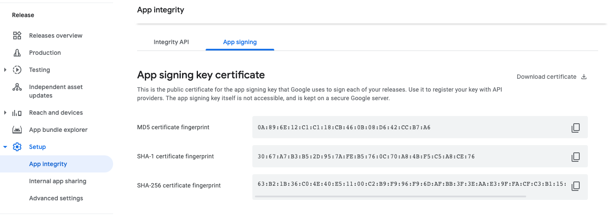
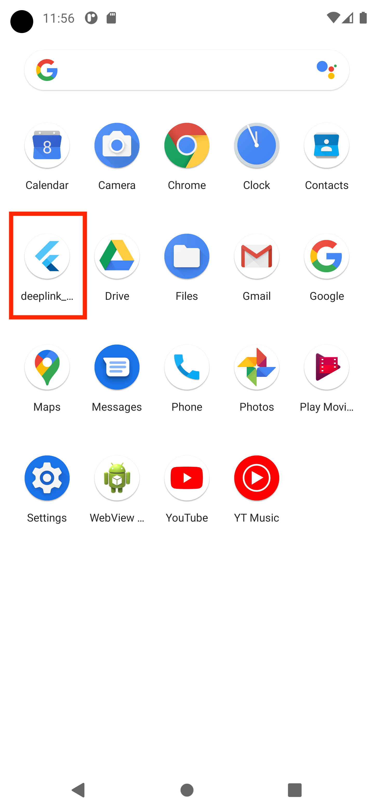
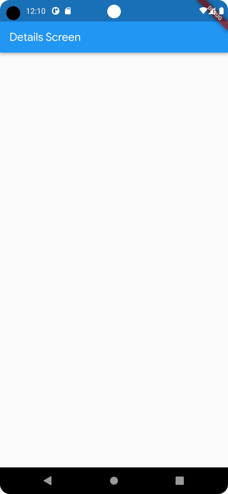
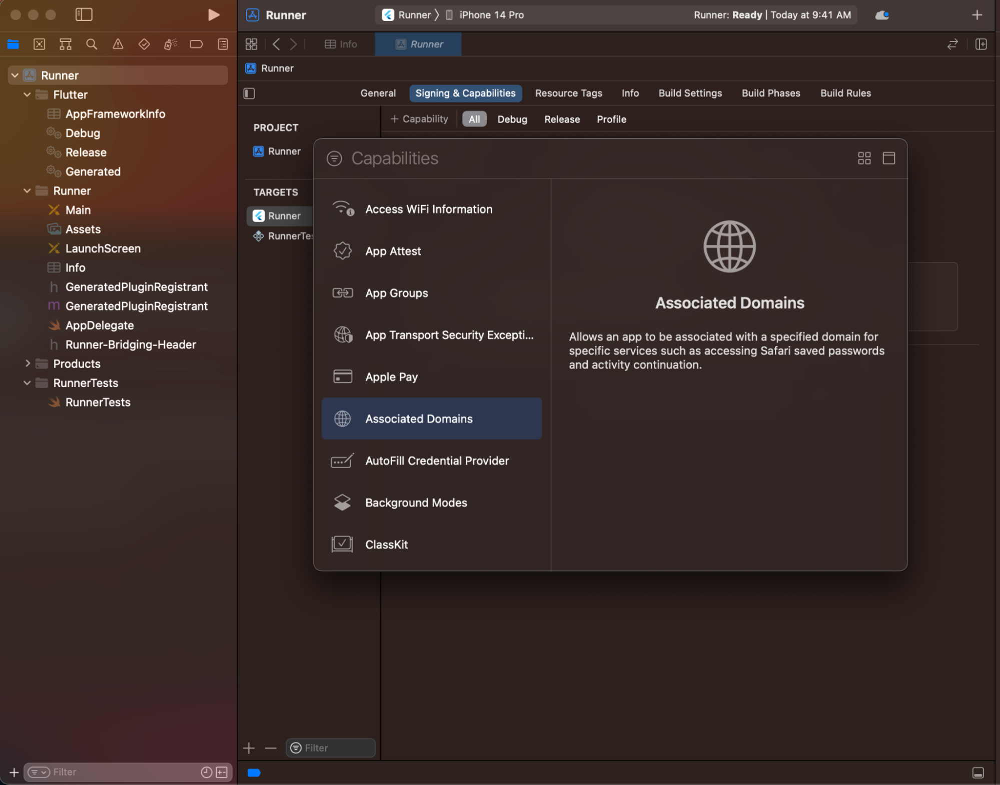
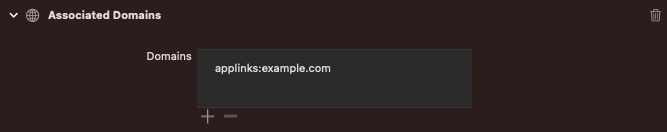

# Navigasyon ve Yönlendirme (Navigation and Routing)

Flutter, ekranlar arasında gezinmek ve derin bağlantıları (deep links) işlemek için eksiksiz bir sistem sunar. Karmaşık derin bağlantı gereksinimleri olmayan küçük uygulamalar `Navigator` kullanabilirken; Android, iOS ve Web (adres çubuğu senkronizasyonu için) üzerinde derin bağlantıları doğru şekilde işlemek isteyen uygulamalar `Router` yapısını kullanmalıdır.

## 1. Navigator Kullanımı

`Navigator` widget'ı, ekranları bir yığın (stack) olarak görüntüler ve hedef platform için doğru geçiş animasyonlarını kullanır.

Yeni bir ekrana geçmek için, `Navigator`'a `BuildContext` üzerinden erişin ve `push()` veya `pop()` gibi zorunlu (imperative) yöntemleri çağırın:

```dart
child: const Text('İkinci ekranı aç'),
onPressed: () {
  Navigator.of(context).push(
    MaterialPageRoute<void>(
      builder: (context) => const SecondScreen(),
    ),
  );
},
```

`Navigator`, bir `Route` nesneleri yığını tutar. `MaterialPageRoute`, Material Design geçiş animasyonlarını belirten bir `Route` alt sınıfıdır.

## 2. İsimlendirilmiş Rotalar (Named Routes)

Basit navigasyon gereksinimleri olan uygulamalar, navigasyon için `Navigator`'ı ve derin bağlantılar için `MaterialApp.routes` parametresini kullanabilir:

```dart
onPressed: () {
  Navigator.pushNamed(context, '/second');
},
```

> **Önemli Not:** Çoğu uygulama için isimlendirilmiş rotaların kullanılması **önerilmez**. İsimlendirilmiş rotalar derin bağlantıları işleyebilse de, davranış her zaman aynıdır ve özelleştirilemez (örneğin tarayıcı geri düğmesi desteği zayıftır). Bunun yerine `go_router` gibi bir yönlendirme paketi kullanılması tavsiye edilir.

## 3. Router Kullanımı

Gelişmiş navigasyon gereksinimleri olan (örneğin, her ekrana doğrudan bağlantı kullanan bir web uygulaması) Flutter uygulamaları, rota yolunu ayrıştırabilen ve uygulama yeni bir derin bağlantı aldığında `Navigator`'ı yapılandırabilen `go_router` gibi bir yönlendirme paketi kullanmalıdır.

`Router` kullanmak için, `MaterialApp` veya `CupertinoApp` üzerindeki `router` kurucusuna (constructor) geçiş yapın.

`go_router` gibi paketler genellikle bildirimseldir (declarative); yani bir derin bağlantı alındığında her zaman aynı ekran yapısını gösterirler:

```dart
child: const Text('İkinci ekranı aç'),
onPressed: () => context.go('/second'),
```

### Router ve Navigator'ı Birlikte Kullanma

`Router` ve `Navigator` birlikte çalışmak üzere tasarlanmıştır.

* **Page-backed (Sayfa destekli) Rotalar:** `Router` veya bildirimsel bir paket kullanılarak oluşturulan rotalardır. Bunlar her zaman derin bağlantı (deep-link) uyumludur.
* **Pageless (Sayfasız) Rotalar:** `Navigator.push` veya `showDialog` çağrılarak oluşturulan rotalardır. Bunlar derin bağlantı uyumlu değildir.

Navigasyon sırasında bir **page-backed** rota kaldırıldığında, ondan sonraki tüm **pageless** rotalar da kaldırılır.

## Web Desteği

`Router` sınıfını kullanan uygulamalar, tarayıcının geri ve ileri düğmelerini kullanırken tutarlı bir deneyim sağlamak için Tarayıcı Geçmişi API'si (Browser History API) ile entegre olur.

`Router` kullanarak her gezindiğinizde, tarayıcının geçmiş yığınına bir giriş eklenir. Geri düğmesine basmak **ters kronolojik navigasyon** kullanır; yani kullanıcı, `Router` kullanılarak gösterilen bir önceki konuma geri götürülür.
---


# Sekmelerle Çalışmak


Sekmelerle çalışmak, Material Design yönergelerini izleyen uygulamalarda yaygın bir modeldir. Flutter, `material` kütüphanesinin bir parçası olarak sekme düzenleri oluşturmanın uygun bir yolunu içerir.


Bu tarif, aşağıdaki adımları kullanarak sekmeli bir örnek oluşturur:

1.  Bir `TabController` oluşturun.
2.  Sekmeleri oluşturun.
3.  Her sekme için içerik oluşturun.

## 1. Bir `TabController` Oluşturun

Sekmelerin çalışması için, seçilen sekmeyi ve içerik bölümlerini senkronize halde tutmanız gerekir. Bu, `TabController`'ın işidir.

Bir `TabController`'ı manuel olarak veya bir `DefaultTabController` widget'ı kullanarak otomatik olarak oluşturabilirsiniz.

`DefaultTabController` kullanmak en basit seçenektir, çünkü bir `TabController` oluşturur ve onu tüm alt (descendant) widget'lar için kullanılabilir hale getirir.

```dart
return MaterialApp(
  home: DefaultTabController(length: 3, child: Scaffold()),
);
```

## 2. Sekmeleri Oluşturun

Bir sekme seçildiğinde, içeriği görüntülemesi gerekir. `TabBar` widget'ını kullanarak sekmeler oluşturabilirsiniz. Bu örnekte, üç `Tab` widget'ı içeren bir `TabBar` oluşturun ve bunu bir `AppBar` içine yerleştirin.

```dart
return MaterialApp(
  home: DefaultTabController(
    length: 3,
    child: Scaffold(
      appBar: AppBar(
        bottom: const TabBar(
          tabs: [
            Tab(icon: Icon(Icons.directions_car)),
            Tab(icon: Icon(Icons.directions_transit)),
            Tab(icon: Icon(Icons.directions_bike)),
          ],
        ),
      ),
    ),
  ),
);
```

Varsayılan olarak `TabBar`, widget ağacında en yakın `DefaultTabController`'ı arar. Eğer manuel olarak bir `TabController` oluşturuyorsanız, bunu `TabBar`'a iletin.

## 3. Her sekme için içerik oluşturun

Artık sekmeleriniz olduğuna göre, bir sekme seçildiğinde içeriği görüntüleyin. Bu amaçla `TabBarView` widget'ını kullanın.

> **Not:** Sıralama önemlidir ve `TabBar`'daki sekmelerin sırasına karşılık gelmelidir.

```dart
body: const TabBarView(
  children: [
    Icon(Icons.directions_car),
    Icon(Icons.directions_transit),
    Icon(Icons.directions_bike),
  ],
),
```

### Etkileşimli örnek

```dart
import 'package:flutter/material.dart';

void main() {
  runApp(const TabBarDemo());
}

class TabBarDemo extends StatelessWidget {
  const TabBarDemo({super.key});

  @override
  Widget build(BuildContext context) {
    return MaterialApp(
      home: DefaultTabController(
        length: 3,
        child: Scaffold(
          appBar: AppBar(
            bottom: const TabBar(
              tabs: [
                Tab(icon: Icon(Icons.directions_car)),
                Tab(icon: Icon(Icons.directions_transit)),
                Tab(icon: Icon(Icons.directions_bike)),
              ],
            ),
            title: const Text('Tabs Demo'),
          ),
          body: const TabBarView(
            children: [
              Icon(Icons.directions_car),
              Icon(Icons.directions_transit),
              Icon(Icons.directions_bike),
            ],
          ),
        ),
      ),
    );
  }
}
```


# Yeni bir ekrana gitme ve geri dönme


Çoğu uygulama, farklı türde bilgileri görüntülemek için birkaç ekran içerir. Örneğin, bir uygulama ürünleri görüntüleyen bir ekrana sahip olabilir. Kullanıcı bir ürünün resmine dokunduğunda, ürünle ilgili ayrıntıları gösteren yeni bir ekran açılır.

### Terminoloji

Flutter'da ekranlar ve sayfalar **rota (route)** olarak adlandırılır. Android'de bir rota `Activity`'ye, iOS'te ise `ViewController`'a eşdeğerdir. Flutter'da ise bir rota sadece bir widget'tır.

Bu tarif, yeni bir rotaya gitmek için `Navigator` kullanır. Aşağıdaki adımlar, iki rota arasında nasıl gezineceğinizi gösterir:

1. İki rota oluşturun.
2. `Navigator.push()` kullanarak ikinci rotaya gidin.
3. `Navigator.pop()` kullanarak birinci rotaya dönün.

---

### 1. İki rota oluşturun

İlk olarak, üzerinde çalışmak için iki rota oluşturun. Bu temel bir örnek olduğu için her rota yalnızca tek bir düğme içerir.

```dart
class FirstRoute extends StatelessWidget {
  const FirstRoute({super.key});

  @override
  Widget build(BuildContext context) {
    return Scaffold(
      appBar: AppBar(title: const Text('First Route')),
      body: Center(
        child: ElevatedButton(
          child: const Text('Rotayı aç'),
          onPressed: () {
            // Dokunulduğunda ikinci rotaya git.
          },
        ),
      ),
    );
  }
}

class SecondRoute extends StatelessWidget {
  const SecondRoute({super.key});

  @override
  Widget build(BuildContext context) {
    return Scaffold(
      appBar: AppBar(title: const Text('Second Route')),
      body: Center(
        child: ElevatedButton(
          onPressed: () {
            // Dokunulduğunda ilk rotaya geri dön.
          },
          child: const Text('Geri dön!'),
        ),
      ),
    );
  }
}
```

### 2. `Navigator.push()` kullanarak ikinci rotaya gidin

Yeni bir rotaya geçmek için `Navigator.push()` yöntemini kullanın. `push()` yöntemi, `Navigator` tarafından yönetilen rota yığınına bir `Route` ekler.

Kendi rotanızı oluşturabilir veya `MaterialPageRoute` (Android tarzı) veya `CupertinoPageRoute` (iOS tarzı) gibi platforma özgü bir rota kullanabilirsiniz. Platforma özgü bir rota kullanmak, yeni rotaya geçerken o platforma özgü animasyonu sağladığı için yararlıdır.

`FirstRoute` widget'ının `build()` yönteminde `onPressed()` geri çağrısını güncelleyin:

```dart
// FirstRoute widget'ı içinde:
onPressed: () {
  Navigator.push(
    context,
    MaterialPageRoute<void>(
      builder: (context) => const SecondRoute(),
    ),
  );
}
```

### 3. `Navigator.pop()` kullanarak birinci rotaya dönün

İkinci rotayı kapatıp birinciye nasıl dönersiniz? `Navigator.pop()` yöntemini kullanarak. `pop()` yöntemi, geçerli `Route`'u `Navigator` tarafından yönetilen rota yığınından kaldırır.

Orijinal rotaya dönüşü uygulamak için `SecondRoute` widget'ındaki `onPressed()` geri çağrısını güncelleyin:

```dart
// SecondRoute widget'ı içinde:
onPressed: () {
  Navigator.pop(context);
}
```


## Örnek (Android)

```dart
import 'package:flutter/material.dart';

void main() {
  runApp(const MaterialApp(title: 'Navigation Basics', home: FirstRoute()));
}

class FirstRoute extends StatelessWidget {
  const FirstRoute({super.key});

  @override
  Widget build(BuildContext context) {
    return Scaffold(
      appBar: AppBar(title: const Text('First Route')),
      body: Center(
        child: ElevatedButton(
          child: const Text('Open route'),
          onPressed: () {
            Navigator.push(
              context,
              MaterialPageRoute<void>(
                builder: (context) => const SecondRoute(),
              ),
            );
          },
        ),
      ),
    );
  }
}

class SecondRoute extends StatelessWidget {
  const SecondRoute({super.key});

  @override
  Widget build(BuildContext context) {
    return Scaffold(
      appBar: AppBar(title: const Text('Second Route')),
      body: Center(
        child: ElevatedButton(
          onPressed: () {
            Navigator.pop(context);
          },
          child: const Text('Go back!'),
        ),
      ),
    );
  }
}
```


## Örnek (iOS)

```dart
import 'package:flutter/cupertino.dart';

void main() {
  runApp(const CupertinoApp(title: 'Navigation Basics', home: FirstRoute()));
}

class FirstRoute extends StatelessWidget {
  const FirstRoute({super.key});

  @override
  Widget build(BuildContext context) {
    return CupertinoPageScaffold(
      navigationBar: const CupertinoNavigationBar(middle: Text('First Route')),
      child: Center(
        child: CupertinoButton(
          child: const Text('Open route'),
          onPressed: () {
            Navigator.push(
              context,
              CupertinoPageRoute<void>(
                builder: (context) => const SecondRoute(),
              ),
            );
          },
        ),
      ),
    );
  }
}

class SecondRoute extends StatelessWidget {
  const SecondRoute({super.key});

  @override
  Widget build(BuildContext context) {
    return CupertinoPageScaffold(
      navigationBar: const CupertinoNavigationBar(middle: Text('Second Route')),
      child: Center(
        child: CupertinoButton(
          onPressed: () {
            Navigator.pop(context);
          },
          child: const Text('Go back!'),
        ),
      ),
    );
  }
}
```


# Yeni bir ekrana veri gönderme

Genellikle sadece yeni bir ekrana gitmek istemezsiniz, aynı zamanda o ekrana veri de göndermek istersiniz. Örneğin, bir öğeye tıklandığında o öğe hakkındaki bilgileri bir detay ekranına taşımak gibi.

Bu tarifte, bir yapılacaklar listesi (todos) oluşturacağız. Bir yapılacak işe tıklandığında, o iş hakkındaki bilgileri (başlık ve açıklama) görüntüleyen yeni bir ekrana (widget) gideceğiz.

### 1. Todo sınıfını tanımlayın

İlk olarak, yapılacak işleri temsil edecek basit bir yola ihtiyacınız var. İki parça veri içeren bir sınıf oluşturun: başlık ve açıklama.

```dart
class Todo {
  final String title;
  final String description;

  const Todo(this.title, this.description);
}
```

### 2. Yapılacaklar listesini oluşturun ve görüntüleyin

Örnek veriler oluşturun ve bunları bir `ListView` kullanarak görüntüleyin.

```dart
// 20 adet todo üretin
final todos = List.generate(
  20,
  (i) => Todo(
    'Todo $i',
    'Todo $i için yapılması gerekenlerin açıklaması',
  ),
);

// Listeyi ekranda gösterin (Bu kod TodosScreen widget'ının build metodu içinde olacak)
ListView.builder(
  itemCount: todos.length,
  itemBuilder: (context, index) {
    return ListTile(title: Text(todos[index].title));
  },
)
```

### 3. Detay ekranını oluşturun

Şimdi ikinci ekranı oluşturun. Bu ekranın başlığı todo'nun başlığını, gövdesi ise açıklamayı gösterecektir.
Detay ekranı normal bir `StatelessWidget` olduğu için, kullanıcının UI'ı oluştururken bir `Todo` nesnesi vermesini zorunlu kılın (constructor aracılığıyla).

```dart
class DetailScreen extends StatelessWidget {
  // Constructor'da bir Todo nesnesi isteyin.
  const DetailScreen({super.key, required this.todo});

  // Todo'yu tutan alanı tanımlayın.
  final Todo todo;

  @override
  Widget build(BuildContext context) {
    // UI oluşturmak için Todo verisini kullanın.
    return Scaffold(
      appBar: AppBar(title: Text(todo.title)),
      body: Padding(
        padding: const EdgeInsets.all(16),
        child: Text(todo.description),
      ),
    );
  }
}
```

### 4. Gezinin ve veriyi aktarın

Son olarak, `ListView` içindeki bir `ListTile`'a tıklandığında `DetailScreen`'e gidin ve mevcut `todo` nesnesini ona paslayın.

```dart
ListView.builder(
  itemCount: todos.length,
  itemBuilder: (context, index) {
    return ListTile(
      title: Text(todos[index].title),
      // Kullanıcı dokunduğunda detay ekranına git.
      onTap: () {
        Navigator.push(
          context,
          MaterialPageRoute(
            // DetailScreen'i oluştururken o anki todo'yu (todos[index]) gönderiyoruz.
            builder: (context) => DetailScreen(todo: todos[index]),
          ),
        );
      },
    );
  },
)
```

## İnteraktif Örnek
```dart

import 'package:flutter/material.dart';

class Todo {
  final String title;
  final String description;

  const Todo(this.title, this.description);
}

void main() {
  runApp(
    MaterialApp(
      title: 'Passing Data',
      home: TodosScreen(
        todos: List.generate(
          20,
          (i) => Todo(
            'Todo $i',
            'A description of what needs to be done for Todo $i',
          ),
        ),
      ),
    ),
  );
}

class TodosScreen extends StatelessWidget {
  const TodosScreen({super.key, required this.todos});

  final List<Todo> todos;

  @override
  Widget build(BuildContext context) {
    return Scaffold(
      appBar: AppBar(title: const Text('Todos')),
      body: ListView.builder(
        itemCount: todos.length,
        itemBuilder: (context, index) {
          return ListTile(
            title: Text(todos[index].title),
            // When a user taps the ListTile, navigate to the DetailScreen.
            // Notice that you're not only creating a DetailScreen, you're
            // also passing the current todo through to it.
            onTap: () {
              Navigator.push(
                context,
                MaterialPageRoute<void>(
                  builder: (context) => DetailScreen(todo: todos[index]),
                ),
              );
            },
          );
        },
      ),
    );
  }
}

class DetailScreen extends StatelessWidget {
  // In the constructor, require a Todo.
  const DetailScreen({super.key, required this.todo});

  // Declare a field that holds the Todo.
  final Todo todo;

  @override
  Widget build(BuildContext context) {
    // Use the Todo to create the UI.
    return Scaffold(
      appBar: AppBar(title: Text(todo.title)),
      body: Padding(
        padding: const EdgeInsets.all(16),
        child: Text(todo.description),
      ),
    );
  }
}
```
---

### Alternatif Yöntem: `RouteSettings` Kullanımı

Verileri doğrudan constructor (kurucu) yerine `RouteSettings` kullanarak da geçirebilirsiniz. Bu yöntem, özellikle isimlendirilmiş rotalar (named routes) kullanıyorsanız veya widget yapısını veriden ayırmak istiyorsanız yararlıdır.

**1. Veriyi RouteSettings ile Gönderme:**
`Navigator.push` yaparken `settings` parametresini kullanın.

```dart
Navigator.push(
  context,
  MaterialPageRoute<void>(
    builder: (context) => const DetailScreen(),
    // Argümanları RouteSettings'in bir parçası olarak gönderin.
    settings: RouteSettings(arguments: todos[index]),
  ),
);
```

**2. Veriyi Detay Ekranında Alma:**
Detay ekranında `ModalRoute` kullanarak argümanları yakalayın.

```dart
class DetailScreen extends StatelessWidget {
  const DetailScreen({super.key});

  @override
  Widget build(BuildContext context) {
    // Argümanları ModalRoute üzerinden çekin ve Todo tipine dönüştürün.
    final todo = ModalRoute.of(context)!.settings.arguments as Todo;

    return Scaffold(
      appBar: AppBar(title: Text(todo.title)),
      body: Padding(
        padding: const EdgeInsets.all(16),
        child: Text(todo.description),
      ),
    );
  }
}
```

---


# Yeni bir ekrana veri gönderme

Çoğu zaman, sadece yeni bir ekrana gitmek değil, aynı zamanda o ekrana veri de aktarmak istersiniz. Örneğin, tıklanan öğe hakkındaki bilgileri aktarmak isteyebilirsiniz.

Unutmayın: Ekranlar sadece birer widget'tır. Bu örnekte, bir yapılacaklar (todo) listesi oluşturun. Bir todo'ya tıklandığında, todo hakkındaki bilgileri görüntüleyen yeni bir ekrana (widget) gidin.

Bu tarif aşağıdaki adımları izler:

1. Bir `Todo` sınıfı tanımlayın.
2. Todo listesini görüntüleyin.
3. Bir todo hakkında bilgi görüntüleyebilen bir detay ekranı oluşturun.
4. Gezinme işlemini yapın ve verileri detay ekranına aktarın.

## 1. Bir Todo sınıfı tanımlayın

İlk olarak, yapılacakları temsil etmek için basit bir yola ihtiyacınız var. Bu örnek için, iki parça veri içeren bir sınıf oluşturun: başlık ve açıklama.

```dart
class Todo {
  final String title;
  final String description;

  const Todo(this.title, this.description);
}
```

## 2. Todo listesi oluşturun

İkinci olarak, yapılacaklar listesini görüntüleyin. Bu örnekte, 20 tane todo oluşturun ve bunları bir `ListView` kullanarak gösterin. Listelerle çalışma hakkında daha fazla bilgi için "Listeleri Kullanma" tarifine bakın.

**Todo listesini oluşturun:**

```dart
final todos = List.generate(
  20,
  (i) => Todo(
    'Todo $i',
    'Todo $i için yapılması gerekenlerin açıklaması',
  ),
);
```

**Todo listesini bir ListView kullanarak görüntüleyin:**

```dart
ListView.builder(
  itemCount: todos.length,
  itemBuilder: (context, index) {
    return ListTile(title: Text(todos[index].title));
  },
)
```

Şimdiye kadar her şey yolunda. Bu, 20 adet todo oluşturur ve bunları bir `ListView` içinde görüntüler.

## 3. Listeyi görüntülemek için bir Todo ekranı oluşturun

Bunun için bir `StatelessWidget` oluşturuyoruz. Adına `TodosScreen` diyoruz. Bu sayfanın içeriği çalışma zamanında değişmeyeceği için, todo listesini bu widget'ın kapsamında istememiz (require) gerekecek.

`ListView.builder`'ı, `build()` yönteminde döndürdüğümüz widget'ın gövdesi (body) olarak iletiyoruz. Bu, başlamanız için listeyi ekrana çizecektir!

```dart
class TodosScreen extends StatelessWidget {
  // Todo listesini zorunlu kılıyoruz.
  const TodosScreen({super.key, required this.todos});

  final List<Todo> todos;

  @override
  Widget build(BuildContext context) {
    return Scaffold(
      appBar: AppBar(title: const Text('Todos')),
      // ListView.builder'ı içeriye aktarıyoruz
      body: ListView.builder(
        itemCount: todos.length,
        itemBuilder: (context, index) {
          return ListTile(title: Text(todos[index].title));
        },
      ),
    );
  }
}
```

Flutter'ın varsayılan stiliyle, daha sonra yapmak isteyeceğiniz şeyler için endişelenmeden yola çıkmaya hazırsınız!

## 4. Todo hakkında bilgi görüntülemek için bir detay ekranı oluşturun

Şimdi ikinci ekranı oluşturun. Ekranın başlığı todo'nun başlığını içerir ve ekranın gövdesi açıklamayı gösterir.

Detay ekranı normal bir `StatelessWidget` olduğundan, kullanıcının UI'da bir `Todo` girmesini zorunlu kılın. Ardından, verilen todo'yu kullanarak UI'ı oluşturun.

```dart
class DetailScreen extends StatelessWidget {
  // Kurucuda (constructor), bir Todo zorunlu kılınır.
  const DetailScreen({super.key, required this.todo});

  // Todo'yu tutan bir alan (field) bildirin.
  final Todo todo;

  @override
  Widget build(BuildContext context) {
    // UI'ı oluşturmak için Todo'yu kullanın.
    return Scaffold(
      appBar: AppBar(title: Text(todo.title)),
      body: Padding(
        padding: const EdgeInsets.all(16),
        child: Text(todo.description),
      ),
    );
  }
}
```

## 5. Gezinme işlemini yapın ve verileri detay ekranına aktarın

`DetailScreen` hazır olduğuna göre, Gezinme (Navigation) işlemini gerçekleştirmeye hazırsınız. Bu örnekte, bir kullanıcı listedeki bir todo'ya dokunduğunda `DetailScreen`'e gidin. Todo'yu `DetailScreen`'e aktarın.

Kullanıcının `TodosScreen`'deki dokunuşunu yakalamak için, `ListTile` widget'ı için bir `onTap()` geri çağrısı yazın. `onTap()` geri çağrısı içinde `Navigator.push()` yöntemini kullanın.

```dart
body: ListView.builder(
  itemCount: todos.length,
  itemBuilder: (context, index) {
    return ListTile(
      title: Text(todos[index].title),
      // Kullanıcı ListTile'a dokunduğunda, DetailScreen'e gidin.
      // Sadece bir DetailScreen oluşturmadığınıza, aynı zamanda
      // mevcut todo'yu da ona aktardığınıza dikkat edin.
      onTap: () {
        Navigator.push(
          context,
          MaterialPageRoute<void>(
            builder: (context) => DetailScreen(todo: todos[index]),
          ),
        );
      },
    );
  },
),
```

### Alternatif olarak, RouteSettings kullanarak argümanları aktarın

İlk iki adımı tekrarlayın.

**Argümanları çıkarmak için bir detay ekranı oluşturun**

Ardından, `Todo`'dan başlığı ve açıklamayı çıkaran ve görüntüleyen bir detay ekranı oluşturun. `Todo`'ya erişmek için `ModalRoute.of()` yöntemini kullanın. Bu yöntem, argümanlarla birlikte mevcut rotayı döndürür.

```dart
class DetailScreen extends StatelessWidget {
  const DetailScreen({super.key});

  @override
  Widget build(BuildContext context) {
    final todo = ModalRoute.of(context)!.settings.arguments as Todo;

    // UI'ı oluşturmak için Todo'yu kullanın.
    return Scaffold(
      appBar: AppBar(title: Text(todo.title)),
      body: Padding(
        padding: const EdgeInsets.all(16),
        child: Text(todo.description),
      ),
    );
  }
}
```

**Gezinin ve argümanları detay ekranına aktarın**

Son olarak, bir kullanıcı `ListTile` widget'ına dokunduğunda `Navigator.push()` kullanarak `DetailScreen`'e gidin. Argümanları `RouteSettings`'in bir parçası olarak aktarın. `DetailScreen` bu argümanları çıkarır.

```dart
ListView.builder(
  itemCount: todos.length,
  itemBuilder: (context, index) {
    return ListTile(
      title: Text(todos[index].title),
      // Kullanıcı ListTile'a dokunduğunda, DetailScreen'e gidin.
      // Sadece bir DetailScreen oluşturmadığınıza, aynı zamanda
      // mevcut todo'yu da ona aktardığınıza dikkat edin.
      onTap: () {
        Navigator.push(
          context,
          MaterialPageRoute<void>(
            builder: (context) => const DetailScreen(),
            // Argümanları RouteSettings'in bir parçası olarak aktarın.
            // DetailScreen argümanları bu ayarlardan okur.
            settings: RouteSettings(arguments: todos[index]),
          ),
        );
      },
    );
  },
)
```

---

### Tam Örnek

```dart
import 'package:flutter/material.dart';

class Todo {
  final String title;
  final String description;

  const Todo(this.title, this.description);
}

void main() {
  runApp(
    MaterialApp(
      title: 'Veri Aktarımı',
      home: TodosScreen(
        todos: List.generate(
          20,
          (i) => Todo(
            'Todo $i',
            'Todo $i için yapılması gerekenlerin açıklaması',
          ),
        ),
      ),
    ),
  );
}

class TodosScreen extends StatelessWidget {
  const TodosScreen({super.key, required this.todos});

  final List<Todo> todos;

  @override
  Widget build(BuildContext context) {
    return Scaffold(
      appBar: AppBar(title: const Text('Todos')),
      body: ListView.builder(
        itemCount: todos.length,
        itemBuilder: (context, index) {
          return ListTile(
            title: Text(todos[index].title),
            // Kullanıcı ListTile'a dokunduğunda, DetailScreen'e gidin.
            // Sadece bir DetailScreen oluşturmadığınıza, aynı zamanda
            // mevcut todo'yu da ona aktardığınıza dikkat edin.
            onTap: () {
              Navigator.push(
                context,
                MaterialPageRoute<void>(
                  builder: (context) => const DetailScreen(),
                  // Argümanları RouteSettings'in bir parçası olarak aktarın.
                  // DetailScreen argümanları bu ayarlardan okur.
                  settings: RouteSettings(arguments: todos[index]),
                ),
              );
            },
          );
        },
      ),
    );
  }
}

class DetailScreen extends StatelessWidget {
  const DetailScreen({super.key});

  @override
  Widget build(BuildContext context) {
    final todo = ModalRoute.of(context)!.settings.arguments as Todo;

    // UI'ı oluşturmak için Todo'yu kullanın.
    return Scaffold(
      appBar: AppBar(title: Text(todo.title)),
      body: Padding(
        padding: const EdgeInsets.all(16),
        child: Text(todo.description),
      ),
    );
  }
}
```

## İnteraktif Örnek

```dart
import 'package:flutter/material.dart';

void main() {
  runApp(const MaterialApp(title: 'Returning Data', home: HomeScreen()));
}

class HomeScreen extends StatelessWidget {
  const HomeScreen({super.key});

  @override
  Widget build(BuildContext context) {
    return Scaffold(
      appBar: AppBar(title: const Text('Returning Data Demo')),
      body: const Center(child: SelectionButton()),
    );
  }
}

class SelectionButton extends StatefulWidget {
  const SelectionButton({super.key});

  @override
  State<SelectionButton> createState() => _SelectionButtonState();
}

class _SelectionButtonState extends State<SelectionButton> {
  @override
  Widget build(BuildContext context) {
    return ElevatedButton(
      onPressed: () {
        _navigateAndDisplaySelection(context);
      },
      child: const Text('Pick an option, any option!'),
    );
  }

  // A method that launches the SelectionScreen and awaits the result from
  // Navigator.pop.
  Future<void> _navigateAndDisplaySelection(BuildContext context) async {
    // Navigator.push returns a Future that completes after calling
    // Navigator.pop on the Selection Screen.
    final result = await Navigator.push(
      context,
      MaterialPageRoute<String>(builder: (context) => const SelectionScreen()),
    );

    // When a BuildContext is used from a StatefulWidget, the mounted property
    // must be checked after an asynchronous gap.
    if (!context.mounted) return;

    // After the Selection Screen returns a result, hide any previous snackbars
    // and show the new result.
    ScaffoldMessenger.of(context)
      ..removeCurrentSnackBar()
      ..showSnackBar(SnackBar(content: Text('$result')));
  }

}

class SelectionScreen extends StatelessWidget {
  const SelectionScreen({super.key});

  @override
  Widget build(BuildContext context) {
    return Scaffold(
      appBar: AppBar(title: const Text('Pick an option')),
      body: Center(
        child: Column(
          mainAxisAlignment: MainAxisAlignment.center,
          children: <Widget>[
            Padding(
              padding: const EdgeInsets.all(8),
              child: ElevatedButton(
                onPressed: () {
                  // Close the screen and return "Yep!" as the result.
                  Navigator.pop(context, 'Yep!');
                },
                child: const Text('Yep!'),
              ),
            ),
            Padding(
              padding: const EdgeInsets.all(8),
              child: ElevatedButton(
                onPressed: () {
                  // Close the screen and return "Nope." as the result.
                  Navigator.pop(context, 'Nope.');
                },
                child: const Text('Nope.'),
              ),
            ),
          ],
        ),
      ),
    );
  }
}
```


# Ekrana bir Çekmece (Drawer) Ekleme

Material Design kullanan uygulamalarda navigasyon için iki temel seçenek vardır: sekmeler (tabs) ve çekmeceler (drawers). Sekmeler için yeterli alan olmadığında, çekmeceler kullanışlı bir alternatif sunar.

Flutter'da, bir `Scaffold` ile birlikte **`Drawer`** widget'ını kullanarak bir Material Design çekmecesi oluşturabilirsiniz.

### 1. Bir `Scaffold` Oluşturun

Uygulamaya bir çekmece eklemek için onu bir `Scaffold` widget'ı ile sarın. `Scaffold`, Drawer, AppBar ve SnackBar gibi özel Material Design bileşenlerini destekler ve görsel bir yapı sağlar.

```dart
Scaffold(
  appBar: AppBar(title: const Text('Hamburger menülü AppBar')),
  drawer: // Sonraki adımda buraya Drawer ekleyeceğiz.
);
```

### 2. Çekmeceyi (Drawer) Ekleyin

Şimdi `Scaffold`'a bir çekmece ekleyin. Çekmece herhangi bir widget olabilir, ancak Material Design özelliklerine uyan **`Drawer`** widget'ını kullanmak genellikle en iyisidir.

```dart
Scaffold(
  appBar: AppBar(title: const Text('Hamburger menülü AppBar')),
  drawer: Drawer(
    child: // Sonraki adımda Drawer içini dolduracağız.
  ),
);
```

### 3. Çekmeceyi Öğelerle Doldurun

Çekmecenin içine içerik ekleyin. Bu örnekte bir **`ListView`** kullanın. `Column` widget'ı da kullanabilirsiniz ancak içerik ekran boyutunu aşarsa kullanıcının kaydırma yapabilmesi için `ListView` daha kullanışlıdır.

Listeyi bir `DrawerHeader` ve iki `ListTile` widget'ı ile doldurun.

```dart
Drawer(
  // Çekmeceye bir ListView ekleyin. Bu, dikey alan yetmediğinde
  // kullanıcının seçenekler arasında kaydırma yapabilmesini sağlar.
  child: ListView(
    // Önemli: ListView'den dolguyu (padding) kaldırın.
    // Bu, DrawerHeader'ın en tepeye kadar uzanmasını sağlar.
    padding: EdgeInsets.zero,
    children: [
      const DrawerHeader(
        decoration: BoxDecoration(color: Colors.blue),
        child: Text('Drawer Başlığı'),
      ),
      ListTile(
        title: const Text('Öğe 1'),
        onTap: () {
          // Uygulama durumunu güncelleyin.
        },
      ),
      ListTile(
        title: const Text('Öğe 2'),
        onTap: () {
          // Uygulama durumunu güncelleyin.
        },
      ),
    ],
  ),
);
```

### 4. Çekmeceyi Programatik Olarak Açın (İsteğe Bağlı)

Genellikle çekmeceyi açmak için kod yazmanız gerekmez; çünkü `AppBar` içindeki `leading` widget'ı boş olduğunda (ve bir `drawer` tanımlıysa), varsayılan olarak bir "Hamburger Menü" butonu (`DrawerButton`) görünür ve çekmeceyi açar.

Ancak çekmeceyi manuel olarak açmak isterseniz (örneğin özel bir butona basıldığında), `Scaffold.of(context).openDrawer()` yöntemini kullanabilirsiniz.

> **Not:** `Scaffold.of(context)` çağrısının çalışabilmesi için `context`'in Scaffold'un *altında* olması gerekir. Bu yüzden genellikle bir `Builder` widget'ı kullanılır.

```dart
leading: Builder(
  builder: (context) {
    return IconButton(
      icon: const Icon(Icons.menu),
      onPressed: () {
        Scaffold.of(context).openDrawer();
      },
    );
  },
),
```

### 5. Çekmeceyi Programatik Olarak Kapatın

Kullanıcı bir öğeye dokunduktan sonra çekmeceyi kapatmak isteyebilirsiniz.

Kullanıcı çekmeceyi açtığında, Flutter çekmeceyi navigasyon yığınına (navigation stack) ekler. Bu nedenle, çekmeceyi kapatmak için **`Navigator.pop(context)`** çağırmanız yeterlidir.

```dart
ListTile(
  title: const Text('Öğe 1'),
  onTap: () {
    // Önce uygulama durumunu güncelleyin
    // ...
    // Ardından çekmeceyi kapatın
    Navigator.pop(context);
  },
),
```


## İnteraktif Örnek

```dart
import 'package:flutter/material.dart';

void main() => runApp(const MyApp());

class MyApp extends StatelessWidget {
  const MyApp({super.key});

  static const appTitle = 'Drawer Demo';

  @override
  Widget build(BuildContext context) {
    return const MaterialApp(
      title: appTitle,
      home: MyHomePage(title: appTitle),
    );
  }
}

class MyHomePage extends StatefulWidget {
  const MyHomePage({super.key, required this.title});

  final String title;

  @override
  State<MyHomePage> createState() => _MyHomePageState();
}

class _MyHomePageState extends State<MyHomePage> {
  int _selectedIndex = 0;
  static const TextStyle optionStyle = TextStyle(
    fontSize: 30,
    fontWeight: FontWeight.bold,
  );
  static const List<Widget> _widgetOptions = <Widget>[
    Text('Index 0: Home', style: optionStyle),
    Text('Index 1: Business', style: optionStyle),
    Text('Index 2: School', style: optionStyle),
  ];

  void _onItemTapped(int index) {
    setState(() {
      _selectedIndex = index;
    });
  }

  @override
  Widget build(BuildContext context) {
    return Scaffold(
      appBar: AppBar(
        title: Text(widget.title),
        leading: Builder(
          builder: (context) {
            return IconButton(
              icon: const Icon(Icons.menu),
              onPressed: () {
                Scaffold.of(context).openDrawer();
              },
            );
          },
        ),
      ),
      body: Center(child: _widgetOptions[_selectedIndex]),
      drawer: Drawer(
        // Add a ListView to the drawer. This ensures the user can scroll
        // through the options in the drawer if there isn't enough vertical
        // space to fit everything.
        child: ListView(
          // Important: Remove any padding from the ListView.
          padding: EdgeInsets.zero,
          children: [
            const DrawerHeader(
              decoration: BoxDecoration(color: Colors.blue),
              child: Text('Drawer Header'),
            ),
            ListTile(
              title: const Text('Home'),
              selected: _selectedIndex == 0,
              onTap: () {
                // Update the state of the app
                _onItemTapped(0);
                // Then close the drawer
                Navigator.pop(context);
              },
            ),
            ListTile(
              title: const Text('Business'),
              selected: _selectedIndex == 1,
              onTap: () {
                // Update the state of the app
                _onItemTapped(1);
                // Then close the drawer
                Navigator.pop(context);
              },
            ),
            ListTile(
              title: const Text('School'),
              selected: _selectedIndex == 2,
              onTap: () {
                // Update the state of the app
                _onItemTapped(2);
                // Then close the drawer
                Navigator.pop(context);
              },
            ),
          ],
        ),
      ),
    );
  }
}
```


# Derin Bağlantılar (Deep Linking)

Uygulama yeni bir URL aldığında belirli rotalara (ekranlara) gitme işlemi.

**Derin bağlantılar**, bir uygulamayı sadece açmakla kalmayıp, kullanıcıyı uygulamanın "derinliklerindeki" belirli bir konuma götüren bağlantılardır.

Örneğin, bir spor ayakkabı reklamındaki bağlantıya tıkladığınızda, alışveriş uygulamasının ana sayfası yerine doğrudan o ayakkabının ürün sayfasının açılması bir derin bağlantı örneğidir.

Flutter; iOS, Android ve Web üzerinde derin bağlantıları destekler. Bir URL açıldığında, uygulamanızdaki ilgili ekran görüntülenir.

### Nasıl Çalışır?

Rotaları başlatmak ve görüntülemek için iki ana yöntem vardır:

1. **Router Widget'ı (Önerilen):** `go_router` gibi paketler kullanarak deklaratif (bildirimsel) bir yapı kurmak.
2. **İsimlendirilmiş Rotalar (Named Routes):** `routes` parametresi veya `onGenerateRoute` kullanmak.

> **Önemli Not:**
> Çoğu uygulama için isimlendirilmiş rotaların kullanılması **artık önerilmemektedir**. Bunun yerine `Router` widget'ını kullanan modern bir yaklaşım (örneğin `go_router`) tercih edilmelidir.

### Web Desteği

Uygulamayı bir web tarayıcısında çalıştırıyorsanız, ek bir kuruluma gerek yoktur. Rota yolları, iOS veya Android derin bağlantılarıyla aynı şekilde işlenir.

Varsayılan olarak, web uygulamaları derin bağlantı yolunu URL parçasından (fragment) şu deseni kullanarak okur:
`/#/uygulama/ekrani/yolu`

Bu davranış, uygulamanız için **URL stratejisi yapılandırılarak** değiştirilebilir (örneğin `#` işaretini kaldırmak için).

[Video](https://www.youtube.com/watch?v=KNAb2XL7k2g)
---

# Eklenti (Plugin) Tabanlı Derin Bağlantılardan Geçiş

Kendi yazdığınız veya harici bir eklenti kullanarak derin bağlantıları (deep links) yönetiyorsanız, çakışmaları önlemek için Flutter'ın varsayılan derin bağlantı işleyicisini **devre dışı bırakmanız** gerekir.

### Varsayılan İşleyiciyi Devre Dışı Bırakma

Eğer kendi çözümünüzü kullanacaksanız, platforma özel dosyalarda şu ayarları yapmalısınız:

* **iOS (`Info.plist`):**
`FlutterDeepLinkingEnabled` anahtarını `false` olarak ayarlayın.
* **Android (`AndroidManifest.xml`):**
`flutter_deeplinking_enabled` değerini `false` olarak ayarlayın.

---

### Davranış Farklılıkları

Uygulamanın çalışıyor olup olmamasına ve kullandığınız navigasyon yöntemine (`Navigator` vs `Router`) göre derin bağlantıların işlenme şekli değişir.

Aşağıdaki tablo, senaryoya göre beklenen davranışları özetler:

| Senaryo | Navigator Kullanımı (Imperative) | Router Kullanımı (Declarative) |
| --- | --- | --- |
| **iOS (Uygulama Kapalıyken)** | Uygulama önce `initialRoute` ("/") alır. Kısa bir süre sonra `pushRoute` tetiklenir. | Uygulama `initialRoute` ("/") alır. Kısa süre sonra `RouteInformationParser` rotayı ayrıştırır ve `RouterDelegate` sayfaları günceller. |
| **Android (Uygulama Kapalıyken)** | Uygulama doğrudan derin bağlantıyı içeren `initialRoute` ("/deeplink") ile açılır. | `initialRoute` ("/deeplink") alınır, `RouteInformationParser`'a iletilir ve `Navigator` ilgili sayfalarla yapılandırılır. |
| **iOS & Android (Uygulama Açıkken)** | `pushRoute` çağrılır (yeni sayfa yığının üzerine eklenir). | Yol ayrıştırılır ve `Navigator` yeni bir sayfa setiyle yeniden yapılandırılır. |

> **Önemli Fark:**
> **`Router`** widget'ını kullanmanın en büyük avantajı, uygulama çalışırken yeni bir derin bağlantı açıldığında mevcut sayfa yığınını tamamen **değiştirebilme/yenileyebilme** yeteneğidir. `Navigator` genellikle sadece yeni sayfayı en üste ekler (`push`).

---

### Daha Fazla Bilgi İçin Kaynaklar

* **Learning Flutter's new navigation and routing system:** Router sistemine giriş sağlar.
* **Deep dive into Flutter deep linking (Google I/O 2023):** Konuyla ilgili detaylı video anlatımı.
* **Flutter Deep Linking: The Ultimate Guide:** Adım adım uygulama rehberi.


---

# Android İçin Uygulama Bağlantılarını (App Links) Ayarlama


Derin bağlantı (Deep linking), bir uygulamayı bir URI ile başlatma mekanizmasıdır. Bu URI; şema, ana bilgisayar (host) ve yolu içerir ve uygulamayı belirli bir ekranda açar.

**Uygulama bağlantısı (App link)**, `http` veya `https` kullanan ve Android cihazlara özel bir derin bağlantı türüdür.

Uygulama bağlantılarını ayarlamak için bir **web alan adına (domain)** sahip olmanız gerekir. Aksi takdirde, geçici bir çözüm olarak Firebase Hosting veya GitHub Pages kullanmayı düşünün.

Derin bağlantılarınızı ayarladıktan sonra bunları doğrulayabilirsiniz.

## 1. Bir Flutter Uygulamasını Özelleştirin

Gelen bir URL'yi işleyebilecek bir Flutter uygulaması yazın. Bu örnek, yönlendirmeyi işlemek için `go_router` paketini kullanır. Flutter ekibi `go_router` paketinin bakımını yapmaktadır. Bu paket, karmaşık yönlendirme senaryolarını ele almak için basit bir API sağlar.

Yeni bir uygulama oluşturmak için `flutter create <uygulama-adı>` yazın:

```bash
flutter create deeplink_cookbook
```

Uygulamanıza `go_router` paketini dahil etmek için projeye bir bağımlılık ekleyin:

```bash
flutter pub add go_router
```

Yönlendirmeyi işlemek için `main.dart` dosyasında bir `GoRouter` nesnesi oluşturun:

**main.dart**

```dart
import 'package:flutter/material.dart';
import 'package:go_router/go_router.dart';

void main() => runApp(MaterialApp.router(routerConfig: router));

/// Bu '/' ve '/details' yollarını işler.
final router = GoRouter(
  routes: [
    GoRoute(
      path: '/',
      builder: (_, _) => Scaffold(
        appBar: AppBar(title: const Text('Ana Ekran')),
      ),
      routes: [
        GoRoute(
          path: 'details',
          builder: (_, _) => Scaffold(
            appBar: AppBar(title: const Text('Detay Ekranı')),
          ),
        ),
      ],
    ),
  ],
);
```

## 2. AndroidManifest.xml Dosyasını Düzenleyin

1. Flutter projesini VS Code veya Android Studio ile açın.
2. `android/app/src/main/AndroidManifest.xml` dosyasına gidin.
3. Aşağıdaki metadata etiketini ve intent filtresini, `.MainActivity` içeren `<activity>` etiketinin içine ekleyin.
4. `example.com` adresini **kendi web alan adınızla** değiştirin.

```xml
<intent-filter android:autoVerify="true">
    <action android:name="android.intent.action.VIEW" />
    <category android:name="android.intent.category.DEFAULT" />
    <category android:name="android.intent.category.BROWSABLE" />
    <data android:scheme="http" android:host="example.com" />
    <data android:scheme="https" />
</intent-filter>
```

> **Sürüm Notu:** Eğer 3.27'den daha eski bir Flutter sürümü kullanıyorsanız, `<activity>` etiketinize aşağıdaki metadata etiketini ekleyerek derin bağlantıyı manuel olarak etkinleştirmeniz gerekir:
> ```xml
> <meta-data android:name="flutter_deeplinking_enabled" android:value="true" />
> 
> ```
> 
> 

> **Not:** Derin bağlantıları işlemek için `app_links` gibi üçüncü taraf bir eklenti kullanıyorsanız, Flutter'ın varsayılan derin bağlantı işleyicisi bu eklentileri bozacaktır. Flutter'ın varsayılan işleyicisini devre dışı bırakmak için `<activity>` etiketinize şunu ekleyin:
> ```xml
> <meta-data android:name="flutter_deeplinking_enabled" android:value="false" />
> 
> ```
> 
> 

## 3. assetlinks.json Dosyasını Barındırma

Sahibi olduğunuz bir alan adına sahip bir web sunucusu kullanarak bir `assetlinks.json` dosyası barındırın. Bu dosya, mobil tarayıcıya, tarayıcı yerine hangi Android uygulamasının açılacağını söyler. Dosyayı oluşturmak için, önceki adımda oluşturduğunuz Flutter uygulamasının **paket adına** ve APK'yı oluşturmak için kullanacağınız imzalama anahtarının **sha256 parmak izine** ihtiyacınız vardır.

### Paket Adı (Package Name)

Paket adını `AndroidManifest.xml` dosyasında, `<manifest>` etiketinin altındaki `package` özelliğinde bulabilirsiniz. Paket adları genellikle `com.ornek.*` formatındadır.

### sha256 Parmak İzi (Fingerprint)

Bu işlem, APK'nın nasıl imzalandığına bağlı olarak değişebilir.

**Google Play Uygulama İmzalama (App Signing) Kullanarak:**
sha256 parmak izini doğrudan Play Developer Console'dan bulabilirsiniz. Uygulamanızı Play Console'da açın ve şu yolu izleyin: **Release (Sürüm) > Setup (Kurulum) > App Integrity (Uygulama Bütünlüğü) > App Signing (Uygulama İmzalama)** sekmesi.



**Yerel Keystore Kullanarak:**
Anahtarı yerel olarak saklıyorsanız, aşağıdaki komutu kullanarak sha256 oluşturabilirsiniz:

```bash
keytool -list -v -keystore <keystore-dosya-yolu>
```

### assetlinks.json Dosyası

Barındırılan dosya şuna benzer görünmelidir:

```json
[{
  "relation": ["delegate_permission/common.handle_all_urls"],
  "target": {
    "namespace": "android_app",
    "package_name": "com.example.deeplink_cookbook",
    "sha256_cert_fingerprints":
    ["FF:2A:CF:7B:DD:CC:F1:03:3E:E8:B2:27:7C:A2:E3:3C:DE:13:DB:AC:8E:EB:3A:B9:72:A1:0E:26:8A:F5:EC:AF"]
  }
}]
```

1. `package_name` değerini kendi Android uygulama kimliğinizle (application ID) değiştirin.
2. `sha256_cert_fingerprints` değerini önceki adımdan aldığınız değerle değiştirin.
3. Dosyayı şuna benzer bir URL'de barındırın: `<web-alan-adiniz>/.well-known/assetlinks.json`
4. Tarayıcınızın bu dosyaya erişebildiğini doğrulayın.

> **Not:** Birden fazla "flavor" (varyant) kullanıyorsanız, `sha256_cert_fingerprints` alanında birden fazla sha256 değeri bulundurabilirsiniz. Sadece listeye eklemeniz yeterlidir.

## Test Etme

Bir uygulama bağlantısını test etmek için gerçek bir cihaz veya Emülatör kullanabilirsiniz, ancak önce cihazlarda en az bir kez `flutter run` komutunu çalıştırdığınızdan emin olun. Bu, Flutter uygulamasının yüklü olduğundan emin olmanızı sağlar.





**Sadece** uygulama kurulumunu test etmek için `adb` komutunu kullanın:

```bash
adb shell 'am start -a android.intent.action.VIEW \
    -c android.intent.category.BROWSABLE \
    -d "http://<web-alan-adiniz>/details"' \
    <paket adi>
```

> **Önemli:** Bu komut web dosyalarının doğru barındırılıp barındırılmadığını test etmez; web dosyaları sunulmasa bile uygulamayı başlatır.

**Hem** web hem de uygulama kurulumunu test etmek için, bir web tarayıcısı veya başka bir uygulama üzerinden bağlantıya doğrudan tıklamalısınız. Bunun bir yolu, bir Google Dokümanı oluşturmak, bağlantıyı eklemek ve üzerine dokunmaktır.

> **Not:** Yerel olarak hata ayıklama (debug) yapıyorsanız (ve uygulamayı Play Store'dan indirmediyseniz), cihaz ayarlarında "Desteklenen web adresleri" (Supported web addresses) seçeneğini manuel olarak etkinleştirmeniz gerekebilir.

Her şey doğru ayarlanmışsa, Flutter uygulaması başlar ve detaylar ekranını görüntüler.





**Ek**
Kaynak kodu: [deeplink_cookbook](https://github.com/flutter/codelabs/tree/main/deeplink_cookbook)


# iOS için Evrensel Bağlantıları (Universal Links) Ayarlama

Derin bağlantı (deep linking), bir kullanıcının belirli bir URI ile uygulamanızı başlatmasını sağlar. Bu URI şema, ana bilgisayar (host) ve yol (path) içerir ve uygulamayı belirli bir ekranda açar.

**Evrensel Bağlantı (Universal Link)**, iOS cihazlarına özel, sadece `http` veya `https` protokollerini kullanan bir derin bağlantı türüdür.

Kurulum için bir web alan adına (domain) sahip olmanız gerekir. Geçici bir çözüm olarak **Firebase Hosting** veya **GitHub Pages** kullanabilirsiniz.

---

### 1. Flutter Uygulamasını Oluşturun veya Düzenleyin

Gelen URL'leri işleyebilecek bir Flutter uygulaması yazın. Bu örnekte, yönlendirme (routing) için Flutter ekibi tarafından geliştirilen `go_router` paketi kullanılacaktır.

Uygulamanızı oluşturun ve paketi ekleyin:

```bash
flutter create deeplink_cookbook
flutter pub add go_router
```

`main.dart` dosyasında `GoRouter` nesnesini oluşturun:

```dart
import 'package:flutter/material.dart';
import 'package:go_router/go_router.dart';

void main() => runApp(MaterialApp.router(routerConfig: router));

/// '/' ve '/details' yollarını yönetir.
final router = GoRouter(
  routes: [
    GoRoute(
      path: '/',
      builder: (_, _) => Scaffold(
        appBar: AppBar(title: const Text('Ana Ekran')),
      ),
      routes: [
        GoRoute(
          path: 'details',
          builder: (_, _) => Scaffold(
            appBar: AppBar(title: const Text('Detay Ekranı')),
          ),
        ),
      ],
    ),
  ],
);
```

### 2. iOS Derleme Ayarlarını Düzenleyin

Xcode'u başlatın ve Flutter projenizin `ios` klasörü içindeki `ios/Runner.xcworkspace` dosyasını açın.

> **Sürüm Notu:** Flutter 3.27'den önceki bir sürümü kullanıyorsanız, `Info.plist` dosyasına `FlutterDeepLinkingEnabled` anahtarını ekleyip değerini `YES` yaparak derin bağlantıları manuel olarak etkinleştirmeniz gerekir.

> **Uyarı:** `app_links` gibi üçüncü taraf eklentiler kullanıyorsanız, `Info.plist` içinde `FlutterDeepLinkingEnabled` değerini `NO` yapmalısınız, aksi takdirde Flutter'ın varsayılan işleyicisi bu eklentileri bozabilir.

#### İlişkili Alan Adlarını (Associated Domains) Ekleyin

1. Xcode'da sol üstteki **Runner** projesine tıklayın.
2. Editör alanında **Runner** hedefini (target) seçin.
3. **Signing & Capabilities** sekmesine tıklayın.
4. Sol üstteki **+ Capability** butonuna tıklayın ve **Associated Domains**'i seçin.




5. Eklenen **Associated Domains** bölümündeki **+** butonuna tıklayın.
6. Şu formatta giriş yapın: `applinks:<web alan adınız>`. (Örn: `applinks:example.com`)




### 3. Uygulamanızı Web Alan Adınızla İlişkilendirin

Web alan adınızda `apple-app-site-association` (AASA) adında bir dosya barındırmanız gerekir. Bu dosya, mobil tarayıcıya web sitesi yerine hangi iOS uygulamasının açılacağını söyler.

#### `appID` Bileşenlerini Bulun

Apple `appID`'yi `<team id>.<bundle id>` şeklinde biçimlendirir.

* **Bundle ID:** Xcode projesinde (General sekmesinde) bulunur. (Örn: `com.example.deeplinkCookbook`)
* **Team ID:** Apple Developer hesabınızda bulunur. (Örn: `S8QB4VV633`)
* **Sonuç:** `S8QB4VV633.com.example.deeplinkCookbook`

#### JSON Dosyasını Oluşturun ve Barındırın

Aşağıdaki içeriğe benzer bir JSON dosyası oluşturun. Dosyayı kaydederken **uzantı kullanmayın** (yani `.json` eklemeyin).

```json
{
  "applinks": {
    "apps": [],
    "details": [
      {
        "appIDs": [
          "S8QB4VV633.com.example.deeplinkCookbook"
        ],
        "paths": [
          "*"
        ],
        "components": [
          {
            "/": "/*"
          }
        ]
      }
    ]
  },
  "webcredentials": {
    "apps": [
      "S8QB4VV633.com.example.deeplinkCookbook"
    ]
  }
}
```

* **appIDs:** Kendi Team ID ve Bundle ID'nizi girin.
* **paths:** `["*"]` değeri tüm yolların uygulamaya yönlendirilmesini sağlar.

Bu dosyayı web sitenizde şu yolda barındırın:
`https://<webdomain>/.well-known/apple-app-site-association`

### 4. Evrensel Bağlantıyı Test Edin

Test etmeden önce uygulamayı cihazınıza veya simülatöre yükleyin (`flutter run`).

> **Not:** Apple'ın CDN'inin (İçerik Dağıtım Ağı) sitenizdeki AASA dosyasını taraması **24 saate kadar sürebilir**. Bu süre zarfında bağlantılar çalışmayabilir.

**Simülatör ile Test:**
Xcode komut satırını kullanın:

```bash
xcrun simctl openurl booted https://<web alan adınız>/details
```

**Fiziksel Cihaz ile Test:**

1. iOS cihazında **Notlar (Notes)** uygulamasını açın.
2. URL'yi yazın (Örn: `https://example.com/details`).
3. Linke tıklayın.
4. Başarılıysa, uygulamanız açılmalı ve Detay Ekranını göstermelidir.

---


# Web Üzerinde URL Stratejisini Yapılandırma

Web'de **Hash** veya **Path (Yol)** URL stratejilerini kullanın.

Flutter web uygulamaları, web üzerinde URL tabanlı gezinmeyi yapılandırmak için iki yolu destekler:

1.  **Hash (Varsayılan):**
    Yollar, URL'deki **hash fragment** (`#`) kısmına okunur ve yazılır.
    Örneğin: `flutterexample.dev/#/path/to/screen`

2.  **Path (Yol):**
    Yollar, hash (`#`) olmadan okunur ve yazılır.
    Örneğin: `flutterexample.dev/path/to/screen`

## URL Stratejisini Yapılandırma

Flutter'ı varsayılan yerine **Path** stratejisini kullanacak şekilde yapılandırmak için, Flutter SDK'nın bir parçası olan `flutter_web_plugins` kütüphanesi tarafından sağlanan `usePathUrlStrategy` işlevini kullanın.

`flutter_web_plugins` paketini doğrudan `pub add` kullanarak ekleyemezsiniz. Bunu, `pubspec.yaml` dosyanıza bir **Flutter SDK bağımlılığı** olarak eklemelisiniz:

```yaml
dependencies:
  flutter:
    sdk: flutter
  flutter_web_plugins:
    sdk: flutter
```

Daha sonra, `runApp` fonksiyonundan önce `usePathUrlStrategy` fonksiyonunu çağırın:

```dart
import 'package:flutter_web_plugins/url_strategy.dart';

void main() {
  usePathUrlStrategy();
  runApp(ExampleApp());
}
```

## Web Sunucunuzu Yapılandırma

PathUrlStrategy, web sunucuları için ek yapılandırma gerektiren **History API**'yi kullanır.

Web sunucunuzu PathUrlStrategy'yi destekleyecek şekilde yapılandırmak için, istekleri `index.html` dosyasına **yeniden yazmak (rewrite)** üzere web sunucunuzun belgelerine bakın. Tek sayfalı uygulamaların (SPA) nasıl yapılandırılacağına ilişkin ayrıntılar için sunucunuzun belgelerini inceleyin.

* **Firebase Hosting:** Eğer Firebase Hosting kullanıyorsanız, projenizi başlatırken "Configure as a single-page app" (Tek sayfalı uygulama olarak yapılandır) seçeneğini seçin. Daha fazla bilgi için Firebase'in "Configure rewrites" belgelerine bakın.
* **Yerel Geliştirme:** `flutter run -d chrome` çalıştırılarak oluşturulan yerel geliştirme sunucusu, herhangi bir yolu sorunsuz bir şekilde işlemek ve uygulamanızın `index.html` dosyasına geri dönmek (fallback) üzere yapılandırılmıştır.

## Bir Flutter Uygulamasını Kök Olmayan (Non-Root) Bir Konumda Barındırma

`web/index.html` dosyasındaki `<base href="/">` etiketini, uygulamanızın barındırıldığı yola güncelleyin.

Örneğin, Flutter uygulamanızı `my_app.dev/flutter_app` adresinde barındırmak için bu etiketi şu şekilde değiştirin:

```html
<base href="/flutter_app/">
```

Sürüm (release) derlemeleri için **göreli (relative)** `base href` etiketleri desteklenir, ancak sayfanın sunulduğu tam URL'yi hesaba katmaları gerekir. Bu, `/flutter_app/`, `/flutter_app/nested/route` ve `/flutter_app/nested/route/` istekleri için göreli bir `base href`'in farklı olacağı anlamına gelir (sırasıyla `.`, `..` ve `../..` gibi).


---
---

## 📄 Lisans Bilgisi

Bu doküman, **Flutter resmi dokümantasyonundan** türetilmiş Türkçe ders notudur.

**Orijinal kaynak:**  
https://docs.flutter.dev/ui/navigation

**Türkçe çeviri ve düzenleme:**  
[Doç. Dr. Hakan Temiz](mailto:htemiz@artvin.edu.tr)

---

### Lisans Kapsamı

Bu dokümandaki içerikler aşağıdaki açık lisanslar kapsamında sunulmaktadır:

**Metin içerikleri (anlatım ve açıklamalar):**  
Flutter resmi dokümantasyonundan alınmış veya uyarlanmıştır.  
**Lisans:** Creative Commons Attribution 4.0 International (CC BY 4.0)  
https://creativecommons.org/licenses/by/4.0/

Bu lisans kapsamında:
- İçerik kopyalanabilir, dağıtılabilir ve uyarlanabilir  
- Ticari kullanım serbesttir  
- Kaynak belirtilmesi zorunludur  

**Kod örnekleri:**  
Flutter resmi dokümantasyonundan alınmış veya uyarlanmıştır.  
**Lisans:** BSD 3-Clause License  
https://opensource.org/licenses/BSD-3-Clause

Bu lisans kapsamında:
- Kodlar kopyalanabilir, değiştirilebilir ve dağıtılabilir  
- Ticari kullanım serbesttir  
- Lisans bildiriminin korunması gerekir  

---
---
