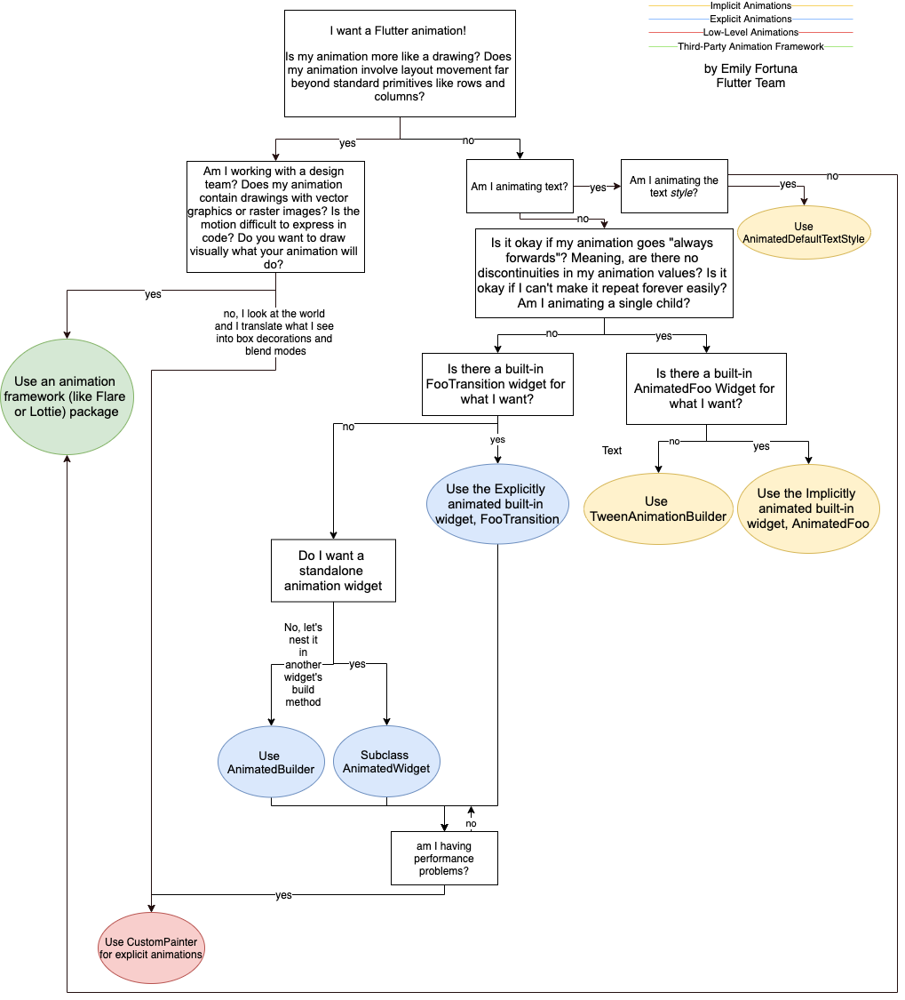
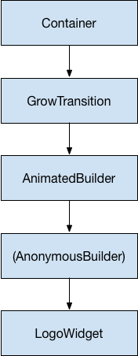

# Animasyonlara Giriş

İyi tasarlanmış animasyonlar, bir kullanıcı arayüzünün (UI) daha sezgisel hissedilmesini sağlar, cilalanmış bir uygulamanın şık görünümüne ve hissine katkıda bulunur ve kullanıcı deneyimini iyileştirir. Flutter'ın animasyon desteği, çeşitli animasyon türlerini uygulamayı kolaylaştırır. Birçok widget, özellikle Material widget'ları, tasarım spesifikasyonlarında tanımlanan standart hareket efektleriyle birlikte gelir, ancak bu efektleri özelleştirmek de mümkündür.

## Bir yaklaşım seçmek

Flutter'da animasyon oluştururken izleyebileceğiniz farklı yaklaşımlar vardır. Hangi yaklaşım sizin için doğru? Karar vermenize yardımcı olması için, "Hangi Flutter Animasyon Widget'ı sizin için doğru?" videosuna göz atın. (Ayrıca tamamlayıcı bir makale olarak da yayınlanmıştır.)

[video](https://www.youtube.com/watch?v=GXIJJkq_H8g)


Karar sürecini derinlemesine incelemek için Flutter Europe'da sunulan "Flutter'da animasyonların doğru yapılması" videosunu izleyebilirsiniz.


Videoda gösterildiği gibi, aşağıdaki karar ağacı, bir Flutter animasyonu uygularken hangi yaklaşımı kullanacağınıza karar vermenize yardımcı olur:




[video](https://www.youtube.com/watch?v=PbcILiN8rbo)


### Örtülü (Implicit) ve açık (Explicit) animasyonlar

#### Hazır paketlenmiş örtülü animasyonlar
Hazır paketlenmiş bir örtülü animasyon (uygulanması en kolay animasyon) ihtiyaçlarınıza uyuyorsa, "Örtülü animasyonlarla animasyon temelleri" içeriğine göz atın.

[video](https://www.youtube.com/watch?v=IVTjpW3W33s)

#### Özel örtülü animasyonlar
Özel bir örtülü animasyon oluşturmak için, "TweenAnimationBuilder ile kendi özel örtülü animasyonlarınızı oluşturma" içeriğini izleyin.

[video](https://www.youtube.com/watch?v=6KiPEqzJIKQ)

#### Yerleşik açık animasyonlar
Açık bir animasyon oluşturmak için (çerçevenin kontrol etmesi yerine animasyonu sizin kontrol ettiğiniz), belki de yerleşik açık animasyon sınıflarından birini kullanabilirsiniz. Daha fazla bilgi için "Yerleşik açık animasyonlarla ilk yönlü animasyonlarınızı yapma" içeriğini izleyin.

[video](https://www.youtube.com/watch?v=CunyH6unILQ)

#### Açık animasyonlar
Sıfırdan açık bir animasyon oluşturmanız gerekiyorsa, "AnimatedBuilder ve AnimatedWidget ile özel açık animasyonlar oluşturma" içeriğini izleyin.

[video](https://www.youtube.com/watch?v=fneC7t4R_B0)

## Animasyon türleri

Genel olarak, animasyonlar ya "tween" (ara değer) tabanlı ya da fizik tabanlıdır. Aşağıdaki bölümler bu terimlerin ne anlama geldiğini açıklar ve daha fazla bilgi edinebileceğiniz kaynaklara yönlendirir.

### Tween animasyonu
"In-betweening" (arasını doldurma) kelimesinin kısaltmasıdır. Bir tween animasyonunda, başlangıç ve bitiş noktalarının yanı sıra bir zaman çizelgesi ve geçişin zamanlamasını ve hızını tanımlayan bir eğri (curve) tanımlanır. Çerçeve (Framework), başlangıç noktasından bitiş noktasına nasıl geçileceğini hesaplar.


* Örneklerde tween kullanan Animasyonlar eğitimine bakın.
* Ayrıca `Tween`, `CurveTween` ve `TweenSequence` için API belgelerine bakın.

### Fizik tabanlı animasyon
Fizik tabanlı animasyonda hareket, gerçek dünya davranışına benzeyecek şekilde modellenir. Örneğin bir topu attığınızda, nereye ve ne zaman düşeceği, ne kadar hızlı atıldığına ve yerden ne kadar yüksekte olduğuna bağlıdır. Benzer şekilde, bir yaya bağlı bir topu düşürmek, bir ipe bağlı bir topu düşürmekten farklı şekilde düşer (ve zıplar).

* Flutter yemek kitabının animasyonlar bölümündeki "Fizik simülasyonu kullanarak bir widget'ı canlandırma" tarifine bakın.
* Ayrıca `AnimationController.animateWith` ve `SpringSimulation` için API belgelerine bakın.

## Yaygın animasyon desenleri

Çoğu UX veya hareket tasarımcısı, bir UI tasarlarken belirli animasyon desenlerinin tekrar tekrar kullanıldığını görür. Bu bölüm, yaygın olarak kullanılan bazı animasyon desenlerini listeler ve daha fazla bilgiyi nerede bulacağınızı söyler.

### Animasyonlu liste veya ızgara
Bu desen, bir listeye veya ızgaraya öğe eklemeyi veya çıkarmayı canlandırmayı içerir.

* **AnimatedList örneği:** Örnek uygulama kataloğundan alınan bu demo, bir listeye öğe eklemeyi veya seçilen bir öğeyi kaldırmayı nasıl canlandıracağınızı gösterir. Kullanıcı artı (+) ve eksi (-) düğmelerini kullanarak listeyi değiştirdikçe dahili Dart listesi senkronize edilir.

### Paylaşılan öğe geçişi (Shared element transition)
Bu desende, kullanıcı sayfadan bir öğeyi (genellikle bir resim) seçer ve UI, seçilen öğeyi daha fazla ayrıntı içeren yeni bir sayfaya canlandırarak taşır. Flutter'da, `Hero` widget'ını kullanarak rotalar (sayfalar) arasında paylaşılan öğe geçişlerini kolayca uygulayabilirsiniz.


* **Hero animasyonları:** İki stil Hero animasyonu nasıl oluşturulur:
    1.  Hero, konum ve boyut değiştirirken bir sayfadan diğerine uçar.
    2.  Hero, bir sayfadan diğerine uçarken sınır şeklini bir daireden kareye değiştirir.
* Ayrıca `Hero`, `Navigator` ve `PageRoute` sınıfları için API belgelerine bakın.

### Kademeli (Staggered) animasyon
Hareketin bir kısmının gecikmeli olduğu, daha küçük hareketlere bölünmüş animasyonlardır. Daha küçük animasyonlar sıralı olabilir veya kısmen ya da tamamen örtüşebilir.


## Temel animasyon kavramları ve sınıfları

Flutter'daki animasyon sistemi, türlendirilmiş `Animation` nesnelerine dayanır. Widget'lar, mevcut değerlerini okuyarak ve durum değişikliklerini dinleyerek bu animasyonları doğrudan derleme (build) işlevlerine dahil edebilirler veya animasyonları diğer widget'lara ilettikleri daha ayrıntılı animasyonların temeli olarak kullanabilirler.


### Animation<double>
Flutter'da bir `Animation` nesnesi ekranda ne olduğu hakkında hiçbir şey bilmez. `Animation`, mevcut değerini ve durumunu (tamamlandı veya reddedildi) anlayan soyut bir sınıftır. En yaygın kullanılan animasyon türlerinden biri `Animation<double>`'dır.

Bir `Animation` nesnesi, belirli bir süre boyunca iki değer arasında enterpolasyonlu (ara değerler) sayılar üretir. Bir `Animation` nesnesinin çıktısı doğrusal, bir eğri, bir basamak işlevi veya oluşturabileceğiniz herhangi bir eşleme olabilir. `Animation` nesnesinin nasıl kontrol edildiğine bağlı olarak, tersine çalışabilir veya hatta ortada yön değiştirebilir.

Animasyonlar, `Animation<Color>` veya `Animation<Size>` gibi double dışındaki türleri de enterpole edebilir. `Animation` nesnesinin durumu vardır. Mevcut değeri her zaman `.value` üyesinde bulunur.

Bir `Animation` nesnesi, oluşturma (rendering) veya `build()` işlevleri hakkında hiçbir şey bilmez.

### CurvedAnimation
Bir `CurvedAnimation`, animasyonun ilerlemesini doğrusal olmayan bir eğri olarak tanımlar.

```dart
animation = CurvedAnimation(parent: controller, curve: Curves.easeIn);
```

`CurvedAnimation` ve `AnimationController` (sonraki bölümlerde açıklanmıştır) her ikisi de `Animation<double>` türündedir, bu nedenle bunları birbirinin yerine geçirebilirsiniz. `CurvedAnimation`, değiştirdiği nesneyi sarar; bir eğri uygulamak için `AnimationController`'ın alt sınıfını oluşturmazsınız.

`CurvedAnimation` ile `Curves` sınıfını kullanabilirsiniz. `Curves` sınıfı, yaygın olarak kullanılan birçok eğriyi tanımlar veya kendi eğrinizi oluşturabilirsiniz. Örneğin:

```dart
import 'dart:math';

class ShakeCurve extends Curve {
  @override
  double transform(double t) => sin(t * pi * 2);
}
```

Bir `Tween`'e animasyon eğrisi uygulamak istiyorsanız, `CurveTween` kullanmayı düşünün.

### AnimationController

`AnimationController`, donanım yeni bir kare için her hazır olduğunda yeni bir değer üreten özel bir `Animation` nesnesidir. Varsayılan olarak, bir `AnimationController`, belirli bir süre boyunca 0.0'dan 1.0'a kadar olan sayıları doğrusal olarak üretir. Örneğin, bu kod bir `Animation` nesnesi oluşturur ancak çalıştırmaz:

```dart
controller = AnimationController(
  duration: const Duration(seconds: 2),
  vsync: this,
);
```

`AnimationController`, `Animation<double>` sınıfından türetilir, bu nedenle bir `Animation` nesnesinin gerekli olduğu her yerde kullanılabilir. Ancak, `AnimationController` animasyonu kontrol etmek için ek yöntemlere sahiptir. Örneğin, `.forward()` yöntemiyle bir animasyonu başlatırsınız. Sayıların üretimi ekran yenilemeye bağlıdır, bu nedenle genellikle saniyede 60 sayı üretilir. Her sayı üretildikten sonra, her `Animation` nesnesi bağlı `Listener` nesnelerini çağırır. Her çocuk için özel bir görüntüleme listesi oluşturmak için `RepaintBoundary`'ye bakın.

Bir `AnimationController` oluştururken, ona bir `vsync` argümanı geçirirsiniz. `vsync` varlığı, ekran dışı animasyonların gereksiz kaynak tüketmesini önler. Sınıf tanımına `SingleTickerProviderStateMixin` ekleyerek durum bilgisi olan (stateful) nesnenizi vsync olarak kullanabilirsiniz. Bunun bir örneğini GitHub'daki `animate1` içinde görebilirsiniz.

> **Not:** Bazı durumlarda, bir konum `AnimationController`'ın 0.0-1.0 aralığını aşabilir. Örneğin, `fling()` işlevi hız, kuvvet ve konum (Force nesnesini kullanarak) sağlamanıza olanak tanır. Konum herhangi bir şey olabilir ve bu nedenle 0.0 ile 1.0 aralığının dışında olabilir.
> Bir `CurvedAnimation`, `AnimationController` aşmasa bile 0.0 ile 1.0 aralığını aşabilir. Seçilen eğriye bağlı olarak, `CurvedAnimation` çıktısı girdiden daha geniş bir aralığa sahip olabilir. Örneğin, `Curves.elasticIn` gibi elastik eğriler varsayılan aralığı önemli ölçüde aşar veya altına düşer.

### Tween

Varsayılan olarak, `AnimationController` nesnesi 0.0 ile 1.0 arasında değişir. Farklı bir aralığa veya farklı bir veri türüne ihtiyacınız varsa, bir animasyonu farklı bir aralığa veya veri türüne enterpole etmek üzere yapılandırmak için bir `Tween` kullanabilirsiniz. Örneğin, aşağıdaki `Tween` -200.0'dan 0.0'a gider:

```dart
tween = Tween<double>(begin: -200, end: 0);

```

Bir `Tween`, yalnızca `begin` ve `end` alan durumsuz (stateless) bir nesnedir. Bir `Tween`'in tek işi, bir giriş aralığından bir çıkış aralığına bir eşleme tanımlamaktır. Giriş aralığı genellikle 0.0 ile 1.0 arasındadır, ancak bu bir zorunluluk değildir.

Bir `Tween`, `Animation<T>`'den değil, `Animatable<T>`'den miras alır. `Animation` gibi bir `Animatable`'ın da çıktı olarak double vermesi gerekmez. Örneğin, `ColorTween` iki renk arasındaki ilerlemeyi belirtir.

```dart
colorTween = ColorTween(begin: Colors.transparent, end: Colors.black54);
```

Bir `Tween` nesnesi herhangi bir durum saklamaz. Bunun yerine, animasyonun geçerli değerini (0.0 ile 1.0 arasında) gerçek animasyon değerine eşlemek için `transform` işlevini kullanan `evaluate(Animation<double> animation)` yöntemini sağlar.

`Animation` nesnesinin geçerli değeri `.value` yönteminde bulunabilir. Evaluate işlevi, animasyon değerleri sırasıyla 0.0 ve 1.0 olduğunda başlangıç ve bitişin döndürülmesini sağlamak gibi bazı temizlik işlemleri de yapar.

#### Tween.animate

Bir `Tween` nesnesini kullanmak için, denetleyici (controller) nesnesini geçirerek `Tween` üzerinde `animate()` çağrısı yapın. Örneğin, aşağıdaki kod 500 ms içinde 0'dan 255'e kadar tamsayı değerleri üretir.

```dart
AnimationController controller = AnimationController(
  duration: const Duration(milliseconds: 500),
  vsync: this,
);
Animation<int> alpha = IntTween(begin: 0, end: 255).animate(controller);
```

> **Not:** `animate()` yöntemi bir `Animatable` değil, bir `Animation` döndürür.

Aşağıdaki örnek bir denetleyici, bir eğri ve bir `Tween` göstermektedir:

```dart
AnimationController controller = AnimationController(
  duration: const Duration(milliseconds: 500),
  vsync: this,
);
final Animation<double> curve = CurvedAnimation(
  parent: controller,
  curve: Curves.easeOut,
);
Animation<int> alpha = IntTween(begin: 0, end: 255).animate(curve);
```

### Animasyon bildirimleri

Bir `Animation` nesnesi, `addListener()` ve `addStatusListener()` ile tanımlanan `Listener` ve `StatusListener`'lara sahip olabilir. Bir `Listener`, animasyonun değeri her değiştiğinde çağrılır. Bir `Listener`'ın en yaygın davranışı, yeniden oluşturmayı (rebuild) tetiklemek için `setState()` çağırmaktır. Bir `StatusListener`, `AnimationStatus` tarafından tanımlandığı gibi bir animasyon başladığında, bittiğinde, ileri hareket ettiğinde veya geri hareket ettiğinde çağrılır.

## Codelab'ler, eğitimler ve makaleler

Aşağıdaki kaynaklar Flutter animasyon çerçevesini öğrenmeye başlamak için iyi bir yerdir. Bu belgelerin her biri animasyon kodunun nasıl yazılacağını gösterir.

* **Flutter'da Animasyonlar Codelab:** Çoktan seçmeli bir bilgi yarışması oyunu oluştururken örtülü ve açık animasyonlar hakkında bilgi edinin.
* **Animasyonlar eğitimi:** Animasyon API'lerinin farklı yönlerini kullanarak bir dizi tween animasyonunda size rehberlik ederken Flutter animasyon paketindeki temel sınıfları (controllers, Animatable, curves, listeners, builders) açıklar. Bu eğitim, kendi özel açık animasyonlarınızı nasıl oluşturacağınızı gösterir.
* **Flutter ile Sıfırdan Bire, Bölüm 1 ve Bölüm 2:** Tweening kullanarak animasyonlu bir grafiğin nasıl oluşturulacağını gösteren Medium makaleleri.
* **Basit oyunlar araç seti:** Flutter animasyonlarının nasıl kullanılacağına dair örnekler içeren oyun şablonlarına sahip bir araç seti.

### Diğer kaynaklar

Aşağıdaki bağlantılardan Flutter animasyonları hakkında daha fazla bilgi edinin:

* **pub.dev üzerindeki animasyon paketleri:** Container dönüşümleri, paylaşılan eksen geçişleri, sönerek geçişler ve sönme geçişleri dahil olmak üzere yaygın olarak kullanılan desenler için önceden oluşturulmuş animasyonlar içerir.
* **Animasyon örnekleri:** Örnek uygulama kataloğundan.
* **Animasyon tarifleri:** Flutter yemek kitabından.
* **Animasyon videoları:** Flutter YouTube kanalından.
* **Animasyonlar: genel bakış:** Animasyon kütüphanesindeki bazı önemli sınıflara ve Flutter'ın animasyon mimarisine bir bakış.
* **Animasyon ve hareket widget'ları:** Flutter API'lerinde sağlanan bazı animasyon widget'larının kataloğu.
* **Flutter API belgelerindeki animasyon kütüphanesi:** Flutter çerçevesi için animasyon API'si. Bu bağlantı sizi kütüphane için teknik bir genel bakış sayfasına götürür.


# Animasyon Eğitimi

**Neler öğreneceksiniz:**
* Bir widget'a animasyon eklemek için animasyon kütüphanesindeki temel sınıfların nasıl kullanılacağı.
* `AnimatedWidget` ile `AnimatedBuilder`'ın ne zaman kullanılacağı.

Bu eğitim, Flutter'da açık animasyonların nasıl oluşturulacağını gösterir. Örnekler birbirinin üzerine inşa edilerek sizi animasyon kütüphanesinin farklı yönleriyle tanıştırır. Eğitim, *Animasyonlara Giriş* bölümünde hakkında bilgi edinebileceğiniz animasyon kütüphanesindeki temel kavramlar, sınıflar ve yöntemler üzerine kurulmuştur.

Flutter SDK ayrıca `FadeTransition`, `SizeTransition` ve `SlideTransition` gibi yerleşik açık animasyonlar da sağlar. Bu basit animasyonlar, bir başlangıç ve bitiş noktası ayarlanarak tetiklenir. Burada açıklanan özel açık animasyonlara göre uygulanmaları daha basittir.


Aşağıdaki bölümler sizi çeşitli animasyon örneklerinde yönlendirir. Her bölüm, o örneğin kaynak koduna bir bağlantı sağlar.

## Animasyonları Oluşturma (Rendering)

**Amaç ne?**
* `addListener()` ve `setState()` kullanarak bir widget'a temel animasyon ekleme.
* Animasyon her yeni bir sayı ürettiğinde, `addListener()` işlevi `setState()`'i çağırır.
* Gerekli `vsync` parametresi ile bir `AnimationController` nasıl tanımlanır.
* Dart'ın "çağlayan (cascade) notasyonu" olarak da bilinen "..addListener" içindeki ".." sözdizimini anlama.
* Bir sınıfı gizli (private) yapmak için adını alt çizgi (_) ile başlatın.

Şimdiye kadar zaman içinde bir sayı dizisi oluşturmayı öğrendiniz. Ekrana henüz hiçbir şey çizilmedi. Bir `Animation` nesnesi ile çizim yapmak için, `Animation` nesnesini widget'ınızın bir üyesi olarak saklayın, ardından nasıl çizileceğine karar vermek için değerini kullanın.


Aşağıdaki, Flutter logosunu animasyonsuz çizen uygulamayı ele alalım:

```dart
import 'package:flutter/material.dart';

void main() => runApp(const LogoApp());

class LogoApp extends StatefulWidget {
  const LogoApp({super.key});

  @override
  State<LogoApp> createState() => _LogoAppState();
}

class _LogoAppState extends State<LogoApp> {
  @override
  Widget build(BuildContext context) {
    return Center(
      child: Container(
        margin: const EdgeInsets.symmetric(vertical: 10),
        height: 300,
        width: 300,
        child: const FlutterLogo(),
      ),
    );
  }
}
```

*Uygulama kaynağı: animate0*

Aşağıdaki kod, logonun hiçlikten tam boyuta büyümesini canlandırmak için değiştirilmiş aynı kodu göstermektedir. Bir `AnimationController` tanımlarken, bir `vsync` nesnesi geçirmelisiniz. `vsync` parametresinin açıklaması `AnimationController` bölümünde mevcuttur.

Animasyonsuz örnekteki değişiklikler vurgulanmıştır:

```dart
// class _LogoAppState extends State<LogoApp> {
class _LogoAppState extends State<LogoApp> with SingleTickerProviderStateMixin {
  late Animation<double> animation;
  late AnimationController controller;

  @override
  void initState() {
    super.initState();
    controller =
        AnimationController(duration: const Duration(seconds: 2), vsync: this);
    animation = Tween<double>(begin: 0, end: 300).animate(controller)
      ..addListener(() {
        setState(() {
          // Burada değişen durum, animasyon nesnesinin değeridir.
        });
      });
    controller.forward();
  }

  @override
  Widget build(BuildContext context) {
    return Center(
      child: Container(
        margin: const EdgeInsets.symmetric(vertical: 10),
        // height: 300,
        // width: 300,
        height: animation.value,
        width: animation.value,
        child: const FlutterLogo(),
      ),
    );
  }

  @override
  void dispose() {
    controller.dispose();
    super.dispose();
  }
}
```

*Uygulama kaynağı: animate1*

`addListener()` işlevi `setState()`'i çağırır, böylece `Animation` her yeni bir sayı ürettiğinde mevcut kare "kirli" (dirty) olarak işaretlenir, bu da `build()` yönteminin tekrar çağrılmasını zorlar. `build()` içinde, konteynerin boyutu değişir çünkü yüksekliği ve genişliği artık sabit kodlanmış bir değer yerine `animation.value` kullanır. Bellek sızıntılarını önlemek için `State` nesnesi atıldığında (discarded) denetleyiciyi (controller) `dispose` edin.

Bu birkaç değişiklikle, Flutter'daki ilk animasyonunuzu oluşturdunuz!

### Dart dili ipucu

Dart'ın çağlayan notasyonuna (cascade notation)—`..addListener()` içindeki iki nokta—aşina olmayabilirsiniz. Bu sözdizimi, `addListener()` yönteminin `animate()` dönüş değeriyle çağrıldığı anlamına gelir. Aşağıdaki örneği düşünün:

```dart
animation = Tween<double>(begin: 0, end: 300).animate(controller)
  ..addListener(() {
    // ···
  });
```

Bu kod şuna eşdeğerdir:

```dart
animation = Tween<double>(begin: 0, end: 300).animate(controller);
animation.addListener(() {
    // ···
  });
```

Çağlayanlar (cascades) hakkında daha fazla bilgi edinmek için Dart dili belgelerindeki *Cascade notation* bölümüne bakın.

## AnimatedWidget ile Sadeleştirme

**Amaç ne?**

* Animasyon yapan bir widget oluşturmak için ( `addListener()` ve `setState()` yerine) `AnimatedWidget` yardımcı sınıfını nasıl kullanacağınızı öğrenin.
* Yeniden kullanılabilir bir animasyon gerçekleştiren bir widget oluşturmak için `AnimatedWidget` kullanın. Geçişi widget'tan ayırmak için, *AnimatedBuilder ile Yeniden Düzenleme* bölümünde gösterildiği gibi bir `AnimatedBuilder` kullanın.
* Flutter API'sindeki `AnimatedWidget` örnekleri: `AnimatedBuilder`, `AnimatedModalBarrier`, `DecoratedBoxTransition`, `FadeTransition`, `PositionedTransition`, `RelativePositionedTransition`, `RotationTransition`, `ScaleTransition`, `SizeTransition`, `SlideTransition`.

`AnimatedWidget` temel sınıfı, çekirdek widget kodunu animasyon kodundan ayırmanıza olanak tanır. `AnimatedWidget`, animasyonu tutmak için bir `State` nesnesi sürdürmeye ihtiyaç duymaz. Aşağıdaki `AnimatedLogo` sınıfını ekleyin:

```dart
class AnimatedLogo extends AnimatedWidget {
  const AnimatedLogo({super.key, required Animation<double> animation})
    : super(listenable: animation);

  @override
  Widget build(BuildContext context) {
    final animation = listenable as Animation<double>;
    return Center(
      child: Container(
        margin: const EdgeInsets.symmetric(vertical: 10),
        height: animation.value,
        width: animation.value,
        child: const FlutterLogo(),
      ),
    );
  }
}
```

`AnimatedLogo`, kendini çizerken `animation`'ın o anki değerini kullanır.

`LogoApp` hala `AnimationController` ve `Tween`'i yönetir ve `Animation` nesnesini `AnimatedLogo`'ya iletir:

```dart
void main() => runApp(const LogoApp());

class AnimatedLogo extends AnimatedWidget {
  const AnimatedLogo({super.key, required Animation<double> animation})
      : super(listenable: animation);

  @override
  Widget build(BuildContext context) {
    final animation = listenable as Animation<double>;
    return Center(
      child: Container(
        margin: const EdgeInsets.symmetric(vertical: 10),
        height: animation.value,
        width: animation.value,
        child: const FlutterLogo(),
      ),
    );
  }
}

class LogoApp extends StatefulWidget {
  // ...

  @override
  void initState() {
    super.initState();
    controller =
        AnimationController(duration: const Duration(seconds: 2), vsync: this);
    // addListener ve setState artık gerekli değil
    animation = Tween<double>(begin: 0, end: 300).animate(controller);
    controller.forward();
  }

  @override
  Widget build(BuildContext context) => AnimatedLogo(animation: animation);

  // ...
}
```

*Uygulama kaynağı: animate2*

## Animasyonun İlerlemesini İzleme

**Amaç ne?**

* Başlatma, durdurma veya yönü tersine çevirme gibi animasyon durumu değişikliklerinin bildirimleri için `addStatusListener()` kullanın.
* Animasyon tamamlandığında veya başlangıç durumuna döndüğünde yönü tersine çevirerek bir animasyonu sonsuz döngüde çalıştırın.

Animasyonun bittiği, ileri gittiği veya tersine döndüğü gibi durum değişikliklerini bilmek genellikle yararlıdır. `addStatusListener()` ile bunun için bildirimler alabilirsiniz. Aşağıdaki kod, önceki örneği bir durum değişikliğini dinleyecek ve bir güncelleme yazdıracak şekilde değiştirir. Vurgulanan satır değişikliği gösterir:

```dart
class _LogoAppState extends State<LogoApp> with SingleTickerProviderStateMixin {
  late Animation<double> animation;
  late AnimationController controller;

  @override
  void initState() {
    super.initState();
    controller = AnimationController(
      duration: const Duration(seconds: 2),
      vsync: this,
    );
    animation = Tween<double>(begin: 0, end: 300).animate(controller)
      ..addStatusListener((status) => print('$status'));
    controller.forward();
  }
  // ...
}
```

Bu kodun çalıştırılması şu çıktıyı üretir:

```
AnimationStatus.forward
AnimationStatus.completed
```

Daha sonra, animasyonu başlangıçta veya sonda tersine çevirmek için `addStatusListener()` kullanın. Bu bir "nefes alma" etkisi yaratır:

```dart
void initState() {
  super.initState();
  controller =
      AnimationController(duration: const Duration(seconds: 2), vsync: this);
  animation = Tween<double>(begin: 0, end: 300).animate(controller);
  animation = Tween<double>(begin: 0, end: 300).animate(controller)
    ..addStatusListener((status) {
      if (status == AnimationStatus.completed) {
        controller.reverse();
      } else if (status == AnimationStatus.dismissed) {
        controller.forward();
      }
    })
    ..addStatusListener((status) => print('$status'));
  controller.forward();
}
```


*Uygulama kaynağı: animate3*

## AnimatedBuilder ile Yeniden Düzenleme (Refactoring)

**Amaç ne?**

* Bir `AnimatedBuilder`, geçişin nasıl işleneceğini (render) anlar.
* Bir `AnimatedBuilder`, widget'ın nasıl işleneceğini bilmez ve `Animation` nesnesini yönetmez.
* Başka bir widget'ın build yönteminin bir parçası olarak bir animasyonu tanımlamak için `AnimatedBuilder` kullanın. Yeniden kullanılabilir bir animasyona sahip bir widget tanımlamak istiyorsanız, *AnimatedWidget ile Sadeleştirme* bölümünde gösterildiği gibi `AnimatedWidget` kullanın.
* Flutter API'sindeki `AnimatedBuilder` örnekleri: `BottomSheet`, `ExpansionTile`, `PopupMenu`, `ProgressIndicator`, `RefreshIndicator`, `Scaffold`, `SnackBar`, `TabBar`, `TextField`.

`animate3` örneğindeki kodla ilgili bir sorun, animasyonu değiştirmenin logoyu işleyen widget'ı değiştirmeyi gerektirmesidir. Daha iyi bir çözüm, sorumlulukları farklı sınıflara ayırmaktır:

1. Logoyu işle (render)
2. `Animation` nesnesini tanımla
3. Geçişi işle (render)

Bu ayrımı `AnimatedBuilder` sınıfının yardımıyla gerçekleştirebilirsiniz. `AnimatedBuilder`, işleme ağacında (render tree) ayrı bir sınıftır. `AnimatedWidget` gibi, `AnimatedBuilder` da `Animation` nesnesinden gelen bildirimleri otomatik olarak dinler ve widget ağacını gerektiği gibi kirli olarak işaretler, bu nedenle `addListener()` öğesini çağırmanıza gerek yoktur.

`animate4` örneği için widget ağacı şöyle görünür:



Widget ağacının en altından başlayarak, logoyu işleme kodu basittir:

```dart
class LogoWidget extends StatelessWidget {
  const LogoWidget({super.key});

  // Animasyonlu ebeveyni doldurması için yükseklik ve genişliği dışarıda bırakın.
  @override
  Widget build(BuildContext context) {
    return Container(
      margin: const EdgeInsets.symmetric(vertical: 10),
      child: const FlutterLogo(),
    );
  }
}
```

Diyagramdaki ortadaki üç blok, aşağıda gösterilen `GrowTransition` içindeki `build()` yönteminde oluşturulur. `GrowTransition` widget'ının kendisi durumsuzdur (stateless) ve geçiş animasyonunu tanımlamak için gerekli olan son değişkenler kümesini tutar. `build()` işlevi, parametre olarak (Anonim oluşturucu) yöntemini ve `LogoWidget` nesnesini alan `AnimatedBuilder`'ı oluşturur ve döndürür. Geçişi işleme işi aslında, `LogoWidget`'ı sığdırmak için küçülmeye zorlayan uygun boyutta bir `Container` oluşturan (Anonim oluşturucu) yönteminde gerçekleşir.

Aşağıdaki koddaki zor noktalardan biri, child'ın (çocuğun) iki kez belirtilmiş gibi görünmesidir. Olan şudur: child'ın dış referansı `AnimatedBuilder`'a iletilir, o da onu anonim closure'a iletir, bu closure da o nesneyi kendi child'ı olarak kullanır. Sonuç olarak `AnimatedBuilder`, işleme ağacındaki iki widget'ın arasına eklenir.

```dart
class GrowTransition extends StatelessWidget {
  const GrowTransition({
    required this.child,
    required this.animation,
    super.key,
  });

  final Widget child;
  final Animation<double> animation;

  @override
  Widget build(BuildContext context) {
    return Center(
      child: AnimatedBuilder(
        animation: animation,
        builder: (context, child) {
          return SizedBox(
            height: animation.value,
            width: animation.value,
            child: child,
          );
        },
        child: child,
      ),
    );
  }
}
```

Son olarak, animasyonu başlatma kodu `animate2` örneğine çok benzer. `initState()` yöntemi bir `AnimationController` ve bir `Tween` oluşturur, ardından bunları `animate()` ile bağlar. Büyü, bir child olarak `LogoWidget` ve geçişi yönlendirmek için bir animasyon nesnesi ile bir `GrowTransition` nesnesi döndüren `build()` yönteminde gerçekleşir. Bunlar, yukarıdaki madde işaretlerinde listelenen üç öğedir.

```dart
void main() => runApp(const LogoApp());

class LogoWidget extends StatelessWidget {
  const LogoWidget({super.key});

  // Animasyonlu ebeveyni doldurması için yükseklik ve genişliği dışarıda bırakın.
  @override
  Widget build(BuildContext context) {
    return Container(
      margin: const EdgeInsets.symmetric(vertical: 10),
      child: const FlutterLogo(),
    );
  }
}

class GrowTransition extends StatelessWidget {
  const GrowTransition({
    required this.child,
    required this.animation,
    super.key,
  });

  final Widget child;
  final Animation<double> animation;

  @override
  Widget build(BuildContext context) {
    return Center(
      child: AnimatedBuilder(
        animation: animation,
        builder: (context, child) {
          return SizedBox(
            height: animation.value,
            width: animation.value,
            child: child,
          );
        },
        child: child,
      ),
    );
  }
}

class LogoApp extends StatefulWidget {
  // ...

  // @override
  // Widget build(BuildContext context) => AnimatedLogo(animation: animation);
  @override
  Widget build(BuildContext context) {
    return GrowTransition(
      animation: animation,
      child: const LogoWidget(),
    );
  }

  // ...
}
```


## Eşzamanlı Animasyonlar

**Amaç ne?**

* `Curves` sınıfı, bir `CurvedAnimation` ile kullanabileceğiniz yaygın olarak kullanılan eğrilerin bir dizisini tanımlar.

Bu bölümde, sürekli olarak içeri ve dışarı animasyon yapmak için `AnimatedWidget` kullanan *animasyonun ilerlemesini izleme* (animate3) örneğinin üzerine inşa edeceksiniz. Opaklık şeffaftan opağa doğru canlanırken, içeri ve dışarı animasyon yapmak istediğiniz durumu düşünün.

> **Not:** Bu örnek, her bir tween'in animasyondaki farklı bir efekti yönettiği, aynı animasyon denetleyicisi üzerinde birden fazla tween'in nasıl kullanılacağını gösterir. Yalnızca açıklama amaçlıdır. Üretim kodunda opaklık ve boyutu tween'liyorsanız, muhtemelen bunun yerine `FadeTransition` ve `SizeTransition` kullanırsınız.

Her tween, animasyonun bir yönünü yönetir. Örneğin:

```dart
controller = AnimationController(
  duration: const Duration(seconds: 2),
  vsync: this,
);
sizeAnimation = Tween<double>(begin: 0, end: 300).animate(controller);
opacityAnimation = Tween<double>(begin: 0.1, end: 1).animate(controller);
```

Boyutu `sizeAnimation.value` ile ve opaklığı `opacityAnimation.value` ile alabilirsiniz, ancak `AnimatedWidget` yapıcısı yalnızca tek bir `Animation` nesnesi alır. Bu sorunu çözmek için örnek, kendi `Tween` nesnelerini oluşturur ve değerleri açıkça hesaplar.

`AnimatedLogo`'yu kendi `Tween` nesnelerini kapsayacak şekilde değiştirin ve `build()` yöntemi, gerekli boyut ve opaklık değerlerini hesaplamak için ebeveynin animasyon nesnesi üzerinde `Tween.evaluate()` çağrısı yapsın. Aşağıdaki kod değişiklikleri vurgulanmış olarak göstermektedir:

```dart
class AnimatedLogo extends AnimatedWidget {
  const AnimatedLogo({super.key, required Animation<double> animation})
    : super(listenable: animation);

  // Değişmedikleri için Tween'leri statik yapın.
  static final _opacityTween = Tween<double>(begin: 0.1, end: 1);
  static final _sizeTween = Tween<double>(begin: 0, end: 300);

  @override
  Widget build(BuildContext context) {
    final animation = listenable as Animation<double>;
    return Center(
      child: Opacity(
        opacity: _opacityTween.evaluate(animation),
        child: Container(
          margin: const EdgeInsets.symmetric(vertical: 10),
          height: _sizeTween.evaluate(animation),
          width: _sizeTween.evaluate(animation),
          child: const FlutterLogo(),
        ),
      ),
    );
  }
}

class LogoApp extends StatefulWidget {
  const LogoApp({super.key});

  @override
  State<LogoApp> createState() => _LogoAppState();
}

class _LogoAppState extends State<LogoApp> with SingleTickerProviderStateMixin {
  late Animation<double> animation;
  late AnimationController controller;

  @override
  void initState() {
    super.initState();
    controller = AnimationController(
      duration: const Duration(seconds: 2),
      vsync: this,
    );
    animation = CurvedAnimation(parent: controller, curve: Curves.easeIn)
      ..addStatusListener((status) {
        if (status == AnimationStatus.completed) {
          controller.reverse();
        } else if (status == AnimationStatus.dismissed) {
          controller.forward();
        }
      });
    controller.forward();
  }

  @override
  Widget build(BuildContext context) => AnimatedLogo(animation: animation);

  @override
  void dispose() {
    controller.dispose();
    super.dispose();
  }
}
```

*Uygulama kaynağı: animate5*

* Bir `AnimationController`, `Animation`'ı yönetir.
* Bir `CurvedAnimation`, ilerlemeyi doğrusal olmayan bir eğri olarak tanımlar.
* Bir `Tween`, canlandırılan bir özellik için başlangıç ve bitiş değeri arasında enterpolasyon yapar.

**Sonraki adımlar**
Bu eğitim, `Tweens` kullanarak Flutter'da animasyonlar oluşturmak için size bir temel sağlar, ancak keşfedilecek daha birçok sınıf vardır. Özelleştirilmiş `Tween` sınıflarını, tasarım sistemi türünüze özgü animasyonları, `ReverseAnimation`, paylaşılan öğe geçişlerini (Hero animasyonları olarak da bilinir), fizik simülasyonlarını ve `fling()` yöntemlerini inceleyebilirsiniz.


# Bir Kapsayıcının (Container) Özelliklerini Canlandırma

`Container` sınıfı; genişlik, yükseklik, arka plan rengi, dolgu (padding), kenarlıklar ve daha fazlası gibi belirli özelliklere sahip bir widget oluşturmanın uygun bir yolunu sağlar.

Basit animasyonlar genellikle bu özelliklerin zaman içinde değiştirilmesini içerir. Örneğin, bir öğenin kullanıcı tarafından seçildiğini belirtmek için arka plan rengini griden yeşile canlandırmak (animate) isteyebilirsiniz.

Bu özellikleri canlandırmak için Flutter, **`AnimatedContainer`** widget'ını sağlar. `Container` widget'ı gibi, `AnimatedContainer` da genişliği, yüksekliği, arka plan renklerini ve daha fazlasını tanımlamanıza olanak tanır. Ancak, `AnimatedContainer` yeni özelliklerle yeniden oluşturulduğunda (rebuild), eski ve yeni değerler arasında otomatik olarak animasyon yapar. Flutter'da bu tür animasyonlar "örtülü animasyonlar" (implicit animations) olarak bilinir.

Bu tarif, aşağıdaki adımları kullanarak kullanıcı bir düğmeye dokunduğunda boyutu, arka plan rengini ve kenarlık yarıçapını canlandırmak için bir `AnimatedContainer`'ın nasıl kullanılacağını açıklar:

1. Varsayılan özelliklere sahip bir `StatefulWidget` oluşturun.
2. Özellikleri kullanarak bir `AnimatedContainer` oluşturun.
3. Yeni özelliklerle yeniden oluşturarak animasyonu başlatın.

---

### 1. Varsayılan özelliklere sahip bir StatefulWidget oluşturun

Başlamak için `StatefulWidget` ve `State` sınıfları oluşturun. Zamanla değişen özellikleri tanımlamak için özel `State` sınıfını kullanın. Bu örnekte, buna genişlik, yükseklik, renk ve kenarlık yarıçapı dahildir. Ayrıca her özelliğin varsayılan değerini de tanımlayabilirsiniz.

Bu özellikler özel bir `State` sınıfına aittir, böylece kullanıcı bir düğmeye dokunduğunda güncellenebilirler.

```dart
class AnimatedContainerApp extends StatefulWidget {
  const AnimatedContainerApp({super.key});

  @override
  State<AnimatedContainerApp> createState() => _AnimatedContainerAppState();
}

class _AnimatedContainerAppState extends State<AnimatedContainerApp> {
  // Varsayılan değerlerle çeşitli özellikleri tanımlayın.
  // Kullanıcı FloatingActionButton'a dokunduğunda bu özellikleri güncelleyin.
  double _width = 50;
  double _height = 50;
  Color _color = Colors.green;
  BorderRadiusGeometry _borderRadius = BorderRadius.circular(8);

  @override
  Widget build(BuildContext context) {
    // Bunu sonraki adımlarda doldurun.
    return Container(); // Yer tutucu
  }
}
```

### 2. Özellikleri kullanarak bir `AnimatedContainer` oluşturun

Ardından, önceki adımda tanımlanan özellikleri kullanarak `AnimatedContainer`'ı oluşturun. Ayrıca, animasyonun ne kadar süreceğini tanımlayan bir `duration` (süre) sağlayın.

```dart
AnimatedContainer(
  // State sınıfında saklanan özellikleri kullanın.
  width: _width,
  height: _height,
  decoration: BoxDecoration(
    color: _color,
    borderRadius: _borderRadius,
  ),
  // Animasyonun ne kadar süreceğini tanımlayın.
  duration: const Duration(seconds: 1),
  // Animasyonun daha pürüzsüz hissedilmesi için isteğe bağlı bir eğri (curve) sağlayın.
  curve: Curves.fastOutSlowIn,
)
```

### 3. Yeni özelliklerle yeniden oluşturarak animasyonu başlatın

Son olarak, `AnimatedContainer`'ı yeni özelliklerle yeniden oluşturarak animasyonu başlatın. Yeniden oluşturma (rebuild) nasıl tetiklenir? **`setState()`** yöntemini kullanın.

Uygulamaya bir düğme ekleyin. Kullanıcı düğmeye dokunduğunda, `setState()` çağrısı içinde özellikleri yeni bir genişlik, yükseklik, arka plan rengi ve kenarlık yarıçapı ile güncelleyin.

Gerçek bir uygulama genellikle sabit değerler arasında geçiş yapar (örneğin, gri bir arka plandan yeşil bir arka plana). Bu uygulama için, kullanıcı düğmeye her dokunduğunda rastgele yeni değerler üretin.

```dart
FloatingActionButton(
  // Kullanıcı düğmeye dokunduğunda
  onPressed: () {
    // Widget'ı yeni değerlerle yeniden oluşturmak için setState kullanın.
    setState(() {
      // Rastgele sayı üreteci oluşturun.
      final random = Random();

      // Rastgele bir genişlik ve yükseklik üretin.
      _width = random.nextInt(300).toDouble();
      _height = random.nextInt(300).toDouble();

      // Rastgele bir renk üretin.
      _color = Color.fromRGBO(
        random.nextInt(256),
        random.nextInt(256),
        random.nextInt(256),
        1,
      );

      // Rastgele bir kenarlık yarıçapı (border radius) üretin.
      _borderRadius = BorderRadius.circular(
        random.nextInt(100).toDouble(),
      );
    });
  },
  child: const Icon(Icons.play_arrow),
)
```

## İnteraktif Örnek

```dart
import 'dart:math';

import 'package:flutter/material.dart';

void main() => runApp(const AnimatedContainerApp());

class AnimatedContainerApp extends StatefulWidget {
  const AnimatedContainerApp({super.key});

  @override
  State<AnimatedContainerApp> createState() => _AnimatedContainerAppState();
}

class _AnimatedContainerAppState extends State<AnimatedContainerApp> {
  // Define the various properties with default values. Update these properties
  // when the user taps a FloatingActionButton.
  double _width = 50;
  double _height = 50;
  Color _color = Colors.green;
  BorderRadiusGeometry _borderRadius = BorderRadius.circular(8);

  @override
  Widget build(BuildContext context) {
    return MaterialApp(
      home: Scaffold(
        appBar: AppBar(title: const Text('AnimatedContainer Demo')),
        body: Center(
          child: AnimatedContainer(
            // Use the properties stored in the State class.
            width: _width,
            height: _height,
            decoration: BoxDecoration(
              color: _color,
              borderRadius: _borderRadius,
            ),
            // Define how long the animation should take.
            duration: const Duration(seconds: 1),
            // Provide an optional curve to make the animation feel smoother.
            curve: Curves.fastOutSlowIn,
          ),
        ),
        floatingActionButton: FloatingActionButton(
          // When the user taps the button
          onPressed: () {
            // Use setState to rebuild the widget with new values.
            setState(() {
              // Create a random number generator.
              final random = Random();

              // Generate a random width and height.
              _width = random.nextInt(300).toDouble();
              _height = random.nextInt(300).toDouble();

              // Generate a random color.
              _color = Color.fromRGBO(
                random.nextInt(256),
                random.nextInt(256),
                random.nextInt(256),
                1,
              );

              // Generate a random border radius.
              _borderRadius = BorderRadius.circular(
                random.nextInt(100).toDouble(),
              );
            });
          },
          child: const Icon(Icons.play_arrow),
        ),
      ),
    );
  }
}
```


# Bir Widget'ı Yavaşça Görünür Yapma ve Gizleme (Fade In/Out)

Kullanıcı arayüzü geliştiricilerinin sıklıkla ekrandaki öğeleri göstermesi ve gizlemesi gerekir. Ancak, öğeleri ekranda aniden açıp kapatmak son kullanıcılar için rahatsız edici (sarsıcı) olabilir. Bunun yerine, pürüzsüz bir deneyim oluşturmak için öğeleri bir opaklık (opacity) animasyonuyla yavaşça görünür yapın veya gizleyin.


**`AnimatedOpacity`** widget'ı, opaklık animasyonlarını gerçekleştirmeyi kolaylaştırır. Bu tarif aşağıdaki adımları kullanır:

1.  Görünür/görünmez olacak bir kutu oluşturun.
2.  Bir `StatefulWidget` tanımlayın.
3.  Görünürlüğü değiştiren (toggle) bir düğme görüntüleyin.
4.  Kutuyu yavaşça görünür yapın ve gizleyin.

### 1. Görünür/Görünmez olacak bir kutu oluşturun
Öncelikle, sönerek açılıp kapanacak bir şey oluşturun. Bu örnek için ekrana yeşil bir kutu çizin.

```dart
Container(width: 200, height: 200, color: Colors.green)
```

### 2. Bir `StatefulWidget` tanımlayın

Artık canlandırılacak yeşil bir kutunuz olduğuna göre, kutunun görünür olup olmayacağını bilmenin bir yoluna ihtiyacınız var. Bunu başarmak için bir **`StatefulWidget`** kullanın.

Bir `StatefulWidget`, bir `State` nesnesi oluşturan bir sınıftır. `State` nesnesi, uygulama hakkında bazı verileri tutar ve bu verileri güncellemek için bir yol sağlar. Verileri güncellerken, Flutter'dan kullanıcı arayüzünü (UI) bu değişikliklerle yeniden oluşturmasını (rebuild) da isteyebilirsiniz.

Bu durumda, tek bir veriye sahipsiniz: düğmenin görünür olup olmadığını temsil eden bir mantıksal değer (boolean).

Bir `StatefulWidget` oluşturmak için iki sınıf oluşturun: Bir `StatefulWidget` ve buna karşılık gelen bir `State` sınıfı.

> **İpucu:** Android Studio ve VSCode için Flutter eklentileri, bu kodu hızlı bir şekilde oluşturmak için `stful` kısayolunu (snippet) içerir.

```dart
// StatefulWidget'ın işi verileri almak ve bir State sınıfı oluşturmaktır.
// Bu durumda, widget bir başlık alır ve bir _MyHomePageState oluşturur.
class MyHomePage extends StatefulWidget {
  final String title;

  const MyHomePage({super.key, required this.title});

  @override
  State<MyHomePage> createState() => _MyHomePageState();
}

// State sınıfı iki şeyden sorumludur: güncelleyebileceğiniz bazı verileri tutmak
// ve bu verileri kullanarak UI'yi oluşturmak.
class _MyHomePageState extends State<MyHomePage> {
  // Yeşil kutunun görünür olup olmayacağı durumu.
  bool _visible = true;

  @override
  Widget build(BuildContext context) {
    // Yeşil kutu diğer Widget'larla birlikte buraya gelecek.
    return Scaffold(
      appBar: AppBar(title: Text(widget.title)),
      body: Center(
        child: // AnimatedOpacity buraya eklenecek (Adım 4)
      ),
    );
  }
}
```

### 3. Görünürlüğü değiştiren bir düğme görüntüleyin

Yeşil kutunun görünür olup olmayacağını belirleyecek bazı verileriniz olduğuna göre, bu verileri güncellemenin bir yoluna ihtiyacınız var. Bu örnekte, kutu görünürse gizleyin. Kutu gizliyse gösterin.

Bunu halletmek için bir düğme görüntüleyin. Bir kullanıcı düğmeye bastığında, boolean değerini `true`'dan `false`'a veya `false`'dan `true`'ya çevirin. Bu değişikliği, `State` sınıfında bir yöntem olan **`setState()`** kullanarak yapın. Bu, Flutter'a widget'ı yeniden oluşturmasını söyler.

Kullanıcı girişiyle çalışma hakkında daha fazla bilgi için, yemek kitabının "Hareketler" (Gestures) bölümüne bakın.

```dart
FloatingActionButton(
  onPressed: () {
    // setState'i çağırın. Bu, Flutter'a UI'yi değişikliklerle
    // yeniden oluşturmasını söyler.
    setState(() {
      _visible = !_visible;
    });
  },
  tooltip: 'Opaklığı Değiştir',
  child: const Icon(Icons.flip),
)
```

### 4. Kutuyu yavaşça görünür yapın ve gizleyin

Ekranınızda yeşil bir kutu ve görünürlüğü `true` veya `false` olarak değiştiren bir düğmeniz var. Kutuyu nasıl sönerek açıp kapatırsınız? Bir **`AnimatedOpacity`** widget'ı ile.

`AnimatedOpacity` widget'ı üç argüman gerektirir:

* **opacity:** 0.0 (görünmez) ile 1.0 (tamamen görünür) arasında bir değer.
* **duration:** Animasyonun tamamlanmasının ne kadar süreceği.
* **child:** Canlandırılacak widget. Bu durumda, yeşil kutu.

```dart
AnimatedOpacity(
  // Widget görünürse 1.0, gizliyse 0.0 değerini kullan.
  opacity: _visible ? 1.0 : 0.0,
  duration: const Duration(milliseconds: 500),
  // Yeşil kutu, AnimatedOpacity widget'ının bir çocuğu (child) olmalıdır.
  child: Container(width: 200, height: 200, color: Colors.green),
)
```


## İnteraktif Örnek

```dart
import 'package:flutter/material.dart';

void main() => runApp(const MyApp());

class MyApp extends StatelessWidget {
  const MyApp({super.key});

  @override
  Widget build(BuildContext context) {
    const appTitle = 'Opacity Demo';
    return const MaterialApp(
      title: appTitle,
      home: MyHomePage(title: appTitle),
    );
  }
}

// The StatefulWidget's job is to take data and create a State class.
// In this case, the widget takes a title, and creates a _MyHomePageState.
class MyHomePage extends StatefulWidget {
  const MyHomePage({super.key, required this.title});

  final String title;

  @override
  State<MyHomePage> createState() => _MyHomePageState();
}

// The State class is responsible for two things: holding some data you can
// update and building the UI using that data.
class _MyHomePageState extends State<MyHomePage> {
  // Whether the green box should be visible
  bool _visible = true;

  @override
  Widget build(BuildContext context) {
    return Scaffold(
      appBar: AppBar(title: Text(widget.title)),
      body: Center(
        child: AnimatedOpacity(
          // If the widget is visible, animate to 0.0 (invisible).
          // If the widget is hidden, animate to 1.0 (fully visible).
          opacity: _visible ? 1.0 : 0.0,
          duration: const Duration(milliseconds: 500),
          // The green box must be a child of the AnimatedOpacity widget.
          child: Container(width: 200, height: 200, color: Colors.green),
        ),
      ),
      floatingActionButton: FloatingActionButton(
        onPressed: () {
          // Call setState. This tells Flutter to rebuild the
          // UI with the changes.
          setState(() {
            _visible = !_visible;
          });
        },
        tooltip: 'Toggle Opacity',
        child: const Icon(Icons.flip),
      ),
    );
  }
}
```


---
---

## 📄 Lisans Bilgisi

Bu doküman, **Flutter resmi dokümantasyonundan** türetilmiş Türkçe ders notudur.

**Orijinal kaynak:**  
https://docs.flutter.dev/ui/animations

**Türkçe çeviri ve düzenleme:**  
[Doç. Dr. Hakan Temiz](mailto:htemiz@artvin.edu.tr)

---

### Lisans Kapsamı

Bu dokümandaki içerikler aşağıdaki açık lisanslar kapsamında sunulmaktadır:

**Metin içerikleri (anlatım ve açıklamalar):**  
Flutter resmi dokümantasyonundan alınmış veya uyarlanmıştır.  
**Lisans:** Creative Commons Attribution 4.0 International (CC BY 4.0)  
https://creativecommons.org/licenses/by/4.0/

Bu lisans kapsamında:
- İçerik kopyalanabilir, dağıtılabilir ve uyarlanabilir  
- Ticari kullanım serbesttir  
- Kaynak belirtilmesi zorunludur  

**Kod örnekleri:**  
Flutter resmi dokümantasyonundan alınmış veya uyarlanmıştır.  
**Lisans:** BSD 3-Clause License  
https://opensource.org/licenses/BSD-3-Clause

Bu lisans kapsamında:
- Kodlar kopyalanabilir, değiştirilebilir ve dağıtılabilir  
- Ticari kullanım serbesttir  
- Lisans bildiriminin korunması gerekir  

---
---
