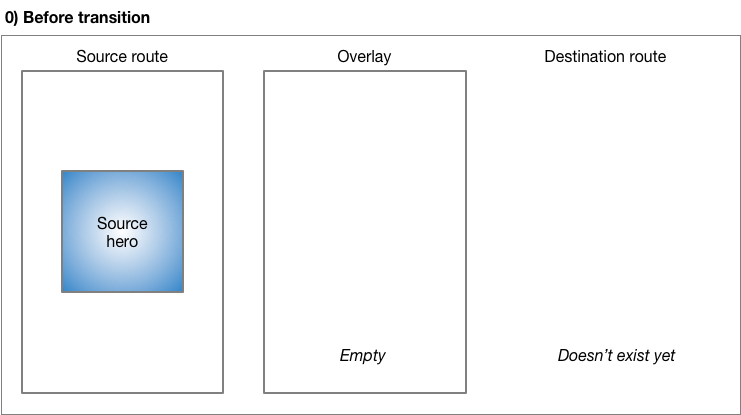
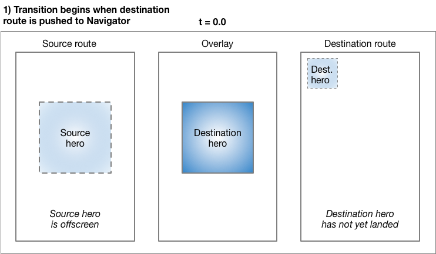
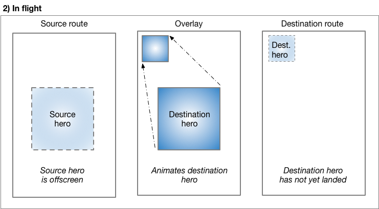
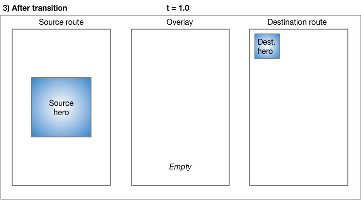
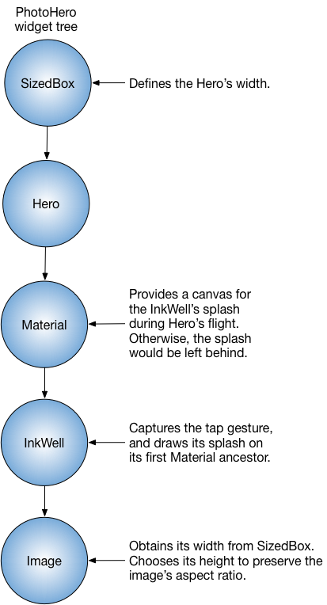
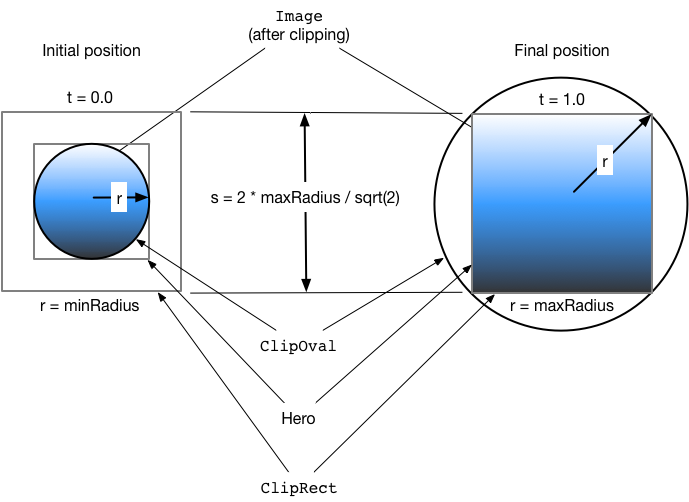
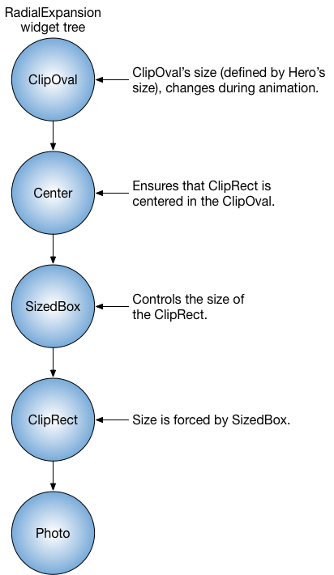

# Hero animasyonları


**Neler öğreneceksiniz?**

* "Hero" (Kahraman), ekranlar arasında uçan widget'ı ifade eder.
* Flutter'ın `Hero` widget'ını kullanarak bir hero animasyonu oluşturma.
* Hero'yu bir ekrandan diğerine uçurma.
* Bir hero'yu bir ekrandan diğerine uçururken şeklini daireselden dikdörtgene dönüştüren animasyonu yapma.

Flutter'daki `Hero` widget'ı, yaygın olarak **paylaşılan öğe geçişleri (shared element transitions)** veya **paylaşılan öğe animasyonları** olarak bilinen bir animasyon stilini uygular.

Muhtemelen hero animasyonlarını birçok kez görmüşsünüzdür. Örneğin, bir ekran, satılık öğeleri temsil eden küçük resimlerin bir listesini görüntüler. Bir öğeyi seçmek, onu daha fazla ayrıntı ve bir "Satın Al" düğmesi içeren yeni bir ekrana uçurur. Flutter'da bir görüntüyü bir ekrandan diğerine uçurmaya **hero animasyonu** denir, ancak aynı hareket bazen **paylaşılan öğe geçişi** olarak da adlandırılır.

[video](https://www.youtube.com/watch?v=Be9UH1kXFDw)

Bu kılavuz, standart hero animasyonlarının ve uçuş sırasında görüntüyü dairesel bir şekilden kare bir şekle dönüştüren hero animasyonlarının nasıl oluşturulacağını gösterir.

## Örnekler

Bu kılavuz, aşağıdaki bağlantılarda her hero animasyon stili için örnekler sunmaktadır:

* Standart hero animasyonu kodu
* Radyal hero animasyonu kodu

> **Flutter'da yeni misiniz?**
> Bu sayfa, Flutter'ın widget'larını kullanarak nasıl düzen (layout) oluşturacağınızı bildiğinizi varsayar. Daha fazla bilgi için "Flutter'da Düzen Oluşturma" bölümüne bakın.

### Terminoloji

**Route (Rota):** Flutter uygulamasında bir sayfayı veya ekranı tanımlar.

Bu animasyonu Flutter'da `Hero` widget'ları ile oluşturabilirsiniz. Hero, kaynaktan hedef rotaya doğru canlanırken, hedef rota (hero eksiğiyle) görünür hale gelir. Genellikle herolar, her iki rotanın da ortak sahip olduğu resimler gibi UI'nın küçük parçalarıdır. Kullanıcının bakış açısına göre hero, rotalar arasında "uçar". Bu kılavuz, aşağıdaki hero animasyonlarının nasıl oluşturulacağını gösterir:

**Standart hero animasyonları**
**Standart bir hero animasyonu**, hero'yu bir rotadan yeni bir rotaya uçurur, genellikle farklı bir konuma ve farklı bir boyuta iner.

Aşağıdaki video (yavaş hızda kaydedilmiştir) tipik bir örneği göstermektedir. Rotanın ortasındaki paletlere dokunmak, onları yeni, mavi bir rotanın sol üst köşesine, daha küçük bir boyutta uçurur. Mavi rotadaki paletlere dokunmak (veya cihazın bir önceki rotaya dön hareketini kullanmak), paletleri orijinal rotaya geri uçurur.


[video](https://www.youtube.com/watch?v=CEcFnqRDfgw)

**Radyal hero animasyonları**
**Radyal hero animasyonunda**, hero rotalar arasında uçarken şekli daireselden dikdörtgene değişiyor gibi görünür.

Aşağıdaki video (yavaş hızda kaydedilmiştir), bir radyal hero animasyonu örneğini göstermektedir. Başlangıçta, rotanın altında üç dairesel resimden oluşan bir satır görünür. Dairesel resimlerden herhangi birine dokunmak, o resmi kare şeklinde görüntüleyen yeni bir rotaya uçurur. Kare resme dokunmak, hero'yu dairesel bir şekille görüntülenen orijinal rotaya geri uçurur.


[video](https://www.youtube.com/watch?v=LWKENpwDKiM)

**Standart** veya **radyal** hero animasyonlarına özgü bölümlere geçmeden önce, hero animasyon kodunu nasıl yapılandıracağınızı öğrenmek için **bir hero animasyonunun temel yapısı** bölümünü ve Flutter'ın bir hero animasyonunu nasıl gerçekleştirdiğini anlamak için **sahne arkası** bölümünü okuyun.

---

## Bir hero animasyonunun temel yapısı

**Amaç ne?**

* Animasyonu uygulamak için farklı rotalarda ancak eşleşen etiketlere (`tag`) sahip iki hero widget'ı kullanın.
* `Navigator`, uygulamanın rotalarını içeren bir yığını (stack) yönetir.
* `Navigator`'ın yığınına bir rota eklemek (push) veya yığından bir rota çıkarmak (pop), animasyonu tetikler.
* Flutter çerçevesi (framework), hero'nun kaynaktan hedef rotaya uçarken sınırlarını tanımlayan bir dikdörtgen ara değerini (`RectTween`) hesaplar. Uçuşu sırasında hero, her iki rotanın da üzerinde görünmesi için bir uygulama katmanına (overlay) taşınır.

> **Terminoloji:**
> "Tween" veya "tweening" kavramı sizin için yeniyse, "Flutter'da Animasyonlar" eğitimine göz atın.

Hero animasyonları iki `Hero` widget'ı kullanılarak uygulanır: biri kaynak rotadaki widget'ı tanımlar, diğeri ise hedef rotadaki widget'ı tanımlar. Kullanıcının bakış açısına göre hero paylaşılıyor gibi görünür ve sadece programcının bu uygulama detayını anlaması gerekir. Hero animasyon kodu aşağıdaki yapıya sahiptir:

1. **Kaynak hero** olarak adlandırılan bir başlangıç `Hero` widget'ı tanımlayın. Hero, grafiksel temsilini (genellikle bir resim) ve tanımlayıcı bir etiketi (`tag`) belirtir ve kaynak rota tarafından tanımlanan o an görüntülenen widget ağacındadır.
2. **Hedef hero** olarak adlandırılan bir bitiş `Hero` widget'ı tanımlayın. Bu hero da grafiksel temsilini ve kaynak hero ile **aynı etiketi** belirtir. Her iki hero widget'ının da aynı etiketle oluşturulması **esastır**, genellikle altta yatan veriyi temsil eden bir nesne kullanılır. En iyi sonuçlar için, herolar neredeyse aynı widget ağaçlarına sahip olmalıdır.
3. Hedef heroyu içeren bir rota oluşturun. Hedef rota, animasyonun sonunda var olan widget ağacını tanımlar.
4. Hedef rotayı `Navigator`'ın yığınına ekleyerek (push) animasyonu tetikleyin. `Navigator` push ve pop işlemleri, kaynak ve hedef rotalarda eşleşen etiketlere sahip her hero çifti için bir hero animasyonunu tetikler.

Flutter, Hero'nun sınırlarını başlangıç noktasından bitiş noktasına canlandıran (boyut ve konumu enterpolasyon yaparak) tween'i hesaplar ve animasyonu bir katmanda (overlay) gerçekleştirir.

Bir sonraki bölüm, Flutter'ın sürecini daha ayrıntılı olarak açıklamaktadır.

---

## Sahne arkası

Aşağıdakiler, Flutter'ın bir rotadan diğerine geçişi nasıl gerçekleştirdiğini açıklar.




**Geçişten önce**, kaynak hero, kaynak rotanın widget ağacında bekler. Hedef rota henüz mevcut değildir ve katman (overlay) boştur.




**`Navigator`'a bir rota eklemek (Pushing)** animasyonu tetikler. `t=0.0` anında, Flutter şunları yapar:

* Material hareket spesifikasyonunda açıklandığı gibi kavisli hareketi kullanarak hedef herunun yolunu ekran dışında hesaplar. Flutter artık herunun nerede biteceğini bilir.
* Hedef heroyu, **kaynak** hero ile aynı konum ve boyutta katmana (overlay) yerleştirir. Katmana bir hero eklemek, Z sırasını değiştirir, böylece tüm rotaların üzerinde görünür.
* Kaynak heroyu ekran dışına taşır.




**Hero uçarken**, dikdörtgen sınırları, Hero'nun `createRectTween` özelliğinde belirtilen `Tween<Rect>` kullanılarak canlandırılır. Varsayılan olarak Flutter, dikdörtgenin karşı köşelerini kavisli bir yol boyunca canlandıran `MaterialRectArcTween`'in bir örneğini kullanır. (Farklı bir Tween animasyonu kullanan bir örnek için **Radyal hero animasyonları** bölümüne bakın.)




**Uçuş tamamlandığında:**

* Flutter, hero widget'ını katmandan (overlay) hedef rotaya taşır. Katman artık boştur.
* Hedef hero, hedef rotadaki son konumunda görünür.
* Kaynak hero, rotasına geri yüklenir.

**Rotayı çıkarmak (Popping)** aynı işlemi gerçekleştirir, heroyu kaynak rotadaki boyutuna ve konumuna geri canlandırır.

### Temel sınıflar

Bu kılavuzdaki örnekler, hero animasyonlarını uygulamak için aşağıdaki sınıfları kullanır:

**Hero**
Kaynaktan hedef rotaya uçan widget. Kaynak rota için bir Hero ve hedef rota için başka bir Hero tanımlayın ve her birine aynı etiketi atayın. Flutter, eşleşen etiketlere sahip hero çiftlerini canlandırır.

**InkWell**
Heroya dokunulduğunda ne olacağını belirtir. `InkWell`'in `onTap()` yöntemi yeni rotayı oluşturur ve `Navigator`'ın yığınına ekler.

**Navigator**
`Navigator`, bir rota yığınını yönetir. `Navigator`'ın yığınına bir rota eklemek veya yığından bir rota çıkarmak animasyonu tetikler.

**Route**
Bir ekranı veya sayfayı belirtir. En temel olanların dışındaki çoğu uygulama birden fazla rotaya sahiptir.

---

## Standart hero animasyonları

**Amaç ne?**

* `MaterialPageRoute`, `CupertinoPageRoute` kullanarak bir rota belirtin veya `PageRouteBuilder` kullanarak özel bir rota oluşturun. Bu bölümdeki örnekler `MaterialPageRoute` kullanır.
* Hedefin görüntüsünü bir `SizedBox` içine sararak geçişin sonundaki görüntünün boyutunu değiştirin.
* Hedefin görüntüsünü bir düzen widget'ına yerleştirerek görüntünün konumunu değiştirin. Bu örnekler `Container` kullanır.

### Standart hero animasyonu kodu

Aşağıdaki örneklerin her biri, bir görüntüyü bir rotadan diğerine uçurmayı gösterir. Bu kılavuz ilk örneği açıklamaktadır.

**hero_animation**
Hero kodunu özel bir `PhotoHero` widget'ında kapsüller. Material hareket spesifikasyonunda açıklandığı gibi herunun hareketini kavisli bir yol boyunca canlandırır.

**basic_hero_animation**
Hero widget'ını doğrudan kullanır. Referansınız için sağlanan bu daha temel örnek, bu kılavuzda açıklanmamaktadır.

### Neler oluyor?

Bir görüntüyü bir rotadan diğerine uçurmak, Flutter'ın hero widget'ını kullanarak uygulaması kolaydır. Yeni rotayı belirtmek için `MaterialPageRoute` kullanıldığında, görüntü `Material Design hareket spesifikasyonu` tarafından tanımlandığı gibi kavisli bir yol boyunca uçar.

Yeni bir Flutter uygulaması oluşturun ve `hero_animation` dosyalarını kullanarak güncelleyin.

**Örneği çalıştırmak için:**

1. Görüntüyü farklı bir konumda ve ölçekte gösteren yeni bir rotaya uçurmak için ana rotadaki fotoğrafa dokunun.
2. Görüntüye dokunarak veya cihazın "önceki rotaya dön" hareketini kullanarak önceki rotaya dönün.
3. `timeDilation` özelliğini kullanarak geçişi daha da yavaşlatabilirsiniz.

### PhotoHero sınıfı

Özel `PhotoHero` sınıfı; heroyu, boyutunu, görüntüsünü ve dokunulduğundaki davranışını korur. `PhotoHero` aşağıdaki widget ağacını oluşturur:

Kod şu şekildedir:




```dart
class PhotoHero extends StatelessWidget {
  const PhotoHero({
    super.key,
    required this.photo,
    this.onTap,
    required this.width,
  });

  final String photo;
  final VoidCallback? onTap;
  final double width;

  @override
  Widget build(BuildContext context) {
    return SizedBox(
      width: width,
      child: Hero(
        tag: photo,
        child: Material(
          color: Colors.transparent,
          child: InkWell(
            onTap: onTap,
            child: Image.asset(
              photo,
              fit: BoxFit.contain,
            ),
          ),
        ),
      ),
    );
  }
}
```

**Önemli bilgiler:**

* Başlangıç rotası, `HeroAnimation` uygulamanın home özelliği olarak sağlandığında `MaterialApp` tarafından dolaylı olarak (implicitly) eklenir.
* Bir `InkWell` görüntüyü sarar, böylece hem kaynak hem de hedef herolara bir dokunma hareketi eklemeyi çok kolaylaştırır.
* Material widget'ını şeffaf bir renkle tanımlamak, görüntünün hedefine uçarken arka plandan "fırlamasını" sağlar.
* `SizedBox`, animasyonun başlangıcında ve sonunda herunun boyutunu belirtir.
* Image'ın `fit` özelliğini `BoxFit.contain` olarak ayarlamak, görüntünün geçiş sırasında en boy oranını değiştirmeden mümkün olduğunca büyük olmasını sağlar.

### HeroAnimation sınıfı

`HeroAnimation` sınıfı, kaynak ve hedef `PhotoHero`'ları oluşturur ve geçişi ayarlar.

Kod şu şekildedir:

```dart
class HeroAnimation extends StatelessWidget {
  const HeroAnimation({super.key});

  Widget build(BuildContext context) {
    timeDilation = 5.0; // 1.0 normal animasyon hızı demektir.

    return Scaffold(
      appBar: AppBar(
        title: const Text('Temel Hero Animasyonu'),
      ),
      body: Center(
        child: PhotoHero(
          photo: 'images/flippers-alpha.png',
          width: 300.0,
          onTap: () {
            Navigator.of(context).push(MaterialPageRoute<void>(
              builder: (context) {
                return Scaffold(
                  appBar: AppBar(
                    title: const Text('Paletler Sayfası'),
                  ),
                  body: Container(
                    // Arka planı maviye ayarlayarak yeni bir rota olduğunu vurgulayın.
                    color: Colors.lightBlueAccent,
                    padding: const EdgeInsets.all(16),
                    alignment: Alignment.topLeft,
                    child: PhotoHero(
                      photo: 'images/flippers-alpha.png',
                      width: 100.0,
                      onTap: () {
                        Navigator.of(context).pop();
                      },
                    ),
                  ),
                );
              }
            ));
          },
        ),
      ),
    );
  }
}
```

**Önemli bilgiler:**

* Kullanıcı kaynak heroyu içeren `InkWell`'e dokunduğunda, kod `MaterialPageRoute` kullanarak hedef rotayı oluşturur. Hedef rotayı `Navigator`'ın yığınına eklemek animasyonu tetikler.
* `Container`, `PhotoHero`'yu hedef rotanın sol üst köşesine, `AppBar`'ın altına konumlandırır.
* Hedef `PhotoHero` için `onTap()` yöntemi, `Navigator`'ın yığınını çıkarır (pop), böylece `Hero`'yu orijinal rotaya geri uçuran animasyonu tetikler.
* Hata ayıklama sırasında geçişi yavaşlatmak için `timeDilation` özelliğini kullanın.

---

## Radyal hero animasyonları

**Amaç ne?**

* **Radyal dönüşüm (radial transformation)**, dairesel bir şekli kare bir şekle dönüştürür.
* Radyal bir **hero** animasyonu, heroyu kaynak rotadan hedef rotaya uçururken radyal bir dönüşüm gerçekleştirir.
* `MaterialRectCenterArcTween`, tween animasyonunu tanımlar.
* Hedef rotayı `PageRouteBuilder` kullanarak oluşturun.

Bir heroyu bir rotadan diğerine uçururken dairesel bir şekilden dikdörtgen bir şekle dönüştürmek, `Hero` widget'larını kullanarak uygulayabileceğiniz şık bir efekttir. Bunu başarmak için kod, iki kırpma (clip) şeklinin kesişimini canlandırır: bir daire ve bir kare. Animasyon boyunca, dairesel kırpma (ve görüntü) `minRadius`'tan `maxRadius`'a ölçeklenirken, kare kırpma sabit boyutunu korur. Aynı zamanda, görüntü kaynak rotadaki konumundan hedef rotadaki konumuna uçar.

Bu animasyon karmaşık görünebilir (ve öyledir), ancak sağlanan örneği ihtiyaçlarınıza göre **özelleştirebilirsiniz**. **Ağır iş sizin için yapılmıştır.**

### Radyal hero animasyonu kodu

Aşağıdaki örneklerin her biri radyal bir hero animasyonunu gösterir. Bu kılavuz ilk örneği açıklamaktadır.

**radial_hero_animation**
Material hareket spesifikasyonunda açıklandığı gibi bir radyal hero animasyonu.

**basic_radial_hero_animation**
Radyal hero animasyonunun en basit örneği. Hedef rotada Scaffold, Card, Column veya Text yoktur. Referansınız için sağlanan bu temel örnek, bu kılavuzda açıklanmamaktadır.

**radial_hero_animation_animate_rectclip**
Dikdörtgen kırpmanın boyutunu da canlandırarak `radial_hero_animation`'ı genişletir. Referansınız için sağlanan bu daha gelişmiş örnek, bu kılavuzda açıklanmamaktadır.

> **Profesyonel İpucu:**
> Radyal hero animasyonu, yuvarlak bir şeklin kare bir şekille kesişmesini içerir. Bunu görmek, `timeDilation` ile animasyonu yavaşlatsanız bile zor olabilir, bu nedenle geliştirme sırasında `debugPaintSizeEnabled` bayrağını etkinleştirmeyi düşünebilirsiniz.

### Neler oluyor?

Aşağıdaki diyagram, animasyonun başında (t = 0.0) ve sonunda (t = 1.0) kırpılmış görüntüyü göstermektedir.



Mavi gradyan (görüntüyü temsil eder), kırpma şekillerinin nerede kesiştiğini gösterir. Geçişin başlangıcında, kesişimin sonucu dairesel bir kırpmadır (`ClipOval`). Dönüşüm sırasında, `ClipOval` `minRadius`'tan `maxRadius`'a ölçeklenirken, `ClipRect` sabit bir boyutu korur. Geçişin sonunda, dairesel ve dikdörtgen kırpmaların kesişimi, hero widget'ı ile aynı boyutta bir dikdörtgen verir. Başka bir deyişle, geçişin sonunda görüntü artık kırpılmaz.

Yeni bir Flutter uygulaması oluşturun ve `radial_hero_animation` GitHub dizinindeki dosyaları kullanarak güncelleyin.

**Örneği çalıştırmak için:**

1. Orijinal rotayı gizleyen yeni bir rotanın ortasında konumlanmış daha büyük bir kareye animasyonla geçmek için üç dairesel küçük resimden birine dokunun.
2. Görüntüye dokunarak veya cihazın "önceki rotaya dön" hareketini kullanarak önceki rotaya dönün.
3. `timeDilation` özelliğini kullanarak geçişi daha da yavaşlatabilirsiniz.

### Photo sınıfı

`Photo` sınıfı, görüntüyü tutan widget ağacını oluşturur:

```dart
class Photo extends StatelessWidget {
  const Photo({super.key, required this.photo, this.color, this.onTap});

  final String photo;
  final Color? color;
  final VoidCallback onTap;

  Widget build(BuildContext context) {
    return Material(
      // Görüntünün şeffaflığı olan yerlerde hafif opak bir renk görünür.
      color: Theme.of(context).primaryColor.withValues(alpha: 0.25),
      child: InkWell(
        onTap: onTap,
        child: Image.asset(
          photo,
          fit: BoxFit.contain,
        ),
      ),
    );
  }
}
```

**Önemli bilgiler:**

* `InkWell`, dokunma hareketini yakalar. Çağıran işlev, `onTap()` işlevini `Photo`'nun yapıcısına iletir.
* Uçuş sırasında, `InkWell` sıçramasını (splash) ilk Material atası üzerine çizer.
* Material widget'ı hafif opak bir renge sahiptir, bu nedenle görüntünün şeffaf kısımları renkle oluşturulur. Bu, şeffaflığı olan görüntüler için bile daire-kare geçişinin görülmesinin kolay olmasını sağlar.
* `Photo` sınıfı, widget ağacında `Hero`'yu içermez. Animasyonun çalışması için hero, `RadialExpansion` widget'ını sarmalar.

### RadialExpansion sınıfı

Demonun çekirdeği olan `RadialExpansion` widget'ı, geçiş sırasında görüntüyü kırpan widget ağacını oluşturur. Kırpılmış şekil, uçuş sırasında büyüyen dairesel bir kırpma ile baştan sona sabit bir boyutta kalan dikdörtgen bir kırpmanın kesişiminden kaynaklanır.

Bunu yapmak için aşağıdaki widget ağacını oluşturur:



Kod şu şekildedir:

```dart
class RadialExpansion extends StatelessWidget {
  const RadialExpansion({
    super.key,
    required this.maxRadius,
    this.child,
  }) : clipRectSize = 2.0 * (maxRadius / math.sqrt2);

  final double maxRadius;
  final double clipRectSize;
  final Widget? child;

  @override
  Widget build(BuildContext context) {
    return ClipOval(
      child: Center(
        child: SizedBox(
          width: clipRectSize,
          height: clipRectSize,
          child: ClipRect(
            child: child, // Fotoğraf
          ),
        ),
      ),
    );
  }
}
```

**Önemli bilgiler:**

* Hero, `RadialExpansion` widget'ını sarmalar.
* Hero uçarken boyutu değişir ve çocuğunun boyutunu kısıtladığı için `RadialExpansion` widget'ı eşleşecek şekilde boyut değiştirir.
* `RadialExpansion` animasyonu, örtüşen iki kırpma (clip) tarafından oluşturulur.
* Örnek, tween enterpolasyonunu `MaterialRectCenterArcTween` kullanarak tanımlar. Bir hero animasyonu için varsayılan uçuş yolu, tweenleri heroların köşelerini kullanarak enterpolasyon yapar. Bu yaklaşım, radyal dönüşüm sırasında herunun en boy oranını etkiler, bu nedenle yeni uçuş yolu, tweenleri her bir herunun merkez noktasını kullanarak enterpolasyon yapmak için `MaterialRectCenterArcTween` kullanır.

Kod şu şekildedir:

```dart
static RectTween _createRectTween(Rect? begin, Rect? end) {
  return MaterialRectCenterArcTween(begin: begin, end: end);
}
```

Herunun uçuş yolu hala bir yay (arc) izler, ancak görüntünün en boy oranı sabit kalır.

---


# Bir Sayfa Yolu (Page Route) Geçişini Canlandırma

Bir sayfadan diğerine nasıl animasyonla geçilir?

Material gibi bir tasarım dili, rotalar (veya ekranlar) arasında geçiş yaparken standart davranışlar tanımlar. Ancak bazen ekranlar arasında özel bir geçiş, bir uygulamayı daha benzersiz hale getirebilir. Buna yardımcı olmak için `PageRouteBuilder` bir `Animation` nesnesi sağlar. Bu `Animation`, geçiş animasyonunu özelleştirmek için `Tween` ve `Curve` nesneleriyle birlikte kullanılabilir. Bu tarif, yeni rotayı ekranın altından görünüme girecek şekilde canlandırarak rotalar arasında nasıl geçiş yapılacağını gösterir.


Özel bir sayfa yolu geçişi oluşturmak için bu tarif aşağıdaki adımları kullanır:

1.  Bir `PageRouteBuilder` kurun.
2.  Bir `Tween` oluşturun.
3.  Bir `AnimatedWidget` ekleyin.
4.  Bir `CurveTween` kullanın.
5.  İki `Tween`'i birleştirin.

### 1. Bir PageRouteBuilder Kurun

Başlamak için, bir `Route` oluşturmak üzere `PageRouteBuilder` kullanın. `PageRouteBuilder` iki geri çağırma (callback) işlevine sahiptir: biri rotanın içeriğini oluşturmak için (`pageBuilder`), diğeri ise rotanın geçişini oluşturmak için (`transitionsBuilder`).

> **Not:** `transitionsBuilder` içindeki `child` parametresi, `pageBuilder`'dan döndürülen widget'tır. `pageBuilder` işlevi yalnızca rota ilk kez oluşturulduğunda çağrılır. Çerçeve (framework), `child` geçiş boyunca aynı kaldığı için fazladan iş yapmaktan kaçınabilir.

Aşağıdaki örnek iki rota oluşturur: "Go!" (Git!) düğmesi olan bir ana rota ve "Page 2" (Sayfa 2) başlıklı ikinci bir rota.

```dart
import 'package:flutter/material.dart';

void main() {
  runApp(const MaterialApp(home: Page1()));
}

class Page1 extends StatelessWidget {
  const Page1({super.key});

  @override
  Widget build(BuildContext context) {
    return Scaffold(
      appBar: AppBar(),
      body: Center(
        child: ElevatedButton(
          onPressed: () {
            Navigator.of(context).push(_createRoute());
          },
          child: const Text('Go!'),
        ),
      ),
    );
  }
}

Route<void> _createRoute() {
  return PageRouteBuilder(
    pageBuilder: (context, animation, secondaryAnimation) => const Page2(),
    transitionsBuilder: (context, animation, secondaryAnimation, child) {
      return child;
    },
  );
}

class Page2 extends StatelessWidget {
  const Page2({super.key});

  @override
  Widget build(BuildContext context) {
    return Scaffold(
      appBar: AppBar(),
      body: const Center(child: Text('Page 2')),
    );
  }
}
```

### 2. Bir Tween Oluşturun

Yeni sayfanın alttan canlanarak gelmesini sağlamak için, `Offset(0,1)`'den `Offset(0, 0)`'a (genellikle `Offset.zero` yapıcısı kullanılarak tanımlanır) doğru canlanması gerekir. Bu durumda `Offset`, `FractionalTranslation` widget'ı için bir 2B vektördür. `dy` argümanını 1 olarak ayarlamak, sayfanın tam yüksekliği kadar dikey bir ötelemeyi temsil eder.

`transitionsBuilder` geri çağrısının bir `animation` parametresi vardır. Bu, 0 ile 1 arasında değerler üreten bir `Animation<double>` nesnesidir. Bir `Tween` kullanarak `Animation<double>`'ı `Animation<Offset>`'e dönüştürün:

```dart
transitionsBuilder: (context, animation, secondaryAnimation, child) {
  const begin = Offset(0.0, 1.0);
  const end = Offset.zero;
  final tween = Tween(begin: begin, end: end);
  final offsetAnimation = animation.drive(tween);
  return child;
},
```

### 3. Bir AnimatedWidget Kullanın

Flutter, animasyonun değeri değiştiğinde kendilerini yeniden oluşturan, `AnimatedWidget`'ı genişleten bir widget setine sahiptir. Örneğin, `SlideTransition` bir `Animation<Offset>` alır ve animasyonun değeri her değiştiğinde çocuğunu (child) öteler (bir `FractionalTranslation` widget'ı kullanarak).

`Animation<Offset>` ve çocuk (child) widget ile bir `SlideTransition` döndürün:

```dart
transitionsBuilder: (context, animation, secondaryAnimation, child) {
  const begin = Offset(0.0, 1.0);
  const end = Offset.zero;
  final tween = Tween(begin: begin, end: end);
  final offsetAnimation = animation.drive(tween);

  return SlideTransition(position: offsetAnimation, child: child);
},
```

### 4. Bir CurveTween Kullanın

Flutter, animasyonun hızını zaman içinde ayarlayan bir dizi yumuşatma eğrisi (easing curves) sağlar. `Curves` sınıfı, yaygın olarak kullanılan önceden tanımlanmış bir dizi eğri sunar. Örneğin, `Curves.easeOut` animasyonun hızlı başlamasını ve yavaş bitmesini sağlar.

Bir Eğri (Curve) kullanmak için yeni bir `CurveTween` oluşturun ve ona bir Curve verin:

```dart
var curve = Curves.ease;
var curveTween = CurveTween(curve: curve);
```

Bu yeni `Tween` hala 0'dan 1'e kadar değerler üretir. Bir sonraki adımda, 2. adımdaki `Tween<Offset>` ile birleştirilecektir.

### 5. İki Tween'i Birleştirin

Tween'leri birleştirmek için `chain()` kullanın:

```dart
const begin = Offset(0.0, 1.0);
const end = Offset.zero;
const curve = Curves.ease;

var tween = Tween(begin: begin, end: end).chain(CurveTween(curve: curve));
```

Ardından bu tween'i `animation.drive()`'a ileterek kullanın. Bu, `SlideTransition` widget'ına verilebilecek yeni bir `Animation<Offset>` oluşturur:

```dart
return SlideTransition(position: animation.drive(tween), child: child);
```

Bu yeni Tween (veya Animatable), önce `CurveTween`'i değerlendirip ardından `Tween<Offset>`'i değerlendirerek Offset değerleri üretir. Animasyon çalıştığında, değerler şu sırayla hesaplanır:

1. **Animasyon** (`transitionsBuilder` geri çağrısına sağlanan) 0'dan 1'e kadar değerler üretir.
2. **CurveTween**, bu değerleri eğrisine bağlı olarak 0 ile 1 arasındaki yeni değerlere eşler.
3. **Tween<Offset>**, double değerlerini Offset değerlerine eşler.

Yumuşatma eğrisine sahip bir `Animation<Offset>` oluşturmanın başka bir yolu da `CurvedAnimation` kullanmaktır:

```dart
transitionsBuilder: (context, animation, secondaryAnimation, child) {
  const begin = Offset(0.0, 1.0);
  const end = Offset.zero;
  const curve = Curves.ease;

  final tween = Tween(begin: begin, end: end);
  final curvedAnimation = CurvedAnimation(parent: animation, curve: curve);

  return SlideTransition(
    position: tween.animate(curvedAnimation),
    child: child,
  );
}
```


## İnteraktif Örnek

```dart
import 'package:flutter/material.dart';

void main() {
  runApp(const MaterialApp(home: Page1()));
}

class Page1 extends StatelessWidget {
  const Page1({super.key});

  @override
  Widget build(BuildContext context) {
    return Scaffold(
      appBar: AppBar(),
      body: Center(
        child: ElevatedButton(
          onPressed: () {
            Navigator.of(context).push(_createRoute());
          },
          child: const Text('Go!'),
        ),
      ),
    );
  }
}

Route<void> _createRoute() {
  return PageRouteBuilder(
    pageBuilder: (context, animation, secondaryAnimation) => const Page2(),
    transitionsBuilder: (context, animation, secondaryAnimation, child) {
      const begin = Offset(0.0, 1.0);
      const end = Offset.zero;
      const curve = Curves.ease;

      var tween = Tween(begin: begin, end: end).chain(CurveTween(curve: curve));

      return SlideTransition(position: animation.drive(tween), child: child);
    },
  );
}

class Page2 extends StatelessWidget {
  const Page2({super.key});

  @override
  Widget build(BuildContext context) {
    return Scaffold(
      appBar: AppBar(),
      body: const Center(child: Text('Page 2')),
    );
  }
}
```


# Bir Widget'ı Fizik Simülasyonu Kullanarak Canlandırma

Fizik simülasyonları, uygulama etkileşimlerinin gerçekçi ve etkileşimli hissettirmesini sağlayabilir. Örneğin, bir widget'ı sanki bir yaya bağlıymış veya yerçekimi ile düşüyormuş gibi davranacak şekilde canlandırmak isteyebilirsiniz.


Bu tarif, sürüklenen bir noktadan merkeze geri dönen bir widget'ı, bir yay (spring) simülasyonu kullanarak nasıl hareket ettireceğinizi gösterir.

Bu tarif şu adımları kullanır:
1.  Bir animasyon denetleyicisi kurun
2.  Widget'ı hareketleri (gestures) kullanarak taşıyın
3.  Widget'ı canlandırın
4.  Yaylanma hareketini simüle etmek için hızı hesaplayın

### Adım 1: Bir animasyon denetleyicisi kurun

`DraggableCard` adında bir stateful (durumlu) widget ile başlayın:

```dart
import 'package:flutter/material.dart';

void main() {
  runApp(const MaterialApp(home: PhysicsCardDragDemo()));
}

class PhysicsCardDragDemo extends StatelessWidget {
  const PhysicsCardDragDemo({super.key});

  @override
  Widget build(BuildContext context) {
    return Scaffold(
      appBar: AppBar(),
      body: const DraggableCard(child: FlutterLogo(size: 128)),
    );
  }
}

class DraggableCard extends StatefulWidget {
  const DraggableCard({required this.child, super.key});

  final Widget child;

  @override
  State<DraggableCard> createState() => _DraggableCardState();
}

class _DraggableCardState extends State<DraggableCard> {
  @override
  void initState() {
    super.initState();
  }

  @override
  void dispose() {
    super.dispose();
  }

  @override
  Widget build(BuildContext context) {
    return Align(child: Card(child: widget.child));
  }
}
```

`_DraggableCardState` sınıfının `SingleTickerProviderStateMixin`'den türetilmesini (extend) sağlayın. Ardından `initState` içinde bir `AnimationController` oluşturun ve `vsync` değerini `this` olarak ayarlayın.

> **Not:** `SingleTickerProviderStateMixin`'i genişletmek, state nesnesinin `AnimationController` için bir `TickerProvider` olmasını sağlar. Daha fazla bilgi için `TickerProvider` belgelerine bakın.

```dart
// class _DraggableCardState extends State<DraggableCard> {
class _DraggableCardState extends State<DraggableCard>
    with SingleTickerProviderStateMixin {
  late AnimationController _controller;

  @override
  void initState() {
    super.initState();
    _controller =
        AnimationController(vsync: this, duration: const Duration(seconds: 1));
  }

  @override
  void dispose() {
    _controller.dispose();
    super.dispose();
  }
```

### Adım 2: Widget'ı hareketleri kullanarak taşıyın

Widget'ın sürüklendiğinde hareket etmesini sağlayın ve `_DraggableCardState` sınıfına bir `Alignment` alanı ekleyin:

```dart
class _DraggableCardState extends State<DraggableCard>
    with SingleTickerProviderStateMixin {
  late AnimationController _controller;
  Alignment _dragAlignment = Alignment.center;
```

`onPanDown`, `onPanUpdate` ve `onPanEnd` geri çağrılarını (callbacks) işleyen bir `GestureDetector` ekleyin. Hizalamayı ayarlamak için, widget'ın boyutunu almak üzere `MediaQuery` kullanın ve 2'ye bölün. (Bu işlem, "sürüklenen piksel" birimlerini `Align` widget'ının kullandığı koordinatlara dönüştürür.) Ardından, `Align` widget'ının `alignment` özelliğini `_dragAlignment` olarak ayarlayın:

```dart
  @override
  Widget build(BuildContext context) {
    var size = MediaQuery.of(context).size;
    return GestureDetector(
      onPanDown: (details) {},
      onPanUpdate: (details) {
        setState(() {
          _dragAlignment += Alignment(
            details.delta.dx / (size.width / 2),
            details.delta.dy / (size.height / 2),
          );
        });
      },
      onPanEnd: (details) {},
      child: Align(
        alignment: _dragAlignment,
        child: Card(
          child: widget.child,
        ),
      ),
    );
  }
```

### Adım 3: Widget'ı canlandırın

Widget bırakıldığında merkeze geri yaylanmalıdır.

Bir `Animation<Alignment>` alanı ve bir `_runAnimation` yöntemi ekleyin. Bu yöntem, widget'ın sürüklendiği nokta ile merkez noktası arasında enterpolasyon yapan bir `Tween` tanımlar.

```dart
class _DraggableCardState extends State<DraggableCard>
    with SingleTickerProviderStateMixin {
  late AnimationController _controller;
  late Animation<Alignment> _animation;
  Alignment _dragAlignment = Alignment.center;

  void _runAnimation() {
    _animation = _controller.drive(
      AlignmentTween(begin: _dragAlignment, end: Alignment.center),
    );
    _controller.reset();
    _controller.forward();
  }
```

Daha sonra, `AnimationController` bir değer ürettiğinde `_dragAlignment`'ı güncelleyin:

```dart
  @override
  void initState() {
    super.initState();
    _controller =
        AnimationController(vsync: this, duration: const Duration(seconds: 1));
    _controller.addListener(() {
      setState(() {
        _dragAlignment = _animation.value;
      });
    });
  }
```

Ardından, `Align` widget'ının `_dragAlignment` alanını kullanmasını sağlayın:

```dart
child: Align(
  alignment: _dragAlignment,
  child: Card(child: widget.child),
),
```

Son olarak, `GestureDetector`'ı animasyon denetleyicisini yönetecek şekilde güncelleyin:

```dart
return GestureDetector(
  // onPanDown: (details) {},
  onPanDown: (details) {
    _controller.stop();
  },
  onPanUpdate: (details) {
    // ...
  },
  // onPanEnd: (details) {},
  onPanEnd: (details) {
    _runAnimation();
  },
  child: Align(
```

### Adım 4: Yaylanma hareketini simüle etmek için hızı hesaplayın

Son adım, widget sürüklenmesi bittikten sonraki hızını hesaplamak için biraz matematik yapmaktır. Bu, widget'ın geri çekilmeden önce o hızda gerçekçi bir şekilde devam etmesi içindir. (`_runAnimation` yöntemi, animasyonun başlangıç ve bitiş hizalamasını ayarlayarak yönü zaten belirler.)

İlk olarak, `physics` paketini içe aktarın:

```dart
import 'package:flutter/physics.dart';

```

`onPanEnd` geri çağrısı bir `DragEndDetails` nesnesi sağlar. Bu nesne, işaretçinin ekranla teması kesildiğindeki hızını sağlar. Hız, saniye başına piksel cinsindendir, ancak `Align` widget'ı pikselleri kullanmaz. Merkezin `[0.0, 0.0]` olduğu `[-1.0, -1.0]` ile `[1.0, 1.0]` arasındaki koordinat değerlerini kullanır. 2. adımda hesaplanan `size`, pikselleri bu aralıktaki koordinat değerlerine dönüştürmek için kullanılır.

Son olarak, `AnimationController`'ın bir `SpringSimulation` (Yay Simülasyonu) verilebilen `animateWith()` adında bir yöntemi vardır:

```dart
  /// Bir [SpringSimulation] hesaplar ve çalıştırır.
  void _runAnimation(Offset pixelsPerSecond, Size size) {
    _animation = _controller.drive(
      AlignmentTween(begin: _dragAlignment, end: Alignment.center),
    );
    // Animasyon denetleyicisi tarafından kullanılan birim aralığına [0,1]
    // göre hızı hesaplayın.
    final unitsPerSecondX = pixelsPerSecond.dx / size.width;
    final unitsPerSecondY = pixelsPerSecond.dy / size.height;
    final unitsPerSecond = Offset(unitsPerSecondX, unitsPerSecondY);
    final unitVelocity = unitsPerSecond.distance;

    const spring = SpringDescription(mass: 1, stiffness: 1, damping: 1);

    final simulation = SpringSimulation(spring, 0, 1, -unitVelocity);

    _controller.animateWith(simulation);
  }
```

`_runAnimation()` yöntemini hız ve boyut ile çağırmayı unutmayın:

```dart
onPanEnd: (details) {
  _runAnimation(details.velocity.pixelsPerSecond, size);
},
```

> **Not:** Animasyon denetleyicisi artık bir simülasyon kullandığına göre, `duration` (süre) argümanı artık gerekli değildir.


## İnteraktif Örnek

```dart
import 'package:flutter/material.dart';
import 'package:flutter/physics.dart';

void main() {
  runApp(const MaterialApp(home: PhysicsCardDragDemo()));
}

class PhysicsCardDragDemo extends StatelessWidget {
  const PhysicsCardDragDemo({super.key});

  @override
  Widget build(BuildContext context) {
    return Scaffold(
      appBar: AppBar(),
      body: const DraggableCard(child: FlutterLogo(size: 128)),
    );
  }
}

/// A draggable card that moves back to [Alignment.center] when it's
/// released.
class DraggableCard extends StatefulWidget {
  const DraggableCard({required this.child, super.key});

  final Widget child;

  @override
  State<DraggableCard> createState() => _DraggableCardState();
}

class _DraggableCardState extends State<DraggableCard>
    with SingleTickerProviderStateMixin {
  late AnimationController _controller;

  /// The alignment of the card as it is dragged or being animated.
  ///
  /// While the card is being dragged, this value is set to the values computed
  /// in the GestureDetector onPanUpdate callback. If the animation is running,
  /// this value is set to the value of the [_animation].
  Alignment _dragAlignment = Alignment.center;

  late Animation<Alignment> _animation;

  /// Calculates and runs a [SpringSimulation].
  void _runAnimation(Offset pixelsPerSecond, Size size) {
    _animation = _controller.drive(
      AlignmentTween(begin: _dragAlignment, end: Alignment.center),
    );
    // Calculate the velocity relative to the unit interval, [0,1],
    // used by the animation controller.
    final unitsPerSecondX = pixelsPerSecond.dx / size.width;
    final unitsPerSecondY = pixelsPerSecond.dy / size.height;
    final unitsPerSecond = Offset(unitsPerSecondX, unitsPerSecondY);
    final unitVelocity = unitsPerSecond.distance;

    const spring = SpringDescription(mass: 1, stiffness: 1, damping: 1);

    final simulation = SpringSimulation(spring, 0, 1, -unitVelocity);

    _controller.animateWith(simulation);
  }

  @override
  void initState() {
    super.initState();
    _controller = AnimationController(vsync: this);

    _controller.addListener(() {
      setState(() {
        _dragAlignment = _animation.value;
      });
    });
  }

  @override
  void dispose() {
    _controller.dispose();
    super.dispose();
  }

  @override
  Widget build(BuildContext context) {
    final size = MediaQuery.of(context).size;
    return GestureDetector(
      onPanDown: (details) {
        _controller.stop();
      },
      onPanUpdate: (details) {
        setState(() {
          _dragAlignment += Alignment(
            details.delta.dx / (size.width / 2),
            details.delta.dy / (size.height / 2),
          );
        });
      },
      onPanEnd: (details) {
        _runAnimation(details.velocity.pixelsPerSecond, size);
      },
      child: Align(
        alignment: _dragAlignment,
        child: Card(child: widget.child),
      ),
    );
  }
}
```


---
---

## 📄 Lisans Bilgisi

Bu doküman, **Flutter resmi dokümantasyonundan** türetilmiş Türkçe ders notudur.

**Orijinal kaynak:**  
https://docs.flutter.dev/ui/animations/hero-animations

**Türkçe çeviri ve düzenleme:**  
[Doç. Dr. Hakan Temiz](mailto:htemiz@artvin.edu.tr)

---

### Lisans Kapsamı

Bu dokümandaki içerikler aşağıdaki açık lisanslar kapsamında sunulmaktadır:

**Metin içerikleri (anlatım ve açıklamalar):**  
Flutter resmi dokümantasyonundan alınmış veya uyarlanmıştır.  
**Lisans:** Creative Commons Attribution 4.0 International (CC BY 4.0)  
https://creativecommons.org/licenses/by/4.0/

Bu lisans kapsamında:
- İçerik kopyalanabilir, dağıtılabilir ve uyarlanabilir  
- Ticari kullanım serbesttir  
- Kaynak belirtilmesi zorunludur  

**Kod örnekleri:**  
Flutter resmi dokümantasyonundan alınmış veya uyarlanmıştır.  
**Lisans:** BSD 3-Clause License  
https://opensource.org/licenses/BSD-3-Clause

Bu lisans kapsamında:
- Kodlar kopyalanabilir, değiştirilebilir ve dağıtılabilir  
- Ticari kullanım serbesttir  
- Lisans bildiriminin korunması gerekir  

---
---
