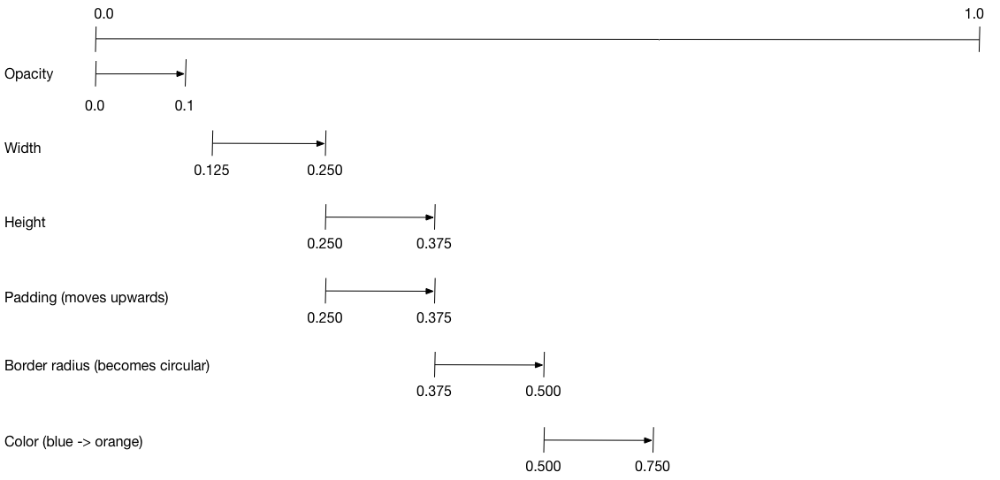
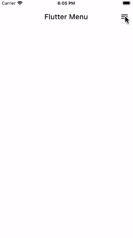
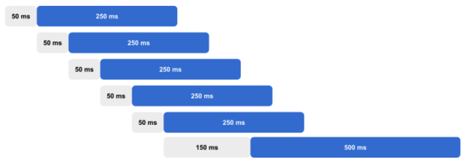

# Aşamalı (Staggered) Animasyonlar

**Neler öğreneceksiniz?**
* Aşamalı bir animasyon, sıralı veya örtüşen animasyonlardan oluşur.
* Aşamalı bir animasyon oluşturmak için birden fazla `Animation` nesnesi kullanın.
* Tek bir `AnimationController`, tüm `Animation`'ları kontrol eder.
* Her `Animation` nesnesi, bir `Interval` (Aralık) boyunca animasyonu belirtir.
* Canlandırılan her özellik için bir `Tween` oluşturun.

**Terminoloji**
Tween'ler veya ara değerleme (tweening) kavramı sizin için yeniyse, "Flutter'da Animasyonlar" eğitimine bakın.

Aşamalı animasyonlar basit bir kavramdır: görsel değişiklikler, hepsi aynı anda olmak yerine bir dizi işlem olarak gerçekleşir. Animasyon, bir değişikliğin diğerinden sonra gerçekleştiği tamamen sıralı olabilir veya kısmen ya da tamamen örtüşebilir. Ayrıca hiçbir değişikliğin olmadığı boşluklara da sahip olabilir.

Bu kılavuz, Flutter'da aşamalı bir animasyonun nasıl oluşturulacağını gösterir.

## Örnekler

Bu kılavuz `basic_staggered_animation` örneğini açıklamaktadır. Daha karmaşık bir örnek olan `staggered_pic_selection`'a da başvurabilirsiniz.

**basic_staggered_animation**
Tek bir widget'ın bir dizi sıralı ve örtüşen animasyonunu gösterir. Ekrana dokunmak; opaklığı, boyutu, şekli, rengi ve dolguyu (padding) değiştiren bir animasyonu başlatır.

**staggered_pic_selection**
Üç boyuttan birinde görüntülenen bir resim listesinden bir resmin silinmesini gösterir. Bu örnek iki animasyon denetleyicisi kullanır: biri resim seçimi/seçim kaldırma için, diğeri ise resim silme için. Seçim/seçim kaldırma animasyonu aşamalıdır. (Bu efekti görmek için `timeDilation` değerini artırmanız gerekebilir.) En büyük resimlerden birini seçin; mavi bir daire içinde bir onay işareti görüntülerken küçülür. Ardından, en küçük resimlerden birini seçin; onay işareti kaybolurken büyük resim genişler. Büyük resim genişlemeyi bitirmeden önce, küçük resim onay işaretini görüntülemek için küçülür. Bu aşamalı davranış, Google Fotoğraflar'da görebileceğiniz davranışa benzer.

Aşağıdaki video, `basic_staggered_animation` tarafından gerçekleştirilen animasyonu göstermektedir:

[video](https://www.youtube.com/watch?v=0fFvnZemmh8)

Videoda, hafif yuvarlatılmış köşelere sahip kenarlıklı mavi bir kare olarak başlayan tek bir widget'ın aşağıdaki animasyonunu görürsünüz. Kare, aşağıdaki sırayla değişikliklerden geçer:
1.  Belirir (Fade in)
2.  Genişler
3.  Yukarı doğru hareket ederken boyu uzar
4.  Kenarlıklı bir daireye dönüşür
5.  Rengi turuncuya döner

İleriye doğru çalıştıktan sonra, animasyon tersine çalışır.

> **Flutter'da yeni misiniz?**
> Bu sayfa, Flutter'ın widget'larını kullanarak nasıl düzen (layout) oluşturacağınızı bildiğinizi varsayar. Daha fazla bilgi için "Flutter'da Düzen Oluşturma" bölümüne bakın.

## Aşamalı bir animasyonun temel yapısı

**Amaç ne?**
* Tüm animasyonlar aynı `AnimationController` tarafından yönetilir.
* Animasyon gerçek zamanlı olarak ne kadar sürerse sürsün, denetleyicinin değerleri 0.0 ile 1.0 (dahil) arasında olmalıdır.
* Her animasyonun 0.0 ile 1.0 (dahil) arasında bir `Interval`'i (Aralığı) vardır.
* Bir aralıkta canlandırılan her özellik için bir `Tween` oluşturun. `Tween`, o özellik için başlangıç ve bitiş değerlerini belirtir.
* `Tween`, denetleyici tarafından yönetilen bir `Animation` nesnesi üretir.

Aşağıdaki diyagram, `basic_staggered_animation` örneğinde kullanılan `Interval`'leri göstermektedir.




Aşağıdaki özellikleri fark edebilirsiniz:
* Opaklık, zaman çizelgesinin ilk %10'luk diliminde değişir.
* Opaklık değişimi ile genişlik değişimi arasında çok küçük bir boşluk vardır.
* Zaman çizelgesinin son %25'lik diliminde hiçbir şey canlanmaz.
* Dolguyu (padding) artırmak, widget'ın yukarı doğru yükseliyor gibi görünmesini sağlar.
* Kenarlık yarıçapını (border radius) 0.5'e çıkarmak, yuvarlatılmış köşeli kareyi bir daireye dönüştürür.
* Dolgu ve yükseklik değişiklikleri tam olarak aynı aralıkta gerçekleşir, ancak zorunda değildirler.

**Animasyonu ayarlamak için:**

1.  Tüm `Animation`'ları yöneten bir `AnimationController` oluşturun.
2.  Canlandırılan her özellik için bir `Tween` oluşturun. `Tween` bir değer aralığı tanımlar.
3.  `Tween`'in `animate` yöntemi, `parent` (ebeveyn) denetleyiciyi gerektirir ve o özellik için bir `Animation` üretir.
4.  `Animation`'ın `curve` özelliğinde aralığı (interval) belirtin.

Kontrol eden animasyonun değeri değiştiğinde, yeni animasyonun değeri değişir ve kullanıcı arayüzünün güncellenmesini tetikler.

Aşağıdaki kod, `width` (genişlik) özelliği için bir tween oluşturur. Yumuşatılmış (eased) bir eğri belirterek bir `CurvedAnimation` oluşturur. Mevcut diğer önceden tanımlanmış animasyon eğrileri için `Curves` bölümüne bakın.

```dart
width = Tween<double>(
  begin: 50.0,
  end: 150.0,
).animate(
  CurvedAnimation(
    parent: controller,
    curve: const Interval(
      0.125,
      0.250,
      curve: Curves.ease,
    ),
  ),
),
```

`begin` ve `end` değerleri double (ondalıklı sayı) olmak zorunda değildir. Aşağıdaki kod, `BorderRadius.circular()` kullanarak `borderRadius` özelliği (karenin köşelerinin yuvarlaklığını kontrol eder) için tween'i oluşturur.

```dart
borderRadius = BorderRadiusTween(
  begin: BorderRadius.circular(4),
  end: BorderRadius.circular(75),
).animate(
  CurvedAnimation(
    parent: controller,
    curve: const Interval(
      0.375,
      0.500,
      curve: Curves.ease,
    ),
  ),
),
```

## Tamamlanmış aşamalı animasyon

Tüm etkileşimli widget'lar gibi, tam animasyon bir widget çiftinden oluşur: durumsuz (stateless) ve durumlu (stateful) bir widget.

* **Stateless widget**, `Tween`'leri belirtir, `Animation` nesnelerini tanımlar ve widget ağacının canlandırılan kısmını oluşturmaktan sorumlu bir `build()` işlevi sağlar.
* **Stateful widget**, denetleyiciyi oluşturur, animasyonu oynatır ve widget ağacının canlanmayan kısmını oluşturur. Animasyon, ekranda herhangi bir yere dokunulduğunda başlar.

`basic_staggered_animation`'ın main.dart dosyası için tam kod:

### Stateless widget: StaggerAnimation

Stateless widget olan `StaggerAnimation` içinde, `build()` işlevi, animasyonlar oluşturmak için genel amaçlı bir widget olan `AnimatedBuilder`'ı örneklendirir. `AnimatedBuilder` bir widget oluşturur ve `Tween`'lerin geçerli değerlerini kullanarak onu yapılandırır. Örnek, `_buildAnimation()` adında (gerçek UI güncellemelerini yapan) bir işlev oluşturur ve bunu `builder` özelliğine atar. AnimatedBuilder, animasyon denetleyicisinden gelen bildirimleri dinler ve değerler değiştikçe widget ağacını kirli (dirty) olarak işaretler. Animasyonun her bir "tık"ı (tick) için değerler güncellenir ve bu da `_buildAnimation()` çağrısıyla sonuçlanır.

```dart
class StaggerAnimation extends StatelessWidget {
  StaggerAnimation({super.key, required this.controller}) :

    // Burada tanımlanan her animasyon, değerini animasyonun aralığı (interval)
    // tarafından tanımlanan denetleyici süresinin alt kümesi sırasında dönüştürür.
    // Örneğin, opaklık animasyonu değerini denetleyici süresinin
    // ilk %10'u sırasında dönüştürür.

    opacity = Tween<double>(
      begin: 0.0,
      end: 1.0,
    ).animate(
      CurvedAnimation(
        parent: controller,
        curve: const Interval(
          0.0,
          0.100,
          curve: Curves.ease,
        ),
      ),
    ),

    // ... Diğer tween tanımları ...
    );

  final AnimationController controller;
  final Animation<double> opacity;
  final Animation<double> width;
  final Animation<double> height;
  final Animation<EdgeInsets> padding;
  final Animation<BorderRadius?> borderRadius;
  final Animation<Color?> color;

  // Bu işlev, denetleyici yeni bir kareyi her "tık"ladığında çağrılır.
  // Çalıştığında, tüm animasyon değerleri denetleyicinin
  // geçerli değerini yansıtacak şekilde güncellenmiş olacaktır.
  Widget _buildAnimation(BuildContext context, Widget? child) {
    return Container(
      padding: padding.value,
      alignment: Alignment.bottomCenter,
      child: Opacity(
        opacity: opacity.value,
        child: Container(
          width: width.value,
          height: height.value,
          decoration: BoxDecoration(
            color: color.value,
            border: Border.all(
              color: Colors.indigo[300]!,
              width: 3,
            ),
            borderRadius: borderRadius.value,
          ),
        ),
      ),
    );
  }

  @override
  Widget build(BuildContext context) {
    return AnimatedBuilder(
      builder: _buildAnimation,
      animation: controller,
    );
  }
}
```

### Stateful widget: StaggerDemo

Stateful widget olan `StaggerDemo`, `AnimationController`'ı (hepsini yöneten) oluşturur ve 2000 ms'lik bir süre belirtir. Animasyonu oynatır ve widget ağacının canlanmayan kısmını oluşturur. Animasyon, ekranda bir dokunuş algılandığında başlar. Animasyon ileri, sonra geri çalışır.

```dart
class StaggerDemo extends StatefulWidget {
  @override
  State<StaggerDemo> createState() => _StaggerDemoState();
}

class _StaggerDemoState extends State<StaggerDemo>
    with TickerProviderStateMixin {
  late AnimationController _controller;

  @override
  void initState() {
    super.initState();

    _controller = AnimationController(
      duration: const Duration(milliseconds: 2000),
      vsync: this,
    );
  }

  // ...Boilerplate (Standart Kodlar)...

  Future<void> _playAnimation() async {
    try {
      await _controller.forward().orCancel;
      await _controller.reverse().orCancel;
    } on TickerCanceled {
      // Animasyon iptal edildi, muhtemelen dispose edildiği için.
    }
  }

  @override
  Widget build(BuildContext context) {
    timeDilation = 10.0; // 1.0 normal animasyon hızıdır.
    return Scaffold(
      appBar: AppBar(
        title: const Text('Staggered Animation'),
      ),
      body: GestureDetector(
        behavior: HitTestBehavior.opaque,
        onTap: () {
          _playAnimation();
        },
        child: Center(
          child: Container(
            width: 300,
            height: 300,
            decoration: BoxDecoration(
              color: Colors.black.withValues(alpha: 0.1),
              border: Border.all(
                color: Colors.black.withValues(alpha: 0.5),
              ),
            ),
            child: StaggerAnimation(controller:_controller.view),
          ),
        ),
      ),
    );
  }
}
```


# Kademeli (Staggered) Bir Menü Animasyonu Oluşturun


Tek bir uygulama ekranı birden fazla animasyon içerebilir. Tüm animasyonları aynı anda oynatmak bunaltıcı olabilir. Animasyonları arka arkaya oynatmak ise çok uzun sürebilir. Daha iyi bir seçenek, animasyonları kademeli (staggered) hale getirmektir. Her animasyon farklı bir zamanda başlar, ancak animasyonlar daha kısa bir toplam süre oluşturmak için örtüşür. Bu tarifte, kademeli animasyonlu içeriğe sahip ve en altta aniden beliren (pop in) bir düğmesi olan bir çekmece (drawer) menüsü oluşturacaksınız.

Aşağıdaki animasyon uygulamanın davranışını göstermektedir:




## Menüyü animasyonlar olmadan oluşturun

Çekmece menüsü bir başlık listesi ve ardından menünün altında bir "Get Started" (Başlayın) düğmesi görüntüler.

Listeyi ve düğmeyi statik konumlarda görüntüleyen `Menu` adında bir `StatefulWidget` tanımlayın.

```dart
class Menu extends StatefulWidget {
  const Menu({super.key});

  @override
  State<Menu> createState() => _MenuState();
}

class _MenuState extends State<Menu> {
  static const _menuTitles = [
    'Declarative Style',
    'Premade Widgets',
    'Stateful Hot Reload',
    'Native Performance',
    'Great Community',
  ];

  @override
  Widget build(BuildContext context) {
    return Container(
      color: Colors.white,
      child: Stack(
        fit: StackFit.expand,
        children: [_buildFlutterLogo(), _buildContent()],
      ),
    );
  }

  Widget _buildFlutterLogo() {
    // TODO: Bunu daha sonra uygulayacağız.
    return Container();
  }

  Widget _buildContent() {
    return Column(
      crossAxisAlignment: CrossAxisAlignment.start,
      children: [
        const SizedBox(height: 16),
        ..._buildListItems(),
        const Spacer(),
        _buildGetStartedButton(),
      ],
    );
  }

  List<Widget> _buildListItems() {
    final listItems = <Widget>[];
    for (var i = 0; i < _menuTitles.length; ++i) {
      listItems.add(
        Padding(
          padding: const EdgeInsets.symmetric(horizontal: 36, vertical: 16),
          child: Text(
            _menuTitles[i],
            textAlign: TextAlign.left,
            style: const TextStyle(fontSize: 24, fontWeight: FontWeight.w500),
          ),
        ),
      );
    }
    return listItems;
  }

  Widget _buildGetStartedButton() {
    return SizedBox(
      width: double.infinity,
      child: Padding(
        padding: const EdgeInsets.all(24),
        child: ElevatedButton(
          style: ElevatedButton.styleFrom(
            shape: const StadiumBorder(),
            backgroundColor: Colors.blue,
            padding: const EdgeInsets.symmetric(horizontal: 48, vertical: 14),
          ),
          onPressed: () {},
          child: const Text(
            'Get Started',
            style: TextStyle(color: Colors.white, fontSize: 22),
          ),
        ),
      ),
    );
  }
}
```

## Animasyonlara hazırlık

Animasyon zamanlamasının kontrolü bir `AnimationController` gerektirir.

`SingleTickerProviderStateMixin`'i `MenuState` sınıfına ekleyin. Ardından, bir `AnimationController` bildirin ve örneklendirin.

```dart
class _MenuState extends State<Menu> with SingleTickerProviderStateMixin {
  late AnimationController _staggeredController;

  @override
  void initState() {
    super.initState();

    _staggeredController = AnimationController(vsync: this);
  }

  @override
  void dispose() {
    _staggeredController.dispose();
    super.dispose();
  }
}
```

Her animasyondan önceki gecikme süresi size kalmıştır. Animasyon gecikmelerini, bireysel animasyon sürelerini ve toplam animasyon süresini tanımlayın.

```dart
class _MenuState extends State<Menu> with SingleTickerProviderStateMixin {
  static const _initialDelayTime = Duration(milliseconds: 50);
  static const _itemSlideTime = Duration(milliseconds: 250);
  static const _staggerTime = Duration(milliseconds: 50);
  static const _buttonDelayTime = Duration(milliseconds: 150);
  static const _buttonTime = Duration(milliseconds: 500);
  final _animationDuration =
      _initialDelayTime +
      (_staggerTime * _menuTitles.length) +
      _buttonDelayTime +
      _buttonTime;
}
```

Bu durumda, tüm animasyonlar 50 ms gecikmelidir. Bundan sonra, liste öğeleri görünmeye başlar. Her liste öğesinin görünümü, önceki liste öğesinin kaymaya başlamasından 50 ms sonra gerçekleşir. Her liste öğesinin sağdan sola kayması 250 ms sürer. Son liste öğesi kaymaya başladıktan sonra, alttaki düğme belirmek için 150 ms daha bekler. Düğme animasyonu 500 ms sürer.

Tanımlanan her gecikme ve animasyon süresi ile toplam süre hesaplanır, böylece bireysel animasyon zamanlarını hesaplamak için kullanılabilir.

İstenen animasyon zamanları aşağıdaki diyagramda gösterilmektedir:




Daha büyük bir animasyonun bir alt bölümü sırasında bir değeri canlandırmak için Flutter `Interval` sınıfını sağlar. Bir `Interval` (Aralık), bir başlangıç zamanı yüzdesi ve bir bitiş zamanı yüzdesi alır. Bu `Interval` daha sonra, tüm animasyonun başlangıç ve bitiş zamanlarını kullanmak yerine, bu başlangıç ve bitiş zamanları arasında bir değeri canlandırmak için kullanılabilir. Örneğin, 1 saniye süren bir animasyon verildiğinde, 0.2'den 0.5'e kadar olan bir aralık 200 ms'de (%20) başlayıp 500 ms'de (%50) biter.

Her liste öğesinin `Interval`'ını ve alt düğme `Interval`'ını bildirin ve hesaplayın.

```dart
class _MenuState extends State<Menu> with SingleTickerProviderStateMixin {
  final List<Interval> _itemSlideIntervals = [];
  late Interval _buttonInterval;

  @override
  void initState() {
    super.initState();

    _createAnimationIntervals();

    _staggeredController = AnimationController(
      vsync: this,
      duration: _animationDuration,
    );
  }

  void _createAnimationIntervals() {
    for (var i = 0; i < _menuTitles.length; ++i) {
      final startTime = _initialDelayTime + (_staggerTime * i);
      final endTime = startTime + _itemSlideTime;
      _itemSlideIntervals.add(
        Interval(
          startTime.inMilliseconds / _animationDuration.inMilliseconds,
          endTime.inMilliseconds / _animationDuration.inMilliseconds,
        ),
      );
    }

    final buttonStartTime =
        Duration(milliseconds: _menuTitles.length * 50) + _buttonDelayTime;
    final buttonEndTime = buttonStartTime + _buttonTime;
    _buttonInterval = Interval(
      buttonStartTime.inMilliseconds / _animationDuration.inMilliseconds,
      buttonEndTime.inMilliseconds / _animationDuration.inMilliseconds,
    );
  }
}
```

## Liste öğelerini ve düğmeyi canlandırın

Kademeli animasyon, menü görünür hale gelir gelmez oynatılır.

Animasyonu `initState()` içinde başlatın.

```dart
@override
void initState() {
  super.initState();

  _createAnimationIntervals();

  _staggeredController = AnimationController(
    vsync: this,
    duration: _animationDuration,
  )..forward();
}
```

Her liste öğesi sağdan sola kayar ve aynı anda belirginleşir (fade in).

Her liste öğesinin opaklık ve öteleme (translation) değerlerini canlandırmak için liste öğesinin `Interval`'ını ve bir `easeOut` eğrisini kullanın.

```dart
List<Widget> _buildListItems() {
  final listItems = <Widget>[];
  for (var i = 0; i < _menuTitles.length; ++i) {
    listItems.add(
      AnimatedBuilder(
        animation: _staggeredController,
        builder: (context, child) {
          final animationPercent = Curves.easeOut.transform(
            _itemSlideIntervals[i].transform(_staggeredController.value),
          );
          final opacity = animationPercent;
          final slideDistance = (1.0 - animationPercent) * 150;

          return Opacity(
            opacity: opacity,
            child: Transform.translate(
              offset: Offset(slideDistance, 0),
              child: child,
            ),
          );
        },
        child: Padding(
          padding: const EdgeInsets.symmetric(horizontal: 36, vertical: 16),
          child: Text(
            _menuTitles[i],
            textAlign: TextAlign.left,
            style: const TextStyle(fontSize: 24, fontWeight: FontWeight.w500),
          ),
        ),
      ),
    );
  }
  return listItems;
}
```

Alt düğmenin opaklığını ve ölçeğini canlandırmak için aynı yaklaşımı kullanın. Bu sefer, düğmeye yaylanma efekti vermek için bir `elasticOut` eğrisi kullanın.

```dart
Widget _buildGetStartedButton() {
  return SizedBox(
    width: double.infinity,
    child: Padding(
      padding: const EdgeInsets.all(24),
      child: AnimatedBuilder(
        animation: _staggeredController,
        builder: (context, child) {
          final animationPercent = Curves.elasticOut.transform(
            _buttonInterval.transform(_staggeredController.value),
          );
          final opacity = animationPercent.clamp(0.0, 1.0);
          final scale = (animationPercent * 0.5) + 0.5;

          return Opacity(
            opacity: opacity,
            child: Transform.scale(scale: scale, child: child),
          );
        },
        child: ElevatedButton(
          style: ElevatedButton.styleFrom(
            shape: const StadiumBorder(),
            backgroundColor: Colors.blue,
            padding: const EdgeInsets.symmetric(horizontal: 48, vertical: 14),
          ),
          onPressed: () {},
          child: const Text(
            'Get Started',
            style: TextStyle(color: Colors.white, fontSize: 22),
          ),
        ),
      ),
    ),
  );
}
```


## İnteraktif Örnek
```dart
import 'package:flutter/material.dart';

void main() {
  runApp(
    const MaterialApp(
      home: ExampleStaggeredAnimations(),
      debugShowCheckedModeBanner: false,
    ),
  );
}

class ExampleStaggeredAnimations extends StatefulWidget {
  const ExampleStaggeredAnimations({super.key});

  @override
  State<ExampleStaggeredAnimations> createState() =>
      _ExampleStaggeredAnimationsState();
}

class _ExampleStaggeredAnimationsState extends State<ExampleStaggeredAnimations>
    with SingleTickerProviderStateMixin {
  late AnimationController _drawerSlideController;

  @override
  void initState() {
    super.initState();

    _drawerSlideController = AnimationController(
      vsync: this,
      duration: const Duration(milliseconds: 150),
    );
  }

  @override
  void dispose() {
    _drawerSlideController.dispose();
    super.dispose();
  }

  bool _isDrawerOpen() {
    return _drawerSlideController.value == 1.0;
  }

  bool _isDrawerOpening() {
    return _drawerSlideController.status == AnimationStatus.forward;
  }

  bool _isDrawerClosed() {
    return _drawerSlideController.value == 0.0;
  }

  void _toggleDrawer() {
    if (_isDrawerOpen() || _isDrawerOpening()) {
      _drawerSlideController.reverse();
    } else {
      _drawerSlideController.forward();
    }
  }

  @override
  Widget build(BuildContext context) {
    return Scaffold(
      backgroundColor: Colors.white,
      appBar: _buildAppBar(),
      body: Stack(children: [_buildContent(), _buildDrawer()]),
    );
  }

  PreferredSizeWidget _buildAppBar() {
    return AppBar(
      title: const Text('Flutter Menu', style: TextStyle(color: Colors.black)),
      backgroundColor: Colors.transparent,
      elevation: 0.0,
      automaticallyImplyLeading: false,
      actions: [
        AnimatedBuilder(
          animation: _drawerSlideController,
          builder: (context, child) {
            return IconButton(
              onPressed: _toggleDrawer,
              icon: _isDrawerOpen() || _isDrawerOpening()
                  ? const Icon(Icons.clear, color: Colors.black)
                  : const Icon(Icons.menu, color: Colors.black),
            );
          },
        ),
      ],
    );
  }

  Widget _buildContent() {
    // Put page content here.
    return const SizedBox();
  }

  Widget _buildDrawer() {
    return AnimatedBuilder(
      animation: _drawerSlideController,
      builder: (context, child) {
        return FractionalTranslation(
          translation: Offset(1.0 - _drawerSlideController.value, 0.0),
          child: _isDrawerClosed() ? const SizedBox() : const Menu(),
        );
      },
    );
  }
}

class Menu extends StatefulWidget {
  const Menu({super.key});

  @override
  State<Menu> createState() => _MenuState();
}

class _MenuState extends State<Menu> with SingleTickerProviderStateMixin {
  static const _menuTitles = [
    'Declarative style',
    'Premade widgets',
    'Stateful hot reload',
    'Native performance',
    'Great community',
  ];

  static const _initialDelayTime = Duration(milliseconds: 50);
  static const _itemSlideTime = Duration(milliseconds: 250);
  static const _staggerTime = Duration(milliseconds: 50);
  static const _buttonDelayTime = Duration(milliseconds: 150);
  static const _buttonTime = Duration(milliseconds: 500);
  final _animationDuration =
      _initialDelayTime +
      (_staggerTime * _menuTitles.length) +
      _buttonDelayTime +
      _buttonTime;

  late AnimationController _staggeredController;
  final List<Interval> _itemSlideIntervals = [];
  late Interval _buttonInterval;

  @override
  void initState() {
    super.initState();

    _createAnimationIntervals();

    _staggeredController = AnimationController(
      vsync: this,
      duration: _animationDuration,
    )..forward();
  }

  void _createAnimationIntervals() {
    for (var i = 0; i < _menuTitles.length; ++i) {
      final startTime = _initialDelayTime + (_staggerTime * i);
      final endTime = startTime + _itemSlideTime;
      _itemSlideIntervals.add(
        Interval(
          startTime.inMilliseconds / _animationDuration.inMilliseconds,
          endTime.inMilliseconds / _animationDuration.inMilliseconds,
        ),
      );
    }

    final buttonStartTime =
        Duration(milliseconds: _menuTitles.length * 50) + _buttonDelayTime;
    final buttonEndTime = buttonStartTime + _buttonTime;
    _buttonInterval = Interval(
      buttonStartTime.inMilliseconds / _animationDuration.inMilliseconds,
      buttonEndTime.inMilliseconds / _animationDuration.inMilliseconds,
    );
  }

  @override
  void dispose() {
    _staggeredController.dispose();
    super.dispose();
  }

  @override
  Widget build(BuildContext context) {
    return Container(
      color: Colors.white,
      child: Stack(
        fit: StackFit.expand,
        children: [_buildFlutterLogo(), _buildContent()],
      ),
    );
  }

  Widget _buildFlutterLogo() {
    return const Positioned(
      right: -100,
      bottom: -30,
      child: Opacity(opacity: 0.2, child: FlutterLogo(size: 400)),
    );
  }

  Widget _buildContent() {
    return Column(
      crossAxisAlignment: CrossAxisAlignment.start,
      children: [
        const SizedBox(height: 16),
        ..._buildListItems(),
        const Spacer(),
        _buildGetStartedButton(),
      ],
    );
  }

  List<Widget> _buildListItems() {
    final listItems = <Widget>[];
    for (var i = 0; i < _menuTitles.length; ++i) {
      listItems.add(
        AnimatedBuilder(
          animation: _staggeredController,
          builder: (context, child) {
            final animationPercent = Curves.easeOut.transform(
              _itemSlideIntervals[i].transform(_staggeredController.value),
            );
            final opacity = animationPercent;
            final slideDistance = (1.0 - animationPercent) * 150;

            return Opacity(
              opacity: opacity,
              child: Transform.translate(
                offset: Offset(slideDistance, 0),
                child: child,
              ),
            );
          },
          child: Padding(
            padding: const EdgeInsets.symmetric(horizontal: 36, vertical: 16),
            child: Text(
              _menuTitles[i],
              textAlign: TextAlign.left,
              style: const TextStyle(fontSize: 24, fontWeight: FontWeight.w500),
            ),
          ),
        ),
      );
    }
    return listItems;
  }

  Widget _buildGetStartedButton() {
    return SizedBox(
      width: double.infinity,
      child: Padding(
        padding: const EdgeInsets.all(24),
        child: AnimatedBuilder(
          animation: _staggeredController,
          builder: (context, child) {
            final animationPercent = Curves.elasticOut.transform(
              _buttonInterval.transform(_staggeredController.value),
            );
            final opacity = animationPercent.clamp(0.0, 1.0);
            final scale = (animationPercent * 0.5) + 0.5;

            return Opacity(
              opacity: opacity,
              child: Transform.scale(scale: scale, child: child),
            );
          },
          child: ElevatedButton(
            style: ElevatedButton.styleFrom(
              shape: const StadiumBorder(),
              backgroundColor: Colors.blue,
              padding: const EdgeInsets.symmetric(horizontal: 48, vertical: 14),
            ),
            onPressed: () {},
            child: const Text(
              'Get started',
              style: TextStyle(color: Colors.white, fontSize: 22),
            ),
          ),
        ),
      ),
    );
  }
}
```


---

# Animasyon API'sine Genel Bakış

Flutter'daki animasyon sistemi, türlendirilmiş (typed) `Animation` nesnelerine dayanır. Widget'lar, bu animasyonları doğrudan derleme (build) işlevlerine dahil ederek mevcut değerlerini okuyabilir ve durum değişikliklerini dinleyebilir veya bu animasyonları diğer widget'lara ilettikleri daha ayrıntılı animasyonların temeli olarak kullanabilirler.

## Animation (Animasyon)

Animasyon sisteminin birincil yapı taşı `Animation` sınıfıdır. Bir animasyon, animasyonun ömrü boyunca değişebilen belirli bir türdeki değeri temsil eder. Animasyon gerçekleştiren çoğu widget, parametre olarak bir `Animation` nesnesi alır; bu nesneden animasyonun geçerli değerini okur ve bu değerdeki değişiklikleri dinler.

### addListener (Dinleyici Ekle)

Animasyonun değeri her değiştiğinde, animasyon `addListener` ile eklenen tüm dinleyicileri (listeners) bilgilendirir. Genellikle, bir animasyonu dinleyen bir `State` nesnesi, widget sistemine animasyonun yeni değeriyle yeniden oluşturulması gerektiğini bildirmek için dinleyici geri çağrısında (callback) kendi üzerinde `setState` çağırır.

Bu desen o kadar yaygındır ki, animasyonlar değer değiştirdiğinde widget'ların yeniden oluşturulmasına yardımcı olan iki widget vardır: `AnimatedWidget` ve `AnimatedBuilder`.
* Birincisi, **`AnimatedWidget`**, durumu olmayan (stateless) animasyonlu widget'lar için en yararlısıdır. `AnimatedWidget`'ı kullanmak için, onu alt sınıf olarak tanımlayın ve `build` işlevini uygulayın.
* İkincisi, **`AnimatedBuilder`**, bir animasyonu daha büyük bir derleme işlevinin parçası olarak dahil etmek isteyen daha karmaşık widget'lar için yararlıdır. `AnimatedBuilder`'ı kullanmak için, widget'ı oluşturun ve ona bir `builder` işlevi iletin.

### addStatusListener (Durum Dinleyicisi Ekle)

Animasyonlar ayrıca, animasyonun zaman içinde nasıl gelişeceğini gösteren bir `AnimationStatus` sağlar. Animasyonun durumu her değiştiğinde, animasyon `addListener` ile eklenen tüm dinleyicileri bilgilendirir. Genellikle, animasyonlar `dismissed` (reddedildi/başlangıçta) durumunda başlar, bu da aralıklarının başında oldukları anlamına gelir. Örneğin, 0.0'dan 1.0'a ilerleyen animasyonlar, değerleri 0.0 olduğunda `dismissed` durumunda olacaktır. Bir animasyon daha sonra `forward` (ileri, 0.0'dan 1.0'a) veya belki `reverse` (geri, 1.0'dan 0.0'a) çalışabilir. Sonunda, animasyon aralığının sonuna (1.0) ulaşırsa, `completed` (tamamlandı) durumuna ulaşır.

## AnimationController (Animasyon Denetleyicisi)

Bir animasyon oluşturmak için önce bir `AnimationController` oluşturun. Kendisi de bir animasyon olmasının yanı sıra, `AnimationController` animasyonu kontrol etmenizi sağlar. Örneğin, denetleyiciye animasyonu ileri (`forward`) oynatmasını veya durdurmasını (`stop`) söyleyebilirsiniz. Ayrıca, animasyonu sürmek için yay gibi fiziksel bir simülasyon kullanan fırlatma (`fling`) animasyonları da yapabilirsiniz.

Bir animasyon denetleyicisi oluşturduktan sonra, buna dayalı başka animasyonlar oluşturmaya başlayabilirsiniz. Örneğin, orijinal animasyonu yansıtan ancak ters yönde (1.0'dan 0.0'a) çalışan bir `ReverseAnimation` oluşturabilirsiniz. Benzer şekilde, değeri bir Eğri (`Curve`) tarafından ayarlanan bir `CurvedAnimation` oluşturabilirsiniz.

## Tweens (Aradegerler)

0.0 ile 1.0 aralığının ötesinde animasyon yapmak için, `begin` (başlangıç) ve `end` (bitiş) değerleri arasında interpolasyon (ara değer hesaplama) yapan bir `Tween<T>` kullanabilirsiniz. Birçok türün, türe özgü interpolasyon sağlayan özel `Tween` alt sınıfları vardır. Örneğin, `ColorTween` renkler arasında ve `RectTween` dikdörtgenler (rects) arasında interpolasyon yapar. Kendi `Tween` alt sınıfınızı oluşturarak ve `lerp` işlevini geçersiz kılarak (override) kendi interpolasyonlarınızı tanımlayabilirsiniz.

Tek başına bir tween, yalnızca iki değer arasında nasıl interpolasyon yapılacağını tanımlar. Bir animasyonun geçerli karesi için somut bir değer elde etmek üzere, geçerli durumu belirlemek için bir animasyona da ihtiyacınız vardır. Somut bir değer elde etmek için bir tween'i bir animasyonla birleştirmenin iki yolu vardır:

1.  Tween'i bir animasyonun geçerli değerinde **değerlendirebilirsiniz (evaluate)**. Bu yaklaşım, halihazırda animasyonu dinleyen ve bu nedenle animasyon değer değiştirdiğinde yeniden oluşturulan widget'lar için en yararlısıdır.
2.  Tween'i animasyona dayalı olarak **canlandırabilirsiniz (animate)**. Tek bir değer döndürmek yerine, animate işlevi tween'i içeren yeni bir `Animation` döndürür. Bu yaklaşım, yeni oluşturulan animasyonu, tween'i içeren geçerli değeri okuyabilen ve değerdeki değişiklikleri dinleyebilen başka bir widget'a vermek istediğinizde en yararlısıdır.


## Mimari (Architecture)

Animasyonlar aslında bir dizi temel yapı taşından oluşturulmuştur.

### Scheduler (Zamanlayıcı)

`SchedulerBinding`, Flutter zamanlama temellerini (primitives) dışa aktaran tekil (singleton) bir sınıftır.
Bu tartışma için temel öğe çerçeve geri çağrılarıdır (frame callbacks). Ekranda bir karenin gösterilmesi gerektiğinde, Flutter'ın motoru, zamanlayıcının `scheduleFrameCallback()` kullanılarak kaydedilen tüm dinleyicilere çoğulladığı (multiplex) bir "kareyi başlat" (begin frame) geri çağrısını tetikler. Tüm bu geri çağrılara, rastgele bir başlangıç zamanından (epoch) itibaren bir `Duration` (Süre) biçiminde karenin resmi zaman damgası verilir. Tüm geri çağrılar aynı zamana sahip olduğundan, bu geri çağrılardan tetiklenen tüm animasyonlar, yürütülmesi birkaç milisaniye sürse bile tam olarak senkronize edilmiş gibi görünecektir.

### Tickers (Tikler)

`Ticker` sınıfı, her tikte (tick) bir geri çağrıyı çağırmak için zamanlayıcının `scheduleFrameCallback()` mekanizmasına bağlanır.
Bir `Ticker` başlatılabilir ve durdurulabilir. Başlatıldığında, durdurulduğunda çözülecek bir `Future` döndürür.
Her tikte, `Ticker`, geri çağrıya başlatıldıktan sonraki ilk tikten bu yana geçen süreyi sağlar.
Tikler her zaman başlatıldıktan sonraki ilk tike göre geçen süreyi verdiğinden; tiklerin tümü senkronizedir. İki tik arasında farklı zamanlarda üç tik başlatırsanız, yine de hepsi aynı başlangıç zamanıyla senkronize edilecek ve ardından kilitli adımda (lockstep) tikleyecektir. Bir otobüs durağındaki insanlar gibi, tüm tikler hareket etmeye (zamanı saymaya) başlamak için düzenli olarak gerçekleşen bir olayı (tiki) bekler.

### Simulations (Simülasyonlar)

`Simulation` soyut sınıfı, göreli bir zaman değerini (geçen bir süre) bir double değerine eşler ve bir tamamlanma kavramına sahiptir.
Prensipte simülasyonlar durumsuzdur (stateless), ancak pratikte bazı simülasyonlar (örneğin, `BouncingScrollSimulation` ve `ClampingScrollSimulation`) sorgulandığında durumu geri döndürülemez şekilde değiştirir.
Farklı efektler için `Simulation` sınıfının çeşitli somut uygulamaları vardır.

### Animatables (Canlandırılabilirler)

`Animatable` soyut sınıfı, bir double'ı belirli bir türdeki bir değere eşler.
`Animatable` sınıfları durumsuzdur ve değişmezdir (immutable).

### Tweens (Aradegerler)

`Tween<T>` soyut sınıfı, nominal olarak 0.0-1.0 aralığındaki bir double değerini türlendirilmiş bir değere (örneğin, bir `Color` veya başka bir double) eşler. Bu bir `Animatable`'dır.
Bir çıktı türü (T), o türden bir `begin` (başlangıç) değeri ve `end` (bitiş) değeri ve belirli bir giriş değeri (nominal olarak 0.0-1.0 aralığındaki double) için başlangıç ve bitiş değerleri arasında interpolasyon (lerp) yapmanın bir yoluna sahiptir.
`Tween` sınıfları durumsuzdur ve değişmezdir.

### Composing animatables (Canlandırılabilirleri Besteleyin)

Bir `Animatable<double>`'ı (ebeveyn) bir `Animatable`'ın `chain()` yöntemine geçirmek, önce ebeveynin eşlemesini ardından çocuğun eşlemesini uygulayan yeni bir `Animatable` alt sınıfı oluşturur.

### Curves (Eğriler)

`Curve` soyut sınıfı, nominal olarak 0.0-1.0 aralığındaki double'ları, nominal olarak 0.0-1.0 aralığındaki double'lara eşler.
`Curve` sınıfları durumsuzdur ve değişmezdir.

### Animations (Animasyonlar)

`Animation` soyut sınıfı, belirli bir türde bir değer, bir animasyon yönü ve animasyon durumu kavramı ve değer veya durum değiştiğinde çağrılan geri çağrıları kaydetmek için bir dinleyici arayüzü sağlar.
`Animation`'ın bazı alt sınıfları asla değişmeyen değerlere sahiptir (`kAlwaysCompleteAnimation`, `kAlwaysDismissedAnimation`, `AlwaysStoppedAnimation`); bunlara geri çağrı kaydetmenin hiçbir etkisi yoktur çünkü geri çağrılar asla çağrılmaz.
`Animation<double>` varyantı özeldir çünkü `Curve` ve `Tween` sınıfları ile `Animation`'ın bazı diğer alt sınıfları tarafından beklenen girdi olan nominal olarak 0.0-1.0 aralığındaki bir double'ı temsil etmek için kullanılabilir.
Bazı `Animation` alt sınıfları durumsuzdur, sadece dinleyicileri ebeveynlerine iletir. Bazıları ise çok durumludur (stateful).


### Composable animations (Bestelenebilir Animasyonlar)

Çoğu `Animation` alt sınıfı açık bir "ebeveyn" `Animation<double>` alır. O ebeveyn tarafından sürülürler.

* `CurvedAnimation` alt sınıfı girdi olarak bir `Animation<double>` sınıfı (ebeveyn) ve birkaç `Curve` sınıfı (ileri ve geri eğrileri) alır ve çıktısını belirlemek üzere eğrilere girdi olarak ebeveynin değerini kullanır. `CurvedAnimation` değişmez ve durumsuzdur.
* `ReverseAnimation` alt sınıfı, ebeveyni olarak bir `Animation<double>` sınıfı alır ve animasyonun tüm değerlerini tersine çevirir. Ebeveynin nominal olarak 0.0-1.0 aralığında bir değer kullandığını varsayar ve 1.0-0.0 aralığında bir değer döndürür. Ebeveyn animasyonunun durumu ve yönü de tersine çevrilir. `ReverseAnimation` değişmez ve durumsuzdur.
* `ProxyAnimation` alt sınıfı, ebeveyni olarak bir `Animation<double>` sınıfı alır ve sadece o ebeveynin geçerli durumunu iletir. Ancak, ebeveyn değiştirilebilir (mutable).
* `TrainHoppingAnimation` alt sınıfı iki ebeveyn alır ve değerleri kesiştiğinde aralarında geçiş yapar.

### Animation controllers (Animasyon Denetleyicileri)

`AnimationController`, kendisine hayat vermek için bir `Ticker` kullanan durumlu bir `Animation<double>`'dır. Başlatılabilir ve durdurulabilir. Her tikte, başlatıldığından beri geçen süreyi alır ve bir değer elde etmek için bunu bir `Simulation`'a iletir. Raporladığı değer budur. Eğer `Simulation` o anda sona erdiğini bildirirse, denetleyici kendini durdurur.

Animasyon denetleyicisine arasında animasyon yapacağı bir alt ve üst sınır ve bir süre verilebilir.

* Basit durumda (`forward()` veya `reverse()` kullanarak), animasyon denetleyicisi verilen süre boyunca alt sınırdan üst sınıra (veya ters yön için tam tersi) doğrusal bir interpolasyon yapar.
* `repeat()` kullanıldığında, animasyon denetleyicisi verilen süre boyunca verilen sınırlar arasında doğrusal bir interpolasyon kullanır ancak durmaz.
* `animateTo()` kullanıldığında, animasyon denetleyicisi verilen süre boyunca geçerli değerden verilen hedefe doğrusal bir interpolasyon yapar. Yönteme bir süre verilmezse, animasyonun hızını belirlemek için denetleyicinin varsayılan süresi ve denetleyicinin alt ve üst sınırı tarafından tanımlanan aralık kullanılır.
* `fling()` kullanıldığında, denetleyiciyi sürmek için kullanılan belirli bir simülasyon oluşturmak üzere bir `Force` (Kuvvet) kullanılır.
* `animateWith()` kullanıldığında, denetleyiciyi sürmek için verilen simülasyon kullanılır.

Bu yöntemlerin tümü, `Ticker`'ın sağladığı ve denetleyici bir sonraki durduğunda veya simülasyon değiştirdiğinde çözülecek olan "geleceği" (future) döndürür.

### Attaching animatables to animations (Canlandırılabilirleri Animasyonlara Ekleme)

Bir `Animatable`'ın `animate()` yöntemine bir `Animation<double>` (yeni ebeveyn) geçirmek, `Animatable` gibi davranan ancak verilen ebeveyn tarafından sürülen yeni bir `Animation` alt sınıfı oluşturur.


---
---

## 📄 Lisans Bilgisi

Bu doküman, **Flutter resmi dokümantasyonundan** türetilmiş Türkçe ders notudur.

**Orijinal kaynak:**  
https://docs.flutter.dev/ui/animations/staggered-animations

**Türkçe çeviri ve düzenleme:**  
[Doç. Dr. Hakan Temiz](mailto:htemiz@artvin.edu.tr)

---

### Lisans Kapsamı

Bu dokümandaki içerikler aşağıdaki açık lisanslar kapsamında sunulmaktadır:

**Metin içerikleri (anlatım ve açıklamalar):**  
Flutter resmi dokümantasyonundan alınmış veya uyarlanmıştır.  
**Lisans:** Creative Commons Attribution 4.0 International (CC BY 4.0)  
https://creativecommons.org/licenses/by/4.0/

Bu lisans kapsamında:
- İçerik kopyalanabilir, dağıtılabilir ve uyarlanabilir  
- Ticari kullanım serbesttir  
- Kaynak belirtilmesi zorunludur  

**Kod örnekleri:**  
Flutter resmi dokümantasyonundan alınmış veya uyarlanmıştır.  
**Lisans:** BSD 3-Clause License  
https://opensource.org/licenses/BSD-3-Clause

Bu lisans kapsamında:
- Kodlar kopyalanabilir, değiştirilebilir ve dağıtılabilir  
- Ticari kullanım serbesttir  
- Lisans bildiriminin korunması gerekir  

---
---
