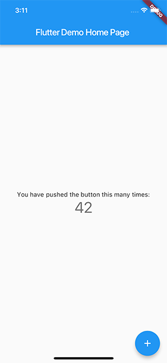
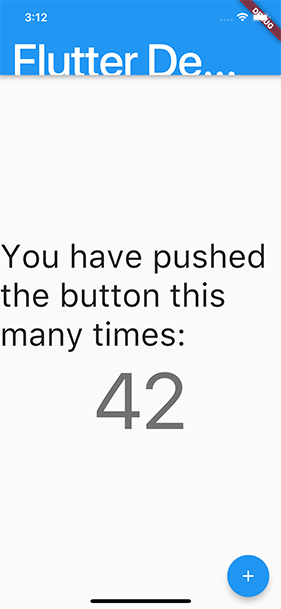

# Erişilebilirlik (Accessibility)

## Arka Plan

Uygulamaların geniş bir kullanıcı kitlesi tarafından erişilebilir olmasını sağlamak, yüksek kaliteli bir uygulama oluşturmanın önemli bir parçasıdır. Kötü tasarlanmış uygulamalar her yaştan insan için engeller oluşturur. [BM Engelli Hakları Sözleşmesi](https://www.un.org/development/desa/disabilities/convention-on-the-rights-of-persons-with-disabilities.html), bilgi sistemlerine evrensel erişimi sağlamanın ahlaki ve yasal zorunluluğunu belirtir; dünya çapındaki ülkeler erişilebilirliği bir gereklilik olarak uygular ve şirketler hizmetlerine erişimi en üst düzeye çıkarmanın ticari avantajlarını kabul eder.

Uygulamanızı yayınlamadan önce bir erişilebilirlik kontrol listesini temel bir kriter olarak dahil etmenizi şiddetle tavsiye ederiz. Flutter, geliştiricileri uygulamalarını daha erişilebilir hale getirmeleri konusunda desteklemeye kararlıdır ve temel işletim sistemi tarafından sağlananlara ek olarak erişilebilirlik için birinci sınıf çerçeve (framework) desteği içerir:

* **UI Tasarımı ve stillendirme**
* **Yardımcı Teknolojiler (Ekran Okuyucu) desteği**


## Erişilebilirlik Düzenlemeleri

Erişilebilirlik standartları ve düzenlemeleri, ürünlerin engelli kişiler için erişilebilir olmasını sağlamaya yardımcı olur. Bunların çoğu yasa ve politika haline getirilmiş, ürün ve hizmetler için gereklilikler olmuştur.

* **WCAG 2:** [Web İçeriği Erişilebilirlik Yönergeleri (WCAG) 2](https://www.w3.org/TR/WCAG21/), web içeriğini engelli kişiler için daha erişilebilir hale getirmek amacıyla uluslararası kabul görmüş bir standarttır. World Wide Web Consortium (W3C) tarafından geliştirilen kararlı, teknik bir standarttır.
* **EN 301 549:** [EN 301 549](https://adod.idrc.ocadu.ca/standards/en301549), Bilgi ve İletişim Teknolojisi (ICT) ürünleri ve hizmetleri için erişilebilirlik gerekliliklerine yönelik Avrupa uyumlaştırılmış standardıdır.
* **VPAT:** [Gönüllü Ürün Erişilebilirlik Şablonu (VPAT)](https://www.itic.org/policy/accessibility/vpat), erişilebilirlik gerekliliklerini ve standartlarını ürünler ve hizmetler için eyleme geçirilebilir test kriterlerine dönüştüren ücretsiz bir şablondur.

Dünyanın dört bir yanındaki yasalar, dijital içerik ve hizmetlerin engelli kişiler için erişilebilir olmasını gerektirir. ABD'de, **Amerikalılar Engelliler Yasası (ADA)** kamuya açık konaklama yerlerinde ayrımcılığı yasaklar. **Rehabilitasyon Yasası'nın 508. Bölümü**, federal kurumların ve yüklenicilerinin tüm ICT (Bilgi ve İletişim Teknolojileri) için WCAG standartlarını karşılamasını gerektirir.

AB'de, **Avrupa Erişilebilirlik Yasası (EAA)**, teknik temeli olarak öncelikle **EN 301 549**'u kullanarak çok çeşitli kamu ve özel sektör hizmetlerinin erişilebilir olmasını gerektirir.

## Erişilebilirliği Göz Önünde Bulundurarak İnşa Etmek

Uygulamanızın herkes tarafından kullanılabilmesini sağlamak, erişilebilirliği en baştan itibaren uygulamanın içine inşa etmek anlamına gelir. Bazı uygulamalar için bunu söylemek yapmaktan daha kolaydır. Aşağıdaki videoda (orijinal metindeki video kastediliyor), mühendislerimizden ikisi bir mobil uygulamayı kötü bir erişilebilirlik durumundan alıp, Flutter'ın yerleşik widget'larından yararlanarak çok daha erişilebilir bir deneyim sunan bir hale getiriyor.

[video](https://www.youtube.com/watch?v=bWbBgbmAdQs)


## Erişilebilirlik Sürüm Kontrol Listesi

Uygulamanızı yayına hazırlarken göz önünde bulundurmanız gereken, kapsamlı olmayan bir liste şöyledir:

* **Aktif etkileşimler:** Tüm aktif etkileşimlerin bir şeyler yaptığından emin olun. Basılabilen herhangi bir düğme basıldığında bir şeyler yapmalıdır. Örneğin, bir `onPressed` olayı için işlevsiz (no-op) bir geri çağırmanız varsa, bunu ekranda hangi kontrole bastığınızı açıklayan bir `SnackBar` gösterecek şekilde değiştirin.
* **Ekran okuyucu testi:** Ekran okuyucu, dokunduğunuzda sayfadaki tüm kontrolleri tanımlayabilmeli ve açıklamalar anlaşılır olmalıdır. Uygulamanızı **TalkBack** (Android) ve **VoiceOver** (iOS) ile test edin.
* **Kontrast oranları:** Devre dışı bırakılmış bileşenler hariç, kontroller veya metin ile arka plan arasında en az 4.5:1 kontrast oranına sahip olmanızı öneririz. Görüntüler de yeterli kontrast açısından incelenmelidir.


* **Bağlam değiştirme:** Bilgi girilirken hiçbir şey kullanıcının bağlamını otomatik olarak değiştirmemelidir. Genellikle, widget'lar bir tür onay eylemi olmadan kullanıcının bağlamını değiştirmekten kaçınmalıdır.
* **Dokunulabilir hedefler:** Tüm dokunulabilir hedefler en az 48x48 piksel olmalıdır.


* **Hatalar:** Önemli eylemler geri alınabilmelidir. Hata gösteren alanlarda, mümkünse bir düzeltme önerin.
* **Renk görme eksikliği testi:** Kontroller, renk körü ve gri tonlamalı modlarda kullanılabilir ve okunaklı olmalıdır.
* **Ölçek faktörleri:** Kullanıcı arayüzü (UI), metin boyutu ve ekran ölçeklendirmesi için çok büyük ölçek faktörlerinde bile okunaklı ve kullanılabilir kalmalıdır.

## Daha Fazla Bilgi Edinin

Flutter ve erişilebilirlik hakkında daha fazla bilgi edinmek için topluluk üyeleri tarafından yazılan aşağıdaki makalelere göz atın:

* [A deep dive into Flutter's accessibility widgets (Flutter'ın erişilebilirlik widget'larına derinlemesine bir bakış)](https://medium.com/flutter-community/a-deep-dive-into-flutters-accessibility-widgets-eb0ef9455bc)
* [Flutter: Crafting a great experience for screen readers (Flutter: Ekran okuyucular için harika bir deneyim oluşturmak)](https://blog.gskinner.com/archives/2022/09/flutter-crafting-a-great-experience-for-screen-readers.html)


---
---


# UI (Kullanıcı Arayüzü) Tasarımı ve Stillendirme

Flutter'ın erişilebilirlik desteği hakkında bilgiler.

Erişilebilir bir uygulama oluşturmak için, kullanıcı arayüzünüzü (UI) erişilebilirliği göz önünde bulundurarak tasarlayın. Bu sayfa, erişilebilir UI tasarımı ve stillendirmenin temel yönlerini kapsar.

## Büyük Yazı Tipleri

Hem Android hem de iOS, uygulamalar tarafından kullanılan istenen yazı tipi boyutlarını yapılandırmak için sistem ayarları içerir. Flutter metin widget'ları, yazı tipi boyutlarını belirlerken bu işletim sistemi ayarına uyar.

Yazı tipi boyutları, işletim sistemi ayarına göre Flutter tarafından otomatik olarak hesaplanır. Ancak, bir geliştirici olarak, yazı tipi boyutları artırıldığında düzeninizin (layout) tüm içeriğini oluşturmak için yeterli alana sahip olduğundan emin olmalısınız. Örneğin, uygulamanızın tüm bölümlerini, en büyük yazı tipi ayarını kullanacak şekilde yapılandırılmış küçük ekranlı bir cihazda test edebilirsiniz.

Yazı tipi boyutlarını ayarlamak için:
* **iOS'te:** Ayarlar > Erişilebilirlik > Ekran ve Metin Boyutu'na gidin.
* **Android'de:** Ayarlar > Yazı tipi boyutu'na gidin.

### Örnek

Aşağıdaki iki ekran görüntüsü, varsayılan iOS yazı tipi ayarıyla ve iOS erişilebilirlik ayarlarında seçilen en büyük yazı tipi ayarıyla oluşturulan standart Flutter uygulama şablonunu göstermektedir.


 &nbsp;&nbsp;&nbsp;&nbsp;&nbsp;&nbsp;&nbsp;&nbsp;&nbsp;&nbsp;


[Varsayılan yazı tipi ayarı]&nbsp;&nbsp;&nbsp;&nbsp;&nbsp; [En büyük erişilebilirlik yazı tipi ayarı]

## Yeterli Kontrast

Yeterli renk kontrastı, metin ve resimlerin okunmasını kolaylaştırır. Çeşitli görme bozuklukları olan kullanıcılara fayda sağlamanın yanı sıra, yeterli renk kontrastı, doğrudan güneş ışığına maruz kalma veya düşük parlaklığa sahip bir ekran gibi aşırı aydınlatma koşullarında bir arayüzü görüntülerken tüm kullanıcılara yardımcı olur.


W3C şunları önerir:
* Küçük metinler için en az **4.5:1** (18 punto normal veya 14 punto kalından küçük).
* Büyük metinler için en az **3.0:1** (18 punto ve üzeri normal veya 14 punto ve üzeri kalın).

Kontrastı Flutter'ın **Erişilebilirlik Yönergesi API**'sini (Accessibility Guideline API) kullanarak test edebilirsiniz. Test etme hakkında daha fazla ayrıntı için erişilebilirlik testi sayfasına göz atın.

## Dokunma Hedefi Boyutu (Tap Target Size)

Çok küçük olan kontroller, birçok kişinin etkileşimde bulunması ve seçmesi açısından zordur. Etkileşimli öğelerin, kullanıcılar tarafından kolayca basılabilecek kadar büyük bir dokunma hedefine sahip olduğundan emin olun.


* **Android**, minimum **48x48 dp** dokunma hedefi boyutu önerir.
* **iOS**, minimum **44x44 pts** dokunma hedefi boyutu önerir.
* **W3C**, minimum **44'e 44 CSS pikseli** hedef boyutu önerir.

Dokunma hedefi boyutunu Flutter'ın **Erişilebilirlik Yönergesi API**'sini kullanarak test edebilirsiniz. Test etme hakkında daha fazla ayrıntı için erişilebilirlik testi sayfasına göz atın.

## Diğer Erişilebilirlik Özellikleri

Kalın metin, yüksek kontrast ve ters renkler gibi platform tarafından etkinleştirilebilecek ek erişilebilirlik özellikleri için `AccessibilityFeatures` sınıfını kontrol edebilirsiniz.


---
---


# Erişilebilirlik Teknolojileri

## Özet

Yardımcı teknolojiler, dijital içeriği engelli bireyler için erişilebilir kılmak adına hayati öneme sahiptir. Bu belge, Flutter geliştirmeyle ilgili iki temel yardımcı teknoloji kategorisine genel bir bakış sunar: görme bozukluğu olan kullanıcılar için **ekran okuyucular** ve motor (hareket) kısıtlamaları olanlar için **hareketlilik destek araçları**. Bu teknolojileri anlayarak ve bunlarla testler yaparak, Flutter uygulamanızın herkes için daha kapsayıcı ve kullanıcı dostu bir deneyim sunduğundan emin olabilirsiniz.

## Ekran Okuyucular (Screen Readers)

Mobil cihazlar için ekran okuyucular (**TalkBack**, **VoiceOver**), görme engelli kullanıcıların ekranın içeriği hakkında sesli geri bildirim almasını ve mobilde jestleri, masaüstünde ise klavye kısayollarını kullanarak kullanıcı arayüzüyle (UI) etkileşime girmesini sağlar. Mobil cihazınızda VoiceOver veya TalkBack'i açın ve uygulamanızda gezinin.


[video](https://www.youtube.com/watch?v=FQyj_XTl01w)


Cihazınızda ekran okuyucuyu açmak için aşağıdaki adımları tamamlayın:

1.  Cihazınızda **Ayarlar**'ı (Settings) açın.
2.  **Erişilebilirlik**'i (Accessibility) ve ardından **TalkBack**'i seçin.
3.  'TalkBack'i kullan' seçeneğini açın veya kapatın.
4.  **Tamam**'ı seçin.


Android'in erişilebilirlik özelliklerini nasıl bulacağınızı ve özelleştireceğinizi öğrenmek için ilgili videoları izleyebilirsiniz.

Artık arşivlenmiş olan Flutter Gallery web uygulamasıyla VoiceOver'ın nasıl kullanılacağını görmek için video demolarına göz atabilirsiniz.

Flutter'ın standart widget'ları otomatik olarak bir erişilebilirlik ağacı oluşturur. Ancak, uygulamanızın farklı bir şeye ihtiyacı varsa, `Semantics` widget'ı kullanılarak özelleştirilebilir.

Uygulamanızda belirli bir sesle seslendirilmesi gereken bir metin olduğunda, `TextSpan.locale` öğesini çağırarak ekran okuyucuya hangi sesi kullanacağını bildirin. `MaterialApp.locale` ve `Localizations.override`, Flutter 3.38 sürümünden itibaren ekran okuyucu seslerini etkileyecektir. Genellikle ekran okuyucu, `TextSpan.locale` ile açıkça ayarlamadığınız sürece sistem sesini kullanır.

## Hareketlilik Desteği (Mobility Support)

Sınırlı el becerisi veya el gücü olan kullanıcılar için hareketlilik destek özellikleri yardımcı olabilir. Hem Android hem de iOS, gezinmeyi ve kontrolü kolaylaştırmak için tasarlanmış bir dizi araç sunar. Bu özellikler, kullanıcıların cihazlarını harici anahtarlar, sesli komutlar veya basitleştirilmiş ekran menüleri aracılığıyla çalıştırmasına olanak tanır.

Android; Anahtar Erişimi (Switch Access), Sesle Erişim (Voice Access) ve Erişilebilirlik Menüsü (Accessibility Menu) sağlarken; iOS, Anahtarla Denetim (Switch Control), Sesle Denetim (Voice Control) ve AssistiveTouch sunar. Bu araçları anlamak, çeşitli fiziksel yeteneklere sahip kişiler tarafından kullanılabilen uygulamalar oluşturmaya yardımcı olur.


| İşletim Sistemi | Özellikler | İşlevler |
| :--- | :--- | :--- |
| **Android** | Switch Access (Anahtar Erişimi) | Alternatif bir giriş yöntemi olarak, Anahtar Erişimi ve Kamera Anahtarlarını kullanabilirsiniz. |
| **Android** | Voice Access (Sesle Erişim) | Cihazınızı sesinizle kontrol edin. |
| **Android** | Accessibility Menu (Erişilebilirlik Menüsü) | Temel telefon işlevlerini kontrol etmek için basitleştirilmiş düğmeler sağlayan, ekranda yüzen bir menü. |
| **iOS** | Switch Control (Anahtarla Denetim) | Anahtarları alternatif bir giriş yöntemi olarak kullanın. |
| **iOS** | Voice Control (Sesle Denetim) | Cihazınızı sesinizle kontrol edin. |
| **iOS** | AssistiveTouch | Çok parmaklı hareketleri veya donanım düğmesi eylemlerini değiştirmek için AssistiveTouch'ı kullanın. |


---
---


# Erişilebilirlik Testi

## Erişilebilirlik Düzenlemeleri

Uygulamanızın erişilebilir olduğundan emin olmak için, onu **Web İçeriği Erişilebilirlik Yönergeleri (WCAG) 2** ve **EN 301 549** gibi genel standartlara göre kontrol edin ve ürününüzü kendi kendinize değerlendirmek için **Gönüllü Ürün Erişilebilirlik Şablonu (VPAT)** gibi kaynakları kullanın. Bu düzenlemeler hakkında daha fazla ayrıntı için ana erişilebilirlik sayfasına göz atın.

## Erişilebilirlik Desteğini İnceleme (Denetleme)

Aşağıdakileri test etmek için otomatik erişilebilirlik tarayıcılarını kullanmanızı öneririz:

### Android için:

1.  Android için **Accessibility Scanner** (Erişilebilirlik Tarayıcısı) uygulamasını yükleyin.
2.  **Android Ayarlar > Erişilebilirlik > Erişilebilirlik Tarayıcısı > Açık** yolunu izleyerek Erişilebilirlik Tarayıcısını etkinleştirin.
3.  Bir tarama başlatmak için Erişilebilirlik Tarayıcısı 'onay kutusu' simge düğmesine gidin.


### iOS için:

1.  Xcode'da Flutter uygulamanızın `iOS` klasörünü açın.
2.  Hedef olarak bir Simülatör seçin ve **Çalıştır** (Run) düğmesine tıklayın.
3.  Xcode'da **Xcode > Open Developer Tools > Accessibility Inspector** (Geliştirici Araçlarını Aç > Erişilebilirlik Denetçisi) seçeneğini seçin.
4.  Erişilebilirlik Denetçisi'nde, **Inspection > Enable Point to Inspect** (İnceleme > İncelemek İçin İşaretlemeyi Etkinleştir) seçeneğini seçin ve ardından erişilebilirlik özniteliklerini incelemek için çalışan Flutter uygulamanızdaki çeşitli kullanıcı arayüzü öğelerini seçin.
5.  Erişilebilirlik Denetçisi'nde, araç çubuğundaki **Audit** (Denetim) öğesini seçin ve ardından olası sorunların bir raporunu almak için **Run Audit** (Denetimi Çalıştır) öğesini seçin.


### Web için:

1.  Chrome DevTools'u (veya diğer tarayıcılardaki benzer araçları) açın.
2.  Flutter tarafından oluşturulan ARIA niteliklerini içeren semantik (anlamsal) ana bilgisayar altındaki HTML ağacını inceleyin.
3.  Chrome'da, "Elements" (Öğeler) sekmesi, semantik ağaca dışa aktarılan verileri incelemek için kullanılabilecek bir "Accessibility" (Erişilebilirlik) alt sekmesine sahiptir.


## Mobilde Erişilebilirlik Testi

Uygulamanızı Flutter'ın **Erişilebilirlik Yönergesi API**'sini (Accessibility Guideline API) kullanarak test edin. Bu API, uygulamanızın kullanıcı arayüzünün Flutter'ın erişilebilirlik önerilerini karşılayıp karşılamadığını kontrol eder. Bunlar metin kontrastı, hedef boyutu ve hedef etiketleri için önerileri kapsar.

Aşağıdaki kod parçası, `AccessibleApp` adlı örnek bir widget üzerinde Guideline API'nin nasıl kullanılacağını gösterir:

`test/a11y_test.dart`

```dart
import 'package:flutter_test/flutter_test.dart';
import 'package:your_accessible_app/main.dart';

void main() {
  testWidgets('Erişilebilirlik yönergelerini takip eder', (tester) async {
    final SemanticsHandle handle = tester.ensureSemantics();
    await tester.pumpWidget(const AccessibleApp());

    // Android için dokunulabilir düğümlerin (nodes) minimum
    // 48'e 48 piksel boyutunda olup olmadığını kontrol eder.
    await expectLater(tester, meetsGuideline(androidTapTargetGuideline));

    // iOS için dokunulabilir düğümlerin (nodes) minimum
    // 44'e 44 piksel boyutunda olup olmadığını kontrol eder.
    await expectLater(tester, meetsGuideline(iOSTapTargetGuideline));

    // Dokunma veya uzun basma eylemi olan dokunma hedeflerinin
    // etiketlenip etiketlenmediğini kontrol eder.
    await expectLater(tester, meetsGuideline(labeledTapTargetGuideline));

    // Semantik düğümlerin minimum metin kontrastı seviyelerini
    // karşılayıp karşılamadığını kontrol eder.
    // Önerilen metin kontrastı, daha büyük metinler için 3:1'dir
    // (18 punto ve üzeri normal).
    await expectLater(tester, meetsGuideline(textContrastGuideline));
    handle.dispose();
  });
}
```

Bu testleri denemek için, *İlk Flutter uygulamanızı yazın* kod laboratuvarında (codelab) oluşturduğunuz uygulama üzerinde çalıştırın. O uygulamanın ana ekranındaki her düğme, 18 puntoluk bir yazı tipiyle oluşturulmuş metne sahip dokunulabilir bir hedef görevi görür.

Guideline API testlerini diğer widget testleriyle birlikte veya bu örnekteki `test/a11y_test.dart` gibi ayrı bir dosyaya ekleyebilirsiniz.

## Web'de Erişilebilirlik Testi

Profil ve sürüm (release) modlarında aşağıdaki komut satırı bayrağını kullanarak web uygulamanız için oluşturulan anlamsal düğümleri görselleştirerek erişilebilirliği ayıklayabilirsiniz (debug):

```bash
flutter run -d chrome --profile --dart-define=FLUTTER_WEB_DEBUG_SHOW_SEMANTICS=true
```

Bayrak etkinleştirildiğinde, anlamsal düğümler widget'ların üzerinde görünür; anlamsal öğelerin olması gereken yere yerleştirildiğini doğrulayabilirsiniz. Anlamsal düğümler yanlış yerleştirilmişse, lütfen bir hata raporu gönderin.

---
---


# Web Erişilebilirliği (Web Accessibility)

## Arka Plan

Flutter, dahili Semantics (anlambilim) ağacını ekran okuyucuların anlayabileceği erişilebilir bir HTML DOM yapısına çevirerek web erişilebilirliğini destekler. Flutter, kullanıcı arayüzünü (UI) tek bir tuval (canvas) üzerinde oluşturduğundan, UI'ın anlamını ve yapısını web tarayıcılarına göstermek için özel bir katmana ihtiyaç duyar.


## İsteğe Bağlı (Opt-in) Web Erişilebilirliği

### Görünmez Düğme

Performans nedenleriyle, Flutter'ın web erişilebilirliği varsayılan olarak açık değildir. Erişilebilirliği açmak için kullanıcının `aria-label="Enable accessibility"` etiketine sahip görünmez bir düğmeye basması gerekir. Düğmeye bastıktan sonra, DOM ağacı widget'lar için tüm erişilebilirlik bilgilerini yansıtacaktır.


### Erişilebilirlik Modunu Kodda Açma

Alternatif bir yaklaşım, bir uygulamayı çalıştırırken aşağıdaki kodu ekleyerek erişilebilirlik modunu açmaktır.

```dart
import 'package:flutter/semantics.dart';

void main() {
  runApp(const MyApp());
  if (kIsWeb) {
    SemanticsBinding.instance.ensureSemantics();
  }
}
```

## Erişilebilirliği Semantik Roller ile Geliştirme

### Semantik Roller (Semantic Roles) Nedir?

Semantik roller, bir UI öğesinin amacını tanımlar ve ekran okuyucuların ve diğer yardımcı araçların uygulamanızı kullanıcılara etkili bir şekilde yorumlamasına ve sunmasına yardımcı olur. Örneğin, bir rol, bir widget'ın bir düğme, bir bağlantı, bir başlık, bir kaydırıcı veya bir tablonun parçası olup olmadığını belirtebilir.

Flutter'ın standart widget'ları genellikle bu semantiği otomatik olarak sağlarken, açıkça tanımlanmış bir rolü olmayan özel bir bileşen, bir ekran okuyucu kullanıcısı için anlaşılmaz olabilir.

Uygun rolleri atayarak şunları sağlarsınız:

* Ekran okuyucular, öğelerin türünü ve amacını doğru bir şekilde duyurabilir.
* Kullanıcılar, yardımcı teknolojileri kullanarak uygulamanızda daha etkili bir şekilde gezinebilir.
* Uygulamanız web erişilebilirlik standartlarına uyar ve kullanılabilirliği artırır.

### Flutter Web için `SemanticsRole` Kullanımı

Flutter, geliştiricilerin widget'larına belirli roller atamasına izin vermek için `SemanticsRole` enum'u ile `Semantics` widget'ını sağlar. Flutter web uygulamanız oluşturulduğunda, bu Flutter'a özgü roller, web sayfasının HTML yapısındaki karşılık gelen ARIA rollerine çevrilir.

#### 1. Standart Widget'lardan Otomatik Semantikler

`TabBar`, `MenuAnchor` ve `Table` gibi birçok standart Flutter widget'ı, rollerinin yanı sıra anlamsal bilgileri de otomatik olarak içerir. Mümkün olduğunda, birçok erişilebilirlik yönünü kullanıma hazır (out-of-the-box) olarak ele aldıkları için bu standart widget'ları kullanmayı tercih edin.

#### 2. Rolleri Açıkça Ekleme veya Geçersiz Kılma

Özel bileşenler için veya varsayılan semantiklerin yeterli olmadığı durumlarda, rolü tanımlamak için `Semantics` widget'ını kullanın:

İşte bir listeyi ve öğelerini açıkça nasıl tanımlayabileceğinize dair bir örnek:

```dart
import 'package:flutter/material.dart';
import 'package:flutter/semantics.dart';


class MyCustomListWidget extends StatelessWidget {
  const MyCustomListWidget({Key? key}) : super(key: key);

  @override
  Widget build(BuildContext context) {
    // Bu örnek, özel bir liste yapısı oluştururken liste ve 
    // liste öğesi rollerinin açıkça nasıl atanacağını gösterir.
    return Semantics(
      role: SemanticsRole.list,
      explicitChildNodes: true,
      child: Column(
        children: <Widget>[
          Semantics(
            role: SemanticsRole.listItem,
            child: const Padding(
              padding: EdgeInsets.all(8.0),
              child: Text('Content of the first custom list item.'),
            ),
          ),
          Semantics(
            role: SemanticsRole.listItem,
            child: const Padding(
              padding: EdgeInsets.all(8.0),
              child: Text('Content of the second custom list item.'),
            ),
          ),
        ],
      ),
    );
  }
}
```


---
---

## 📄 Lisans Bilgisi

Bu doküman, **Flutter resmi dokümantasyonundan** türetilmiş Türkçe ders notudur.

**Orijinal kaynak:**  
https://docs.flutter.dev/ui/accessibility

**Türkçe çeviri ve düzenleme:**  
[Doç. Dr. Hakan Temiz](mailto:htemiz@artvin.edu.tr)

---

### Lisans Kapsamı

Bu dokümandaki içerikler aşağıdaki açık lisanslar kapsamında sunulmaktadır:

**Metin içerikleri (anlatım ve açıklamalar):**  
Flutter resmi dokümantasyonundan alınmış veya uyarlanmıştır.  
**Lisans:** Creative Commons Attribution 4.0 International (CC BY 4.0)  
https://creativecommons.org/licenses/by/4.0/

Bu lisans kapsamında:
- İçerik kopyalanabilir, dağıtılabilir ve uyarlanabilir  
- Ticari kullanım serbesttir  
- Kaynak belirtilmesi zorunludur  

**Kod örnekleri:**  
Flutter resmi dokümantasyonundan alınmış veya uyarlanmıştır.  
**Lisans:** BSD 3-Clause License  
https://opensource.org/licenses/BSD-3-Clause

Bu lisans kapsamında:
- Kodlar kopyalanabilir, değiştirilebilir ve dağıtılabilir  
- Ticari kullanım serbesttir  
- Lisans bildiriminin korunması gerekir  

---
---
