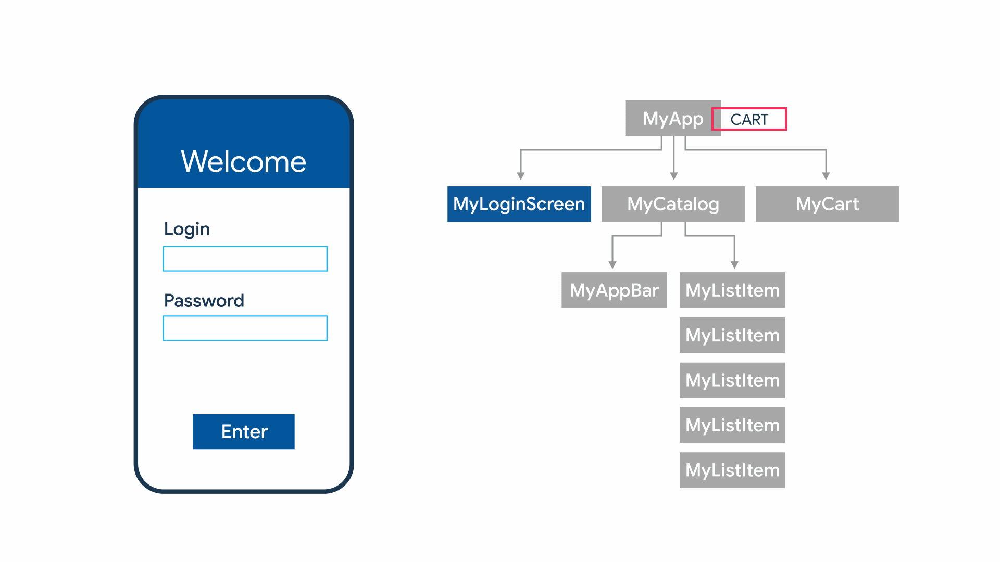
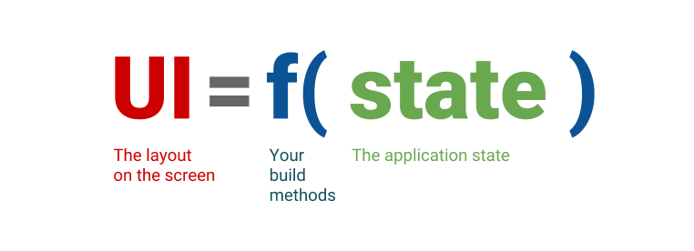
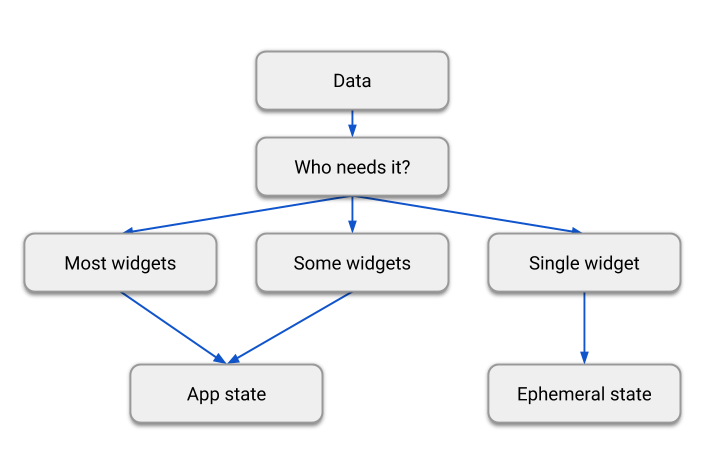
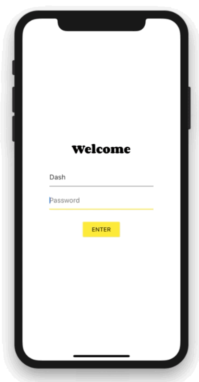
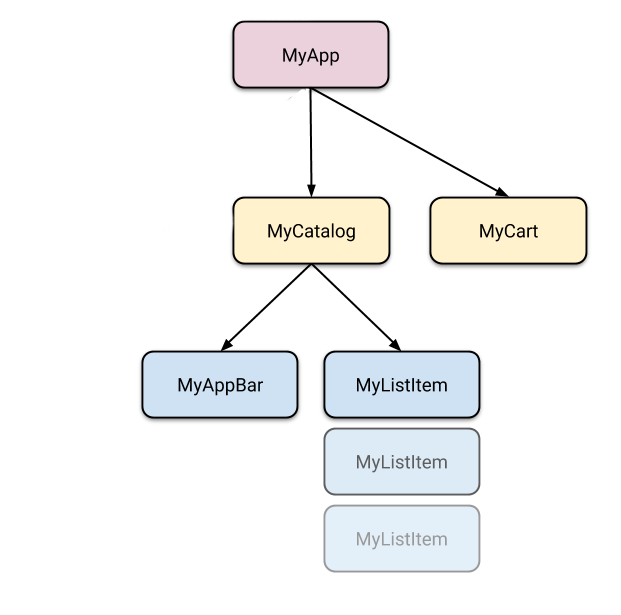
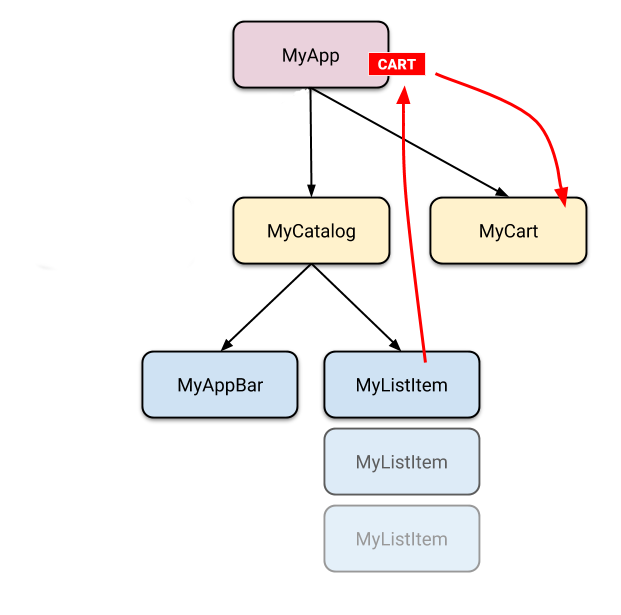

# Durum yönetimi (State management)


> **Not**
> Flutter kullanarak bir mobil uygulama geliştirdiyseniz ve yeniden başlatma sırasında uygulamanızın durumunun neden kaybolduğunu merak ediyorsanız, **Android'de durumu geri yükleme** veya **iOS'te durumu geri yükleme** bölümlerine göz atın.




Reaktif uygulamalarda durum yönetimine zaten aşinaysanız bu bölümü atlayabilirsiniz, ancak yine de **farklı yaklaşımların listesini** incelemek isteyebilirsiniz.


Flutter'ı keşfettikçe, uygulamanız genelinde ekranlar arasında uygulama durumunu paylaşmanız gereken bir zaman gelecektir. Benimseyebileceğiniz birçok yaklaşım ve üzerine düşünmeniz gereken birçok soru vardır.


Sonraki sayfalarda, Flutter uygulamalarında durumla (*state*) başa çıkmanın temellerini öğreneceksiniz.


# Bildirimsel (Declarative) düşünmeye başlayın

Bildirimsel programlama hakkında nasıl düşünülmeli.

Flutter'a imperatif (emirsel) bir çerçeveden (Android SDK veya iOS UIKit gibi) geliyorsanız, uygulama geliştirmeye yeni bir perspektiften bakmaya başlamanız gerekir.

Sahip olabileceğiniz birçok varsayım Flutter için geçerli değildir. Örneğin Flutter'da, kullanıcı arayüzünüzün (UI) parçalarını değiştirmek yerine sıfırdan yeniden oluşturmak sorun değildir. Flutter bunu, gerekirse her karede (frame) bile yapabilecek kadar hızlıdır.

Flutter **bildirimseldir** (declarative). Bu, Flutter'ın kullanıcı arayüzünü uygulamanızın mevcut durumunu yansıtacak şekilde oluşturduğu anlamına gelir:




Uygulamanızın durumu değiştiğinde (örneğin, kullanıcı ayarlar ekranındaki bir anahtarı değiştirdiğinde), durumu değiştirirsiniz ve bu, kullanıcı arayüzünün yeniden çizilmesini tetikler. Kullanıcı arayüzünün kendisinde (`widget.setText` gibi) imperatif bir değişiklik yoktur; siz durumu değiştirirsiniz ve kullanıcı arayüzü sıfırdan yeniden oluşturulur.

Kullanıcı arayüzü programlamaya yönelik bildirimsel yaklaşım hakkında daha fazla bilgiyi **başlangıç kılavuzunda** okuyun.

Bildirimsel kullanıcı arayüzü programlama tarzının birçok faydası vardır. Dikkat çekici bir şekilde, kullanıcı arayüzünün herhangi bir durumu için yalnızca tek bir kod yolu vardır. Kullanıcı arayüzünün herhangi bir durum için nasıl görünmesi gerektiğini bir kez tanımlarsınız ve hepsi bu kadardır.

İlk başta, bu programlama tarzı imperatif tarz kadar sezgisel görünmeyebilir. Bu bölümün burada olmasının nedeni budur. Okumaya devam edin.


# Geçici durum (ephemeral state) ve uygulama durumu (app state) arasındaki fark

Geçici durum ile uygulama durumu arasındaki fark nasıl anlaşılır?

Bu belge; uygulama durumunu, geçici durumu ve bir Flutter uygulamasında her birini nasıl yönetebileceğinizi tanıtır.

Mümkün olan en geniş anlamıyla, bir uygulamanın durumu (state), uygulama çalışırken bellekte var olan her şeydir. Buna uygulamanın varlıkları (assets), Flutter çerçevesinin (framework) UI, animasyon durumu, dokular, yazı tipleri vb. hakkında tuttuğu tüm değişkenler dahildir. Durumun bu en geniş tanımı geçerli olsa da, bir uygulamanın mimarisini oluşturmak için çok yararlı değildir.

Birincisi, bazı durumları (dokular gibi) siz yönetmezsiniz bile. Çerçeve bunları sizin için halleder. Bu nedenle, durumun daha yararlı bir tanımı şudur: "Herhangi bir anda kullanıcı arayüzünüzü yeniden oluşturmak için ihtiyaç duyduğunuz her türlü veri". İkincisi, kendiniz **yönettiğiniz** durum iki kavramsal türe ayrılabilir: geçici durum ve uygulama durumu.

## Geçici durum (Ephemeral state)

Geçici durum (bazen **UI durumu** veya **yerel durum** olarak da adlandırılır), tek bir widget içinde düzgün bir şekilde barındırabileceğiniz durumdur.

Bu kasıtlı olarak belirsiz bir tanımdır, bu yüzden işte birkaç örnek:

* Bir `PageView` içindeki mevcut sayfa
* Karmaşık bir animasyonun mevcut ilerleme durumu
* Bir `BottomNavigationBar` içindeki mevcut seçili sekme

Widget ağacının diğer kısımlarının bu tür bir duruma erişmesi nadiren gerekir. Bunu serileştirmeye gerek yoktur ve karmaşık şekillerde değişmez.

Başka bir deyişle, bu tür bir durum üzerinde durum yönetimi tekniklerini (ScopedModel, Redux vb.) kullanmaya gerek yoktur. Tek ihtiyacınız olan bir `StatefulWidget`'tır.

Aşağıda, alt gezinme çubuğunda o anda seçili olan öğenin `_MyHomepageState` sınıfının `_index` alanında nasıl tutulduğunu görebilirsiniz. Bu örnekte `_index` geçici bir durumdur.

```dart
class MyHomepage extends StatefulWidget {
  const MyHomepage({super.key});

  @override
  State<MyHomepage> createState() => _MyHomepageState();
}

class _MyHomepageState extends State<MyHomepage> {
  int _index = 0;

  @override
  Widget build(BuildContext context) {
    return BottomNavigationBar(
      currentIndex: _index,
      onTap: (newIndex) {
        setState(() {
          _index = newIndex;
        });
      },
      // ... öğeler ...
    );
  }
}
```

Burada `setState()` ve `StatefulWidget`'ın State sınıfı içinde bir alan (field) kullanmak tamamen doğaldır. Uygulamanızın başka hiçbir parçasının `_index`e erişmesi gerekmez. Değişken yalnızca `MyHomepage` widget'ı içinde değişir. Ve kullanıcı uygulamayı kapatıp yeniden başlatırsa, `_index`in sıfıra sıfırlanması sizin için sorun olmaz.

## Uygulama durumu (App state)

Geçici olmayan, uygulamanızın birçok parçasıyla paylaşmak istediğiniz ve kullanıcı oturumları arasında saklamak istediğiniz durum, uygulama durumu (bazen **paylaşılan durum** olarak da adlandırılır) dediğimiz şeydir.

Uygulama durumuna örnekler:

* Kullanıcı tercihleri
* Giriş bilgileri
* Bir sosyal ağ uygulamasındaki bildirimler
* Bir e-ticaret uygulamasındaki alışveriş sepeti
* Bir haber uygulamasındaki makalelerin okundu/okunmadı durumu

Uygulama durumunu yönetmek için seçeneklerinizi araştırmak isteyeceksiniz. Seçiminiz uygulamanızın karmaşıklığına ve doğasına, ekibinizin önceki deneyimine ve diğer birçok yöne bağlıdır. Okumaya devam edin.

## Kesin bir kural yoktur

Açık olmak gerekirse, uygulamanızdaki tüm durumu yönetmek için `State` ve `setState()` kullanabilirsiniz. Aslında Flutter ekibi bunu birçok basit uygulama örneğinde (her `flutter create` ile aldığınız başlangıç uygulaması dahil) yapar.

Tam tersi de geçerlidir. Örneğin, kendi uygulamanız bağlamında, bir alt gezinme çubuğundaki seçili sekmenin **geçici durum olmadığına** karar verebilirsiniz. Bunu sınıfın dışından değiştirmeniz, oturumlar arasında saklamanız vb. gerekebilir. Bu durumda, `_index` değişkeni uygulama durumudur.

Belirli bir değişkenin geçici mi yoksa uygulama durumu mu olduğunu ayırt etmek için kesin, evrensel bir kural yoktur. Bazen, birini diğerine dönüştürmeniz (refactor) gerekir. Örneğin, açıkça geçici bir durumla başlarsınız, ancak uygulamanızın özellikleri arttıkça bunun uygulama durumuna taşınması gerekebilir.

Bu nedenle, aşağıdaki diyagrama ihtiyatla yaklaşın:



React'in setState'i ile Redux'ın store'u karşılaştırıldığında, Redux'ın yazarı Dan Abramov şöyle yanıtlamıştır:

> "Genel kural şudur: Hangisi daha az tuhaf (zahmetli) geliyorsa onu yapın."

Özetle, herhangi bir Flutter uygulamasında iki kavramsal durum türü vardır. Geçici durum, `State` ve `setState()` kullanılarak uygulanabilir ve genellikle tek bir widget için yereldir. Geri kalanı uygulama durumunuzdur. Her iki türün de herhangi bir Flutter uygulamasında yeri vardır ve ikisi arasındaki ayrım kendi tercihinize ve uygulamanın karmaşıklığına bağlıdır.


# Basit uygulama durumu yönetimi

Artık **bildirimsel UI (arayüz) programlamayı** ve **geçici durum ile uygulama durumu** arasındaki farkı bildiğinize göre, basit uygulama durumu yönetimini öğrenmeye hazırsınız.

Bu sayfada, `provider` paketini kullanacağız. Flutter'da yeniyseniz ve başka bir yaklaşımı (Redux, Rx, kancalar (hooks) vb.) seçmek için güçlü bir nedeniniz yoksa, muhtemelen başlamanız gereken yaklaşım budur. `provider` paketinin anlaşılması kolaydır ve fazla kod kullanmaz. Ayrıca diğer tüm yaklaşımlarda geçerli olan kavramları kullanır.

Bununla birlikte, diğer reaktif çerçevelerden gelen güçlü bir durum yönetimi geçmişiniz varsa, **seçenekler sayfasında** listelenen paketleri ve öğreticileri bulabilirsiniz.

## Örneğimiz

Açıklama amacıyla, aşağıdaki basit uygulamayı ele alalım.




Uygulamanın iki ayrı ekranı vardır: bir katalog ve bir sepet (sırasıyla `MyCatalog` ve `MyCart` widget'ları ile temsil edilir). Bu bir alışveriş uygulaması olabilir, ancak aynı yapıyı basit bir sosyal ağ uygulamasında da hayal edebilirsiniz (kataloğu "duvar" ve sepeti "favoriler" ile değiştirin).

Katalog ekranı, özel bir uygulama çubuğu (`MyAppBar`) ve birçok liste öğesinin (`MyListItems`) kayan bir görünümünü içerir.

İşte bir widget ağacı olarak görselleştirilmiş uygulama.





Yani en az 5 tane `Widget` alt sınıfımız var. Bunların çoğu başka bir yere "ait" olan duruma erişmeye ihtiyaç duyar. Örneğin, her bir `MyListItem`, kendini sepete ekleyebilmelidir. Ayrıca, o anda görüntülenen öğenin zaten sepette olup olmadığını görmek isteyebilir.

Bu bizi ilk sorumuza götürür: Sepetin mevcut durumunu nereye koymalıyız?

## Durumu yukarı taşımak (Lifting state up)

Flutter'da durumu, onu kullanan widget'ların üzerinde tutmak mantıklıdır.

Neden? Flutter gibi bildirimsel çerçevelerde, kullanıcı arayüzünü (UI) değiştirmek istiyorsanız, onu yeniden oluşturmanız gerekir. `MyCart.updateWith(somethingNew)` gibi bir yöntem kullanmanın kolay bir yolu yoktur. Başka bir deyişle, bir widget'ı dışarıdan, üzerinde bir yöntem çağırarak zorunlu (imperative) olarak değiştirmek zordur. Ve bunu çalıştırabilseniz bile, çerçevenin size yardım etmesine izin vermek yerine onunla savaşıyor olurdunuz.

```dart
// KÖTÜ: BUNU YAPMAYIN
void myTapHandler() {
  var cartWidget = somehowGetMyCartWidget();
  cartWidget.updateWith(item);
}
```

Yukarıdaki kodu çalıştırsanız bile, `MyCart` widget'ında aşağıdakilerle uğraşmak zorunda kalırdınız:

```dart
// KÖTÜ: BUNU YAPMAYIN
Widget build(BuildContext context) {
  return SomeWidget(
    // Sepetin başlangıç durumu.
  );
}

void updateWith(Item item) {
  // Bir şekilde UI'ı buradan değiştirmeniz gerekir.
}
```

Kullanıcı arayüzünün mevcut durumunu dikkate almanız ve yeni verileri buna uygulamanız gerekirdi. Bu şekilde hatalardan (bug) kaçınmak zordur.

Flutter'da, içeriği her değiştiğinde yeni bir widget oluşturursunuz. `MyCart.updateWith(somethingNew)` (bir yöntem çağrısı) yerine `MyCart(contents)` (bir yapıcı - constructor) kullanırsınız. Yeni widget'ları yalnızca ebeveynlerinin `build` yöntemlerinde oluşturabildiğiniz için, `contents` (içerik) değişecekse, bunun `MyCart`'ın ebeveyninde veya daha yukarısında yaşaması gerekir.

```dart
// İYİ
void myTapHandler(BuildContext context) {
  var cartModel = somehowGetMyCartModel(context);
  cartModel.add(item);
}
```

Şimdi `MyCart`, kullanıcı arayüzünün herhangi bir sürümünü oluşturmak için yalnızca tek bir kod yoluna sahiptir.

```dart
// İYİ
Widget build(BuildContext context) {
  var cartModel = somehowGetMyCartModel(context);
  return SomeWidget(
    // Sepetin mevcut durumunu kullanarak UI'ı sadece bir kez oluşturun.
    // ···
  );
}
```

Örneğimizde, `contents`'in `MyApp` içinde yaşaması gerekir. Ne zaman değişirse, `MyCart`'ı yukarıdan yeniden oluşturur (buna daha sonra değineceğiz). Bu nedenle, `MyCart` yaşam döngüsü (lifecycle) hakkında endişelenmek zorunda değildir; sadece herhangi bir `contents` için ne göstereceğini bildirir. Bu değiştiğinde, eski `MyCart` widget'ı kaybolur ve tamamen yenisiyle değiştirilir.

Widget'lar değişmezdir (immutable) dediğimizde kastettiğimiz budur. Değişmezler, yerlerine yenileri gelir.




Artık sepetin durumunu nereye koyacağımızı bildiğimize göre, ona nasıl erişeceğimize bakalım.

## Duruma erişim

Kullanıcı katalogdaki öğelerden birine tıkladığında, öğe sepete eklenir. Ancak sepet `MyListItem`'ın üzerinde yaşadığına göre, bunu nasıl yaparız?

Basit bir seçenek, `MyListItem` tıklandığında çağırabileceği bir geri çağrı (callback) sağlamaktır. Dart'ın işlevleri birinci sınıf nesnelerdir, bu yüzden onları istediğiniz herhangi bir şekilde dolaştırabilirsiniz. Yani, `MyCatalog` içinde aşağıdakini tanımlayabilirsiniz:

```dart
@override
Widget build(BuildContext context) {
  return SomeWidget(
    // Yukarıdaki yönteme bir referans ileterek widget'ı oluşturun.
    MyListItem(myTapCallback),
  );
}

void myTapCallback(Item item) {
  print('kullanıcı şuna tıkladı: $item');
}
```

Bu işe yarar, ancak birçok farklı yerden değiştirmeniz gereken bir uygulama durumu için, etrafta çok fazla geri çağrı (callback) dolaştırmanız gerekir; bu da oldukça hızlı bir şekilde eskimeye (yetersiz kalmaya) başlar.

Neyse ki Flutter, widget'ların verileri ve hizmetleri torunlarına (başka bir deyişle, sadece çocuklarına değil, altlarındaki herhangi bir widget'a) sağlaması için mekanizmalara sahiptir. Flutter'dan bekleyeceğiniz gibi, (Her şeyin bir Widget™ olduğu yerde), bu mekanizmalar sadece özel türde widget'lardır: `InheritedWidget`, `InheritedNotifier`, `InheritedModel` ve daha fazlası. Bunları burada ele almayacağız çünkü yapmaya çalıştığımız şey için biraz düşük seviyeliler.

Bunun yerine, düşük seviyeli widget'larla çalışan ancak kullanımı basit olan bir paket kullanacağız. Adı `provider`.

`provider` ile çalışmadan önce, `pubspec.yaml` dosyanıza bağımlılığı eklemeyi unutmayın.

`provider` paketini bağımlılık olarak eklemek için `flutter pub add` komutunu çalıştırın:

```bash
flutter pub add provider
```

Artık `import 'package:provider/provider.dart';` yapabilir ve oluşturmaya başlayabilirsiniz.

`provider` ile geri çağrılar veya `InheritedWidgets` hakkında endişelenmenize gerek yoktur. Ancak 3 kavramı anlamanız gerekir:

1. ChangeNotifier
2. ChangeNotifierProvider
3. Consumer

### ChangeNotifier

`ChangeNotifier`, Flutter SDK'sına dahil olan ve dinleyicilerine değişiklik bildirimi sağlayan basit bir sınıftır. Başka bir deyişle, bir şey `ChangeNotifier` ise, değişikliklerine abone olabilirsiniz. (Bu terime aşina olanlar için, bu bir Gözlemlenebilir (Observable) biçimidir.)

`provider` içinde `ChangeNotifier`, uygulama durumunuzu kapsüllemenin bir yoludur. Çok basit uygulamalar için tek bir `ChangeNotifier` ile idare edebilirsiniz. Karmaşık olanlarda, birkaç modeliniz ve dolayısıyla birkaç `ChangeNotifier`'ınız olacaktır. (`provider` ile `ChangeNotifier` kullanmak zorunda değilsiniz, ancak çalışması kolay bir sınıftır.)

Alışveriş uygulaması örneğimizde, sepetin durumunu bir `ChangeNotifier` içinde yönetmek istiyoruz. Aşağıdaki gibi onu genişleten (extend) yeni bir sınıf oluşturuyoruz:

```dart
class CartModel extends ChangeNotifier {
  /// Sepetin dahili, özel durumu.
  final List<Item> _items = [];

  /// Sepetteki öğelerin değiştirilemez bir görünümü.
  UnmodifiableListView<Item> get items => UnmodifiableListView(_items);

  /// Tüm öğelerin güncel toplam fiyatı (tüm öğelerin 42$ olduğunu varsayarsak).
  int get totalPrice => _items.length * 42;

  /// [item] öğesini sepete ekler. Bu ve [removeAll], sepeti dışarıdan
  /// değiştirmenin tek yoludur.
  void add(Item item) {
    _items.add(item);
    // Bu çağrı, bu modeli dinleyen widget'lara yeniden oluşturulmalarını söyler.
    notifyListeners();
  }

  /// Sepetteki tüm öğeleri kaldırır.
  void removeAll() {
    _items.clear();
    // Bu çağrı, bu modeli dinleyen widget'lara yeniden oluşturulmalarını söyler.
    notifyListeners();
  }
}
```

`ChangeNotifier`'a özgü olan tek kod `notifyListeners()` çağrısıdır. Model, uygulamanızın arayüzünü değiştirebilecek şekilde değiştiğinde bu yöntemi çağırın. `CartModel` içindeki diğer her şey modelin kendisi ve iş mantığıdır.

`ChangeNotifier`, `flutter:foundation`'ın bir parçasıdır ve Flutter'daki herhangi bir üst düzey sınıfa bağlı değildir. Kolayca test edilebilir (bunun için **widget testi** kullanmanıza bile gerek yoktur). Örneğin, işte `CartModel`'in basit bir birim testi:

```dart
test('öğe eklemek toplam maliyeti artırır', () {
  final cart = CartModel();
  final startingPrice = cart.totalPrice;
  var i = 0;
  cart.addListener(() {
    expect(cart.totalPrice, greaterThan(startingPrice));
    i++;
  });
  cart.add(Item('Dash'));
  expect(i, 1);
});
```

### ChangeNotifierProvider

`ChangeNotifierProvider`, torunlarına bir `ChangeNotifier` örneği sağlayan widget'tır. `provider` paketinden gelir.

`ChangeNotifierProvider`'ı nereye koyacağımızı zaten biliyoruz: ona erişmesi gereken widget'ların üzerine. `CartModel` durumunda bu, hem `MyCart` hem de `MyCatalog`'un üzerinde bir yer anlamına gelir.

`ChangeNotifierProvider`'ı gerekenden daha yükseğe yerleştirmek istemezsiniz (çünkü kapsamı kirletmek istemezsiniz). Ancak bizim durumumuzda, hem `MyCart` hem de `MyCatalog`'un üzerinde olan tek widget `MyApp`'tir.

```dart
void main() {
  runApp(
    ChangeNotifierProvider(
      create: (context) => CartModel(),
      child: const MyApp(),
    ),
  );
}
```

Yeni bir `CartModel` örneği oluşturan bir oluşturucu (builder) tanımladığımıza dikkat edin. `ChangeNotifierProvider`, kesinlikle gerekli olmadıkça `CartModel`'i yeniden oluşturmayacak kadar akıllıdır. Ayrıca, örneğe artık ihtiyaç duyulmadığında `CartModel` üzerinde otomatik olarak `dispose()` yöntemini çağırır.

Birden fazla sınıf sağlamak istiyorsanız, `MultiProvider` kullanabilirsiniz:

```dart
void main() {
  runApp(
    MultiProvider(
      providers: [
        ChangeNotifierProvider(create: (context) => CartModel()),
        Provider(create: (context) => SomeOtherClass()),
      ],
      child: const MyApp(),
    ),
  );
}
```

### Consumer

`CartModel` artık üstteki `ChangeNotifierProvider` beyanı aracılığıyla uygulamamızdaki widget'lara sağlandığına göre, onu kullanmaya başlayabiliriz.

Bu, `Consumer` widget'ı aracılığıyla yapılır.

```dart
return Consumer<CartModel>(
  builder: (context, cart, child) {
    return Text('Total price: ${cart.totalPrice}');
  },
);
```

Erişmek istediğimiz modelin türünü belirtmeliyiz. Bu durumda `CartModel` istiyoruz, bu yüzden `Consumer<CartModel>` yazıyoruz. Jenerik türü (`<CartModel>`) belirtmezseniz, `provider` paketi size yardımcı olamaz. `provider` türlere dayalıdır ve tür olmadan ne istediğinizi bilemez.

`Consumer` widget'ının tek zorunlu argümanı `builder`'dır. Builder, `ChangeNotifier` her değiştiğinde çağrılan bir işlevdir. (Başka bir deyişle, modelinizde `notifyListeners()` çağrısı yaptığınızda, ilgili tüm `Consumer` widget'larının tüm oluşturucu yöntemleri çağrılır.)

Oluşturucu (builder) üç argümanla çağrılır. Birincisi `context`'tir, bunu her derleme (build) yönteminde de alırsınız.

Oluşturucu işlevinin ikinci argümanı `ChangeNotifier` örneğidir. En başta istediğimiz şey budur. Herhangi bir noktada kullanıcı arayüzünün nasıl görünmesi gerektiğini tanımlamak için modeldeki verileri kullanabilirsiniz.

Üçüncü argüman `child`'dır ve optimizasyon için oradadır. `Consumer` altında, model değiştiğinde *değişmeyen* büyük bir widget alt ağacınız varsa, bunu bir kez oluşturabilir ve oluşturucu aracılığıyla alabilirsiniz.

```dart
return Consumer<CartModel>(
  builder: (context, cart, child) => Stack(
    children: [
      // SomeExpensiveWidget'ı her seferinde yeniden oluşturmadan burada kullanın.
      if (child != null) child,
      Text('Total price: ${cart.totalPrice}'),
    ],
  ),
  // Maliyetli widget'ı burada oluşturun.
  child: const SomeExpensiveWidget(),
);
```

`Consumer` widget'larınızı ağacın mümkün olduğunca derinlerine yerleştirmek en iyi uygulamadır. Sadece bir yerdeki bir ayrıntı değişti diye kullanıcı arayüzünün büyük bölümlerini yeniden oluşturmak istemezsiniz.

```dart
// BUNU YAPMAYIN
return Consumer<CartModel>(
  builder: (context, cart, child) {
    return HumongousWidget(
      // ...
      child: AnotherMonstrousWidget(
        // ...
        child: Text('Total price: ${cart.totalPrice}'),
      ),
    );
  },
);
```

Bunun yerine:

```dart
// BUNU YAPIN
return HumongousWidget(
  // ...
  child: AnotherMonstrousWidget(
    // ...
    child: Consumer<CartModel>(
      builder: (context, cart, child) {
        return Text('Total price: ${cart.totalPrice}');
      },
    ),
  ),
);
```

### Provider.of

Bazen, kullanıcı arayüzünü değiştirmek için modeldeki *veriye* gerçekten ihtiyaç duymazsınız, ancak yine de ona erişmeniz gerekir. Örneğin, bir `ClearCart` (Sepeti Temizle) düğmesi, kullanıcının sepetten her şeyi kaldırmasına izin vermek ister. Sepetin içeriğini görüntülemesi gerekmez, sadece `clear()` yöntemini çağırması gerekir.

Bunun için `Consumer<CartModel>` kullanabilirdik, ancak bu israf olurdu. Çerçeveden, yeniden oluşturulması gerekmeyen bir widget'ı yeniden oluşturmasını istiyor olurduk.

Bu kullanım durumu için, `listen` parametresi `false` olarak ayarlanmış `Provider.of` kullanabiliriz.

```dart
Provider.of<CartModel>(context, listen: false).removeAll();
```

Yukarıdaki satırı bir derleme (build) yönteminde kullanmak, `notifyListeners` çağrıldığında bu widget'ın yeniden oluşturulmasına neden olmaz.

## Hepsini bir araya getirmek

Bu makalede ele alınan **örneği inceleyebilirsiniz**. Daha basit bir şey istiyorsanız, basit Sayaç uygulamasının **provider ile oluşturulduğunda** nasıl göründüğüne bakın.

Bu makaleleri takip ederek, durum tabanlı uygulamalar oluşturma yeteneğinizi büyük ölçüde geliştirdiniz. Bu becerilerde ustalaşmak için kendiniz `provider` ile bir uygulama oluşturmayı deneyin.


# Durum yönetimi yaklaşımları

Durum yönetimi karmaşık bir konudur. Sorularınızın bazılarının yanıtlanmadığını veya bu sayfalarda açıklanan yaklaşımın kullanım durumlarınız için uygun olmadığını düşünüyorsanız, muhtemelen haklısınız.

Çoğu Flutter topluluğu tarafından katkıda bulunulan aşağıdaki kaynaklardan daha fazla bilgi edinin.

## Genel bakış

Bir yaklaşım seçmeden önce gözden geçirilmesi gerekenler.

* **Durum yönetimine giriş:** Bu bölümün başlangıcıdır (doğrudan bu Seçenekler sayfasına gelen ve önceki sayfaları kaçıranlarınız için).
* **Flutter'da Pragmatik Durum Yönetimi:** Google I/O 2019'dan bir video.
* **Flutter Mimari Örnekleri:** Brian Egan tarafından.

## Yerleşik yaklaşımlar

### setState

Widget'a özgü, geçici durum için kullanılacak düşük seviyeli yaklaşım.

* **Flutter uygulamanıza etkileşim ekleme:** Bir Flutter eğitimi.
* **Google Flutter'da temel durum yönetimi:** Agung Surya tarafından.

### ValueNotifier ve InheritedNotifier

Durumu güncellemek ve değişiklikleri kullanıcı arayüzüne bildirmek için yalnızca Flutter tarafından sağlanan API'leri kullanan bir yaklaşım.

* **ValueNotifier ve InheritedNotifier kullanarak Durum Yönetimi:** Tadas Petra tarafından.

### InheritedWidget ve InheritedModel

Widget ağacındaki atalar (ancestors) ve çocuklar (children) arasında iletişim kurmak için kullanılan düşük seviyeli yaklaşım. `package:provider` ve diğer birçok yaklaşımın kaputun altında kullandığı şey budur.

Aşağıdaki eğitmen liderliğindeki video atölyesi, `InheritedWidget`'ın nasıl kullanılacağını kapsar:

[Video](https://www.youtube.com/watch?v=LFcGPS6cGrY)

Diğer yararlı belgeler şunlardır:

* **InheritedWidget belgeleri**
* **InheritedWidgets ile Flutter Uygulama Durumunu Yönetme:** Hans Muller tarafından.
* **Widget'ları Kalıtım Yoluyla Alma (Inheriting Widgets):** Mehmet Fidanboylu tarafından.
* **Flutter Inherited Widget'larını Etkili Bir Şekilde Kullanma:** Eric Windmill tarafından.
* **Widget - State - Context - InheritedWidget:** Didier Bolelens tarafından.

## Topluluk tarafından sağlanan paketler

Uygulamanızın karmaşıklığına ve ekibinizin tercihlerine bağlı olarak, bir durum yönetimi paketini benimsemeyi yararlı bulabilirsiniz. Durum yönetimi paketleri genellikle basmakalıp (boilerplate) kodu azaltmaya yardımcı olur, özel hata ayıklama araçları sağlar ve daha net ve tutarlı bir uygulama mimarisi oluşturmaya yardımcı olabilir.

Flutter topluluğu çok çeşitli durum yönetimi paketleri sunar. Uygulamanız için en iyi seçim genellikle uygulamanın karmaşıklığına, ekibinizin tercihlerine ve çözmeniz gereken belirli sorunlara bağlıdır.

Mevcut seçenekleri keşfetmeye başlamak için pub.dev sitesindeki **#state-management** konusuna göz atın ve ihtiyaçlarınıza uyan paketleri bulmak için aramayı daraltın.


---
---

## 📄 Lisans Bilgisi

Bu doküman, **Flutter resmi dokümantasyonundan** türetilmiş Türkçe ders notudur.

**Orijinal kaynak:**  
https://docs.flutter.dev/data-and-backend/state-mgmt/intro

**Türkçe çeviri ve düzenleme:**  
[Doç. Dr. Hakan Temiz](mailto:htemiz@artvin.edu.tr)

---

### Lisans Kapsamı

Bu dokümandaki içerikler aşağıdaki açık lisanslar kapsamında sunulmaktadır:

**Metin içerikleri (anlatım ve açıklamalar):**  
Flutter resmi dokümantasyonundan alınmış veya uyarlanmıştır.  
**Lisans:** Creative Commons Attribution 4.0 International (CC BY 4.0)  
https://creativecommons.org/licenses/by/4.0/

Bu lisans kapsamında:
- İçerik kopyalanabilir, dağıtılabilir ve uyarlanabilir  
- Ticari kullanım serbesttir  
- Kaynak belirtilmesi zorunludur  

**Kod örnekleri:**  
Flutter resmi dokümantasyonundan alınmış veya uyarlanmıştır.  
**Lisans:** BSD 3-Clause License  
https://opensource.org/licenses/BSD-3-Clause

Bu lisans kapsamında:
- Kodlar kopyalanabilir, değiştirilebilir ve dağıtılabilir  
- Ticari kullanım serbesttir  
- Lisans bildiriminin korunması gerekir  

---
---
