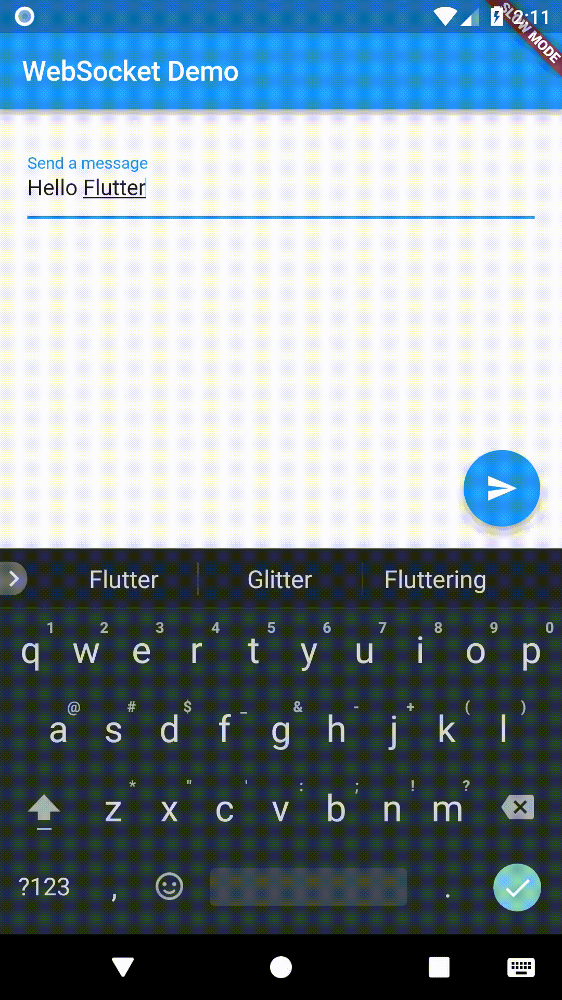

# Ağ İletişimi (Networking)

## Platformlar arası http ağ iletişimi

`http` paketi, http istekleri göndermenin en basit yolunu sağlar. Bu paket Android, iOS, macOS, Windows, Linux ve web üzerinde desteklenmektedir.

### Platform notları

Bazı platformlar, aşağıda ayrıntılı olarak açıklandığı gibi ek adımlar gerektirir.

#### Android

Android uygulamaları, Android bildirim dosyasında (`AndroidManifest.xml`) internet kullanımlarını beyan etmelidir:

```xml
<manifest xmlns:android...>
 ...
 <uses-permission android:name="android.permission.INTERNET" />
 <application ...
</manifest>
```

#### macOS

macOS uygulamaları, ilgili `*.entitlements` dosyalarında ağ erişimine izin vermelidir.

```xml
<key>com.apple.security.network.client</key>
<true/>
```


# İnternetten veri çekme

http paketini kullanarak internet üzerinden veri nasıl çekilir.

Çoğu uygulama için internetten veri çekmek gereklidir. Şanslıyız ki Dart ve Flutter, bu tür işler için `http` paketi gibi araçlar sağlar.

> **Not**
> HTTP istekleri yapmak için doğrudan `dart:io` veya `dart:html` kullanmaktan kaçınmalısınız. Bu kütüphaneler platforma bağımlıdır ve tek bir uygulamaya bağlıdır.

Bu tarif (yöntem) aşağıdaki adımları kullanır:
1. `http` paketini ekleyin.
2. `http` paketini kullanarak bir ağ isteği yapın.
3. Yanıtı özel bir Dart nesnesine dönüştürün.
4. Veriyi çekin ve Flutter ile görüntüleyin.

## 1. `http` paketini ekleyin

`http` paketi, internetten veri çekmenin en basit yolunu sunar.
`http` paketini bir bağımlılık olarak eklemek için `flutter pub add` komutunu çalıştırın:

```bash
flutter pub add http
```

http paketini içe aktarın (import edin).

```dart
import 'package:http/http.dart' as http;
```

Eğer Android'e dağıtım yapıyorsanız, İnternet iznini eklemek için `AndroidManifest.xml` dosyanızı düzenleyin.

```xml
<uses-permission android:name="android.permission.INTERNET" />
```

Aynı şekilde, eğer macOS'e dağıtım yapıyorsanız, ağ istemcisi yetkisini dahil etmek için `macos/Runner/DebugProfile.entitlements` ve `macos/Runner/Release.entitlements` dosyalarınızı düzenleyin.

```xml
<key>com.apple.security.network.client</key>
<true/>
```

## 2. Bir ağ isteği yapın

Bu tarif, `http.get()` metodunu kullanarak JSONPlaceholder'dan örnek bir albümün nasıl çekileceğini kapsar.

```dart
Future<http.Response> fetchAlbum() {
  return http.get(Uri.parse('[https://jsonplaceholder.typicode.com/albums/1](https://jsonplaceholder.typicode.com/albums/1)'));
}
```

`http.get()` metodu, bir `Response` (Yanıt) içeren bir `Future` döndürür.

* `Future`, asenkron işlemlerle çalışmak için temel bir Dart sınıfıdır. Bir Future nesnesi, gelecekte bir zamanda mevcut olacak potansiyel bir değeri veya hatayı temsil eder.
* `http.Response` sınıfı, başarılı bir http çağrısından alınan verileri içerir.

## 3. Yanıtı özel bir Dart nesnesine dönüştürün

Bir ağ isteği yapmak kolay olsa da, ham bir `Future<http.Response>` ile çalışmak çok uygun değildir. İşinizi kolaylaştırmak için `http.Response`'u bir Dart nesnesine dönüştürün.

### Bir `Album` sınıfı oluşturun

İlk olarak, ağ isteğinden gelen verileri içeren bir `Album` sınıfı oluşturun. Bu sınıf, JSON'dan bir `Album` oluşturan bir `factory` kurucusu (constructor) içerir.

JSON'u `desen eşleştirme` (pattern matching) kullanarak dönüştürmek sadece bir seçenektir. Daha fazla bilgi için "JSON ve serileştirme" hakkındaki tam makaleye bakın.

```dart
class Album {
  final int userId;
  final int id;
  final String title;

  const Album({required this.userId, required this.id, required this.title});

  factory Album.fromJson(Map<String, dynamic> json) {
    return switch (json) {
      {'userId': int userId, 'id': int id, 'title': String title} => Album(
        userId: userId,
        id: id,
        title: title,
      ),
      _ => throw const FormatException('Albüm yüklenemedi.'),
    };
  }
}
```

### `http.Response`'u bir `Album`'e dönüştürün

Şimdi, `fetchAlbum()` fonksiyonunu bir `Future<Album>` döndürecek şekilde güncellemek için aşağıdaki adımları kullanın:

1. Yanıt gövdesini `dart:convert` paketi ile bir JSON `Map`'e dönüştürün.
2. Eğer sunucu 200 durum kodu ile bir OK (Tamam) yanıtı dönerse, `fromJson()` factory metodunu kullanarak JSON `Map`'i bir `Album`'e dönüştürün.
3. Eğer sunucu 200 durum kodu ile bir OK yanıtı dönmezse, bir istisna (exception) fırlatın. (Bir "404 Not Found" sunucu yanıtı durumunda bile bir istisna fırlatın. `null` döndürmeyin. Bu, aşağıda gösterildiği gibi `snapshot` içindeki veriyi incelerken önemlidir.)

```dart
Future<Album> fetchAlbum() async {
  final response = await http.get(
    Uri.parse('[https://jsonplaceholder.typicode.com/albums/1](https://jsonplaceholder.typicode.com/albums/1)'),
  );

  if (response.statusCode == 200) {
    // Sunucu 200 OK yanıtı dönerse,
    // JSON'u ayrıştırın.
    return Album.fromJson(jsonDecode(response.body) as Map<String, dynamic>);
  } else {
    // Sunucu 200 OK yanıtı dönmezse,
    // bir istisna fırlatın.
    throw Exception('Albüm yüklenemedi');
  }
}
```

Yaşasın! Artık internetten bir albüm çeken bir fonksiyonunuz var.

## 4. Veriyi çekin

`fetchAlbum()` metodunu `initState()` veya `didChangeDependencies()` metodunun içinde çağırın.

`initState()` metodu tam olarak bir kez çağrılır ve bir daha asla çağrılmaz. Eğer bir `InheritedWidget` değiştiğinde API'yi yeniden yükleme seçeneğine sahip olmak istiyorsanız, çağrıyı `didChangeDependencies()` metodunun içine koyun. Daha fazla detay için `State` dokümantasyonuna bakın.

```dart
class _MyAppState extends State<MyApp> {
  late Future<Album> futureAlbum;

  @override
  void initState() {
    super.initState();
    futureAlbum = fetchAlbum();
  }
  // ···
}
```

Bu Future bir sonraki adımda kullanılacaktır.

## 5. Veriyi görüntüleyin

Veriyi ekranda görüntülemek için `FutureBuilder` widget'ını kullanın. `FutureBuilder` widget'ı Flutter ile birlikte gelir ve asenkron veri kaynaklarıyla çalışmayı kolaylaştırır.

İki parametre sağlamalısınız:

1. Çalışmak istediğiniz `Future`. Bu durumda, `fetchAlbum()` fonksiyonundan dönen future.
2. Flutter'a `Future`'ın durumuna (yükleniyor, başarılı veya hata) bağlı olarak ne render edeceğini söyleyen bir `builder` fonksiyonu.

`snapshot.hasData`'nın yalnızca snapshot null olmayan bir veri değeri içerdiğinde `true` döndürdüğüne dikkat edin.

`fetchAlbum` yalnızca null olmayan değerler döndürebildiği için, fonksiyon "404 Not Found" sunucu yanıtı durumunda bile bir istisna fırlatmalıdır. Bir istisna fırlatmak `snapshot.hasError` değerini `true` yapar, bu da bir hata mesajı görüntülemek için kullanılabilir.

Aksi takdirde, yükleme çarkı (spinner) görüntülenecektir.

```dart
FutureBuilder<Album>(
  future: futureAlbum,
  builder: (context, snapshot) {
    if (snapshot.hasData) {
      return Text(snapshot.data!.title);
    } else if (snapshot.hasError) {
      return Text('${snapshot.error}');
    }

    // Varsayılan olarak bir yükleme çarkı göster.
    return const CircularProgressIndicator();
  },
)
```

### Neden fetchAlbum() initState() içinde çağrılıyor?

Her ne kadar uygun olsa da, bir API çağrısını `build()` metodunun içine koymak önerilmez.

Flutter, görünümde herhangi bir şeyi değiştirmesi gerektiğinde `build()` metodunu çağırır ve bu şaşırtıcı derecede sık gerçekleşir. `fetchAlbum()` metodu eğer `build()` içine yerleştirilirse, her yeniden oluşturma (rebuild) işleminde tekrar tekrar çağrılır ve uygulamanın yavaşlamasına neden olur.

`fetchAlbum()` sonucunu bir durum (state) değişkeninde saklamak, `Future`'ın yalnızca bir kez çalıştırılmasını ve sonraki yeniden oluşturmalar için önbelleğe alınmasını sağlar.

## Test Etme

Bu işlevselliğin nasıl test edileceği hakkında bilgi için aşağıdaki tariflere bakın:

* Birim testine (Unit testing) giriş
* Mockito kullanarak bağımlılıkları taklit etme (Mocking)

## Tam Örnek

```dart
import 'dart:async';
import 'dart:convert';

import 'package:flutter/material.dart';
import 'package:http/http.dart' as http;

Future<Album> fetchAlbum() async {
  final response = await http.get(
    Uri.parse('[https://jsonplaceholder.typicode.com/albums/1](https://jsonplaceholder.typicode.com/albums/1)'),
  );

  if (response.statusCode == 200) {
    // Sunucu 200 OK yanıtı dönerse,
    // JSON'u ayrıştırın.
    return Album.fromJson(jsonDecode(response.body) as Map<String, dynamic>);
  } else {
    // Sunucu 200 OK yanıtı dönmezse,
    // bir istisna fırlatın.
    throw Exception('Albüm yüklenemedi');
  }
}

class Album {
  final int userId;
  final int id;
  final String title;

  const Album({required this.userId, required this.id, required this.title});

  factory Album.fromJson(Map<String, dynamic> json) {
    return switch (json) {
      {'userId': int userId, 'id': int id, 'title': String title} => Album(
        userId: userId,
        id: id,
        title: title,
      ),
      _ => throw const FormatException('Albüm yüklenemedi.'),
    };
  }
}

void main() => runApp(const MyApp());

class MyApp extends StatefulWidget {
  const MyApp({super.key});

  @override
  State<MyApp> createState() => _MyAppState();
}

class _MyAppState extends State<MyApp> {
  late Future<Album> futureAlbum;

  @override
  void initState() {
    super.initState();
    futureAlbum = fetchAlbum();
  }

  @override
  Widget build(BuildContext context) {
    return MaterialApp(
      title: 'Veri Çekme Örneği',
      theme: ThemeData(
        colorScheme: ColorScheme.fromSeed(seedColor: Colors.deepPurple),
      ),
      home: Scaffold(
        appBar: AppBar(title: const Text('Veri Çekme Örneği')),
        body: Center(
          child: FutureBuilder<Album>(
            future: futureAlbum,
            builder: (context, snapshot) {
              if (snapshot.hasData) {
                return Text(snapshot.data!.title);
              } else if (snapshot.hasError) {
                return Text('${snapshot.error}');
              }

              // Varsayılan olarak bir yükleme çarkı göster.
              return const CircularProgressIndicator();
            },
          ),
        ),
      ),
    );
  }
}
```


# Kimlik doğrulamalı istekler yapma (Make authenticated requests)

Bir web servisinden yetkilendirilmiş veriler nasıl getirilir.

Çoğu web servisinden veri getirmek için yetkilendirme (authorization) sağlamanız gerekir. Bunu yapmanın birçok yolu vardır, ancak belki de en yaygını `Authorization` HTTP başlığını kullanmaktır.

## Yetkilendirme başlıkları ekleme

`http` paketi, isteklerinize başlık eklemek için uygun bir yol sağlar. Alternatif olarak, `dart:io` kütüphanesinden `HttpHeaders` sınıfını kullanın.

```dart
final response = await http.get(
  Uri.parse('[https://jsonplaceholder.typicode.com/albums/1](https://jsonplaceholder.typicode.com/albums/1)'),
  // Arka uca (backend) yetkilendirme başlıklarını gönderin.
  headers: {HttpHeaders.authorizationHeader: 'Basic your_api_token_here'},
);
```

## Tam örnek

Bu örnek, **İnternetten veri getirme** tarifi üzerine kurulmuştur.

```dart
import 'dart:async';
import 'dart:convert';
import 'dart:io';

import 'package:http/http.dart' as http;

Future<Album> fetchAlbum() async {
  final response = await http.get(
    Uri.parse('[https://jsonplaceholder.typicode.com/albums/1](https://jsonplaceholder.typicode.com/albums/1)'),
    // Arka uca yetkilendirme başlıklarını gönderin.
    headers: {HttpHeaders.authorizationHeader: 'Basic your_api_token_here'},
  );
  final responseJson = jsonDecode(response.body) as Map<String, dynamic>;

  return Album.fromJson(responseJson);
}

class Album {
  final int userId;
  final int id;
  final String title;

  const Album({required this.userId, required this.id, required this.title});

  factory Album.fromJson(Map<String, dynamic> json) {
    return switch (json) {
      {'userId': int userId, 'id': int id, 'title': String title} => Album(
        userId: userId,
        id: id,
        title: title,
      ),
      _ => throw const FormatException('Albüm yüklenemedi.'),
    };
  }
}
```


# İnternete veri gönderme

http paketini kullanarak internet üzerinden veri nasıl gönderilir.

Çoğu uygulama için internete veri göndermek gereklidir. `http` paketi bu ihtiyacı da karşılar.

Bu tarif (yöntem) aşağıdaki adımları kullanır:
1. `http` paketini ekleyin.
2. `http` paketini kullanarak bir sunucuya veri gönderin.
3. Yanıtı özel bir Dart nesnesine dönüştürün.
4. Kullanıcı girişinden bir `title` (başlık) alın.
5. Yanıtı ekranda görüntüleyin.

## 1. `http` paketini ekleyin

`http` paketini bir bağımlılık olarak eklemek için `flutter pub add` komutunu çalıştırın:

```bash
flutter pub add http
```

`http` paketini içe aktarın (import edin).

```dart
import 'package:http/http.dart' as http;
```

Eğer Android'e dağıtım yapıyorsanız, İnternet iznini eklemek için `AndroidManifest.xml` dosyanızı düzenleyin.

```xml
<uses-permission android:name="android.permission.INTERNET" />
```

Aynı şekilde, eğer macOS'e dağıtım yapıyorsanız, ağ istemcisi yetkisini dahil etmek için `macos/Runner/DebugProfile.entitlements` ve `macos/Runner/Release.entitlements` dosyalarınızı düzenleyin.

```xml
<key>com.apple.security.network.client</key>
<true/>
```

## 2. Sunucuya veri gönderme

Bu tarif, `http.post()` metodunu kullanarak JSONPlaceholder'a bir albüm başlığı göndererek nasıl bir `Album` oluşturulacağını kapsar.

Veriyi kodlamak için `jsonEncode`'a erişim sağlayan `dart:convert` kütüphanesini içe aktarın:

```dart
import 'dart:convert';
```

Kodlanmış veriyi göndermek için `http.post()` metodunu kullanın:

```dart
Future<http.Response> createAlbum(String title) {
  return http.post(
    Uri.parse('[https://jsonplaceholder.typicode.com/albums](https://jsonplaceholder.typicode.com/albums)'),
    headers: <String, String>{
      'Content-Type': 'application/json; charset=UTF-8',
    },
    body: jsonEncode(<String, String>{'title': title}),
  );
}
```

`http.post()` metodu, bir `Response` (Yanıt) içeren bir `Future` döndürür.

* `Future`, asenkron işlemlerle çalışmak için temel bir Dart sınıfıdır. Bir Future nesnesi, gelecekte bir zamanda mevcut olacak potansiyel bir değeri veya hatayı temsil eder.
* `http.Response` sınıfı, başarılı bir http çağrısından alınan verileri içerir.
* `createAlbum()` metodu, sunucuya bir `Album` oluşturmak üzere gönderilen bir `title` argümanı alır.

## 3. `http.Response`'u özel bir Dart nesnesine dönüştürme

Bir ağ isteği yapmak kolay olsa da, ham bir `Future<http.Response>` ile çalışmak çok uygun değildir. İşinizi kolaylaştırmak için `http.Response`'u bir Dart nesnesine dönüştürün.

### Bir Album sınıfı oluşturun

İlk olarak, ağ isteğinden gelen verileri içeren bir `Album` sınıfı oluşturun. Bu sınıf, JSON'dan bir `Album` oluşturan bir `factory` kurucusu (constructor) içerir.

JSON'u `desen eşleştirme` (pattern matching) ile dönüştürmek sadece bir seçenektir. Daha fazla bilgi için "JSON ve serileştirme" hakkındaki tam makaleye bakın.

```dart
class Album {
  final int id;
  final String title;

  const Album({required this.id, required this.title});

  factory Album.fromJson(Map<String, dynamic> json) {
    return switch (json) {
      {'id': int id, 'title': String title} => Album(id: id, title: title),
      _ => throw const FormatException('Albüm yüklenemedi.'),
    };
  }
}
```

### `http.Response`'u bir `Album`'e dönüştürün

`createAlbum()` fonksiyonunu bir `Future<Album>` döndürecek şekilde güncellemek için aşağıdaki adımları kullanın:

1. Yanıt gövdesini `dart:convert` paketi ile bir JSON `Map`'e dönüştürün.
2. Eğer sunucu 201 durum kodu ile bir `CREATED` (Oluşturuldu) yanıtı dönerse, `fromJson()` factory metodunu kullanarak JSON `Map`'i bir `Album`'e dönüştürün.
3. Eğer sunucu 201 durum kodu ile bir `CREATED` yanıtı dönmezse, bir istisna (exception) fırlatın. (Bir "404 Not Found" sunucu yanıtı durumunda bile bir istisna fırlatın. `null` döndürmeyin. Bu, aşağıda gösterildiği gibi `snapshot` içindeki veriyi incelerken önemlidir.)

```dart
Future<Album> createAlbum(String title) async {
  final response = await http.post(
    Uri.parse('[https://jsonplaceholder.typicode.com/albums](https://jsonplaceholder.typicode.com/albums)'),
    headers: <String, String>{
      'Content-Type': 'application/json; charset=UTF-8',
    },
    body: jsonEncode(<String, String>{'title': title}),
  );

  if (response.statusCode == 201) {
    // Sunucu 201 CREATED yanıtı dönerse,
    // JSON'u ayrıştırın.
    return Album.fromJson(jsonDecode(response.body) as Map<String, dynamic>);
  } else {
    // Sunucu 201 CREATED yanıtı dönmezse,
    // bir istisna fırlatın.
    throw Exception('Albüm oluşturulamadı.');
  }
}
```

Yaşasın! Artık bir albüm oluşturmak için sunucuya başlık gönderen bir fonksiyonunuz var.

## 4. Kullanıcı girişinden bir başlık alın

Ardından, bir başlık girmek için bir `TextField` ve veriyi sunucuya göndermek için bir `ElevatedButton` oluşturun. Ayrıca kullanıcı girişini `TextField`'dan okumak için bir `TextEditingController` tanımlayın.

`ElevatedButton`'a basıldığında, `_futureAlbum`, `createAlbum()` metodu tarafından döndürülen değere ayarlanır.

```dart
Column(
  mainAxisAlignment: MainAxisAlignment.center,
  children: <Widget>[
    TextField(
      controller: _controller,
      decoration: const InputDecoration(hintText: 'Başlık Girin'),
    ),
    ElevatedButton(
      onPressed: () {
        setState(() {
          _futureAlbum = createAlbum(_controller.text);
        });
      },
      child: const Text('Veri Oluştur'),
    ),
  ],
)
```

`Veri Oluştur` düğmesine basıldığında, `TextField` içindeki veriyi sunucuya bir `POST` isteği olarak gönderen ağ isteğini yapın. `Future` olan `_futureAlbum`, bir sonraki adımda kullanılır.

## 5. Yanıtı ekranda görüntüleyin

Veriyi ekranda görüntülemek için `FutureBuilder` widget'ını kullanın. `FutureBuilder` widget'ı Flutter ile birlikte gelir ve asenkron veri kaynaklarıyla çalışmayı kolaylaştırır. İki parametre sağlamalısınız:

1. Çalışmak istediğiniz `Future`. Bu durumda, `createAlbum()` fonksiyonundan dönen future.
2. Flutter'a `Future`'ın durumuna (yükleniyor, başarılı veya hata) bağlı olarak ne render edeceğini söyleyen bir `builder` fonksiyonu.

`snapshot.hasData`'nın yalnızca snapshot null olmayan bir veri değeri içerdiğinde `true` döndürdüğüne dikkat edin. Bu nedenle `createAlbum()` fonksiyonu, bir "404 Not Found" sunucu yanıtı durumunda bile bir istisna fırlatmalıdır. Eğer `createAlbum()` `null` döndürürse, `CircularProgressIndicator` sonsuza kadar görüntülenir.

```dart
FutureBuilder<Album>(
  future: _futureAlbum,
  builder: (context, snapshot) {
    if (snapshot.hasData) {
      return Text(snapshot.data!.title);
    } else if (snapshot.hasError) {
      return Text('${snapshot.error}');
    }

    return const CircularProgressIndicator();
  },
)
```

## Tam Örnek

```dart
import 'dart:async';
import 'dart:convert';

import 'package:flutter/material.dart';
import 'package:http/http.dart' as http;

Future<Album> createAlbum(String title) async {
  final response = await http.post(
    Uri.parse('[https://jsonplaceholder.typicode.com/albums](https://jsonplaceholder.typicode.com/albums)'),
    headers: <String, String>{
      'Content-Type': 'application/json; charset=UTF-8',
    },
    body: jsonEncode(<String, String>{'title': title}),
  );

  if (response.statusCode == 201) {
    // Sunucu 201 CREATED yanıtı dönerse,
    // JSON'u ayrıştırın.
    return Album.fromJson(jsonDecode(response.body) as Map<String, dynamic>);
  } else {
    // Sunucu 201 CREATED yanıtı dönmezse,
    // bir istisna fırlatın.
    throw Exception('Albüm oluşturulamadı.');
  }
}

class Album {
  final int id;
  final String title;

  const Album({required this.id, required this.title});

  factory Album.fromJson(Map<String, dynamic> json) {
    return switch (json) {
      {'id': int id, 'title': String title} => Album(id: id, title: title),
      _ => throw const FormatException('Albüm yüklenemedi.'),
    };
  }
}

void main() {
  runApp(const MyApp());
}

class MyApp extends StatefulWidget {
  const MyApp({super.key});

  @override
  State<MyApp> createState() {
    return _MyAppState();
  }
}

class _MyAppState extends State<MyApp> {
  final TextEditingController _controller = TextEditingController();
  Future<Album>? _futureAlbum;

  @override
  Widget build(BuildContext context) {
    return MaterialApp(
      title: 'Veri Oluşturma Örneği',
      theme: ThemeData(
        colorScheme: ColorScheme.fromSeed(seedColor: Colors.deepPurple),
      ),
      home: Scaffold(
        appBar: AppBar(title: const Text('Veri Oluşturma Örneği')),
        body: Container(
          alignment: Alignment.center,
          padding: const EdgeInsets.all(8),
          child: (_futureAlbum == null) ? buildColumn() : buildFutureBuilder(),
        ),
      ),
    );
  }

  Column buildColumn() {
    return Column(
      mainAxisAlignment: MainAxisAlignment.center,
      children: <Widget>[
        TextField(
          controller: _controller,
          decoration: const InputDecoration(hintText: 'Başlık Girin'),
        ),
        ElevatedButton(
          onPressed: () {
            setState(() {
              _futureAlbum = createAlbum(_controller.text);
            });
          },
          child: const Text('Veri Oluştur'),
        ),
      ],
    );
  }

  FutureBuilder<Album> buildFutureBuilder() {
    return FutureBuilder<Album>(
      future: _futureAlbum,
      builder: (context, snapshot) {
        if (snapshot.hasData) {
          return Text(snapshot.data!.title);
        } else if (snapshot.hasError) {
          return Text('${snapshot.error}');
        }

        return const CircularProgressIndicator();
      },
    );
  }
}
```


# Verileri internet üzerinden güncelleme

İnternet üzerinden verileri güncellemek için `http` paketinin kullanımı.

Verileri internet üzerinden güncellemek çoğu uygulama için gereklidir. `http` paketi bu işi halleder!

Bu tarif aşağıdaki adımları kullanır:

1.  `http` paketini ekleyin.
2.  `http` paketini kullanarak verileri internet üzerinden güncelleyin.
3.  Yanıtı özel bir Dart nesnesine dönüştürün.
4.  Verileri internetten alın.
5.  Kullanıcı girdisinden mevcut `title` (başlık) bilgisini güncelleyin.
6.  Yanıtı güncelleyin ve ekranda görüntüleyin.

## 1. `http` paketini ekleyin

`http` paketini bağımlılık olarak eklemek için `flutter pub add` komutunu çalıştırın:

```bash
flutter pub add http
```

`http` paketini içe aktarın (import).

```dart
import 'package:http/http.dart' as http;
```

Android'e dağıtım yapıyorsanız, İnternet iznini eklemek için `AndroidManifest.xml` dosyanızı düzenleyin.

```xml
<uses-permission android:name="android.permission.INTERNET" />
```

Benzer şekilde, macOS'e dağıtım yapıyorsanız, ağ istemcisi yetkisini eklemek için `macos/Runner/DebugProfile.entitlements` ve `macos/Runner/Release.entitlements` dosyalarınızı düzenleyin.

```xml
<key>com.apple.security.network.client</key>
<true/>
```

## 2. `http` paketini kullanarak verileri internet üzerinden güncelleme

Bu tarif, `http.put()` yöntemini kullanarak **JSONPlaceholder** üzerindeki bir albüm başlığının nasıl güncelleneceğini kapsar.

```dart
Future<http.Response> updateAlbum(String title) {
  return http.put(
    Uri.parse('[https://jsonplaceholder.typicode.com/albums/1](https://jsonplaceholder.typicode.com/albums/1)'),
    headers: <String, String>{
      'Content-Type': 'application/json; charset=UTF-8',
    },
    body: jsonEncode(<String, String>{'title': title}),
  );
}
```

`http.put()` yöntemi, bir `Response` (Yanıt) içeren bir `Future` döndürür.

* `Future`, asenkron işlemlerle çalışmak için temel bir Dart sınıfıdır. Bir `Future` nesnesi, gelecekte bir zamanda mevcut olacak potansiyel bir değeri veya hatayı temsil eder.
* `http.Response` sınıfı, başarılı bir http çağrısından alınan verileri içerir.
* `updateAlbum()` yöntemi, `Album`ü güncellemek üzere sunucuya gönderilen `title` argümanını alır.

## 3. `http.Response` yanıtını özel bir Dart nesnesine dönüştürün

Bir ağ isteği yapmak kolay olsa da, ham bir `Future<http.Response>` ile çalışmak pek uygun değildir. İşinizi kolaylaştırmak için `http.Response`'ı bir Dart nesnesine dönüştürün.

### Bir Albüm (Album) sınıfı oluşturun

İlk olarak, ağ isteğinden gelen verileri içeren bir `Album` sınıfı oluşturun. Bu sınıf, JSON'dan bir `Album` oluşturan bir fabrika (factory) kurucusu içerir.

JSON'ı **desen eşleştirme (pattern matching)** ile dönüştürmek sadece bir seçenektir. Daha fazla bilgi için **JSON ve serileştirme** hakkındaki tam makaleye bakın.

```dart
class Album {
  final int id;
  final String title;

  const Album({required this.id, required this.title});

  factory Album.fromJson(Map<String, dynamic> json) {
    return switch (json) {
      {'id': int id, 'title': String title} => Album(id: id, title: title),
      _ => throw const FormatException('Albüm yüklenemedi.'),
    };
  }
}
```

### `http.Response`'ı bir `Album` nesnesine dönüştürün

Şimdi, `updateAlbum()` işlevini bir `Future<Album>` döndürecek şekilde güncellemek için aşağıdaki adımları kullanın:

1. `dart:convert` paketi ile yanıt gövdesini (response body) bir JSON `Map`'e dönüştürün.
2. Sunucu 200 durum koduyla bir **GÜNCELLENDİ** (UPDATED) yanıtı döndürürse, `fromJson()` fabrika yöntemini kullanarak JSON `Map`'i bir `Album`'e dönüştürün.
3. Sunucu 200 durum koduyla bir **GÜNCELLENDİ** yanıtı döndürmezse, bir istisna (exception) fırlatın. ("404 Bulunamadı" sunucu yanıtı durumunda bile bir istisna fırlatın. `null` döndürmeyin. Bu, aşağıda gösterildiği gibi `snapshot` içindeki verileri incelerken önemlidir.)

```dart
Future<Album> updateAlbum(String title) async {
  final response = await http.put(
    Uri.parse('[https://jsonplaceholder.typicode.com/albums/1](https://jsonplaceholder.typicode.com/albums/1)'),
    headers: <String, String>{
      'Content-Type': 'application/json; charset=UTF-8',
    },
    body: jsonEncode(<String, String>{'title': title}),
  );

  if (response.statusCode == 200) {
    // Sunucu 200 OK yanıtı döndürdüyse,
    // JSON'ı ayrıştırın.
    return Album.fromJson(jsonDecode(response.body) as Map<String, dynamic>);
  } else {
    // Sunucu 200 OK yanıtı döndürmediyse,
    // bir istisna fırlatın.
    throw Exception('Albüm güncellenemedi.');
  }
}
```


## Verileri internetten alın

Verileri güncellemeden önce internetten alın. Tam bir örnek için **Veri getirme (Fetch data)** tarifine bakın.

```dart
Future<Album> fetchAlbum() async {
  final response = await http.get(
    Uri.parse('[https://jsonplaceholder.typicode.com/albums/1](https://jsonplaceholder.typicode.com/albums/1)'),
  );

  if (response.statusCode == 200) {
    // Sunucu 200 OK yanıtı döndürdüyse,
    // JSON'ı ayrıştırın.
    return Album.fromJson(jsonDecode(response.body) as Map<String, dynamic>);
  } else {
    // Sunucu 200 OK yanıtı döndürmediyse,
    // bir istisna fırlatın.
    throw Exception('Albüm yüklenemedi');
  }
}
```

İdeal olarak, verileri internetten getirmek için `initState` sırasında `_futureAlbum`'ü ayarlamak üzere bu yöntemi kullanacaksınız.

## 4. Kullanıcı girdisinden mevcut başlığı güncelleyin

Bir başlık girmek için `TextField` ve sunucudaki verileri güncellemek için bir `ElevatedButton` oluşturun. Ayrıca kullanıcı girdisini `TextField`'dan okumak için bir `TextEditingController` tanımlayın.

`ElevatedButton`'a basıldığında, `_futureAlbum`, `updateAlbum()` yöntemi tarafından döndürülen değere ayarlanır.

```dart
Column(
  mainAxisAlignment: MainAxisAlignment.center,
  children: <Widget>[
    Padding(
      padding: const EdgeInsets.all(8),
      child: TextField(
        controller: _controller,
        decoration: const InputDecoration(hintText: 'Başlık Girin'),
      ),
    ),
    ElevatedButton(
      onPressed: () {
        setState(() {
          _futureAlbum = updateAlbum(_controller.text);
        });
      },
      child: const Text('Veriyi Güncelle'),
    ),
  ],
);
```

**Veriyi Güncelle** düğmesine basıldığında, bir ağ isteği `TextField`'daki verileri sunucuya `PUT` isteği olarak gönderir. `_futureAlbum` değişkeni bir sonraki adımda kullanılır.

## 5. Yanıtı ekranda görüntüleyin

Verileri ekranda görüntülemek için `FutureBuilder` widget'ını kullanın. `FutureBuilder` widget'ı Flutter ile birlikte gelir ve asenkron veri kaynaklarıyla çalışmayı kolaylaştırır. İki parametre sağlamanız gerekir:

1. Çalışmak istediğiniz `Future`. Bu durumda, `updateAlbum()` işlevinden döndürülen future.
2. `Future`'ın durumuna (yükleniyor, başarılı veya hata) bağlı olarak Flutter'a neyi oluşturacağını söyleyen bir `builder` (oluşturucu) işlevi.

`snapshot.hasData`'nın yalnızca anlık görüntü (snapshot) null olmayan bir veri değeri içerdiğinde `true` döndürdüğünü unutmayın. Bu nedenle `updateAlbum` işlevi, "404 Bulunamadı" sunucu yanıtı durumunda bile bir istisna fırlatmalıdır. `updateAlbum` `null` döndürürse, `CircularProgressIndicator` süresiz olarak görüntülenir.

```dart
FutureBuilder<Album>(
  future: _futureAlbum,
  builder: (context, snapshot) {
    if (snapshot.hasData) {
      return Text(snapshot.data!.title);
    } else if (snapshot.hasError) {
      return Text('${snapshot.error}');
    }

    return const CircularProgressIndicator();
  },
);
```

## Tam örnek

```dart
import 'dart:async';
import 'dart:convert';

import 'package:flutter/material.dart';
import 'package:http/http.dart' as http;

Future<Album> fetchAlbum() async {
  final response = await http.get(
    Uri.parse('[https://jsonplaceholder.typicode.com/albums/1](https://jsonplaceholder.typicode.com/albums/1)'),
  );

  if (response.statusCode == 200) {
    // Sunucu 200 OK yanıtı döndürdüyse,
    // JSON'ı ayrıştırın.
    return Album.fromJson(jsonDecode(response.body) as Map<String, dynamic>);
  } else {
    // Sunucu 200 OK yanıtı döndürmediyse,
    // bir istisna fırlatın.
    throw Exception('Albüm yüklenemedi');
  }
}

Future<Album> updateAlbum(String title) async {
  final response = await http.put(
    Uri.parse('[https://jsonplaceholder.typicode.com/albums/1](https://jsonplaceholder.typicode.com/albums/1)'),
    headers: <String, String>{
      'Content-Type': 'application/json; charset=UTF-8',
    },
    body: jsonEncode(<String, String>{'title': title}),
  );

  if (response.statusCode == 200) {
    // Sunucu 200 OK yanıtı döndürdüyse,
    // JSON'ı ayrıştırın.
    return Album.fromJson(jsonDecode(response.body) as Map<String, dynamic>);
  } else {
    // Sunucu 200 OK yanıtı döndürmediyse,
    // bir istisna fırlatın.
    throw Exception('Albüm güncellenemedi.');
  }
}

class Album {
  final int id;
  final String title;

  const Album({required this.id, required this.title});

  factory Album.fromJson(Map<String, dynamic> json) {
    return switch (json) {
      {'id': int id, 'title': String title} => Album(id: id, title: title),
      _ => throw const FormatException('Albüm yüklenemedi.'),
    };
  }
}

void main() {
  runApp(const MyApp());
}

class MyApp extends StatefulWidget {
  const MyApp({super.key});

  @override
  State<MyApp> createState() {
    return _MyAppState();
  }
}

class _MyAppState extends State<MyApp> {
  final TextEditingController _controller = TextEditingController();
  late Future<Album> _futureAlbum;

  @override
  void initState() {
    super.initState();
    _futureAlbum = fetchAlbum();
  }

  @override
  Widget build(BuildContext context) {
    return MaterialApp(
      title: 'Veri Güncelleme Örneği',
      theme: ThemeData(
        colorScheme: ColorScheme.fromSeed(seedColor: Colors.deepPurple),
      ),
      home: Scaffold(
        appBar: AppBar(title: const Text('Veri Güncelleme Örneği')),
        body: Container(
          alignment: Alignment.center,
          padding: const EdgeInsets.all(8),
          child: FutureBuilder<Album>(
            future: _futureAlbum,
            builder: (context, snapshot) {
              if (snapshot.connectionState == ConnectionState.done) {
                if (snapshot.hasData) {
                  return Column(
                    mainAxisAlignment: MainAxisAlignment.center,
                    children: <Widget>[
                      Text(snapshot.data!.title),
                      TextField(
                        controller: _controller,
                        decoration: const InputDecoration(
                          hintText: 'Başlık Girin',
                        ),
                      ),
                      ElevatedButton(
                        onPressed: () {
                          setState(() {
                            _futureAlbum = updateAlbum(_controller.text);
                          });
                        },
                        child: const Text('Veriyi Güncelle'),
                      ),
                    ],
                  );
                } else if (snapshot.hasError) {
                  return Text('${snapshot.error}');
                }
              }

              return const CircularProgressIndicator();
            },
          ),
        ),
      ),
    );
  }
}
```


# İnternet üzerindeki veriyi silme

`http` paketini kullanarak internet üzerindeki veri nasıl silinir.

Bu tarif (yöntem), `http` paketini kullanarak internet üzerinden verilerin nasıl silineceğini kapsar.

Bu tarif aşağıdaki adımları kullanır:
1. `http` paketini ekleyin.
2. Sunucudaki veriyi silin.
3. Ekranı güncelleyin.

## 1. `http` paketini ekleyin

`http` paketini bir bağımlılık olarak eklemek için `flutter pub add` komutunu çalıştırın:

```bash
flutter pub add http
```

`http` paketini içe aktarın (import edin).

```dart
import 'package:http/http.dart' as http;
```

Eğer Android'e dağıtım yapıyorsanız, İnternet iznini eklemek için `AndroidManifest.xml` dosyanızı düzenleyin.

```xml
<uses-permission android:name="android.permission.INTERNET" />
```

Aynı şekilde, eğer macOS'e dağıtım yapıyorsanız, ağ istemcisi yetkisini dahil etmek için `macos/Runner/DebugProfile.entitlements` ve `macos/Runner/Release.entitlements` dosyalarınızı düzenleyin.

```xml
<key>com.apple.security.network.client</key>
<true/>
```

## 2. Sunucudaki veriyi silin

Bu tarif, `http.delete()` metodunu kullanarak JSONPlaceholder'dan bir albümün nasıl silineceğini kapsar. Bunun, silmek istediğiniz albümün `id`'sini gerektirdiğini unutmayın. Bu örnek için, halihazırda bildiğiniz bir şeyi kullanın, örneğin `id = 1`.

```dart
Future<http.Response> deleteAlbum(String id) async {
  final http.Response response = await http.delete(
    Uri.parse('[https://jsonplaceholder.typicode.com/albums/$id](https://jsonplaceholder.typicode.com/albums/$id)'),
    headers: <String, String>{
      'Content-Type': 'application/json; charset=UTF-8',
    },
  );

  return response;
}
```

`http.delete()` metodu, bir `Response` (Yanıt) içeren bir `Future` döndürür.

* `Future`, asenkron işlemlerle çalışmak için temel bir Dart sınıfıdır. Bir Future nesnesi, gelecekte bir zamanda mevcut olacak potansiyel bir değeri veya hatayı temsil eder.
* `http.Response` sınıfı, başarılı bir http çağrısından alınan verileri içerir.
* `deleteAlbum()` metodu, sunucudan silinecek veriyi tanımlamak için gereken bir `id` argümanı alır.

## 3. Ekranı güncelleyin

Verinin silinip silinmediğini kontrol etmek için, önce `http.get()` metodunu kullanarak JSONPlaceholder'dan veriyi çekin ve ekranda görüntüleyin. (Tam bir örnek için "Veri Çekme" tarifine bakın.) Artık basıldığında `deleteAlbum()` metodunu çağıran bir `Veriyi Sil` düğmesine sahip olmalısınız.

```dart
Column(
  mainAxisAlignment: MainAxisAlignment.center,
  children: <Widget>[
    Text(snapshot.data?.title ?? 'Silindi'),
    ElevatedButton(
      child: const Text('Veriyi Sil'),
      onPressed: () {
        setState(() {
          _futureAlbum = deleteAlbum(
            snapshot.data!.id.toString(),
          );
        });
      },
    ),
  ],
);
```

Şimdi, `Veriyi Sil` düğmesine tıkladığınızda `deleteAlbum()` metodu çağrılır ve ilettiğiniz id, internetten aldığınız verinin id'sidir. Bu, internetten çektiğiniz aynı veriyi sileceğiniz anlamına gelir.

### deleteAlbum() metodundan bir yanıt döndürme

Silme isteği yapıldıktan sonra, verinin silindiğini ekranımıza bildirmek için `deleteAlbum()` metodundan bir yanıt döndürebilirsiniz.

```dart
Future<Album> deleteAlbum(String id) async {
  final http.Response response = await http.delete(
    Uri.parse('[https://jsonplaceholder.typicode.com/albums/$id](https://jsonplaceholder.typicode.com/albums/$id)'),
    headers: <String, String>{
      'Content-Type': 'application/json; charset=UTF-8',
    },
  );

  if (response.statusCode == 200) {
    // Sunucu 200 OK yanıtı dönerse,
    // boş bir Album döndürün. Silme işleminden sonra,
    // boş bir JSON `{}` yanıtı alırsınız.
    // `null` döndürmeyin, aksi takdirde `snapshot.hasData`
    // `FutureBuilder` üzerinde her zaman false döner.
    return Album.empty();
  } else {
    // Sunucu "200 OK yanıtı" dönmezse,
    // bir istisna fırlatın.
    throw Exception('Albüm silinemedi.');
  }
}
```

`FutureBuilder()` artık bir yanıt aldığında yeniden oluşturulur (rebuild). İstek başarılı olduğunda yanıtın gövdesinde (body) herhangi bir veri olmayacağından, `Album.fromJson()` metodu varsayılan bir değere (bizim durumumuzda `null`) sahip bir `Album` nesnesi örneği oluşturur. Bu davranış dilediğiniz şekilde değiştirilebilir.

Hepsi bu kadar! Artık veriyi internetten silen bir fonksiyonunuz var.

## Tam Örnek

```dart
import 'dart:async';
import 'dart:convert';

import 'package:flutter/material.dart';
import 'package:http/http.dart' as http;

Future<Album> fetchAlbum() async {
  final response = await http.get(
    Uri.parse('[https://jsonplaceholder.typicode.com/albums/1](https://jsonplaceholder.typicode.com/albums/1)'),
  );

  if (response.statusCode == 200) {
    // Sunucu 200 OK yanıtı dönerse, JSON'u ayrıştırın.
    return Album.fromJson(jsonDecode(response.body) as Map<String, dynamic>);
  } else {
    // Sunucu 200 OK yanıtı dönmezse, bir istisna fırlatın.
    throw Exception('Albüm yüklenemedi');
  }
}

Future<Album> deleteAlbum(String id) async {
  final http.Response response = await http.delete(
    Uri.parse('[https://jsonplaceholder.typicode.com/albums/$id](https://jsonplaceholder.typicode.com/albums/$id)'),
    headers: <String, String>{
      'Content-Type': 'application/json; charset=UTF-8',
    },
  );

  if (response.statusCode == 200) {
    // Sunucu 200 OK yanıtı dönerse,
    // boş bir Album döndürün. Silme işleminden sonra,
    // boş bir JSON `{}` yanıtı alırsınız.
    // `null` döndürmeyin, aksi takdirde `snapshot.hasData`
    // `FutureBuilder` üzerinde her zaman false döner.
    return Album.empty();
  } else {
    // Sunucu "200 OK yanıtı" dönmezse,
    // bir istisna fırlatın.
    throw Exception('Albüm silinemedi.');
  }
}

class Album {
  int? id;
  String? title;

  Album({this.id, this.title});

  Album.empty();

  factory Album.fromJson(Map<String, dynamic> json) {
    return switch (json) {
      {'id': int id, 'title': String title} => Album(id: id, title: title),
      _ => throw const FormatException('Albüm yüklenemedi.'),
    };
  }
}

void main() {
  runApp(const MyApp());
}

class MyApp extends StatefulWidget {
  const MyApp({super.key});

  @override
  State<MyApp> createState() {
    return _MyAppState();
  }
}

class _MyAppState extends State<MyApp> {
  late Future<Album> _futureAlbum;

  @override
  void initState() {
    super.initState();
    _futureAlbum = fetchAlbum();
  }

  @override
  Widget build(BuildContext context) {
    return MaterialApp(
      title: 'Veri Silme Örneği',
      theme: ThemeData(
        colorScheme: ColorScheme.fromSeed(seedColor: Colors.deepPurple),
      ),
      home: Scaffold(
        appBar: AppBar(title: const Text('Veri Silme Örneği')),
        body: Center(
          child: FutureBuilder<Album>(
            future: _futureAlbum,
            builder: (context, snapshot) {
              // Bağlantı tamamlandıysa,
              // yanıt verisi veya hata olup olmadığını kontrol edin.
              if (snapshot.connectionState == ConnectionState.done) {
                if (snapshot.hasData) {
                  return Column(
                    mainAxisAlignment: MainAxisAlignment.center,
                    children: <Widget>[
                      Text(snapshot.data?.title ?? 'Silindi'),
                      ElevatedButton(
                        child: const Text('Veriyi Sil'),
                        onPressed: () {
                          setState(() {
                            _futureAlbum = deleteAlbum(
                              snapshot.data!.id.toString(),
                            );
                          });
                        },
                      ),
                    ],
                  );
                } else if (snapshot.hasError) {
                  return Text('${snapshot.error}');
                }
              }

              // Varsayılan olarak bir yükleme çarkı göster.
              return const CircularProgressIndicator();
            },
          ),
        ),
      ),
    );
  }
}
```


Aşağıda metnin Türkçe çevirisi ve Markdown formatındaki hali bulunmaktadır:

```markdown
# WebSockets ile İletişim Kurma

Bir web soketine nasıl bağlanılır.

Normal HTTP isteklerine ek olarak, **WebSockets** kullanarak sunuculara bağlanabilirsiniz. WebSockets, sürekli sorgulama (polling) yapmadan bir sunucuyla iki yönlü iletişime izin verir.


[Image of WebSocket bidirectional communication diagram]


Bu örnekte, Lob.com tarafından desteklenen bir **test WebSocket sunucusuna** bağlanacaksınız. Sunucu, gönderdiğiniz mesajın aynısını size geri gönderir. Bu tarif aşağıdaki adımları kullanır:

1.  Bir WebSocket sunucusuna bağlanın.
2.  Sunucudan gelen mesajları dinleyin.
3.  Sunucuya veri gönderin.
4.  WebSocket bağlantısını kapatın.

## 1. Bir WebSocket sunucusuna bağlanın

`web_socket_channel` paketi, bir WebSocket sunucusuna bağlanmak için ihtiyacınız olan araçları sağlar.

Paket, hem sunucudan gelen mesajları dinlemenizi hem de sunucuya mesaj göndermenizi sağlayan bir `WebSocketChannel` sunar.

Flutter'da, bir sunucuya bağlanan bir `WebSocketChannel` oluşturmak için aşağıdaki satırı kullanın:

```dart
final channel = WebSocketChannel.connect(
  Uri.parse('wss://echo.websocket.events'),
);
```

## 2. Sunucudan gelen mesajları dinleyin

Bağlantıyı kurduğunuza göre, şimdi sunucudan gelen mesajları dinleyin.

Test sunucusuna bir mesaj gönderdikten sonra, sunucu aynı mesajı geri gönderir.

Bu örnekte, yeni mesajları dinlemek için bir `StreamBuilder` widget'ı ve bunları görüntülemek için bir `Text` widget'ı kullanın.

```dart
StreamBuilder(
  stream: channel.stream,
  builder: (context, snapshot) {
    return Text(snapshot.hasData ? '${snapshot.data}' : '');
  },
),
```

### Bu nasıl çalışır?

* `WebSocketChannel`, sunucudan gelen mesajlardan oluşan bir `Stream` (Akış) sağlar.
* `Stream` sınıfı, `dart:async` paketinin temel bir parçasıdır. Bir veri kaynağından gelen asenkron olayları dinlemenin bir yolunu sağlar. Tek bir asenkron yanıt döndüren `Future`'ın aksine, `Stream` sınıfı zaman içinde birçok olay iletebilir.
* `StreamBuilder` widget'ı bir `Stream`'e bağlanır ve verilen `builder()` işlevini kullanarak her olay aldığında Flutter'dan yeniden oluşturulmasını (rebuild) ister.

## 3. Sunucuya veri gönderin

Sunucuya veri göndermek için, `WebSocketChannel` tarafından sağlanan `sink`'e (havuz) `add()` ile mesaj ekleyin.

```dart
channel.sink.add('Merhaba!');
```

### Bu nasıl çalışır?

* `WebSocketChannel`, sunucuya mesaj göndermek için bir `StreamSink` sağlar.
* `StreamSink` sınıfı, bir veri kaynağına senkron veya asenkron olaylar eklemek için genel bir yol sağlar.

## 4. WebSocket bağlantısını kapatın

WebSocket ile işiniz bittiğinde bağlantıyı kapatın:

```dart
channel.sink.close();
```

## Tam örnek

```dart
import 'package:flutter/material.dart';
import 'package:web_socket_channel/web_socket_channel.dart';

void main() => runApp(const MyApp());

class MyApp extends StatelessWidget {
  const MyApp({super.key});

  @override
  Widget build(BuildContext context) {
    const title = 'WebSocket Demosu';
    return const MaterialApp(
      title: title,
      home: MyHomePage(title: title),
    );
  }
}

class MyHomePage extends StatefulWidget {
  const MyHomePage({super.key, required this.title});

  final String title;

  @override
  State<MyHomePage> createState() => _MyHomePageState();
}

class _MyHomePageState extends State<MyHomePage> {
  final TextEditingController _controller = TextEditingController();
  final _channel = WebSocketChannel.connect(
    Uri.parse('wss://echo.websocket.events'),
  );

  @override
  Widget build(BuildContext context) {
    return Scaffold(
      appBar: AppBar(title: Text(widget.title)),
      body: Padding(
        padding: const EdgeInsets.all(20),
        child: Column(
          crossAxisAlignment: CrossAxisAlignment.start,
          children: [
            Form(
              child: TextFormField(
                controller: _controller,
                decoration: const InputDecoration(labelText: 'Bir mesaj gönder'),
              ),
            ),
            const SizedBox(height: 24),
            StreamBuilder(
              stream: _channel.stream,
              builder: (context, snapshot) {
                return Text(snapshot.hasData ? '${snapshot.data}' : '');
              },
            ),
          ],
        ),
      ),
      floatingActionButton: FloatingActionButton(
        onPressed: _sendMessage,
        tooltip: 'Mesaj gönder',
        child: const Icon(Icons.send),
      ),
    );
  }

  void _sendMessage() {
    if (_controller.text.isNotEmpty) {
      _channel.sink.add(_controller.text);
    }
  }

  @override
  void dispose() {
    _channel.sink.close();
    _controller.dispose();
    super.dispose();
  }
}
```





---
---

## 📄 Lisans Bilgisi

Bu doküman, **Flutter resmi dokümantasyonundan** türetilmiş Türkçe ders notudur.

**Orijinal kaynak:**  
https://docs.flutter.dev/data-and-backend/networking

**Türkçe çeviri ve düzenleme:**  
[Doç. Dr. Hakan Temiz](mailto:htemiz@artvin.edu.tr)

---

### Lisans Kapsamı

Bu dokümandaki içerikler aşağıdaki açık lisanslar kapsamında sunulmaktadır:

**Metin içerikleri (anlatım ve açıklamalar):**  
Flutter resmi dokümantasyonundan alınmış veya uyarlanmıştır.  
**Lisans:** Creative Commons Attribution 4.0 International (CC BY 4.0)  
https://creativecommons.org/licenses/by/4.0/

Bu lisans kapsamında:
- İçerik kopyalanabilir, dağıtılabilir ve uyarlanabilir  
- Ticari kullanım serbesttir  
- Kaynak belirtilmesi zorunludur  

**Kod örnekleri:**  
Flutter resmi dokümantasyonundan alınmış veya uyarlanmıştır.  
**Lisans:** BSD 3-Clause License  
https://opensource.org/licenses/BSD-3-Clause

Bu lisans kapsamında:
- Kodlar kopyalanabilir, değiştirilebilir ve dağıtılabilir  
- Ticari kullanım serbesttir  
- Lisans bildiriminin korunması gerekir  

---
---
