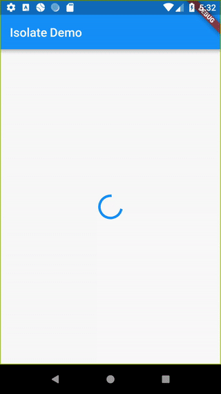

# JSON ve Serileştirme

Bir web sunucusuyla iletişim kurmaya veya bir noktada yapılandırılmış verileri kolayca depolamaya ihtiyaç duymayan bir mobil uygulama düşünmek zordur. Ağ bağlantılı uygulamalar yaparken, er ya da geç eski dostumuz JSON'ı tüketmesi gerekecektir.

Bu kılavuz, Flutter ile JSON kullanmanın yollarını inceler. Farklı senaryolarda hangi JSON çözümünün kullanılacağını ve nedenini kapsar.

## Terminoloji

**Kodlama (Encoding)** ve **serileştirme (serialization)** aynı şeydir; bir veri yapısını bir dizeye (string) dönüştürmek. **Kod çözme (Decoding)** ve **seri durumdan çıkarma (deserialization)** ise tam tersi süreçtir; bir dizeyi bir veri yapısına dönüştürmek. Bununla birlikte, **serileştirme** aynı zamanda veri yapılarının daha kolay okunabilir bir formata çevrilmesi ve bu formattan geri çevrilmesi sürecinin tamamını da ifade eder.


Karışıklığı önlemek için, bu belge genel sürece atıfta bulunurken "serileştirme", özellikle bu süreçlere atıfta bulunurken "kodlama" ve "kod çözme" terimlerini kullanır.

## Hangi JSON serileştirme yöntemi benim için doğru?

Bu makale, JSON ile çalışmak için iki genel stratejiyi kapsar:

1.  Manuel serileştirme
2.  Kod üretimi (code generation) kullanarak otomatik serileştirme

Farklı projeler farklı karmaşıklıklara ve kullanım durumlarına sahiptir. Daha küçük kavram kanıtlama (proof-of-concept) projeleri veya hızlı prototipler için kod oluşturucuları kullanmak aşırıya kaçmak olabilir. Daha fazla karmaşıklığa sahip birkaç JSON modeli olan uygulamalar için, elle kodlama yapmak hızla sıkıcı, tekrarlayıcı hale gelebilir ve birçok küçük hataya yol açabilir.

### Daha küçük projeler için manuel serileştirme kullanın

Manuel JSON kod çözme, `dart:convert` içindeki yerleşik JSON kod çözücüyü kullanmayı ifade eder. Ham JSON dizesini `jsonDecode()` işlevine iletmeyi ve ardından ortaya çıkan `Map<String, dynamic>` içinde ihtiyacınız olan değerleri aramayı içerir. Harici bir bağımlılığı veya özel bir kurulum süreci yoktur ve hızlı bir kavram kanıtı için iyidir.

Manuel kod çözme, projeniz büyüdüğünde iyi performans göstermez. Kod çözme mantığını elle yazmak, yönetilmesi zor ve hataya açık hale gelebilir. Var olmayan bir JSON alanına erişirken bir yazım hatası yaparsanız, kodunuz çalışma zamanında (runtime) bir hata fırlatır.

Projenizde çok fazla JSON modeliniz yoksa ve bir kavramı hızlıca test etmek istiyorsanız, manuel serileştirme başlamak isteyeceğiniz yol olabilir. Manuel kodlama örneği için **dart:convert kullanarak JSON'ı manuel olarak serileştirme** bölümüne bakın.

> **İpucu:** JSON'ı seri durumdan çıkarma konusunda uygulamalı pratik yapmak ve Dart 3'ün yeni özelliklerinden yararlanmak için **Dart'ın desenlerine ve kayıtlarına (patterns and records) dalış** codelab'ine göz atın.

### Orta ve büyük ölçekli projeler için kod üretimi kullanın

Kod üretimi ile JSON serileştirme, harici bir kütüphanenin sizin için kodlama şablonunu (boilerplate) oluşturması anlamına gelir. Bazı başlangıç ayarlarından sonra, model sınıflarınızdan kod üreten bir dosya izleyicisi (file watcher) çalıştırırsınız. Örneğin, `json_serializable` ve `built_value` bu tür kütüphanelerdir.

Bu yaklaşım daha büyük bir proje için iyi ölçeklenir. Elle yazılmış şablon kodlara gerek yoktur ve JSON alanlarına erişirken yapılan yazım hataları derleme zamanında (compile-time) yakalanır. Kod üretiminin dezavantajı, bazı başlangıç ayarları gerektirmesidir. Ayrıca, oluşturulan kaynak dosyaları proje gezgininizde görsel karmaşa yaratabilir.

Orta veya daha büyük bir projeniz olduğunda JSON serileştirme için oluşturulan kodu kullanmak isteyebilirsiniz. Kod üretimi tabanlı JSON kodlaması örneği için **Kod üretimi kütüphanelerini kullanarak JSON serileştirme** bölümüne bakın.

## Flutter'da GSON/Jackson/Moshi eşdeğeri var mı?

Basit cevap **hayır**.

Böyle bir kütüphane, Flutter'da devre dışı bırakılan çalışma zamanı **yansımasını (reflection)** kullanmayı gerektirir. Çalışma zamanı yansıması, Dart'ın uzun süredir desteklediği **tree shaking** (ölü kod temizleme) ile çakışır. Tree shaking ile, kullanılmayan kodları sürüm derlemelerinizden (release builds) "silkeleyip atabilirsiniz". Bu, uygulamanın boyutunu önemli ölçüde optimize eder.

Yansıma, varsayılan olarak tüm kodun dolaylı olarak kullanılmasına neden olduğundan, tree shaking işlemini zorlaştırır. Araçlar, çalışma zamanında hangi parçaların kullanılmadığını bilemez, bu nedenle gereksiz kodun çıkarılması zordur. Yansıma kullanıldığında uygulama boyutları kolayca optimize edilemez.

Flutter ile çalışma zamanı yansımasını kullanamasanız da, bazı kütüphaneler size benzer şekilde kullanımı kolay API'ler sunar ancak bunun yerine kod üretimine dayanır. Bu yaklaşım, **kod üretimi kütüphaneleri** bölümünde daha ayrıntılı olarak ele alınmaktadır.

## dart:convert kullanarak JSON'ı manuel olarak serileştirme

Flutter'da temel JSON serileştirme çok basittir. Flutter, basit bir JSON kodlayıcı ve kod çözücü içeren yerleşik bir `dart:convert` kütüphanesine sahiptir.

Aşağıdaki örnek JSON, basit bir kullanıcı modelini uygular.

```json
{
  "name": "John Smith",
  "email": "john@example.com"
}
```

`dart:convert` ile bu JSON modelini iki şekilde serileştirebilirsiniz.

### JSON'ı satır içi (inline) serileştirme

`dart:convert` belgelerine bakarak, JSON dizesini yöntem argümanı olarak vererek `jsonDecode()` işlevini çağırıp JSON'ın kodunu çözebileceğinizi göreceksiniz.

```dart
final user = jsonDecode(jsonString) as Map<String, dynamic>;

print('Selam, ${user['name']}!');
print('Doğrulama bağlantısını şuraya gönderdik: ${user['email']}.');
```

Ne yazık ki, `jsonDecode()`, `dynamic` döndürür, yani çalışma zamanına kadar değerlerin türlerini bilemezsiniz. Bu yaklaşımla, statik olarak yazılan dil özelliklerinin çoğunu kaybedersiniz: tür güvenliği, otomatik tamamlama ve en önemlisi derleme zamanı istisnaları. Kodunuz anında hataya daha açık hale gelecektir.

Örneğin, `name` veya `email` alanlarına her eriştiğinizde, hızlıca bir yazım hatası yapabilirsiniz. JSON bir harita (map) yapısında yaşadığı için derleyicinin bilmediği bir yazım hatası.

### JSON'ı model sınıfları içinde serileştirme

Bu örnekte `User` olarak adlandırılan düz bir model sınıfı tanıtarak daha önce bahsedilen sorunlarla savaşın. `User` sınıfının içinde şunları bulacaksınız:

* Bir harita yapısından yeni bir `User` örneği oluşturmak için bir `User.fromJson()` kurucusu.
* Bir `User` örneğini bir haritaya dönüştüren bir `toJson()` yöntemi.

Bu yaklaşımla, **çağıran kod** tür güvenliğine, `name` ve `email` alanları için otomatik tamamlamaya ve derleme zamanı istisnalarına sahip olabilir. Yazım hataları yaparsanız veya alanları `String` yerine `int` olarak ele alırsanız, uygulama çalışma zamanında çökmek yerine derlenmeyecektir.

**user.dart**

```dart
class User {
  final String name;
  final String email;

  User(this.name, this.email);

  User.fromJson(Map<String, dynamic> json)
    : name = json['name'] as String,
      email = json['email'] as String;

  Map<String, dynamic> toJson() => {'name': name, 'email': email};
}

```

Kod çözme mantığının sorumluluğu artık modelin içine taşınmıştır. Bu yeni yaklaşımla, bir kullanıcının kodunu kolayca çözebilirsiniz.

```dart
final userMap = jsonDecode(jsonString) as Map<String, dynamic>;
final user = User.fromJson(userMap);

print('Selam, ${user.name}!');
print('Doğrulama bağlantısını şuraya gönderdik: ${user.email}.');

```

Bir kullanıcıyı kodlamak (encode) için, `User` nesnesini `jsonEncode()` işlevine iletin. `toJson()` yöntemini çağırmanıza gerek yoktur, çünkü `jsonEncode()` bunu sizin için zaten yapar.

```dart
String json = jsonEncode(user);
```

Bu yaklaşımla, çağıran kodun JSON serileştirme konusunda hiç endişelenmesine gerek kalmaz. Ancak, model sınıfının kesinlikle endişelenmesi gerekir. Bir üretim uygulamasında, serileştirmenin düzgün çalıştığından emin olmak istersiniz. Pratikte, doğru davranışı doğrulamak için `User.fromJson()` ve `User.toJson()` yöntemlerinin her ikisinin de birim testlerine (unit tests) sahip olması gerekir.

> **Not:** Yemek kitabı (cookbook), JSON dosyasını bir arka plan iş parçacığında ayrıştırmak için bir izole (isolate) kullanarak JSON model sınıflarını kullanmaya dair **daha kapsamlı bir örnek** içerir. Uygulamanızın JSON dosyası kodu çözülürken yanıt vermeye devam etmesi gerekiyorsa bu yaklaşım idealdir.

Ancak, gerçek dünya senaryoları her zaman bu kadar basit değildir. Bazen JSON API yanıtları daha karmaşıktır, örneğin kendi model sınıfları aracılığıyla ayrıştırılması gereken iç içe geçmiş JSON nesneleri içerdikleri için.

JSON kodlama ve kod çözme işlemlerini sizin için halleden bir şey olsaydı güzel olurdu. Neyse ki, var!

## Kod üretimi kütüphanelerini kullanarak JSON serileştirme

Başka kütüphaneler mevcut olsa da, bu kılavuz sizin için JSON serileştirme şablonunu oluşturan otomatik bir kaynak kodu oluşturucu olan `json_serializable`'ı kullanır.

### Bir kütüphane seçimi

pub.dev üzerinde JSON serileştirme kodu üreten iki **Flutter Favorite** paketi fark etmiş olabilirsiniz: `json_serializable` ve `built_value`. Bu paketler arasında nasıl seçim yaparsınız? `json_serializable` paketi, ek açıklamalar (annotations) kullanarak normal sınıfları serileştirilebilir hale getirmenize izin verirken, `built_value` paketi JSON'a da serileştirilebilen değişmez (immutable) değer sınıfları tanımlamak için daha üst düzey bir yol sağlar.

Serileştirme kodu artık elle yazılmadığı veya manuel olarak sürdürülmediği için, çalışma zamanında JSON serileştirme istisnalarına sahip olma riskini en aza indirirsiniz.

### Projede json_serializable kurulumu

Projenize `json_serializable`'ı dahil etmek için bir normal bağımlılığa ve iki **geliştirici bağımlılığına (dev dependencies)** ihtiyacınız vardır. Kısacası, geliştirici bağımlılıkları uygulama kaynak kodumuza dahil edilmeyen bağımlılıklardır - yalnızca geliştirme ortamında kullanılırlar.

Bağımlılıkları eklemek için `flutter pub add` komutunu çalıştırın:

```bash
flutter pub add json_annotation dev:build_runner dev:json_serializable
```

Bu yeni bağımlılıkları projenizde kullanılabilir hale getirmek için proje kök klasörünüzde `flutter pub get` çalıştırın (veya editörünüzde **Packages get**'e tıklayın).

### Model sınıflarını json_serializable yöntemiyle oluşturma

Aşağıdakiler, `User` sınıfının `json_serializable` sınıfına nasıl dönüştürüleceğini gösterir. Basitlik adına, bu kod önceki örneklerdeki basitleştirilmiş JSON modelini kullanır.

**user.dart**

```dart
import 'package:json_annotation/json_annotation.dart';

/// Bu, `User` sınıfının oluşturulan dosyadaki özel (private) üyelere erişmesini sağlar.
/// Bunun değeri *.g.dart'tır, burada yıldız kaynak dosya adını belirtir.
part 'user.g.dart';

/// Kod oluşturucunun, bu sınıfın JSON serileştirme mantığının oluşturulmasına
/// ihtiyacı olduğunu bilmesi için bir ek açıklama (annotation).
@JsonSerializable()
class User {
  User(this.name, this.email);

  String name;
  String email;

  /// Bir haritadan yeni bir User örneği oluşturmak için gerekli bir fabrika kurucusu.
  /// Haritayı oluşturulan `_$UserFromJson()` kurucusuna iletin.
  /// Kurucu, kaynak sınıfın adını alır, bu durumda User.
  factory User.fromJson(Map<String, dynamic> json) => _$UserFromJson(json);

  /// `toJson`, bir sınıfın JSON'a serileştirme desteğini bildirmesi için bir kuraldır.
  /// Uygulama sadece özel, oluşturulan yardımcı yöntem `_$UserToJson`'ı çağırır.
  Map<String, dynamic> toJson() => _$UserToJson(this);
}
```

Bu kurulumla, kaynak kodu oluşturucu, `name` ve `email` alanlarını JSON'dan kodlamak ve kodunu çözmek için kod üretir.

Gerekirse, adlandırma stratejisini özelleştirmek de kolaydır. Örneğin, API `snake_case` (yılan durumu) ile nesneler döndürüyorsa ve siz modellerinizde `lowerCamelCase` (küçük deve durumu) kullanmak istiyorsanız, bir isim parametresi ile `@JsonKey` ek açıklamasını kullanabilirsiniz:

```dart
/// json_serializable'a "registration_date_millis"in bu özelliğe
/// eşlenmesi gerektiğini söyleyin.
@JsonKey(name: 'registration_date_millis')
final int registrationDateMillis;
```

Hem sunucunun hem de istemcinin aynı adlandırma stratejisini izlemesi en iyisidir. `@JsonSerializable()`, dart alanlarını tamamen JSON anahtarlarına dönüştürmek için `fieldRename` enum'ını sağlar.

`@JsonSerializable(fieldRename: FieldRename.snake)` şeklinde değiştirmek, her alana `@JsonKey(name: '<snake_case>')` eklemeye eşdeğerdir.

Bazen sunucu verileri belirsizdir, bu nedenle verileri istemcide doğrulamak ve korumak gerekir. Diğer yaygın olarak kullanılan `@JsonKey` ek açıklamaları şunlardır:

```dart
/// JSON bu anahtarı içermiyorsa veya değer `null` ise json_serializable'a
/// "defaultValue" kullanmasını söyleyin.
@JsonKey(defaultValue: false)
final bool isAdult;

/// `true` olduğunda, json_serializable'a JSON'ın anahtarı içermesi gerektiğini söyleyin.
/// Anahtar mevcut değilse, bir istisna fırlatılır.
@JsonKey(required: true)
final String id;

/// `true` olduğunda, json_serializable'a oluşturulan kodun bu alanı
/// tamamen görmezden gelmesi gerektiğini söyleyin.
@JsonKey(ignore: true)
final String verificationCode;
```

### Kod üretimi aracını çalıştırma

`json_serializable` sınıflarını ilk kez oluştururken, aşağıdakine benzer hatalar alırsınız:

```
Target of URI hasn't been generated: 'user.g.dart'.
```

Bu hatalar tamamen normaldir ve sadece model sınıfı için oluşturulan kodun henüz mevcut olmamasından kaynaklanır. Bunu çözmek için, serileştirme şablonunu üreten kod oluşturucuyu çalıştırın.

Kod oluşturucuyu çalıştırmanın iki yolu vardır.

#### Tek seferlik kod üretimi

Proje kökünde `dart run build_runner build --delete-conflicting-outputs` çalıştırarak, modelleriniz için ihtiyaç duyulduğunda JSON serileştirme kodu üretirsiniz. Bu, kaynak dosyaları gözden geçiren, ilgili olanları seçen ve onlar için gerekli serileştirme kodunu üreten tek seferlik bir derlemeyi tetikler.

Bu uygun olsa da, model sınıflarınızda her değişiklik yaptığınızda derlemeyi manuel olarak çalıştırmak zorunda kalmasanız güzel olurdu.

#### Kodu sürekli olarak üretme

Bir **izleyici (watcher)**, kaynak kodu üretim sürecimizi daha uygun hale getirir. Proje dosyalarımızdaki değişiklikleri izler ve gerektiğinde gerekli dosyaları otomatik olarak derler. İzleyiciyi proje kökünde `dart run build_runner watch --delete-conflicting-outputs` çalıştırarak başlatın.

İzleyiciyi bir kez başlatıp arka planda çalışır durumda bırakmak güvenlidir.

### json_serializable modellerini tüketme

Bir JSON dizesinin kodunu `json_serializable` yöntemiyle çözmek için, önceki kodumuzda aslında herhangi bir değişiklik yapmanız gerekmez.

```dart
final userMap = jsonDecode(jsonString) as Map<String, dynamic>;
final user = User.fromJson(userMap);
```

Aynısı kodlama (encoding) için de geçerlidir. Çağıran API eskisi gibidir.

```dart
String json = jsonEncode(user);
```

`json_serializable` ile, `User` sınıfındaki herhangi bir manuel JSON serileştirmesini unutabilirsiniz. Kaynak kodu oluşturucu, gerekli tüm serileştirme mantığına sahip `user.g.dart` adlı bir dosya oluşturur. Serileştirmenin çalıştığından emin olmak için artık otomatik testler yazmanız gerekmez - serileştirmenin uygun şekilde çalıştığından emin olmak artık **kütüphanenin sorumluluğundadır**.

### İç içe sınıflar için kod üretimi

Bir sınıfın içinde iç içe geçmiş (nested) sınıflara sahip kodunuz olabilir. Durum buysa ve sınıfı JSON formatında bir servise (örneğin Firebase gibi) argüman olarak iletmeyi denediyseniz, bir `Invalid argument` (Geçersiz argüman) hatası yaşamış olabilirsiniz.

Aşağıdaki `Address` sınıfını ele alalım:

```dart
import 'package:json_annotation/json_annotation.dart';
part 'address.g.dart';

@JsonSerializable()
class Address {
  String street;
  String city;

  Address(this.street, this.city);

  factory Address.fromJson(Map<String, dynamic> json) =>
      _$AddressFromJson(json);
  Map<String, dynamic> toJson() => _$AddressToJson(this);
}
```

`Address` sınıfı `User` sınıfının içinde iç içe geçmiştir:

```dart
import 'package:json_annotation/json_annotation.dart';

import 'address.dart';

part 'user.g.dart';

@JsonSerializable()
class User {
  User(this.name, this.address);

  String name;
  Address address;

  factory User.fromJson(Map<String, dynamic> json) => _$UserFromJson(json);
  Map<String, dynamic> toJson() => _$UserToJson(this);
}
```

Terminalde `dart run build_runner build --delete-conflicting-outputs` çalıştırmak `*.g.dart` dosyasını oluşturur, ancak özel `_$UserToJson()` işlevi şuna benzer görünür:

```dart
Map<String, dynamic> _$UserToJson(User instance) => <String, dynamic>{
  'name': instance.name,
  'address': instance.address,
};
```

Şimdi her şey iyi görünüyor, ancak kullanıcı nesnesi üzerinde bir `print()` yaparsanız:

```dart
Address address = Address('My st.', 'New York');
User user = User('John', address);
print(user.toJson());
```

Sonuç şudur:

```
{name: John, address: Instance of 'address'}
```

Muhtemelen istediğiniz çıktı şuna benzer:

```
{name: John, address: {street: My st., city: New York}}
```

Bunun çalışması için, sınıf beyanı üzerindeki `@JsonSerializable()` ek açıklamasında `explicitToJson: true` iletin. `User` sınıfı artık şu şekilde görünür:

```dart
import 'package:json_annotation/json_annotation.dart';

import 'address.dart';

part 'user.g.dart';

@JsonSerializable(explicitToJson: true)
class User {
  User(this.name, this.address);

  String name;
  Address address;

  factory User.fromJson(Map<String, dynamic> json) => _$UserFromJson(json);
  Map<String, dynamic> toJson() => _$UserToJson(this);
}
```

Daha fazla bilgi için, `json_annotation` paketi için `JsonSerializable` sınıfındaki `explicitToJson`'a bakın.

## Diğer referanslar

Daha fazla bilgi için aşağıdaki kaynaklara bakın:

* **dart:convert ve JsonCodec belgeleri**
* pub.dev üzerindeki **json_serializable paketi**
* GitHub üzerindeki **json_serializable örnekleri**
* **Dart'ın desenlerine ve kayıtlarına dalış** codelab'i
* Dart/Flutter'da JSON'ın nasıl ayrıştırılacağı hakkında **bu nihai rehber**


# Arka planda JSON ayrıştırma

Varsayılan olarak, Dart uygulamaları tüm işlerini tek bir iş parçacığı (thread) üzerinde yapar. Çoğu durumda, bu model kodlamayı basitleştirir ve genellikle "jank" (takılma) olarak adlandırılan animasyon takılmalarına veya kötü uygulama performansına yol açmayacak kadar hızlıdır.

Ancak, çok büyük bir JSON belgesini ayrıştırmak gibi maliyetli bir hesaplama yapmanız gerekebilir. Eğer bu iş 16 milisaniyeden uzun sürerse, kullanıcılarınız takılmalar (jank) yaşar.

Takılmaları önlemek için, ayrı bir `Isolate` kullanarak bu tür maliyetli hesaplamaları arka planda gerçekleştirmeniz gerekir. Bu tarif şu adımları kullanır:

1.  `http` paketini ekleyin.
2.  `http` paketini kullanarak bir ağ isteği yapın.
3.  Yanıtı bir fotoğraf listesine dönüştürün.
4.  Bu işi ayrı bir isolate'e taşıyın.

## 1. `http` paketini ekleyin

Öncelikle, projenize `http` paketini ekleyin. `http` paketi, bir JSON uç noktasından veri çekmek gibi ağ isteklerini gerçekleştirmeyi kolaylaştırır.

`http` paketini bir bağımlılık olarak eklemek için `flutter pub add` komutunu çalıştırın:

```bash
flutter pub add http
```

## 2. Bir ağ isteği yapın

Bu örnek, `http.get()` metodunu kullanarak JSONPlaceholder REST API'sinden 5000 fotoğraf nesnesi içeren büyük bir JSON belgesinin nasıl çekileceğini kapsar.

```dart
Future<http.Response> fetchPhotos(http.Client client) async {
  return client.get(Uri.parse('[https://jsonplaceholder.typicode.com/photos](https://jsonplaceholder.typicode.com/photos)'));
}
```

> **Not**
> Bu örnekte fonksiyona bir `http.Client` sağlıyorsunuz. Bu, fonksiyonun test edilmesini ve farklı ortamlarda kullanılmasını kolaylaştırır.

## 3. JSON'u ayrıştırın ve bir fotoğraf listesine dönüştürün

Ardından, "İnternetten veri çekme" tarifindeki rehberliği izleyerek, `http.Response`'u bir Dart nesneleri listesine dönüştürün. Bu, verilerle çalışmayı kolaylaştırır.

### Bir `Photo` sınıfı oluşturun

İlk olarak, bir fotoğraf hakkında veriler içeren bir `Photo` sınıfı oluşturun. Bir JSON nesnesinden başlayarak bir `Photo` oluşturmayı kolaylaştırmak için bir `fromJson()` factory metodu ekleyin.

```dart
class Photo {
  final int albumId;
  final int id;
  final String title;
  final String url;
  final String thumbnailUrl;

  const Photo({
    required this.albumId,
    required this.id,
    required this.title,
    required this.url,
    required this.thumbnailUrl,
  });

  factory Photo.fromJson(Map<String, dynamic> json) {
    return Photo(
      albumId: json['albumId'] as int,
      id: json['id'] as int,
      title: json['title'] as String,
      url: json['url'] as String,
      thumbnailUrl: json['thumbnailUrl'] as String,
    );
  }
}
```

### Yanıtı bir fotoğraf listesine dönüştürün

Şimdi, `fetchPhotos()` fonksiyonunu bir `Future<List<Photo>>` döndürecek şekilde güncellemek için aşağıdaki talimatları kullanın:

1. Yanıt gövdesini `List<Photo>`ya dönüştüren bir `parsePhotos()` fonksiyonu oluşturun.
2. `parsePhotos()` fonksiyonunu `fetchPhotos()` fonksiyonu içinde kullanın.

```dart
// Yanıt gövdesini List<Photo>'ya dönüştüren bir fonksiyon.
List<Photo> parsePhotos(String responseBody) {
  final parsed = (jsonDecode(responseBody) as List<Object?>)
      .cast<Map<String, Object?>>();

  return parsed.map<Photo>(Photo.fromJson).toList();
}

Future<List<Photo>> fetchPhotos(http.Client client) async {
  final response = await client.get(
    Uri.parse('[https://jsonplaceholder.typicode.com/photos](https://jsonplaceholder.typicode.com/photos)'),
  );

  // parsePhotos'u ana isolate'de senkronize olarak çalıştır.
  return parsePhotos(response.body);
}
```

## 4. Bu işi ayrı bir isolate'e taşıyın

Eğer `fetchPhotos()` fonksiyonunu daha yavaş bir cihazda çalıştırırsanız, uygulamanın JSON'u ayrıştırıp dönüştürürken kısa bir an donduğunu fark edebilirsiniz. Bu bir takılmadır (jank) ve bundan kurtulmak istersiniz.

Flutter tarafından sağlanan `compute()` fonksiyonunu kullanarak ayrıştırma ve dönüştürme işlemini bir arka plan isolate'ine taşıyarak takılmayı giderebilirsiniz. `compute()` fonksiyonu, maliyetli fonksiyonları bir arka plan isolate'inde çalıştırır ve sonucu döndürür. Bu durumda, `parsePhotos()` fonksiyonunu arka planda çalıştırın.

```dart
Future<List<Photo>> fetchPhotos(http.Client client) async {
  final response = await client.get(
    Uri.parse('[https://jsonplaceholder.typicode.com/photos](https://jsonplaceholder.typicode.com/photos)'),
  );

  // parsePhotos'u ayrı bir isolate'de çalıştırmak için compute fonksiyonunu kullanın.
  return compute(parsePhotos, response.body);
}
```

### Isolate'ler ile çalışma üzerine notlar

* Isolate'ler birbirlerine mesajlar göndererek iletişim kurarlar. Bu mesajlar `null`, `num`, `bool`, `double` veya `String` gibi ilkel değerler ya da bu örnekteki `List<Photo>` gibi basit nesneler olabilir.
* `Future` veya `http.Response` gibi daha karmaşık nesneleri isolate'ler arasında geçirmeye çalışırsanız hatalarla karşılaşabilirsiniz.
* Alternatif bir çözüm olarak, arka plan işlemleri için `worker_manager` veya `workmanager` paketlerine göz atın.

## Tam Örnek

```dart
import 'dart:async';
import 'dart:convert';

import 'package:flutter/foundation.dart';
import 'package:flutter/material.dart';
import 'package:http/http.dart' as http;

Future<List<Photo>> fetchPhotos(http.Client client) async {
  final response = await client.get(
    Uri.parse('[https://jsonplaceholder.typicode.com/photos](https://jsonplaceholder.typicode.com/photos)'),
  );

  // parsePhotos'u ayrı bir isolate'de çalıştırmak için compute fonksiyonunu kullanın.
  return compute(parsePhotos, response.body);
}

// Yanıt gövdesini List<Photo>'ya dönüştüren bir fonksiyon.
List<Photo> parsePhotos(String responseBody) {
  final parsed = (jsonDecode(responseBody) as List<Object?>)
      .cast<Map<String, Object?>>();

  return parsed.map<Photo>(Photo.fromJson).toList();
}

class Photo {
  final int albumId;
  final int id;
  final String title;
  final String url;
  final String thumbnailUrl;

  const Photo({
    required this.albumId,
    required this.id,
    required this.title,
    required this.url,
    required this.thumbnailUrl,
  });

  factory Photo.fromJson(Map<String, dynamic> json) {
    return Photo(
      albumId: json['albumId'] as int,
      id: json['id'] as int,
      title: json['title'] as String,
      url: json['url'] as String,
      thumbnailUrl: json['thumbnailUrl'] as String,
    );
  }
}

void main() => runApp(const MyApp());

class MyApp extends StatelessWidget {
  const MyApp({super.key});

  @override
  Widget build(BuildContext context) {
    const appTitle = 'Isolate Demosu';

    return const MaterialApp(
      title: appTitle,
      home: MyHomePage(title: appTitle),
    );
  }
}

class MyHomePage extends StatefulWidget {
  const MyHomePage({super.key, required this.title});

  final String title;

  @override
  State<MyHomePage> createState() => _MyHomePageState();
}

class _MyHomePageState extends State<MyHomePage> {
  late Future<List<Photo>> futurePhotos;

  @override
  void initState() {
    super.initState();
    futurePhotos = fetchPhotos(http.Client());
  }

  @override
  Widget build(BuildContext context) {
    return Scaffold(
      appBar: AppBar(title: Text(widget.title)),
      body: FutureBuilder<List<Photo>>(
        future: futurePhotos,
        builder: (context, snapshot) {
          if (snapshot.hasError) {
            return const Center(child: Text('Bir hata oluştu!'));
          } else if (snapshot.hasData) {
            return PhotosList(photos: snapshot.data!);
          } else {
            return const Center(child: CircularProgressIndicator());
          }
        },
      ),
    );
  }
}

class PhotosList extends StatelessWidget {
  const PhotosList({super.key, required this.photos});

  final List<Photo> photos;

  @override
  Widget build(BuildContext context) {
    return GridView.builder(
      gridDelegate: const SliverGridDelegateWithFixedCrossAxisCount(
        crossAxisCount: 2,
      ),
      itemCount: photos.length,
      itemBuilder: (context, index) {
        return Image.network(photos[index].thumbnailUrl);
      },
    );
  }
}
```





---
---

## 📄 Lisans Bilgisi

Bu doküman, **Flutter resmi dokümantasyonundan** türetilmiş Türkçe ders notudur.

**Orijinal kaynak:**  
https://docs.flutter.dev/data-and-backend/serialization/json

**Türkçe çeviri ve düzenleme:**  
[Doç. Dr. Hakan Temiz](mailto:htemiz@artvin.edu.tr)

---

### Lisans Kapsamı

Bu dokümandaki içerikler aşağıdaki açık lisanslar kapsamında sunulmaktadır:

**Metin içerikleri (anlatım ve açıklamalar):**  
Flutter resmi dokümantasyonundan alınmış veya uyarlanmıştır.  
**Lisans:** Creative Commons Attribution 4.0 International (CC BY 4.0)  
https://creativecommons.org/licenses/by/4.0/

Bu lisans kapsamında:
- İçerik kopyalanabilir, dağıtılabilir ve uyarlanabilir  
- Ticari kullanım serbesttir  
- Kaynak belirtilmesi zorunludur  

**Kod örnekleri:**  
Flutter resmi dokümantasyonundan alınmış veya uyarlanmıştır.  
**Lisans:** BSD 3-Clause License  
https://opensource.org/licenses/BSD-3-Clause

Bu lisans kapsamında:
- Kodlar kopyalanabilir, değiştirilebilir ve dağıtılabilir  
- Ticari kullanım serbesttir  
- Lisans bildiriminin korunması gerekir  

---
---
